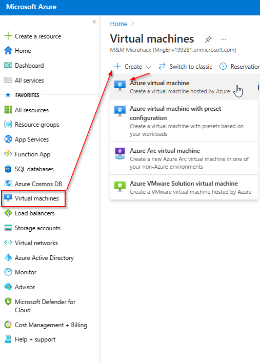
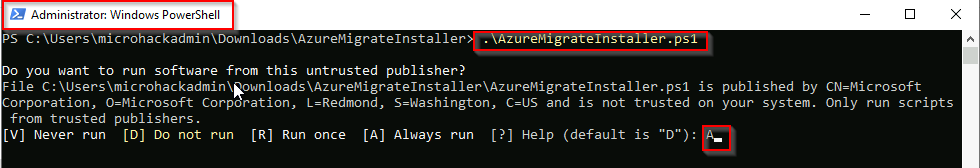
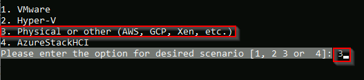
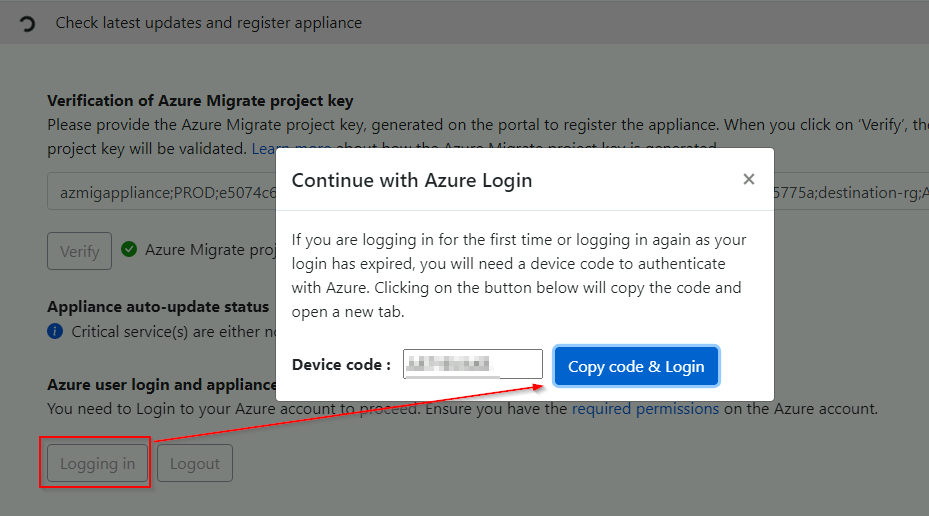
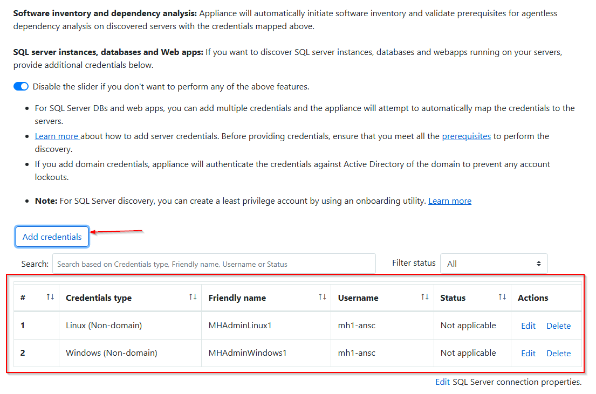

# Walkthrough Challenge 2 - Discover physical servers for the migration

Duration: 60 minutes

## Prerequisites

Please make sure thet you successfully completed [Challenge 1](../challenge-1/solution.md) before continuing with this challenge.

### **Task 1: Create a Azure Migrate Project**

> [!IMPORTANT]
> To be able to create a Business Case, make sure to select **Europe** as the Geography for the Azure Migrate Project

Open the [Azure Portal](https://portal.azure.com) and login using a user account with at least Contributor permissions on a Azure Subscription.

In the search bar enter *Azure Migrate* and select Azure Migrate from the list of services

Select *Servers, databases and web app* from the navigation pane on the left and click on *Create project*

Select the *destination-rg* Resource Group, specify a name for the Azure Migrate Project and also select a geograpy where the data will be stored. *Please select b4as_v2 as VM size.*

Wait until the Azure Migrate Project has been created. Select *Servers, databases and web apps* from the navigation pane on the left.
Your previousley created Azure Migrate project should be preselected.

### **Task 2: Create and prepare Windows Server 2022 for the Azure Migrate Appliance**

To start physical server discovery you must install the Azure Migrate Appliance on your on-premises. The Azure Migrate Appliance can be downloaded as a OVA or VHD template or you can download a ZIP file containing a PowerShell script to install it on a already existing server. For the purpose of this MicroHack we will install the Azure Migrate Appliance via the PowerShell script on a Windows Server 2022 system.

> [!IMPORTANT]
> Please make sure to check the [prerequisites](https://learn.microsoft.com/en-us/azure/migrate/tutorial-discover-physical#prerequisites) of the Azure Migrate Appliance.

In the Azure Portal select *Virtual machines* from the navigation pane on the left. Select *Create -> Azure virtual machine*

Under Basics select the *source-rg* Resource Group and provide a name for the server. Select *Windows Server 2022 Datacenter - x64 Gen2* for the Image.

> [!NOTE]
> For the Username and Password you can either select a combination of your choice or check the secrets within the KeyVault.

Accept the default disk settings and click next to select the *Networking* tab. Select the *source-vnet* Virtual Network, select the *source-subnet* Subnet and make sure to select *None* for the Public IP and NIC network security group.

Accept the default settings for the remaining tabs, select *Review + create* and click *Create*.

Wait until the deployment has been successfully completed and select *Go to resource*

Select *Bastion* from the navigation pane on the left, provide the credentials to login to the Azure Migrate Appliance VM and select *Connect*. A new browser tab should open with a remote session to the Windows Server 2022 system.

> [!NOTE]
> You can also select *Password from Azure KeyVault* under *Authentication Type* if you set the password during VM creation to match the secret stored in the KeyVault.

### **Task 3: Deploy the Azure Migrate Appliance**

> [!IMPORTANT]
> Please make sure to run the following commands inside of the virtual machine you created for the mirgration appliance

Open Microsoft Edge on the Windows Server 2022 system and navigate and login to the [Azure Portal](https://portal.azure.com).

In the search bar enter *Azure Migrate* and select Azure Migrate from the list of services

Select *Servers, databases and web apps*, make sure that the previousley created Azure Migrate project is selected and klick *Discover*

Select *Physical or other (AWS, GCP,Xen, etc.)* from the *Are your servers virtualized* drop down. Enter a name into the *Name your appliance* field and clicke *Generate*. Wait until the Project key has been created. Copy the Project key and klick *Download*, to download the ZIP file containing the PowerShell script to install the Azure Migrate Appliance.

Open the folder containing the download and extract the ZIP file.

Start an evelvated PowerShell session and change the PowerShell directory to the folder where the contents have been extraceted.
Run the script named AzureMigrateInstaller.ps1 and select *A* to confirm script execution.

Select Option 3 for *Physical or other (AWS, GCP, Xen, etc.)*

Select Option 1 for *Azure Public*

Select Option 1 for *public endpoint* and confirm your selection to start the installation.

Select *A* again and continue the installation.

Select *Y* again to uninstall IE11 and continue the installation.

The system will reboot automatically. Installation is now complete.

Wait for the reboot to complete, log-in again and proceed to Task 4.

### **Task 4: Configure the Azure Migrate Appliance**

Open Azure Migrate Appliance Configuration Manager using the icon on the Desktop.

Agree the terms of use.

Paste the previously copied Azure Migrate project key and click *Verify*. Once successfully verified the latest appliance updates will be installed.

Next log in to Azure using the provieded code.

After successfull authentication, appliance will be registered with the Azure Migrate project.

Next you need to specify the credentials that will be used to connect to the source server for discovery.
Add one entry for Windows and for Linux devices. The friendly name will be used later on when specifiying the individual systems.

> [!NOTE]
> For the Username and Password check the secrets within the KeyVault.

Next you need to provide the individual source server details and map them to a specific set of credentials. Make sure that validation is successfull.

The last step is to provide additional credentials if you want to perform software inventory to additionaly collect information about installed web server or SQL server. To start discovery click *Start discovery*.

After discovery has been successfully initiated, go to the Azure portal to review the discovered inventory.

You can click *Overview* to get more insights on what information were discovered.

> [!NOTE]
> If no inventory data is available, click Refresh to refresh inventory data.

You successfully completed challenge 2! 🚀🚀🚀

The deployed architecture now looks like the following diagram.

 **[Home](../../Readme.md)** - [Next Challenge Solution](../challenge-3/solution.md)
