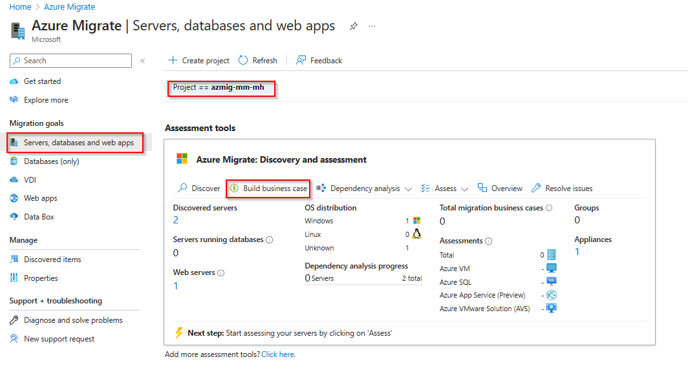
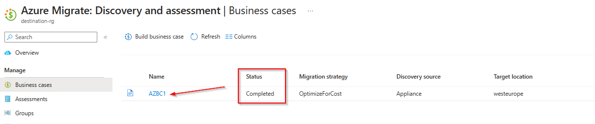
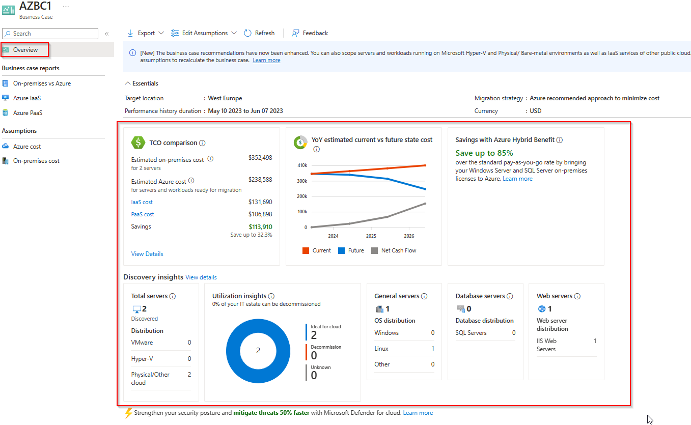
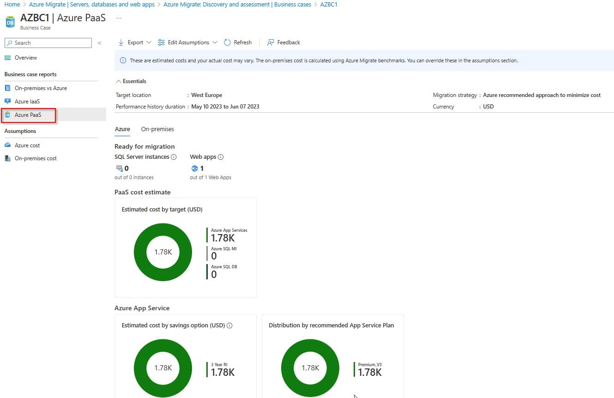
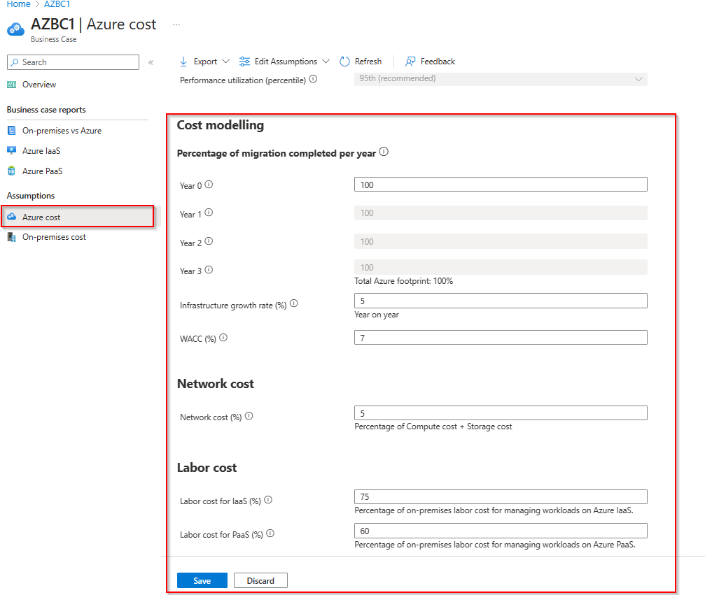
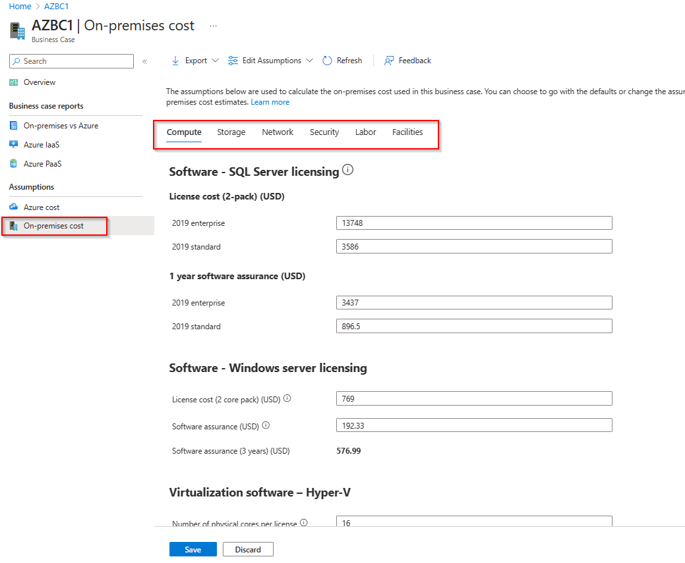
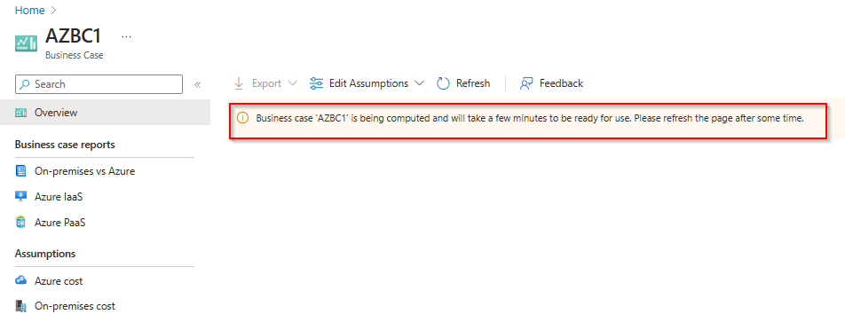

# Walkthrough Challenge 3 - Create a Business Case

Duration: 40 minutes

## Prerequisites

Please make sure thet you successfully completed [Challenge 2](../challenge-2/solution.md) before continuing with this challenge.
Please also make sure to review the [prerequisites](https://learn.microsoft.com/en-us/azure/migrate/how-to-build-a-business-case#prerequisites) for the business case.

### **Task 1: Build a business case**

Open the [Azure Portal](https://portal.azure.com) and navigate to the previousley created Azure Migrate project. Select *Servers, databases and web apps*, make sure that the right Azure Migrate Project is selected and click *Build business case*.

Provide a name for the business case and select a target location. For the migration strategy select *Azure recommended approach to minimize cost*. You can select your desired saving options and discounts that may apply to your Azure Subscription.

Wait for the business case creation to complete and click on the business case name to open it.

💡 Please note that business case creation can take up to 30 minutes.

### **Task 2: Review a business case**

There are four major reports that you need to review:

- Overview: This report is an executive summary of the business case and covers:
  + Potential savings (TCO).
  + Estimated year on year cashflow savings based on the estimated migration completed that year.
  + Savings from unique Azure benefits like Azure Hybrid Benefit.
  + Discovery insights covering the scope of the business case.

- On-premises vs Azure: This report covers the breakdown of the total cost of ownership by cost categories and insights on savings.

- Azure IaaS: This report covers the Azure and on-premises footprint of the servers and workloads recommended for migrating to Azure IaaS.

- Azure PaaS: This report covers the Azure and on-premises footprint of the workloads recommended for migrating to Azure PaaS.

### **Task 3: Adjust business case assumptions**

The business case is calculated based on some [assumptions](https://learn.microsoft.com/en-us/azure/migrate/concepts-business-case-calculation#total-cost-of-ownership-steady-state). To better fit your current scenario, you can adjust those assumptions.

**Azure cost**

**On-premises cost**

You can adjust those parameters what would recalculate the business case.

You successfully completed challenge 3! 🚀🚀🚀

 **[Home](../../Readme.md)** - [Next Challenge Solution](../challenge-4/solution.md)
