# Walkthrough Challenge 4 - Assess VM´s for the migration

Duration: 40 minutes

## Prerequisites

Please make sure thet you successfully completed [Challenge 3](../challenge-3/solution.md) before continuing with this challenge.

### **Task 1: Create a machine group**

You group servers together to assess whether they are suitable for migration to Azure and to get size and cost estimates for Azure.

Open the [Azure Portal](https://portal.azure.com) and navigate to the previousley created Azure Migrate project. Select *Servers, databases and web apps*, make sure that the right Azure Migrate Project is selected and click *Overview*.

In the navigation pane on the left select *Groups* and then click on *Groups*.

Select the discovery source *Servers discovered from Azure Migrate appliance*, provide a group name *Application 1* and select the group purpose *I want to use this group to create Azure VM assessments*.

Select the Azure Migrate Appliance and the servers that should be part of the group (both in our case) and click *Create*.

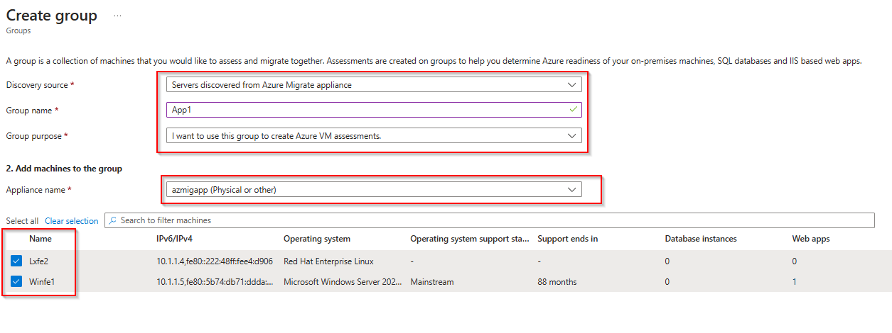

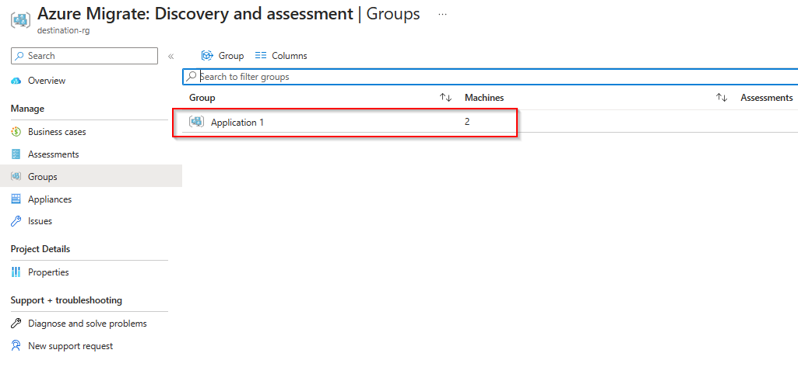

### **Task 2: Create an Azure VM assessment**

To create an assessment select *Assessment* from the navigation pane on the left, click on *Assess* and select *Azure VM* from the dropdown list.

Select *Azure VM* for the assessment type and *Servers discovered from the Azure Migrate appliance* for the disvovery source. Note the predefined assessment settings on the bottom. Click on *Edit* to adjust the assessment settings to your needs.

You can adjust the target environment settings like the target location, the VM size and pricing options.
When finished click on *Save* and select *Next: Select servers to assess* to continue.

Provide a name for the assessment and select the previousley created machine group. Note that the servers are automatically selected based on the machine group. Click on *Next:...* to continue.

Review your selection and click on *Create assessment*.

> [!NOTE]
> Please note that the computation of the assessment can take a few minutes.

When finished the assessment will show up with the status *Ready*.

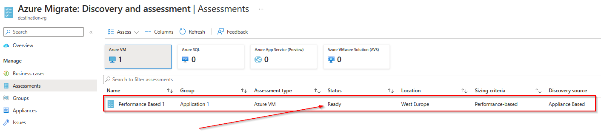

### **Task 3: Review and adjust assessment output and reccomendations**

Click on the assessment name to open it.

The Azure VM assessment overview provides details about:

* Azure readiness: Whether servers are suitable for migration to Azure.
* Monthly cost estimation: The estimated monthly compute and storage costs for running the VMs in Azure.
* Monthly storage cost estimation: Estimated costs for disk storage after migration.

> [!IMPORTANT]
> Please note that confidence rating for the assessment is marked as low. This is due to missing or to less performance data. It is recommended that you collect performance data via the Azure Migrate appliance at least on day before creating the assessment..

In *Azure readiness*, verify whether servers are ready for migration to Azure.

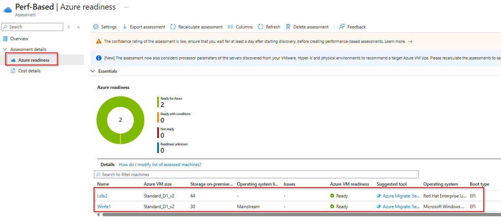

The *Cost details* view shows the estimated compute and storage cost of running VMs in Azure.

To adjust the assessment settings, select *Settings* from the Menu bar on the top.

You can change certain parameters e.g, Storage type, Saving Options, Sizing criteria, Comfort factor and License settings.

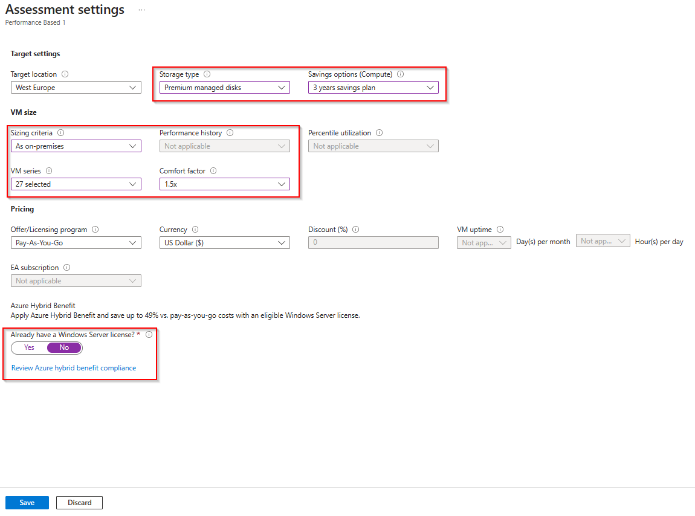

The assessment will be automatically be updated.

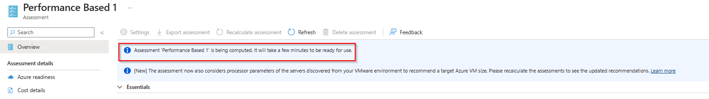

Once finished you can click again on the assessment and review how your changes changed the sizing and pricing recomendations.

### **Task 4: Enable Dependency Analysis**

Dependency analysis identifies dependencies between discovered on-premises servers. It provides these advantages:

* You can gather servers into groups for assessment, more accurately, with greater confidence.
* You can identify servers that must be migrated together. This is especially useful if you're not sure which servers are part of an app deployment that you want to migrate to Azure.
* You can identify whether servers are in use, and which servers can be decommissioned instead of migrated.
* Analyzing dependencies helps ensure that nothing is left behind, and thus avoids surprise outages after migration.

Agentless dependency analysis works by capturing TCP connection data from servers for which it's enabled. No agents are installed on servers. Connections with the same source server and process, and destination server, process, and port are grouped logically into a dependency. You can visualize captured dependency data in a map view, or export it as a CSV. No agents are installed on servers you want to analyze.

Open the [Azure Portal](https://portal.azure.com) and navigate to the previousley created Azure Migrate project. Select *Servers, databases and web apps*, make sure that the right Azure Migrate Project is selected and click *Overview*.

Within the *Azure Migrate: Discovery and assessment* screen click on the discovered servers.

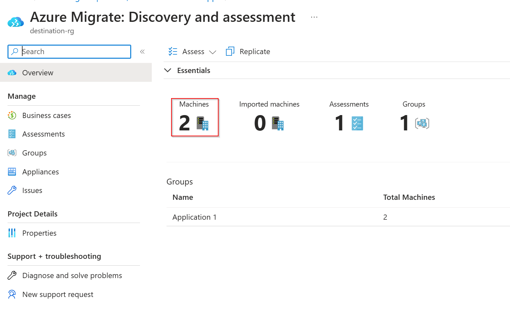

Within the *Discovered Server* screen click on the *Dependency Analysis* button on the top bar and select *Add Servers*.

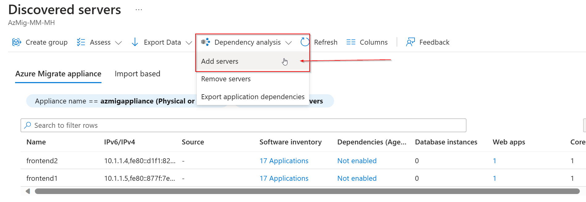

Select the *azmigappliance* as the Azure Migrate Appliance, check the checkbox for the 2 discovered servers and click *Add servers*

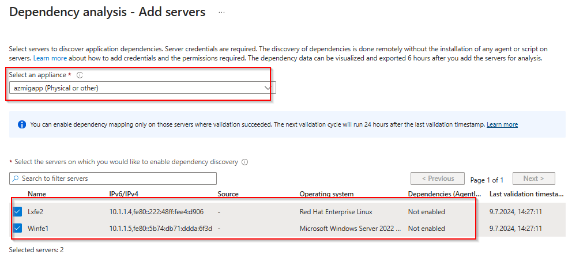

Wait until the process of adding the servers to Dependency Analysis is finished.

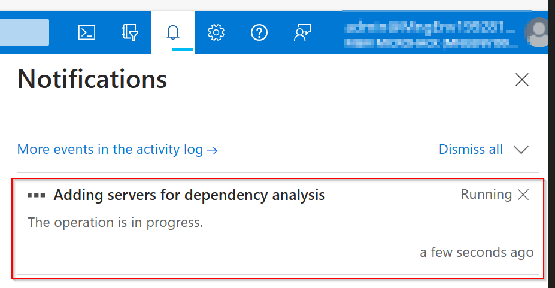

Within the *Discovered servers* scrren click on *Refresh*. You should now be able to view the dependencies of the different servers.

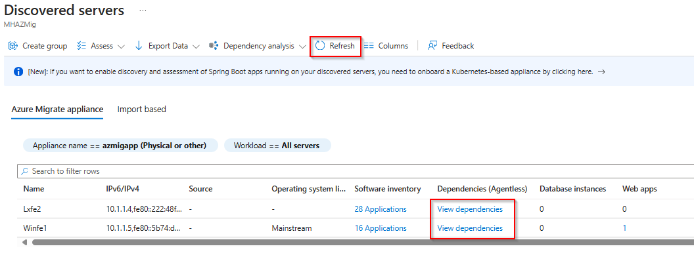

> [!NOTE]
> Please note that it could take some time for the dependency data to show up. 

Once the dependency data has been uploaded to Azure Migrate, you should be able to show the different dependencies of the discovered servers.

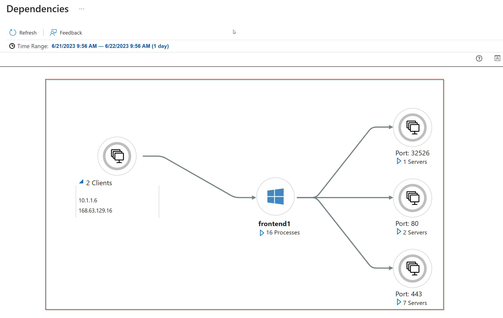

You successfully completed challenge 4! 🚀🚀🚀

 **[Home](../../Readme.md)** - [Next Challenge Solution](../challenge-5/solution.md)
