# Walkthrough Challenge 6 - Modernize with Azure

Duration: 40 minutes

## Prerequisites

Please make sure thet you successfully completed [Challenge 5](../challenge-5/solution.md) before continuing with this challenge.

### **Task 1: Create an App Service Assessment**

The Azure Migrate tool offers additional capabilities that make it easier for you to move applications from on-premises environments to Azure App Service and Azure Kubernetes Service.

Azure App Service bulk migration capabilities are now in public preview through the Azure Migrate feature:

* Discover and assess ASP.NET web apps in addition to categorizing which apps are ready for migration.
* Suggest a destination for migration and provide a guided content and configuration experience for ASP.NET web apps to Azure App Service.
* Discover and migrate with Java Tomcat applications to App Service Linux and to Azure Kubernetes Service.
* Containerize your ASP.NET web apps and move them to either Windows Containers on App Service or to Azure Kubernetes Service.

> [!WARNING]
> **Currently this feature has a few [limitations](https://learn.microsoft.com/en-us/azure/migrate/concepts-migration-webapps#limitations) and therefore it can't be used to migrate web apps directly from physical servers. However, we can use it at least to perform the assessment of our web apps and use the [App Service migration assistant tool](https://learn.microsoft.com/en-us/azure/app-service/app-service-asp-net-migration) for the migration.**

Open the [Azure Portal](https://portal.azure.com) and navigate to the previousley created Azure Migrate project. Select *Servers, databases and web apps*, make sure that the right Azure Migrate Project is selected and click on *Assess* and select *Azure App Service (Preview)* from the drop down list.

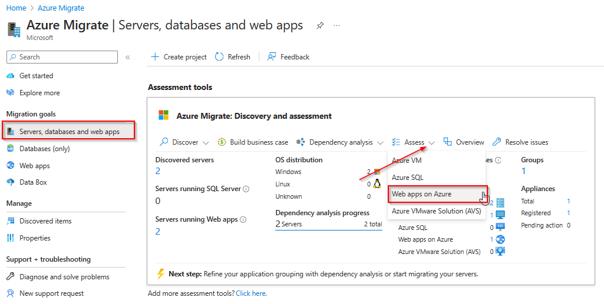

Under *Basics* select *Azure App Service (Preview)* and provide your desired assessment settings.

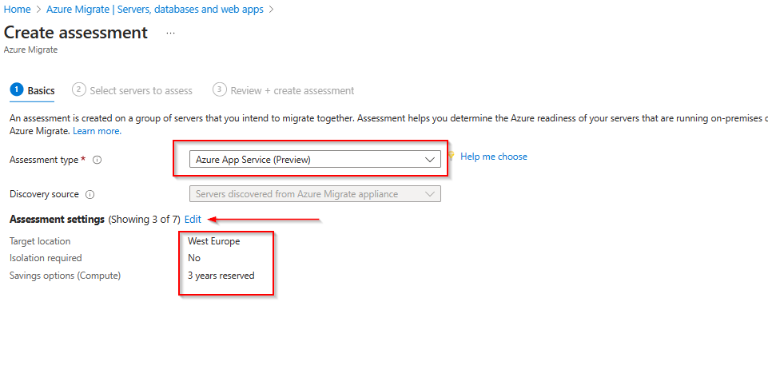

Under *Select servers to assess*, create a new Assessment group and provide a name for the group and the assessment. Make sure to select both servers.

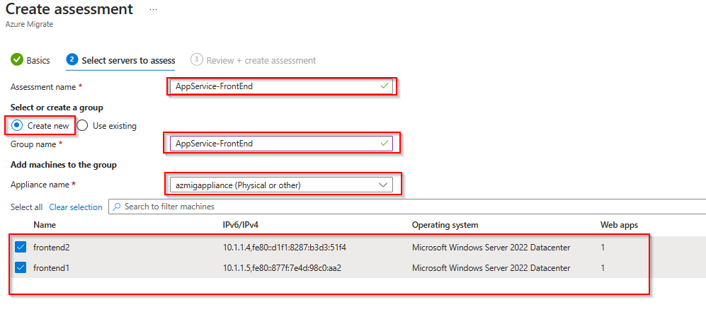

Proceed to the last section *Review + create assessment* and click *Create assessment*

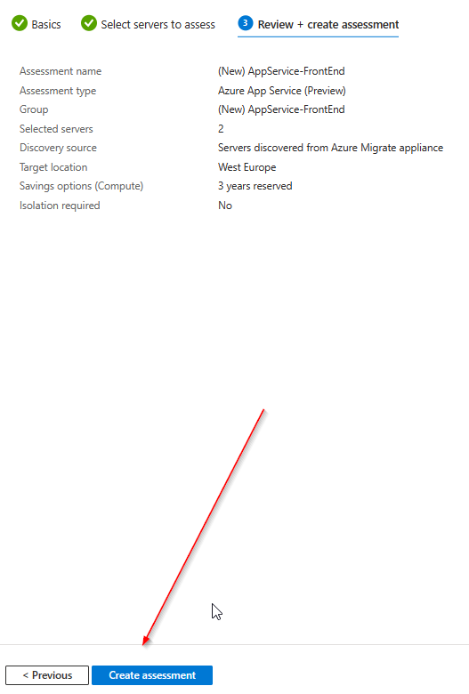

From the *Azure Migrate:Discovery and assessment* page select the *Azure App Service (Preview)* assessment.

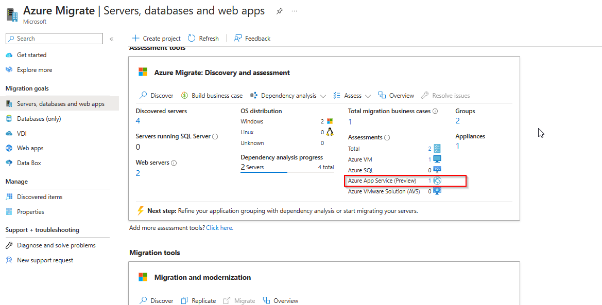

On the next page click on the previousley created assessment.

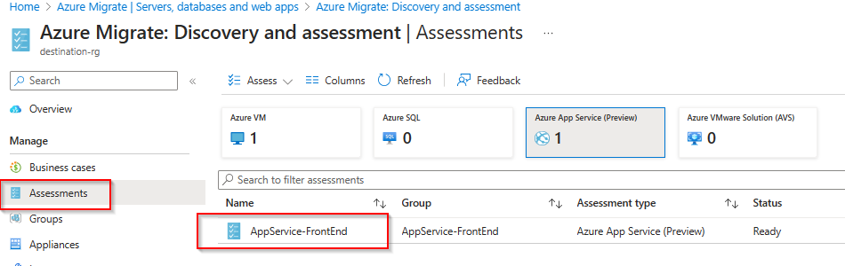

Review the output of the assessment to see if the web app currently running on Windows Server IIS is suitable and readyfor Azure App Services.

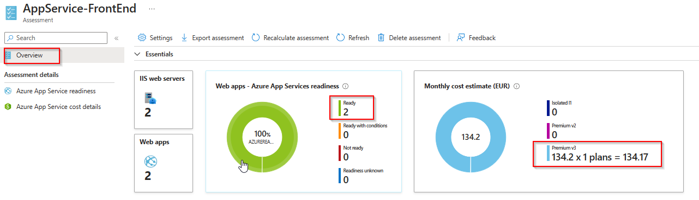

### **Task 2: Modernize web app to Azure App Service Code**

> [!WARNING]
> **As mentioned ubove, the current [limitations](https://learn.microsoft.com/en-us/azure/migrate/concepts-migration-webapps#limitations) will not allow the direct migration of web apps running on physical machines. Therefore, we will use the [App Service migration assistant tool](https://learn.microsoft.com/en-us/azure/app-service/app-service-asp-net-migration) for the migration.**

Login to the Virtual Machine *frontend1* in the *source-rg* Resource Group via Azure Bastion, open the [Azure Portal](https://portal.azure.com) from the *frontend1* VM and navigate to the previousley created Azure Migrate project. Select *Servers, databases and web apps*, make sure that the right Azure Migrate Project is selected and click on *Replicate* within the *Migration tools* box.

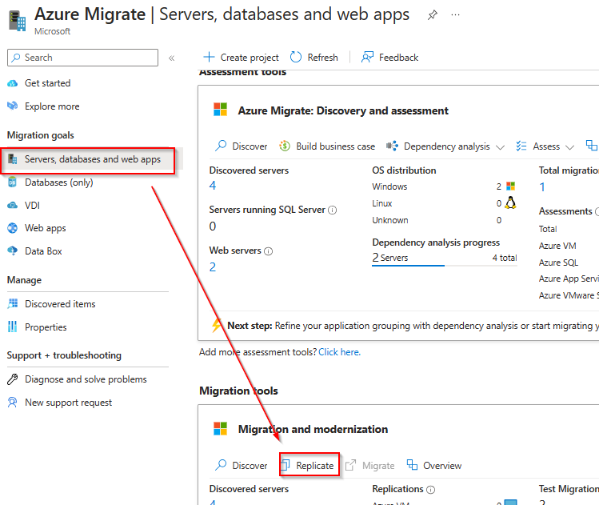

On the next page select *ASP.NET web apps*, *Azure App Service code*, *Pyhsical or others (AWS, GCP, Xen, etc)* and click on the link below to be redirected to the [App Service migration assistant tool](https://learn.microsoft.com/en-us/azure/app-service/app-service-asp-net-migration).

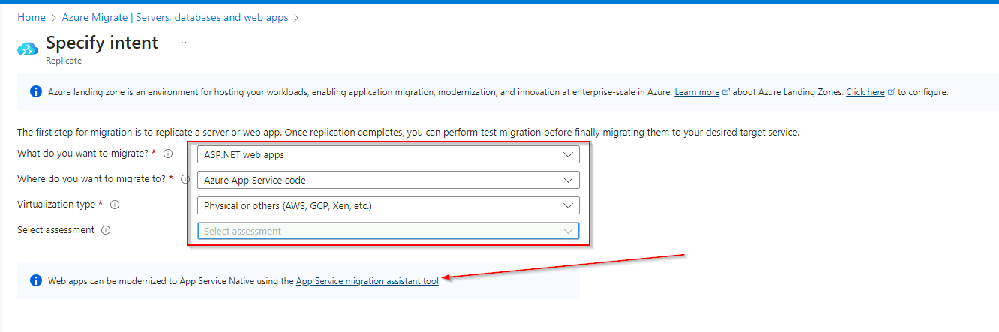

Navigate to *Migrate from an IIS server* and click on the link to download the [PowerShell scripts](https://appmigration.microsoft.com/api/download/psscriptpreview/AppServiceMigrationScripts.zip) (1) and after the script was downloaded click on the link to be redirectioed to the [documentation](https://github.com/Azure/App-Service-Migration-Assistant/wiki/PowerShell-Scripts) (2) for the scripts.

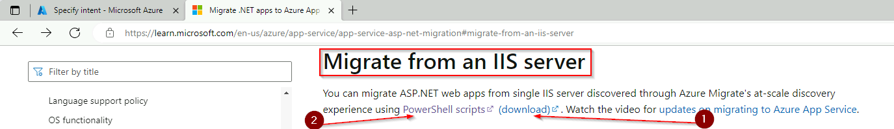

Extract the downloaded ZIP file to e.g. \<userprofile\>\\Downloads\\AppServiceMigrationScripts. Open an elevated PowerShell and change into the directory.

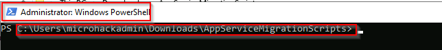

Install the Azure PowerShell modules using the *install-module az* command.

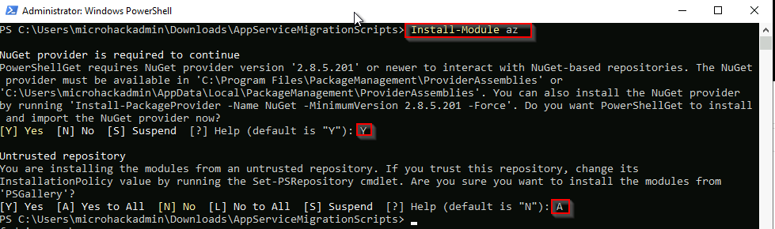

Execute the *Get-SiteReadiness.ps1* script.

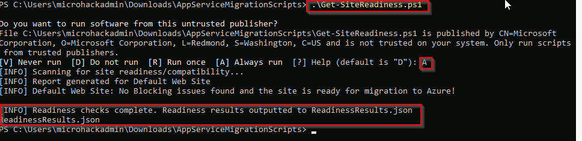

Execute the *Get-SitePackage.ps1 -ReadinessResultsFilePath .\\ReadinessResults.json* script.

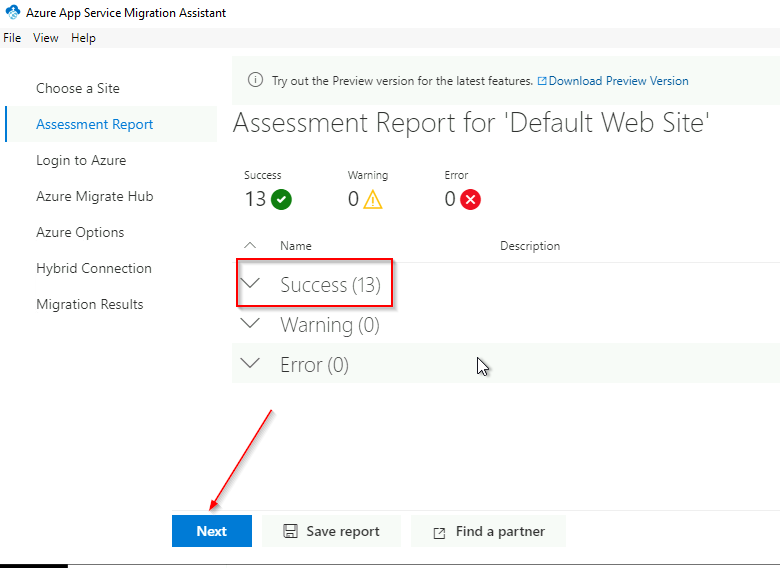

Execute the *Generate-MigrationSettings.ps1 -SitePackageResultsPath .\packagedsites\PackageResults.json -Region WestEurope -SubscriptionId \<SubscriptionID\> -ResourceGroup destination-rg* script. and login using your Azure credentials.

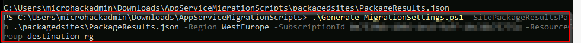

Open *MigrationSettings.json* file using notedpad.

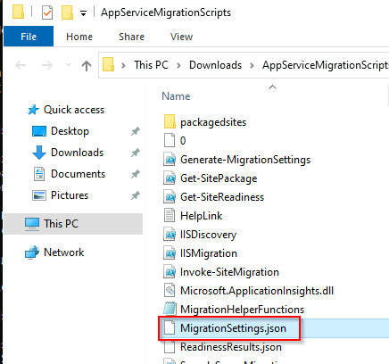

Make sure to remove any blanks for the AzureSiteName parameter as this is not supported in Azure Web Apps.

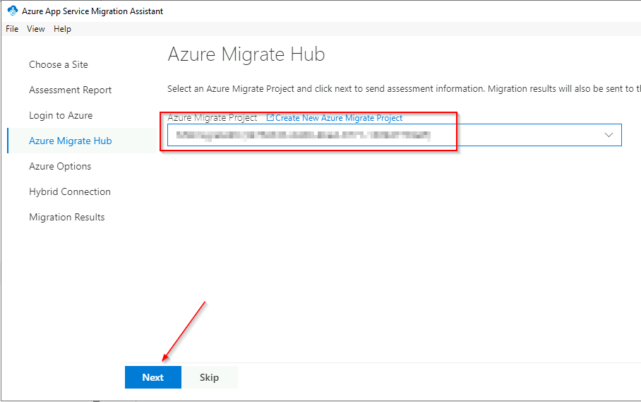

Execute the *Invoke-SiteMigration.ps1 -MigrationSettingsFilePath .\\MigrationSettings.json* script.

> [!WARNING]
> **If you receive a 401 Unauthorized error it could be that Basic Authentication is disabled on the App Service due to Azure Policy enforcement in your environment. For the current version (June 2023) of the App Service migration scripts this is a requirement**

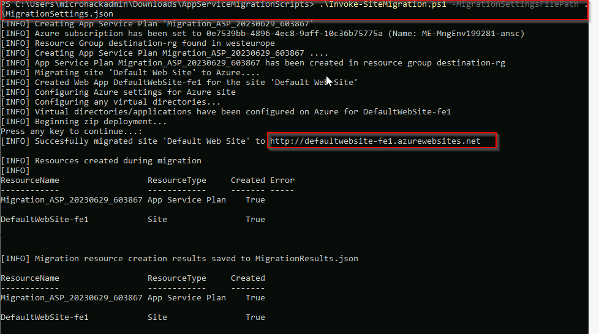

Change back to the Azure Portal and open the Resource Group *destination-rg*. You should now see a App Service called *DefaultWebSite-fe1*.

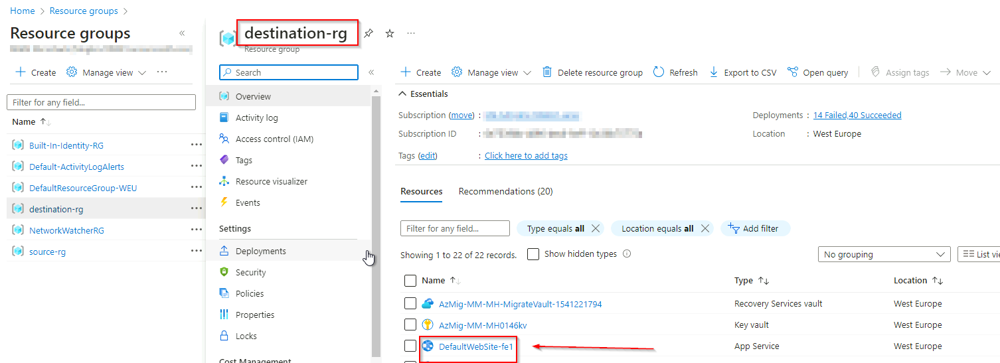

Open the App Service and click on the default domain link.

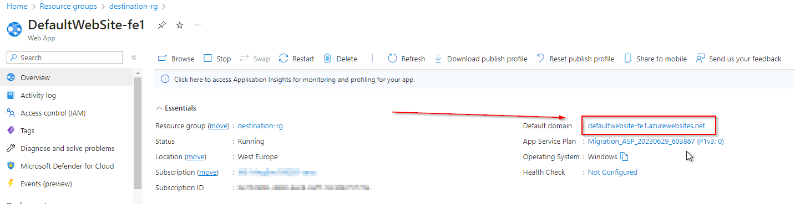

You should now see the web site content that was previously running on Windows Server IIS.

**Repeat the above steps for the frontend2 VM**

### **Task 3: Update Traffic Manager profile**

The Traffic Manager profile is still pointing to the previousley migrated Virtual Machines. You can now update the endpoints within the profile to point to the App Services instead of the VMs.

From the Azure Portal open the Load Balancing blade, select Traffic Manager on the navigation pane and select the previously created *tfp-frontend* Traffic Manager profile. Select *Endpoints* and click *Add*.

Select *Azure endpoint*, provide a name, select *App Service* and select the previousley created App Service.

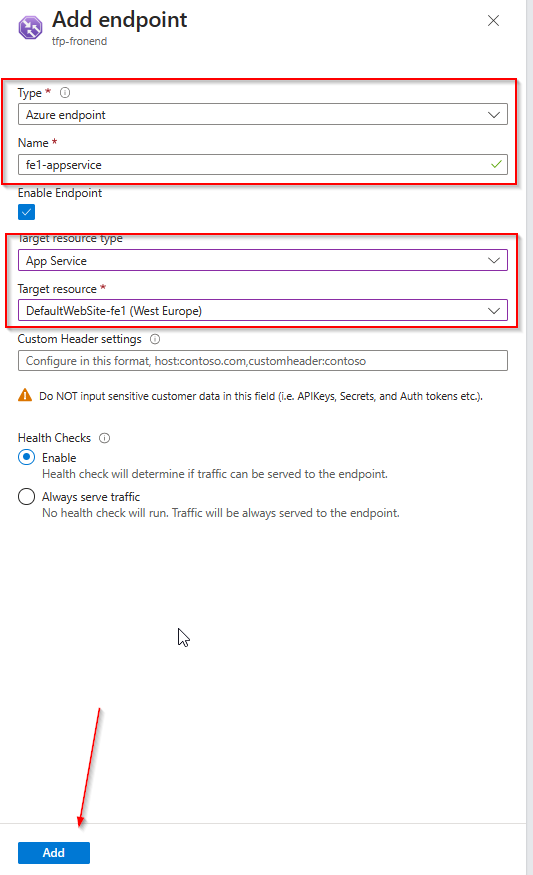

**Repeat the above step for the frontend2 App Service**

Next delete the endpoints for the Virtual Machines.

You can now browse to the Traffic Manager profile. Again, from a user perspective nothing changed but you are now browsing the web site content that is hosted on Azure App Service instead of Virtual Machines.

You successfully completed challenge 6! 🚀🚀🚀

The deployed architecture now looks like the following diagram.

🚀🚀🚀 **!!!Congratulations!!! - You successfully completed the MicroHack. You can now safley remove the *source-rg* and *destination-rg* Resource Groups.** 🚀🚀🚀

 **[Home](../../Readme.md)** -