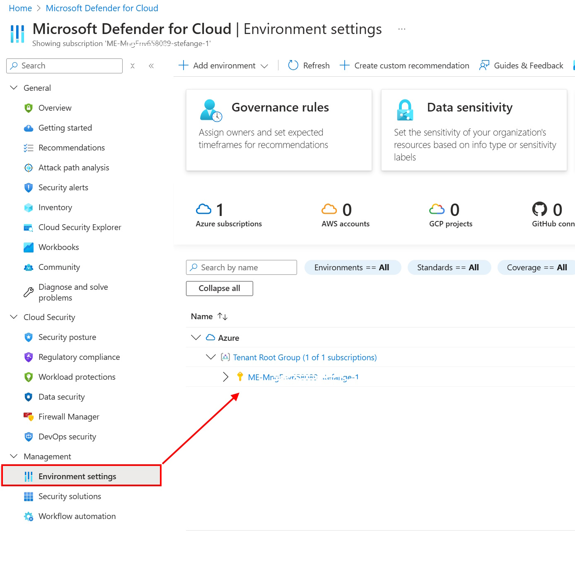
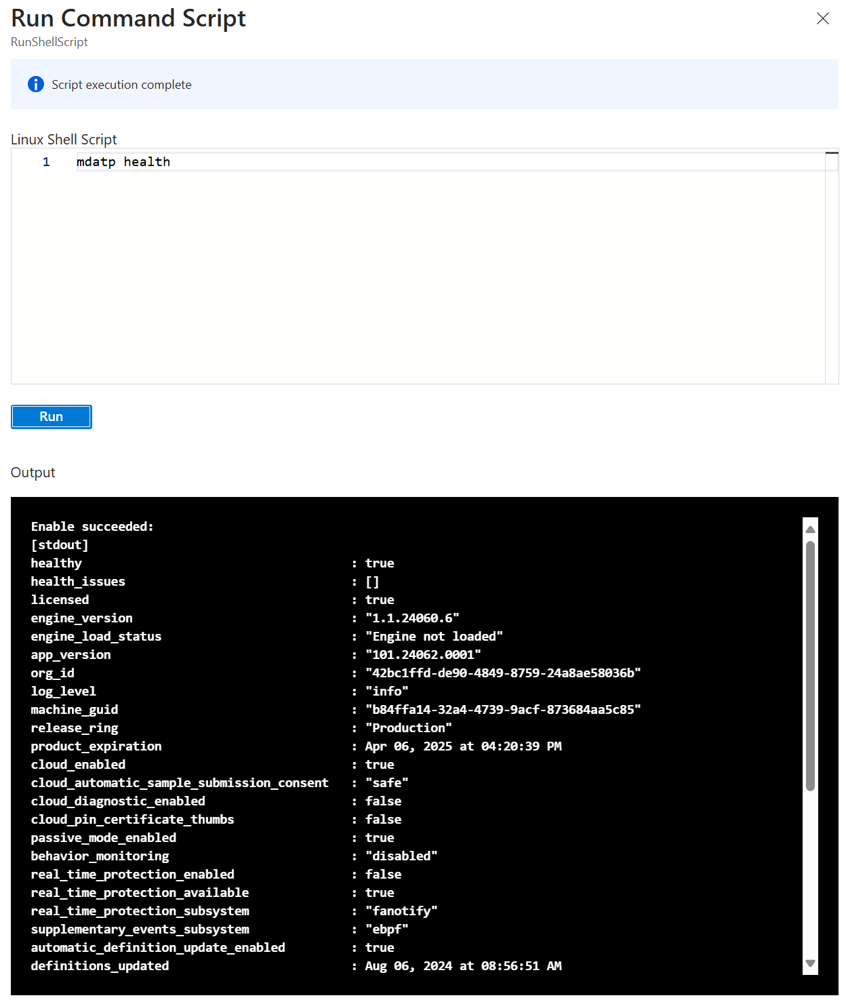

# Walkthrough Challenge 7 - Secure on Azure

Duration: 40 minutes

## Prerequisites

Please make sure thet you successfully completed [Challenge 5](../challenge-5/solution.md) before continuing with this challenge.

### **Task 1: Enable Defender for Cloud for Server**

In [Challenge 5](../challenge-5/solution.md) we migrated two servers to Azure. The servers are already protected by the basic services of Defender for Cloud. In this challenge, we'll improove significantly the protection level by activating advanced services such as "Cloud Security Posture Management (CSPM)" and "Cloud Workload Protection (CWP)" (Defender for Server).

To enable the advanced Defender for Cloud components, open the portal and select *Defender for Cloud*.  Under *Management*, select the *Environment Settings* to define the Defender for Cloud setting for the subscription.

In Settings settings, enable *Defender CSPM* and *Defender for Server* plans to better protect the migrated servers from threats. After enabling the plans, use the "Settings" link for both plans and verify that all features are enabled. Finally *Save* the new configuration.

*Defender CSPM* Settings & monitoring details

*Defender for Server* Settings & monitoring details 

> [!NOTE]
> It takes a few minutes for the new settings to be applied and for more agents to be installed on the servers.

### **Task 2: Check if Defender for Endpoint is active on the virtual machines **

To check if *Defender for Server* was successfully activated on the virtual machines, open the portal and select *Virtual Machines* and select a Windows Server. Under *Operations'* select to run a command and chose to run a PowerShell script/command.

Run the *Get-MpComputerStatus* cmdlet to get the status of antimalware software installed on the virtual machine.

On a linux machine you run a shell script instead of PowerShell - the commandline *mdatp health* will return the health of the *Defender for Endpoint* on a linux box.

### **Task 3: Check if a virus attack is reported in Azure**

In the next step, we check whether the infection with malware is reported to Azure, so that appropriate reactions can be triggered there on the basis of an alert to inform administrators, open an incident or follow up on the problem and initiate appropriate measures or react to such incidents with automatic rules.

Open the portal and select *Virtual Machines* and select a Windows Server. Select *Connect* and establish a connection with the virtual machines using *Bastion*.

The European Institute for Computer Antivirus Research (EICAR) and Computer Antivirus Research Organization (CARO), provide a harmless test file to test the response of computer antivirus programs. Instead of using real malware, which could cause real damage, this test file allows people to test anti-virus software without having to use a real computer virus. Open the following UIRL in a browser in the virtual machine: https://www.eicar.org/download-anti-malware-testfile/ 

Scroll down a bit until you can see the 68 character long EICAR string.  

We will not try to download a test file  from the website, because this will be blocked by the browser already. Instead we will create a new file on the virtual machine and paste the EICAR string into and try to safe the file. 

Select the EICAR String and copy it into the clipboard. Create a new file on the desktop and pase the EICAR string into the file.

Try to safe the file. Defender for Endpoint will trigger - it'll quarantine the file and and display a warning on the local server.

Next we will double-check if this alert was forwared to Azure. Open the portal and select *Defender for Cloud* and select *Security Alerts*. EICAR malware detections are reported with severity "Informational" - in order to include these alerts in the view you need to change the filter: Add severity "informational" in the filter settings - and the security alerts will be displayed.

### **Task 4: Explore *Defender for Cloud* proactive security advice**

You successfully completed challenge 7! 🚀🚀🚀

🚀🚀🚀 **!!!Congratulations!!! - You successfully completed the MicroHack. You can now safley remove the *source-rg* and *destination-rg* Resource Groups.** 🚀🚀🚀

 **[Home](../../Readme.md)** 