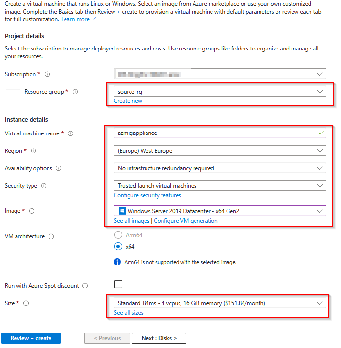
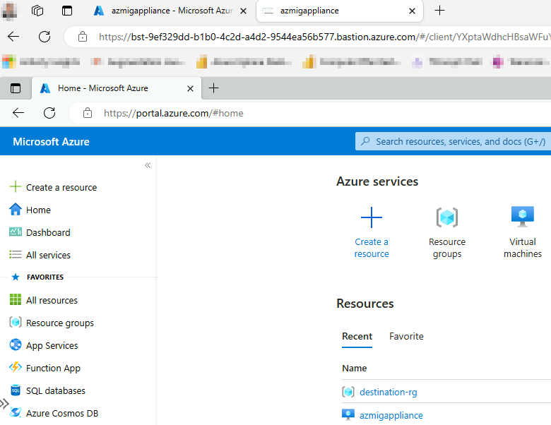

# Walkthrough Challenge 2 - Discover physical servers for the migration

Duration: XX minutes

## Prerequisites

Please make sure thet you successfully completed [Challenge 1](../challenge-1/solution.md) before continuing with this challange.

### **Task 1: Create a Azure Migrate Project**

Open the [Azure Portal](https://portal.azure.com) and login using a user account with at least Contributor permissions on a Azure Subscription.

In the search bar enter *Azure Migrate* and select Azure Migrate from the list of services
[image](./img/AzMig1.png)

Select *Servers, databases and web app* from the navigation pane on the left and click on *Create project*
[image](./img/AzMig2.png)

Select the *destination-rg* Resource Group, specify a name for the Azure Migrate Project and also select a geograpy where the data will be stored.
[image](./img/AzMig3.png)

Wait until the Azure Migrate Project has been created. Select *Servers, databases and web apps* from the navigation pane on the left.
Your previousley created Azure Migrate project should be preselected.
[image](./img/AzMig4.png)

### **Task 2: Deploy Azure Migrate Appliance**

To start physical server discovery you must install the Azure Migrate Appliance on your on-premises. The Azure Migrate Appliance can be downloaded as a OVA or VHD template or you can download a ZIP file containing a PowerShell script to install it on a already existing server. For the purpose of this MicroHack we will install the Azure Migrate Appliance via the PowerShell script on a Windows Server 2022 system.

💡 Please make sure to check the [prerequisites](https://learn.microsoft.com/en-us/azure/migrate/tutorial-discover-physical#prerequisites) of the Azure Migrate Appliance.

In the Azure Portal select *Virtual machines* from the navigation pane on the left. Select *Create -> Azure virtual machine*

Under Basics select the *source-rg* Resource Group and provide a name for the server. Select *Windows Server 2022 Datacenter - x64 Gen2* for the Image.

💡 For the Username and Password you can either select a combination of your choice or check the secrets within the KeyVault.

Accept the default disk settings and click next to select the *Networking* tab. Select the *source-vnet* Virtual Network, select the *source-subnet* Subnet and make sure to select *None* for the Public IP and NIC network security group.

Accept the default settings for the remaining tabs, select *Review + create* and click *Create*.

Wait until the deployment has been successfully completed and select *Go to resource*

Select *Bastion* from the navigation pane on the left, provide the credentials to login to the Azure Migrate Appliance VM and select *Connect*. A new browser tab should open with a remote session to the Windows Server 2022 system.

💡 You can also select *Password from Azure KeyVault* under *Authentication Type* if you set the password during VM creation to match the secret stored in the KeyVault.

Open Microsoft Edge on the Windows Server 2022 system and navigate and login to the [Azure Portal](https://portal.azure.com).

### **Task 3: Put yourself in the position...**

* [Checklist Testing for...](Link to checklist or microsoft docs)

### Task 4: Who defines the requirements...

You successfully completed challenge 2! 🚀🚀🚀

 **[Home](../../Readme.md)** - [Next Challenge Solution](../challenge-3/solution.md)
