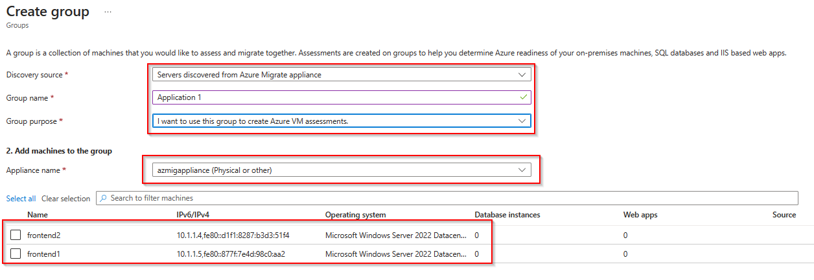
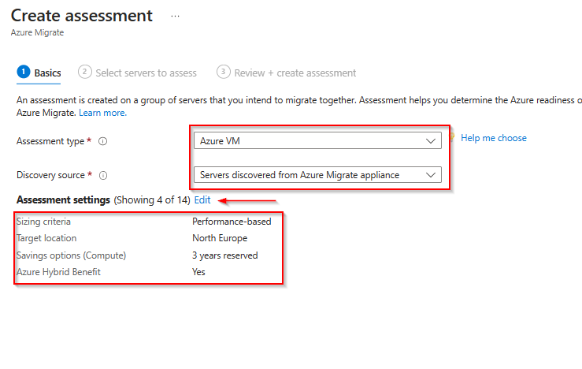
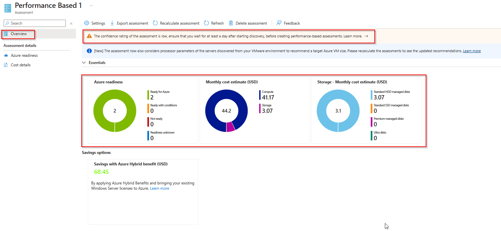
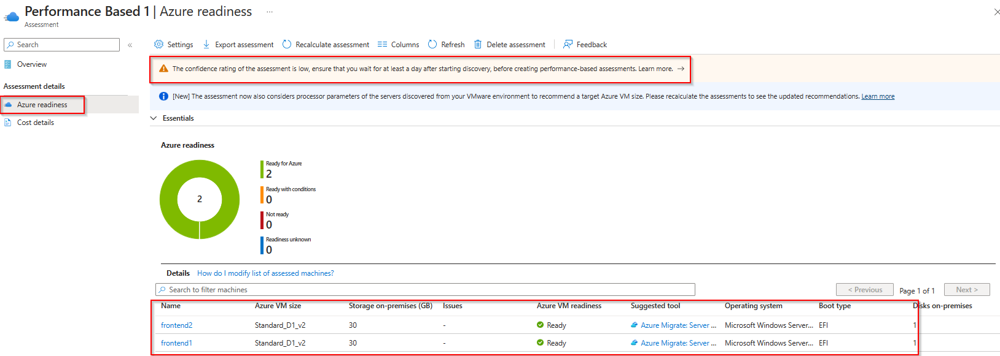
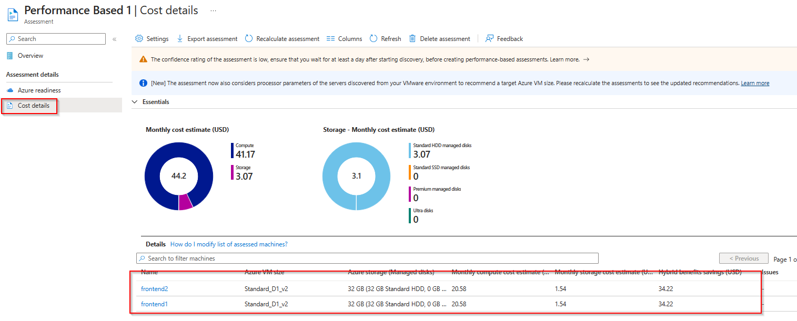
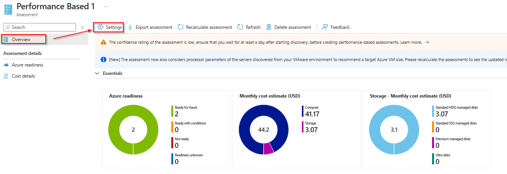

# Walkthrough Challenge 4 - Assess VM´s for the migration

Duration: 40 minutes

## Prerequisites

Please make sure thet you successfully completed [Challenge 3](../challenge-3/solution.md) before continuing with this challenge.

### **Task 1: Create a machine group**

You group servers together to assess whether they are suitable for migration to Azure and to get size and cost estimates for Azure.

Open the [Azure Portal](https://portal.azure.com) and navigate to the previousley created Azure Migrate project. Select *Servers, databases and web apps*, make sure that the right Azure Migrate Project is selected and click *Overview*.

In the navigation pane on the left select *Groups* and then click on *Groups*.

Select the discovery source *Servers discovered from Azure Migrate appliance*, provide a group name *Application 1* and select the group purpose *I want to use this group to create Azure VM assessments*.

Select the Azure Migrate Appliance and the servers that should be part of the group (both in our case) and click *Create*.

### **Task 2: Create an Azure VM assessment**

To create an assessment select *Assessment* from the navigation pane on the left, click on *Assess* and select *Azure VM* from the dropdown list.

Select *Azrue VM* for the assessment type and *Servers discovered from the Azure Migrate appliance* for the disvovery source. Note the predefined assessment settings on the bottom. Click on *Edit* to adjust the assessment settings to your needs.

You can adjust the target environment settings like the target location, the VM size and pricing options.
When finished click on *Save* and select *Next: Select servers to assess* to continue.

Provide a name for the assessment and select the previousley created machine group. Note that the servers are automatically selected based on the machine group. Click on *Next:...* to continue.

Review your selection and click on *Create assessment*.

💡 Please note that the computation of the assessment can take a few minutes.

When finished the assessment will show up with the status *Ready*.

### **Task 4: Review and adjust assessment output and reccomendations**

Click on the assessment name to open it.

The Azure VM assessment overview provides details about:

* Azure readiness: Whether servers are suitable for migration to Azure.
* Monthly cost estimation: The estimated monthly compute and storage costs for running the VMs in Azure.
* Monthly storage cost estimation: Estimated costs for disk storage after migration.

💡 Please note that confidence rating for the assessment is marked as low. This is due to missing or to less performance data. It is recommended that you collect performance data via the Azure Migrate appliance at least on day before creating the assessment.

In *Azure readiness*, verify whether servers are ready for migration to Azure.

The *Cost details* view shows the estimated compute and storage cost of running VMs in Azure.

To adjust the assessment settings, select *Settings* from the Menu bar on the top.

You can change certain parameters e.g, Storage type, Saving Options, Sizing criteria, Comfort factor and License settings.

The assessment will be automatically be updated.

### **Task 3: Create an Azure App Service assessment**

You successfully completed challenge 4! 🚀🚀🚀

 **[Home](../../Readme.md)** - [Next Challenge Solution](../challenge-5/solution.md)
