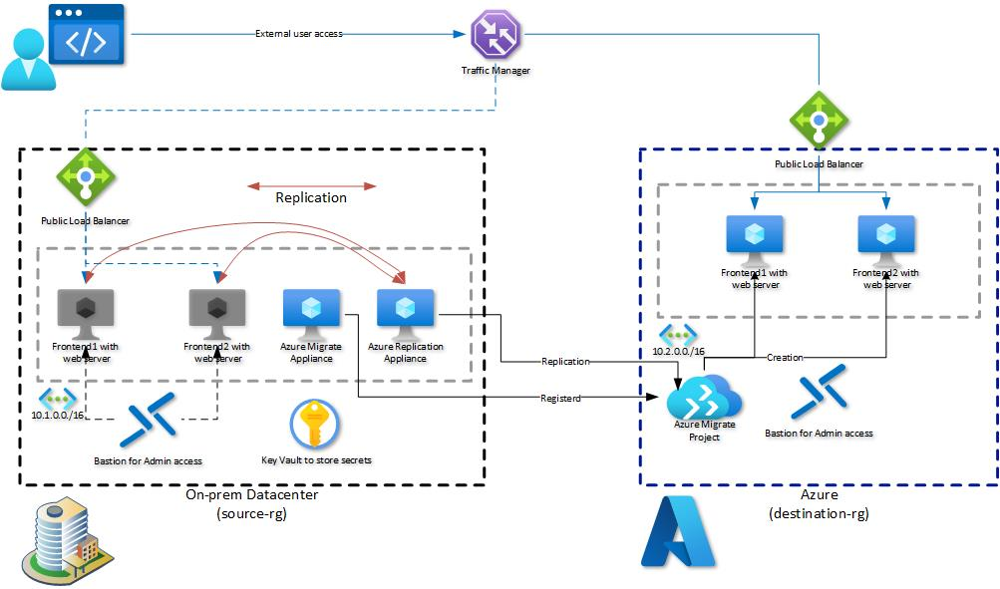

# Walkthrough Challenge 5 - Migrate machines to Azure

Duration: 40 minutes

## Prerequisites

Please make sure thet you successfully completed [Challenge 4](../challenge-4/solution.md) before continuing with this challenge.

### **Task 1: Create and prepare Windows Server 2019 for the Azure Replication Appliance**

To start physical server migration you must install the Azure Replication Appliance on your on-premises. The Azure Replication Appliance can be downloaded as a OVA template or you can download the appliance installer to install it on a already existing server. For the purpose of this MicroHack we will install the Azure Replication Appliance via the installer on a new Windows Server 2019 system.

💡 Please make sure to check the [prerequisites](https://learn.microsoft.com/en-us/azure/migrate/migrate-replication-appliance) of the Azure 
Replication Appliance.

💡 Please note that it is currently [not supported](https://learn.microsoft.com/en-us/azure/migrate/common-questions-appliance#can-the-azure-migrate-appliancereplication-appliance-connect-to-the-same-vcenter) to install the Azure Migrate Replication Appliance on the same system as the Azure Migrate Appliance.

In the Azure Portal select *Virtual machines* from the navigation pane on the left. Select *Create -> Azure virtual machine*

Under Basics select the *source-rg* Resource Group and provide a name for the server. Select *Windows Server 2019 Datacenter - x64 Gen2* for the Image.

💡 For the Username and Password you can either select a combination of your choice or check the secrets within the KeyVault.

Add an additional 1024GiB Standard HDD LRS data disk to the Virtual Machine and click *Next*

In the *Networking* tab, select the *source-vnet* Virtual Network and the *source-subnet* Subnet and make sure to select *None* for the Public IP and NIC network security group.

Accept the default settings for the remaining tabs, select *Review + create* and click *Create*.

Wait until the deployment has been successfully completed and select *Go to resource*

Select *Bastion* from the navigation pane on the left, provide the credentials to login to the Azure Migrate Replication VM and select *Connect*. A new browser tab should open with a remote session to the Windows Server 2019 system.

💡 You can also select *Password from Azure KeyVault* under *Authentication Type* if you set the password during VM creation to match the secret stored in the KeyVault.

### **Task 2: Setup the Azure Replication Appliance**

To prepare for physical server migration, you need to verify the physical server settings, and prepare to deploy a replication appliance.

Open the [Azure Portal](https://portal.azure.com) on the Azure Replication Appliance using the Microsoft Edge browser and navigate to the previousley created Azure Migrate project. Select *Servers, databases and web apps*, make sure that the right Azure Migrate Project is selected and click *Discover* in the *Migration tools* box.

Select *Physical or other...* in the *Are your machines virtualized* drop down and select *West Europe* as the *Target Region*.
Make sure to check the confirmation checkbox and click *Create resources*. 

Wait until the deployment has been successfully completed. Next under *1. Download and install the repliaction appliance software* click *Download* to download the Azure Migrate Repplication Appliance installer. 
You also need to download the registration key that is required to register the replication appliance under *2. Configure the replication appliance and register it to the project*.

Next start the installation of the Azure Migrate Replication Appliance by double cklicking the *MicrosoftAzureSiteRecoveryUnifiedSetup.exe*

Select *Install the configuration server and process server* and click *Next*

Check the *I acceppt...* checkbox and click *Next*

Browse and select the previousley downloaded registration key and click *Next*

Accept the default *Internet connection* configuration

Review the prerequisites check of the installer. Note that you can safely ignore the static IP warning.

Specify the required passwords and note the password requirements. 

💡 For the Passwords you can either select your choice or check the secrets within the KeyVault to reuse the password.

Select *No* for *Do you want to protect VMware virtual machines* and click *Next*

Verify the *Install location*. The installer should automatically pre-select the largest disk, in our case the 1024 GiB data disk that was created during VM creation.

Select the appropriate NICs (We only have 1 in our case).

Verify the installation summary and click *Install* to start the installation.

Wait until the installation progress is finished.

After the successfull installation a configuration server connection passphrase will be displayed. Copy the passphrase and save it as a new secret in the source-rg Resource Group KeyVault.

After the installation completes, the Appliance configuration wizard will be launched automatically.
You can add the local administrator account credentials of the source servers (stored secrets in the source KeyVault).

The last step is to finalize the registration. Refresh the Azure Portal page where you've downloaded the installer and registration keys and select the *azreplappliance* from the drop down list and click on *Finalize registration*.

### **Task 3: Install the Mobility service on the source server**

On machines you want to migrate, you need to install the Mobility service agent. The agent installers are available on the replication appliance in the *%ProgramData%\ASR\home\svsystems\pushinstallsvc\repository* directory.
To install the Mobility service agent on the Windows machines follow the following steps

1. Sign in to the replication appliance.
2. Navigate to %ProgramData%\ASR\home\svsystems\pushinstallsvc\repository.
3. Find the installer for the machine operating system and version. Review [supported operating systems](https://learn.microsoft.com/en-us/azure/site-recovery/vmware-physical-azure-support-matrix#replicated-machines).
4. Copy the installer file to the machine you want to migrate.

**Windows**

5. Make sure that you have the passphrase that was generated when you deployed the appliance (You should have saved it as a KeyVault secret).
  * Store the key in a temporary text file and copy the file into the same direcotry on the source machines.
  * You can obtain the passphrase on the replication appliance. From the command line, run the following command to view the passphrase
     C:\ProgramData\ASR\home\svsystems\bin\genpassphrase.exe -v

  * 💥 Don't regenerate the passphrase. This will break connectivity and you will have to reregister the replication appliance.

#### **Task 3.1: Install the Mobility service on the Windows VMs**

1. Extract the contents of installer file to a local folder (for example C:\Temp) on the machine, as follows:

     ren Microsoft-ASR_UA\*Windows\*release.exe MobilityServiceInstaller.exe
     
     MobilityServiceInstaller.exe /q /x:C:\Temp\Extracted

     cd C:\Temp\Extracted

2. Run the Mobility Service Installer:

     UnifiedAgent.exe /Role "MS" /Platform "VmWare" /Silent

💡 You need to specify *VmWare* for the *Platform* parameter also for physical servers.

3. Register the agent with the replication appliance:

     cd C:\Program Files (x86)\Microsoft Azure Site Recovery\agent

     UnifiedAgentConfigurator.exe /CSEndPoint <replication appliance IP address> /PassphraseFilePath <Passphrase File Path>

     

**💥 Repeat the above steps for the second Windows Server**

You successfully completed challenge 5! 🚀🚀🚀

The deployed architecture now looks like the following diagram.

 **[Home](../../Readme.md)** - [Next Challenge Solution](../challenge-5/solution.md)
