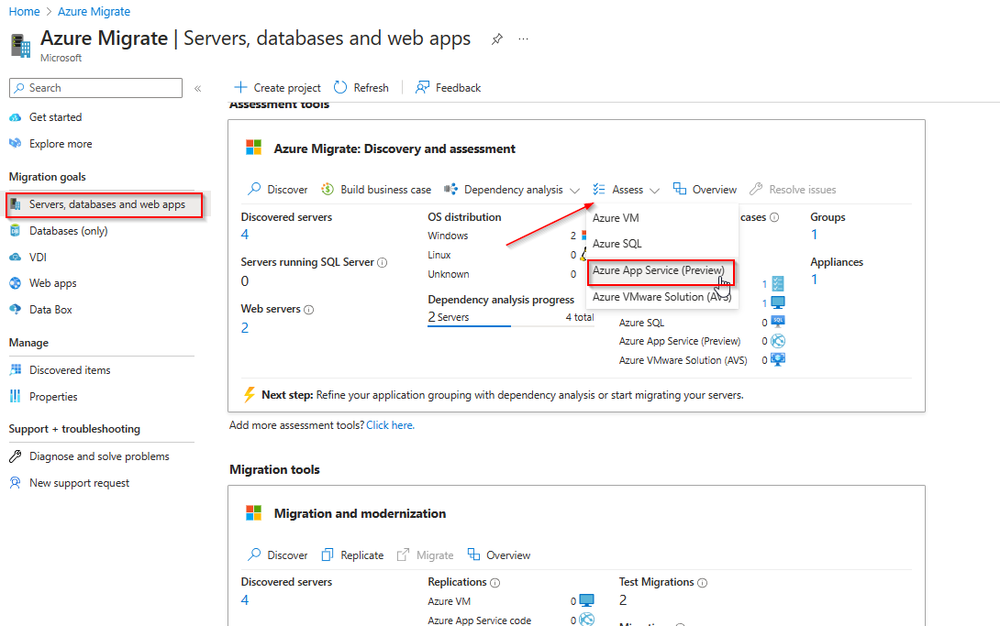
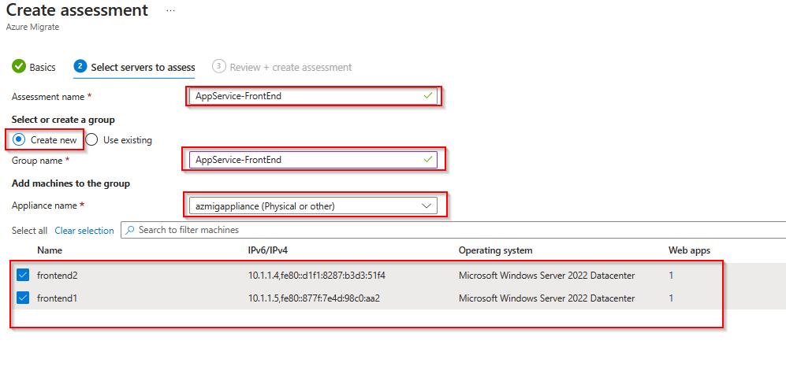
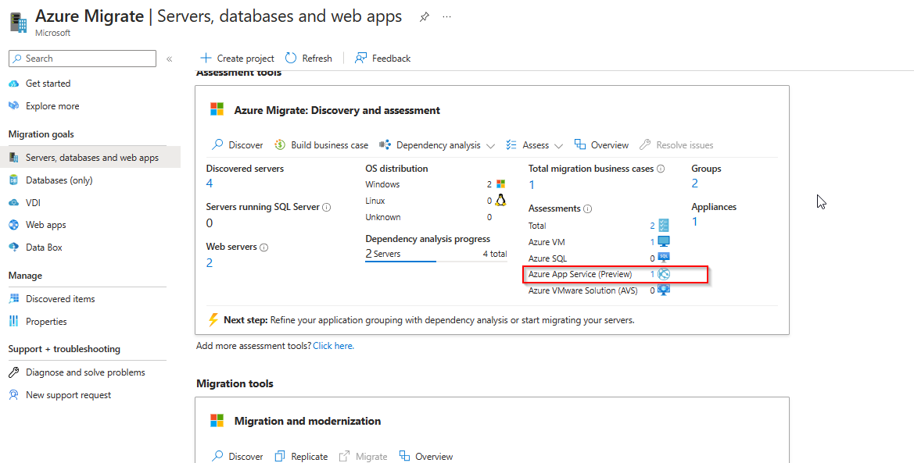
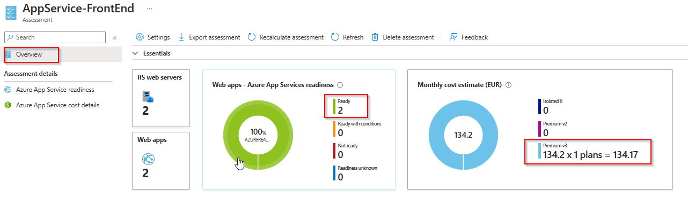
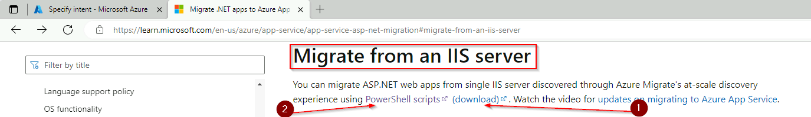
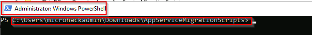
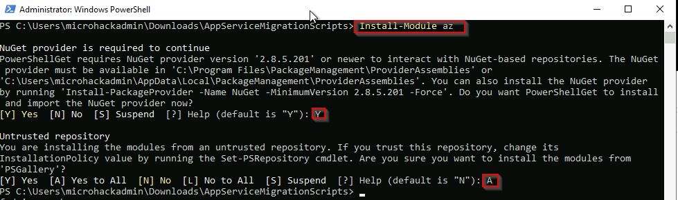
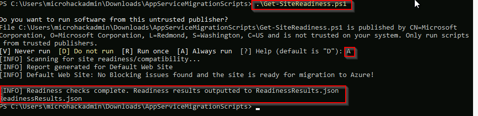
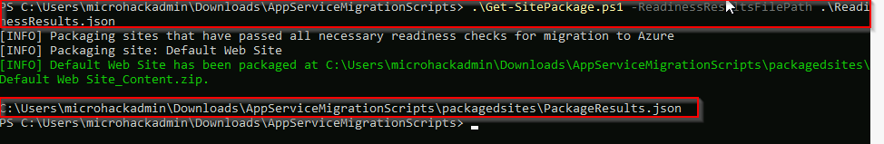

# Walkthrough Challenge 6 - Modernize with Azure

Duration: 40 minutes

## Prerequisites

Please make sure thet you successfully completed [Challenge 5](../challenge-5/solution.md) before continuing with this challenge.

### **Task 1: Create an App Service Assessment**

The Azure Migrate tool now offers additional capabilities that make it easier for you to move applications from on-premises environments to Azure App Service and Azure Kubernetes Service.

Azure App Service bulk migration capabilities are now in public preview through the Azure Migrate feature:

* Discover and assess ASP.NET web apps in addition to categorizing which apps are ready for migration.
* Suggest a destination for migration and provide a guided content and configuration experience for ASP.NET web apps to Azure App Service.
* Discover and migrate with Java Tomcat applications to App Service Linux and to Azure Kubernetes Service.
* Containerize your ASP.NET web apps and move them to either Windows Containers on App Service or to Azure Kubernetes Service.

Open the [Azure Portal](https://portal.azure.com) and navigate to the previousley created Azure Migrate project. Select *Servers, databases and web apps*, make sure that the right Azure Migrate Project is selected and click on *Assess* and select *Azure App Service (Preview)* from the drop down list.

Under *Basics* select *Azure App Service (Preview)* and provide your desired assessment settings.

Under *Select servers to assess*, create a new Assessment group and provide a name for the group and the assessment. Make sure to select both servers.

Proceed to the last section *Review + create assessment* and click *Create assessment*

From the *Azure Migrate:Discovery and assessment* page select the *Azure App Service (Preview)* assessment.

On the next page click on the previousley created assessment.

Review the output of the assessment to see if the web app currently running on Windows Server IIS is suitable and readyfor Azure App Services.

### **Task 2: Modernize web app to Azure App Service Code**

Open the [Azure Portal](https://portal.azure.com) and navigate to the previousley created Azure Migrate project. Select *Servers, databases and web apps*, make sure that the right Azure Migrate Project is selected and click on *Replicate* within the *Migration tools* box.

Specify the required parameters as illustrated in the next diagram and click *Continue*.

Under *Basics* make sure to select the *destination-rg* Resource Group and proceed to the next step.

Under *Web Apps* select the web apps that are currently running on the virtual machines and proceed to the next step. Please note that you could adjust the settings by clicking on *Edit*.

Under *App Service Plans* select the Plan, where the Web Apps will be migrated to. Please note that you could adjust the settings by clicking on *Edit*.

Under *Review + create* review your selection and click *Migrate*.

A new deployment will be triggered that deploys the required resources.

You successfully completed challenge 6! 🚀🚀🚀

The deployed architecture now looks like the following diagram.

 **[Home](../../Readme.md)** -