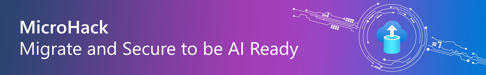

# Migrate and Secure to be ready for AI Ops

*From secure migration to agent-assisted cloud operations.*

- [**Hack introduction**](#hack-introduction)
- [**Hack context**](#hack-context)
- [**Objectives**](#objectives)
- [**Hack challenges**](#hack-challenges)
- [**Contributors**](#contributors)

# Hack introduction

This Hack follows an end-to-end datacenter modernization journey. It combines Azure Migrate, security controls, Azure Monitor, intelligent operations, and a deliberate PaaS replatform. The scenario focuses on practical decisions, repeatable validation, cost awareness, and supported product capabilities.

This lab is not a complete migration-factory or application-modernization program. Use the following articles as foundational reading:

* [Azure Migrate security baseline](https://learn.microsoft.com/en-us/security/benchmark/azure/baselines/azure-migrate-security-baseline)
* [Build a migration plan](https://learn.microsoft.com/en-us/azure/migrate/concepts-migration-planning)
* [Azure VM assessment overview](https://learn.microsoft.com/en-us/azure/migrate/concepts-assessment-calculation)
* [Azure Migrate web-app migration support matrix](https://learn.microsoft.com/en-us/azure/migrate/concepts-migration-webapps?view=migrate)
* [Azure Arc-enabled Extended Security Updates](https://learn.microsoft.com/en-us/windows-server/get-started/extended-security-updates-deploy)

Optional follow-up reading:

* [Support matrix for Hyper-V migration](https://learn.microsoft.com/en-us/azure/migrate/migrate-support-matrix-hyper-v-migration)
* [Hyper-V migration architecture](https://learn.microsoft.com/en-us/azure/migrate/hyper-v-migration-architecture)
* [Azure Migrate troubleshooting guide](https://learn.microsoft.com/en-us/azure/migrate/troubleshoot-general)
* [Azure Copilot Observability Agent](https://learn.microsoft.com/en-us/azure/azure-monitor/aiops/observability-agent-overview)
* [Deploy files to Azure App Service](https://learn.microsoft.com/en-us/azure/app-service/deploy-zip)

# Hack context

The Hack follows a coherent modernization storyline:

1. **Discover** the Hyper-V-hosted servers and their inventory.
2. **Assess** technical readiness and cloud sizing.
3. **Plan** the migration by building the business case and target design.
4. **Migrate** the workloads to Azure IaaS.
5. **Secure** the migrated environment.
6. **Operate intelligently** with Azure Monitor telemetry, alerting, and AI-assisted investigation.
7. **Replatform** the selected static IIS or Apache workload to Azure App Service and evaluate the optimal production hosting target.

The lab simulates an on-premises datacenter by running nested guest VMs on a Hyper-V host in an Azure source resource group. Azure Migrate discovers, assesses, and migrates those systems into a destination resource group. In the final challenges, each team operates and manually replatforms either the migrated Windows/IIS workload or the migrated Ubuntu/Apache workload.

The Hyper-V discovery and migration design is described here:

* [Hyper-V server discovery support](https://learn.microsoft.com/en-us/azure/migrate/migrate-support-matrix-hyper-v)
* [Migrate Hyper-V VMs](https://learn.microsoft.com/en-us/azure/migrate/tutorial-migrate-hyper-v)

# Objectives

After completing this Hack, you will be able to:

* Build an assessment and business case for a datacenter transformation.
* Plan and execute a right-sized Hyper-V VM migration to Azure.
* Apply security practices to migrated workloads.
* Enable OpenTelemetry VM metrics, DCR-based Windows event collection, and service-specific alerting.
* Investigate deterministic IIS and Apache incidents with Azure Copilot Observability Agent or the manual/KQL fallback.
* Restore and verify both services using evidence from the VMs and Azure Monitor.
* Inspect a selected IIS or Apache workload and manually replatform its static content to Windows App Service with ZIP deployment.
* Explain why Azure Storage static website hosting or Azure Static Web Apps can be a better production target for a static workload.

# Hack challenges

## General prerequisites

Complete these prerequisites before the session:

* A Microsoft Entra ID tenant.
* At least one Azure subscription.
* A Microsoft Entra user with Contributor or Owner permissions on the Azure subscription.
* A client network and browser that support the Azure portal, Azure Bastion, and Azure Cloud Shell.

Challenge 7 assumes Hack participants have Azure Copilot access, suitable RBAC, network access, and a supported region. It also includes a concise manual/KQL fallback if agent output is unavailable. No Azure OpenAI resource, model deployment, or model quota is required anywhere in this Hack.

## Challenges

* [Challenge 1 - Prerequisites and landing zone preparation](challenges/challenge-01.md) **<- Start here**
* [Challenge 2 - Discover Hyper-V virtual machines for migration](challenges/challenge-02.md)
* [Challenge 3 - Create a business case](challenges/challenge-03.md)
* [Challenge 4 - Assess VMs for the migration](challenges/challenge-04.md)
* [Challenge 5 - Migrate Hyper-V virtual machines to Azure](challenges/challenge-05.md)
* [Optional Challenge 6 - Secure on Azure](challenges/challenge-06.md)
* [Challenge 7 - Operate the migrated workloads with intelligent observability](challenges/challenge-07.md)
* [Challenge 8 - Replatform the selected migrated web workload to Azure App Service](challenges/challenge-08.md)

## Solutions - Spoiler warning

* [Solution 1 - Prerequisites and landing zone preparation](./walkthrough/challenge-01/solution-01.md)
* [Solution 2 - Discover Hyper-V virtual machines for migration](./walkthrough/challenge-02/solution-02.md)
* [Solution 3 - Create a business case](./walkthrough/challenge-03/solution-03.md)
* [Solution 4 - Assess VMs for the migration](./walkthrough/challenge-04/solution-04.md)
* [Solution 5 - Migrate Hyper-V virtual machines to Azure](./walkthrough/challenge-05/solution-05.md)
* [Optional Solution 6 - Secure on Azure](./walkthrough/challenge-06/solution-06.md)
* [Solution 7 - Operate the migrated workloads with intelligent observability](./walkthrough/challenge-07/solution-07.md)
* [Solution 8 - Replatform the selected migrated web workload to Azure App Service](./walkthrough/challenge-08/solution-08.md)

## Contributors

* Nils Bankert [GitHub](https://github.com/nilsbankert); [LinkedIn](https://www.linkedin.com/in/nilsbankert/)
* Andreas Schwarz [LinkedIn](https://www.linkedin.com/in/andreas-schwarz-7518a818b/)
* Christian Thönes [GitHub](https://github.com/cthoenes); [LinkedIn](https://www.linkedin.com/in/christian-t-510b7522/)
* Stefan Geisler [GitHub](https://github.com/StefanGeislerMS); [LinkedIn](https://www.linkedin.com/in/stefan-geisler-7b7363139/)
