# Walkthrough Challenge 1 - Prerequisites and landing zone preparation

**[Home](../../Readme.md)** - [Next Challenge Solution](../challenge-02/solution-02.md)

Duration: 30 minutes

## Prerequisites

- Please ensure that you successfully verified the [General prerequisites](../../Readme.md#general-prerequisites) before continuing with this challenge.
- The Azure CLI is required to deploy the Bicep configuration for the Hack.
- Clone the GitHub repository or download the [Resources](../../resources) directory to your local PC.

> [!IMPORTANT]
> **Many of the resource deployments in this Hack are adapted from the [Jumpstart ArcBox for IT Pros](https://jumpstart.azure.com/azure_jumpstart_arcbox/ITPro). Special thanks to the [Jumpstart Team](https://aka.ms/arcjumpstart) for their excellent work.**

### **Task 1: Deploy the Landing Zone for the Hack**

- Open the [Azure Portal](https://portal.azure.com) and log in using a user account with at least Contributor permissions on an Azure subscription. Start Azure Cloud Shell from the menu bar at the top.

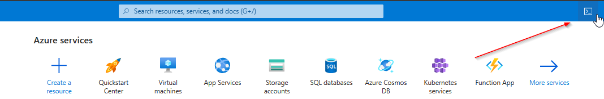

> [!NOTE]
> You can also use your local PC but make sure to install [Azure CLI](https://learn.microsoft.com/en-us/cli/azure/install-azure-cli).

- If this is the first time you have started Cloud Shell, select *Bash*, click *No storage account required*, and then click *Apply*.

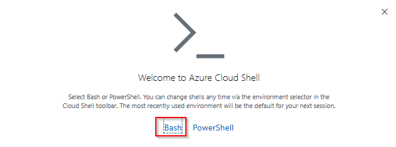

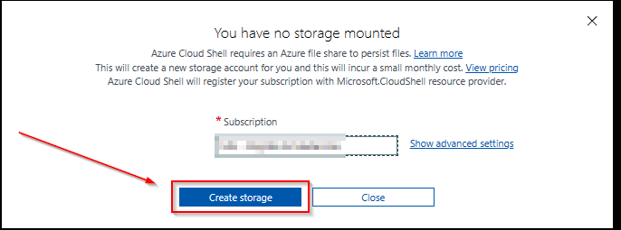

- Make sure to select *Bash*.

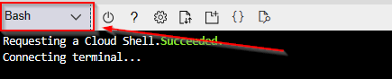

- Clone the Hack GitHub repository using the following command:

```bash
git clone https://github.com/microsoft/MicroHack.git
```

> [!NOTE]
> Contributors testing before merge must clone or check out their fork's feature branch locally so the Bicep files match the automation source selected below.

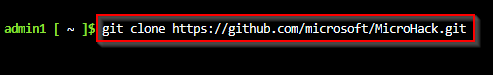

- Change into the Hack's resources directory in the cloned repository using the command:

```bash 
cd MicroHack/03-Azure/01-03-Infrastructure/06_Migration_Secure_AI_Ready/resources/bicep
```

> [!IMPORTANT]
> **Update the `REGION` variable with your desired region (the example defaults to `swedencentral`) and set `USERPASSWORD` to your desired password. The GitHub owner and branch default to the official `microsoft/MicroHack` `main` branch.**

- Set the deployment values. The defaults use the official repository. To test before merge, replace `microsoft` with your `<fork-owner>` and `main` with your `<feature-branch>`.

```bash
REGION="swedencentral"
USERPASSWORD="<REPLACE-WITHYOUR-PASSWORD>"
GITHUB_ACCOUNT="microsoft"
GITHUB_BRANCH="main"
```

> [!NOTE]
> The local `main.bicep` comes from your checked-out clone. `GITHUB_ACCOUNT` and `GITHUB_BRANCH` select the repository version used for all automation and demo-page assets downloaded during deployment.

- Verify that the selected repository branch contains a required deployment artifact before starting the costly Azure deployment:

```bash
ARTIFACT_BASE_URL="https://raw.githubusercontent.com/${GITHUB_ACCOUNT}/MicroHack/${GITHUB_BRANCH}/03-Azure/01-03-Infrastructure/06_Migration_Secure_AI_Ready/resources"
curl --fail --silent --show-error --head \
  "${ARTIFACT_BASE_URL}/artifacts/Bootstrap.ps1" >/dev/null
```

- Start the deployment:

```bash
az deployment sub create \
  --name "$(az ad signed-in-user show --query userPrincipalName -o tsv | cut -d "@" -f 1 | tr '[:upper:]' '[:lower:]')-MHBox" \
  --location "$REGION" \
  --template-file ./main.bicep \
  --parameters \
    windowsAdminPassword="$USERPASSWORD" \
    githubAccount="$GITHUB_ACCOUNT" \
    githubBranch="$GITHUB_BRANCH"
```
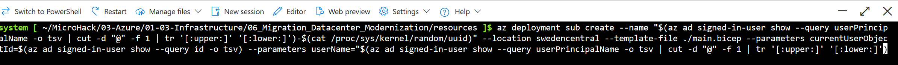

- Wait for the deployment to finish. You can view the deployment from the Azure portal by selecting the Azure subscription and clicking on *Deployments* from the navigation pane on the left.

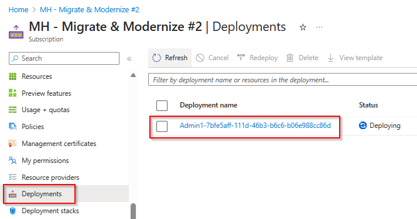

- You can also click the deployment name to see the detailed deployment steps.

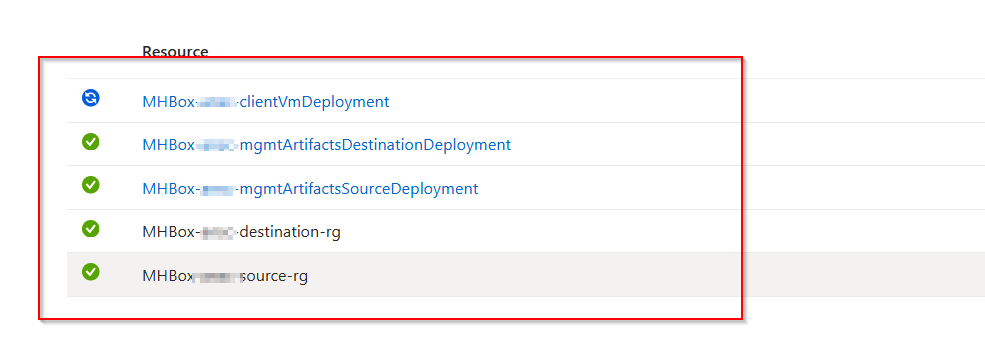

> [!NOTE]
> Please note that the deployment may take up to 15 minutes. After the deployment, multiple scripts are executed on the VM to install the required roles and to download the nested guest VMs. This process might take an additional 20 minutes. The deployment will be finished if the **DeploymentProgress** tag shows a value of **Deployment Completed**.

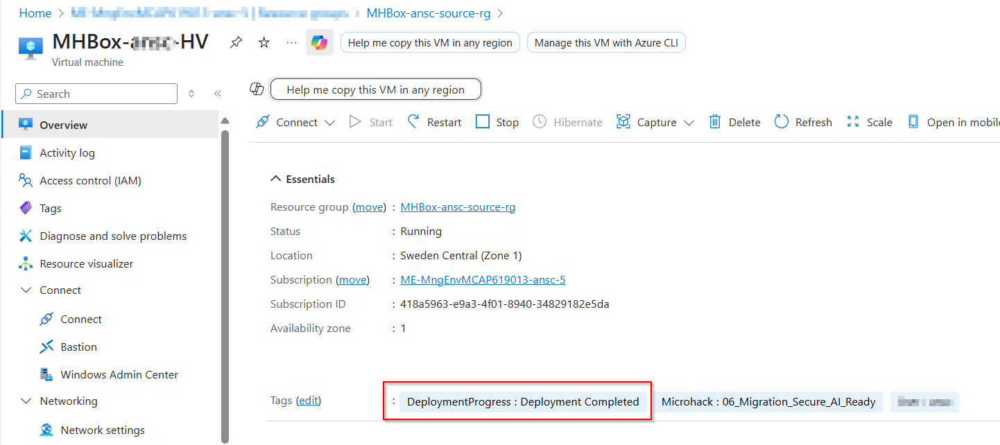

You can also log on to the MHBox-HV system during the deployment to follow the steps.

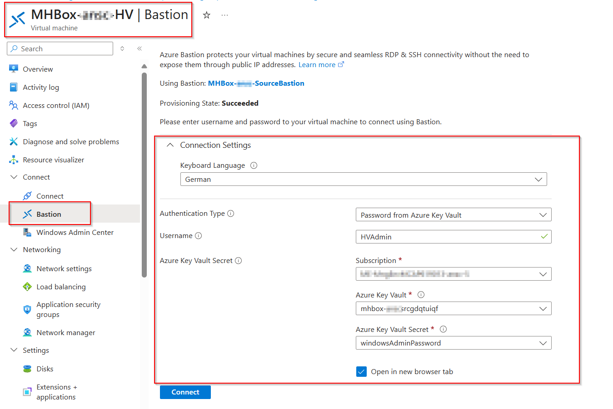

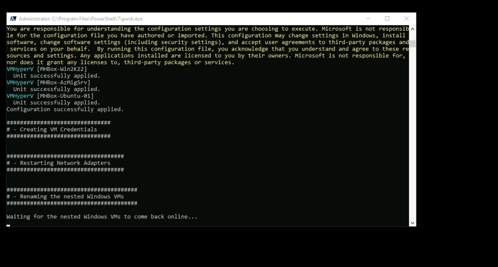

### **Task 2: Verify the deployed VM resources**
After the deployment has completed, open *Hyper-V Manager* from MHBox-HV and ensure that four VMs are running.
+ MHBox-AzMigSrv
    + This system will be used later to deploy the Azure Migrate appliance, which is required for the discovery process.
+ MHBox-SQL
    + This system hosts a Microsoft SQL Server installation to demonstrate the SQL assessment capabilities.
+ MHBox-Ubuntu-01
    + This system hosts an Ubuntu server with an installed Apache web server.
+ MHBox-Win2K22
    + This system hosts Windows Server 2022 with an installed IIS web server.

The following credentials are being used inside the nested VMs.

**Windows virtual machine credentials:**

```text
Username: Administrator
Password: JS123!!
```

**Ubuntu virtual machine credentials:**

```text
Username: jumpstart
Password: JS123!!
```

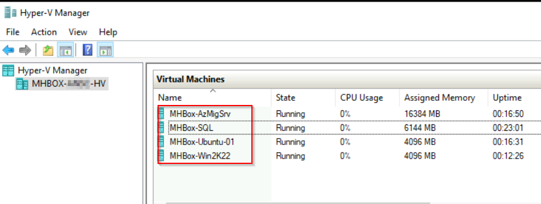

Open Microsoft Edge and navigate to the IP address of each web VM. Confirm that the migration journey dashboard returns HTTP success and shows the correct details:

| VM | Platform | Web server |
| --- | --- | --- |
| *MHBox-Win2K22* | `Windows Server 2022` | `IIS` |
| *MHBox-Ubuntu-01* | `Ubuntu Linux` | `Apache` |

The **Hostname** value must match the VM you opened.


### **Task 3: Verify the deployed Azure resources**

The Bicep deployment should have created the following Azure resources:

- source-rg resource group containing the following resources
    + Virtual Network *source-vnet*
    + Virtual Machine *MHBox-HV* with Hyper-V role installed and all required nested VMs
    + Azure Bastion *source-bastion*
    + Azure Key Vault containing username and password for VM login
    + NAT Gateway for outbound internet access
   
- destination-rg resource group containing the following resources
    + Virtual Network *destination-vnet*
    + Azure Bastion *destination-bastion*
    + NAT Gateway for outbound internet access
    
The deployed architecture looks like the following diagram:
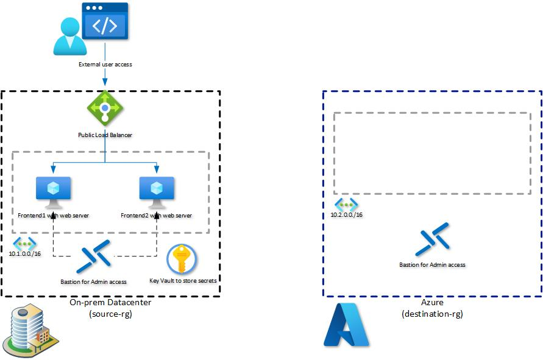

You successfully completed Challenge 1! 🚀🚀🚀
