# Walkthrough Challenge 4 - Assess VMs for the migration

[Previous Challenge Solution](../challenge-03/solution-03.md) - **[Home](../../Readme.md)** - [Next Challenge Solution](../challenge-05/solution-05.md)

Duration: 40 minutes

### **Task 1: Create an Azure VM assessment**

To create an assessment, select *Assessments* from the navigation pane on the left and click *Create assessment*.

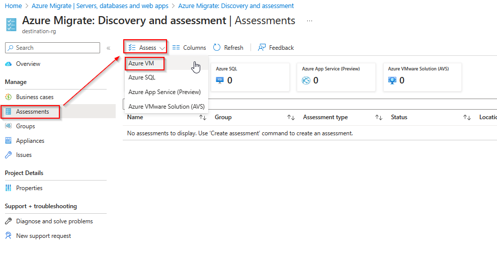

Provide a name and click on *Add workloads* to add the recently discovered systems to the assessment. Click *Next* to proceed to the next step.

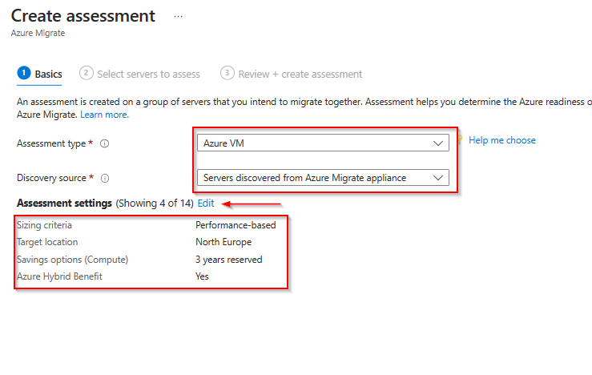

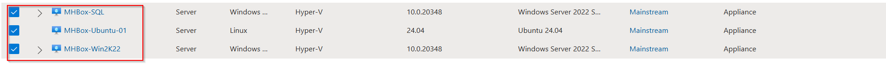 

You can adjust the target environment settings, such as the target location, VM size, and pricing options.
When finished, click *Next* to continue.

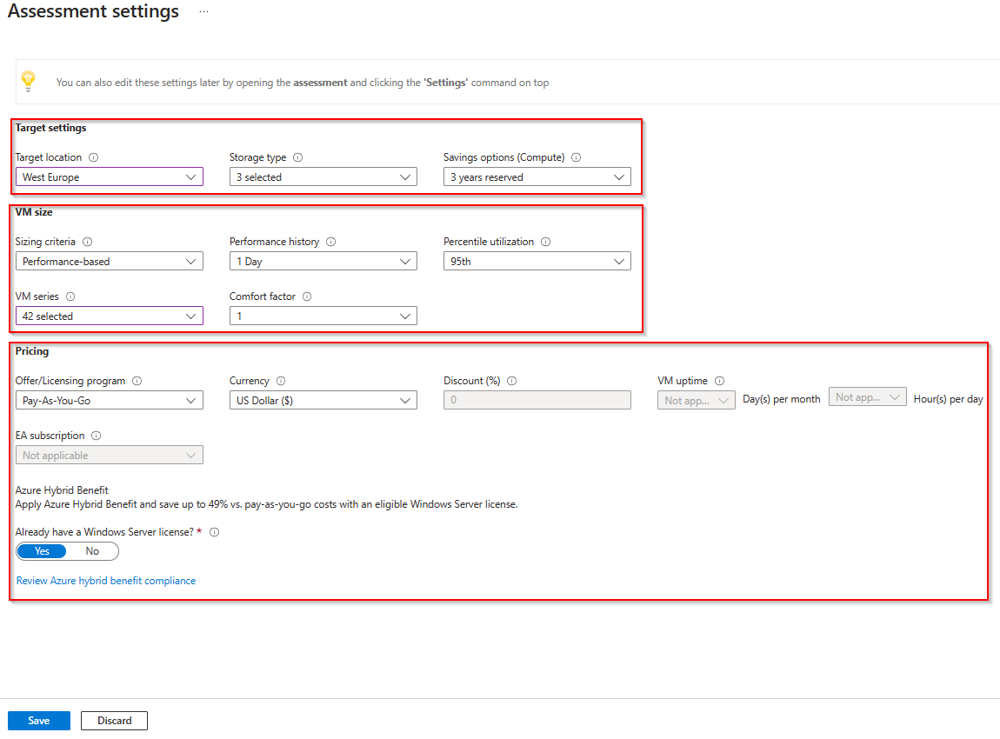

Under *Advanced*, you can adjust workload-specific settings, such as VM and disk sizes, to suit your migration requirements. Review the options or keep the defaults, and then proceed to *Review + Create assessment*.

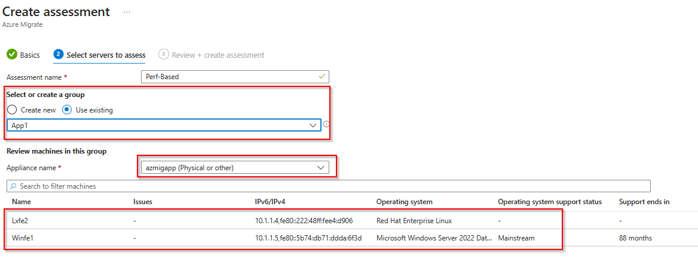

Review your selection and click on *Create assessment*.

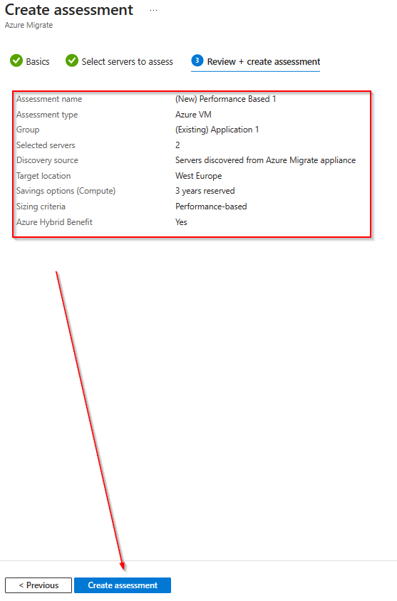

> [!NOTE]
> Please note that the computation of the assessment can take a few minutes.

When finished, the assessment will appear with the status *Ready*.

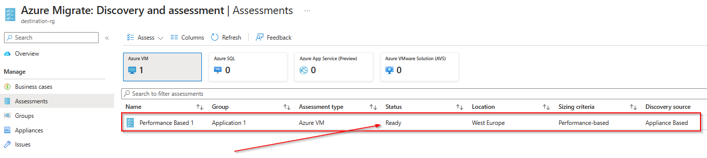

### **Task 2: Review assessment output and recommendations**

Click on the assessment name to open it.

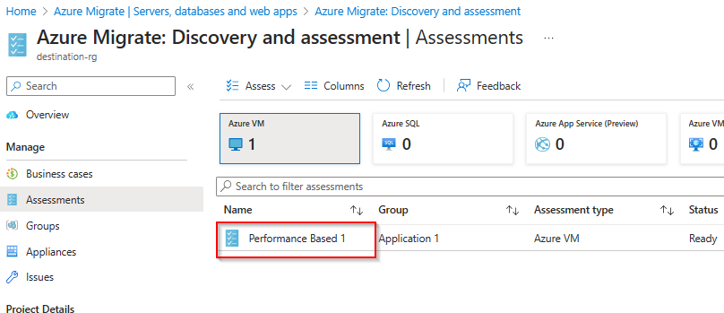

The Azure VM assessment overview provides details about:

* Azure readiness: Whether servers are suitable for migration to Azure.
* Monthly cost estimation: The estimated monthly compute and storage costs for running the VMs in Azure.
* Details about different migration paths.

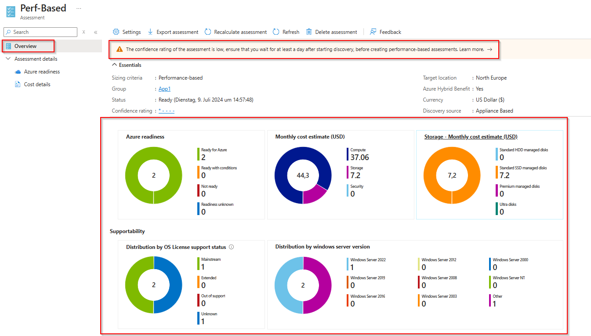

Click on *View details* for *Lift and Shift to Azure VM* to get more insights.

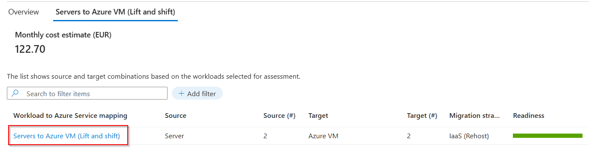

In *Servers to Azure VM (Lift and Shift)*, verify the assessment results, such as the estimated cost, server readiness, and suggested sizing options.

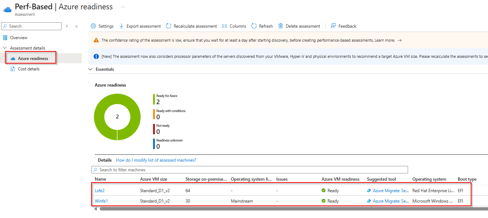

In the overview section, you can also click *Settings* to update the assessment configuration, such as the target region.

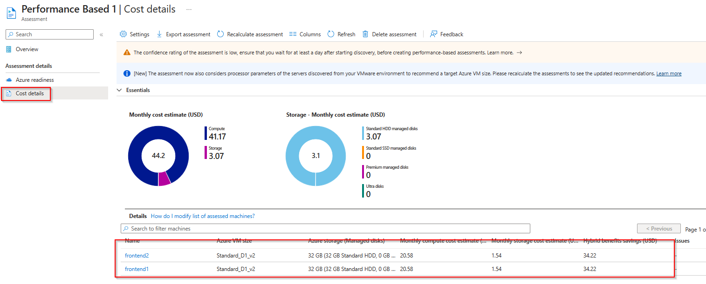

### **Task 3: Review dependency analysis**

Dependency analysis identifies dependencies between discovered on-premises servers. 

There are two options for deploying dependency analysis:

* Agentless
* Agent-based

Agentless dependency analysis works by capturing TCP connection data from servers for which it's enabled. Connections with the same source server and process, destination server and process, and port are grouped logically into a dependency. You can visualize captured dependency data in a map view or export it as a CSV. No agents are installed on the servers you want to analyze.

For agent-based analysis, Azure Migrate: Discovery and assessment uses the Service Map solution in Azure Monitor. You install the Microsoft Monitoring Agent/Log Analytics agent and the Dependency agent on each server you want to analyze.

In this MicroHack, we will use agentless dependency analysis.

> [!NOTE]
> Agentless dependency analysis is automatically enabled for the discovered servers when the prerequisite checks are successful. Unlike before, you no longer need to manually enable this feature on servers.

Once the dependency data has been uploaded to Azure Migrate, you should be able to view the dependencies of the discovered servers.

In the project, you can review dependencies for each server either through the All inventory or Infrastructure inventory view.

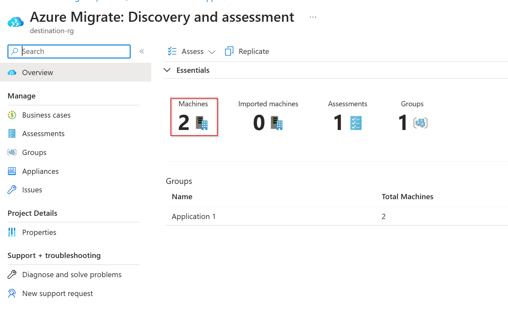

> [!NOTE]
> Please note that it could take some time for the dependency data to appear. After servers are automatically enabled for agentless dependency analysis, the appliance collects dependency data from each server every five minutes. It then sends a combined data point **every six hours**. We recommend waiting at least **24 hours** to allow enough dependency data to be gathered and shown in the visualization.

You successfully completed Challenge 4! 🚀🚀🚀
