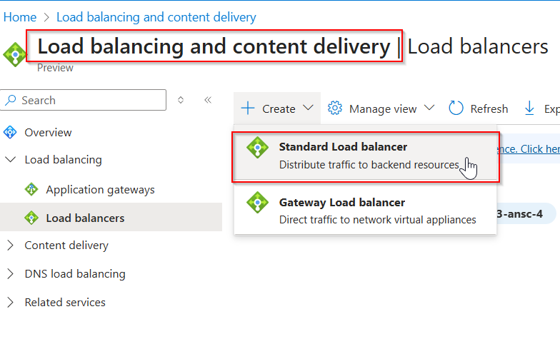
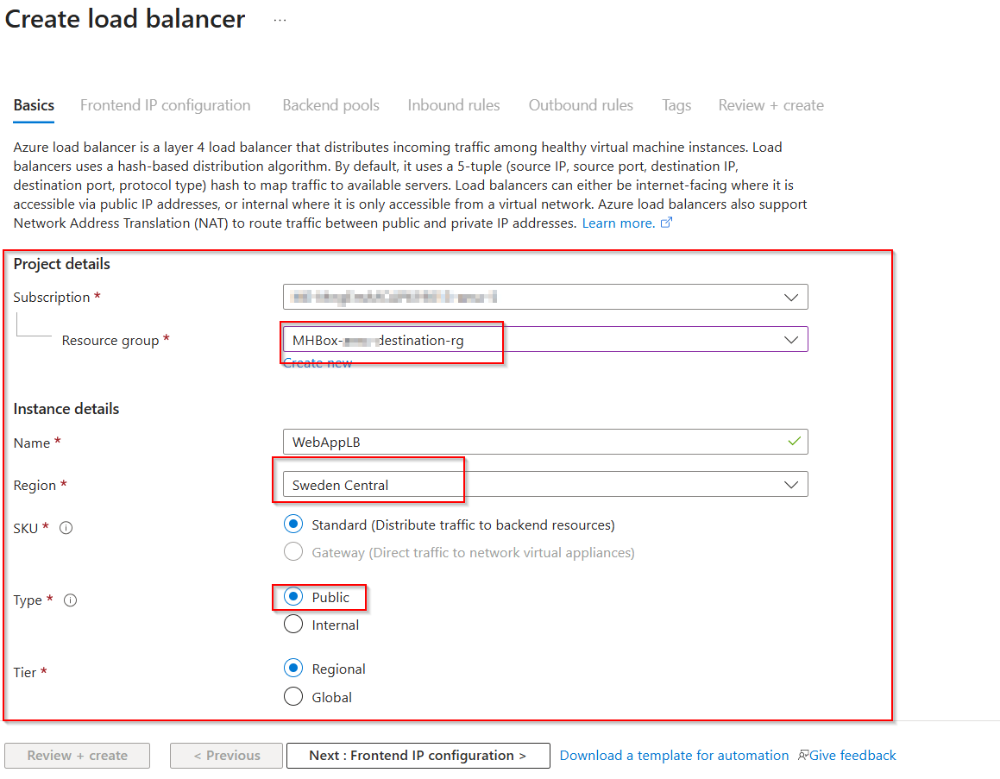
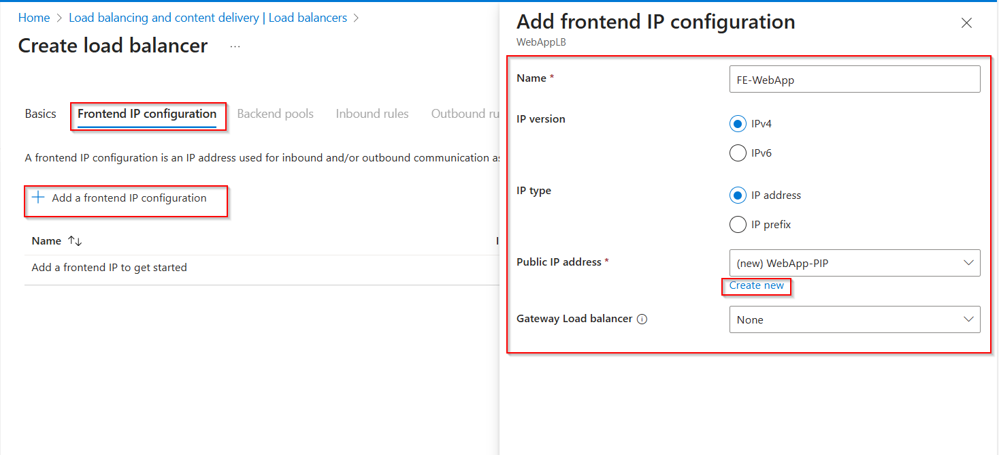
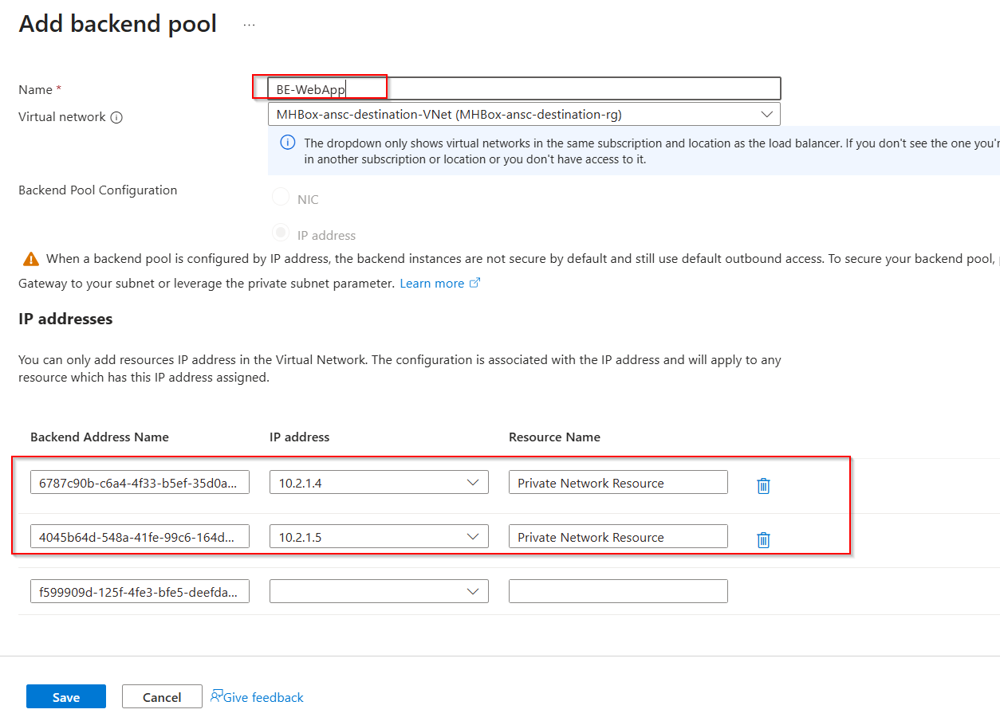
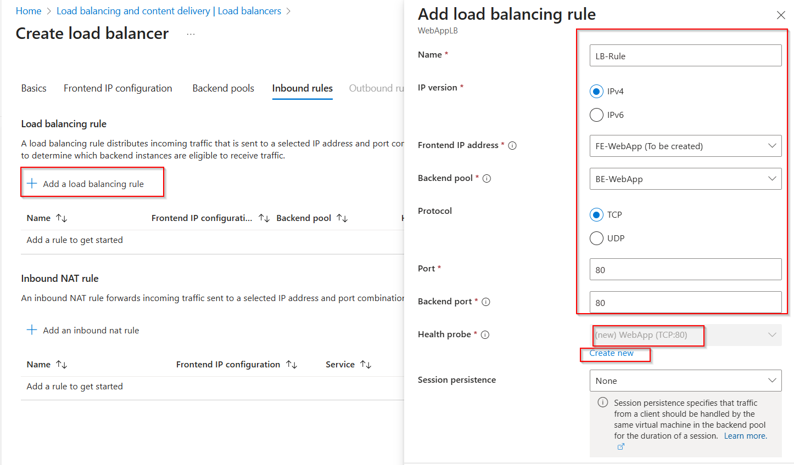
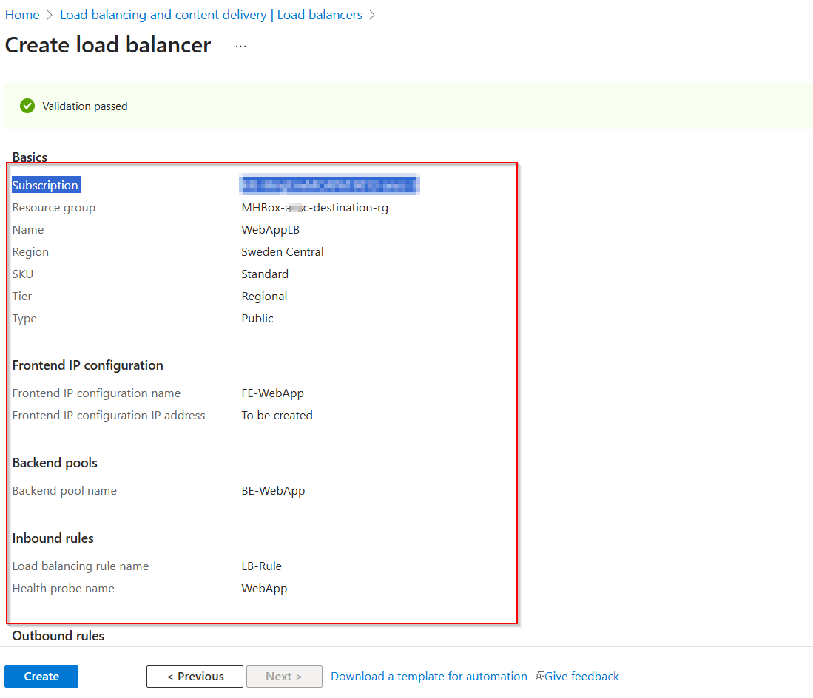
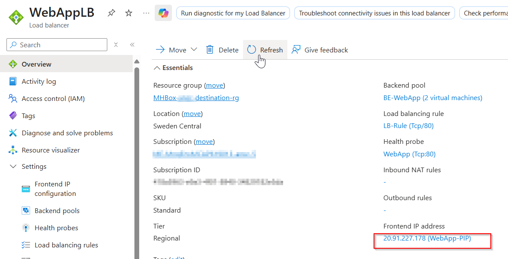
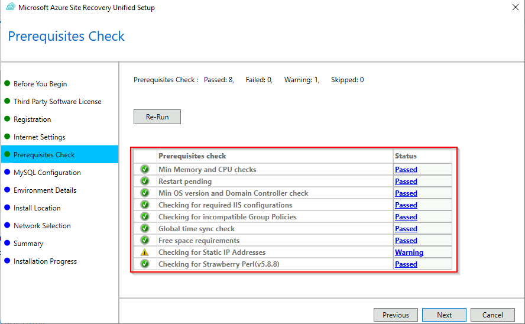
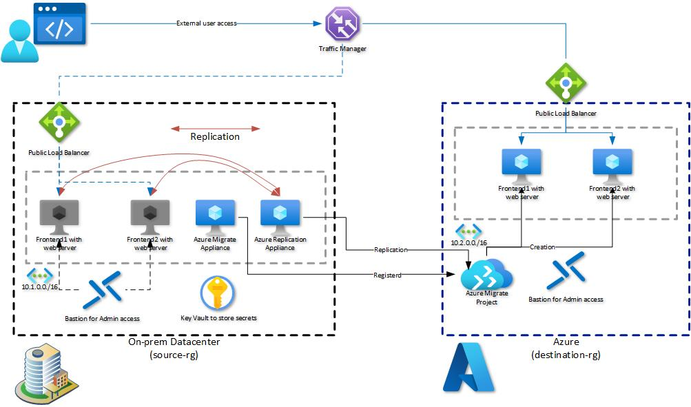

# Walkthrough Challenge 5 - Migrate Hyper-V virtual machines to Azure

[Previous Challenge Solution](../challenge-04/solution-04.md) - **[Home](../../Readme.md)** - [Next Challenge Solution](../challenge-06/solution-06.md)

Duration: 90 minutes

## Prerequisites

Please make sure that you successfully completed [Challenge 4](../challenge-04/solution-04.md) before continuing with this challenge.

> [!IMPORTANT]
> Native Hyper-V migration uses host-installed replication components: the Azure Site Recovery provider and Recovery Services agent. Install them on the Hyper-V host or cluster nodes. Nothing is installed in the guest VMs, and the Azure Migrate appliance isn't used for migration.

### **Task 1: Configure and register the Hyper-V replication providers**

In the Azure Portal, select *Virtual machines* from the navigation pane on the left. Select the **MHBox-HV** system and log on via Azure Bastion with your credentials:

> [!NOTE]
> You can also select *Password from Azure Key Vault* under *Authentication Type* to select the secret stored in the Key Vault.

Open Microsoft Edge on the Hyper-V host, navigate to the [Azure Portal](https://portal.azure.com), and log in.
In the search bar, enter *Azure Migrate* and select Azure Migrate from the list of services.

Select *All projects* from the navigation pane on the left. Your previously created Azure Migrate project should be listed. Click it to open the project.
 

Select *Migrations* from the navigation pane on the left and click *Start execution*.

On *Specify intent*, select *Servers or virtual machines (VMs)* as the workload and *Azure VM* as the destination. Under *How will you select workloads*, select *From replication provider (Hyper-V)*, and then use the link provided to start the replication-provider setup.

> [!IMPORTANT]
> **Make sure to select the correct target region. Double-check it against the destination resource group location. This can't be changed afterward.**

Click *Create resources*.

Next, download the binaries and the registration file.

Execute the *AzureSiteRecoveryProvider.exe* file to start the installation.

Register the provider with the previously downloaded registration file.

Complete the wizard and wait for the provider to be successfully registered.

Go back to the Azure Portal and finalize the registration.

> [!NOTE]
> *You might need to refresh the page.*

> [!NOTE]
> *This process might take up to 15 minutes to complete. Afterward, VM replication can be started.*

### **Task 2: Enable replication**

Once registration is complete, return to the Azure Migrate project in the Azure portal, select *Migrations* from the navigation pane on the left, and click *Start execution*.

 

Specify the intent as shown on the diagram below:

Next, select both web VMs: **MHBox-Win2K22** and **MHBox-Ubuntu-01**. Enable replication for both so that either workload can be selected in Challenges 7 and 8.

> [!NOTE]
> *If either VM isn't available for selection, verify the Hyper-V provider registration, confirm the VM appears in inventory, and review the current [Hyper-V migration support matrix](https://learn.microsoft.com/en-us/azure/migrate/migrate-support-matrix-hyper-v-migration?view=migrate) before continuing.*

Next, select the destination resource group, virtual network, and subnet.

In the *Compute* section, you can adjust target settings such as the VM size.

In the *Disk* section, you can adjust target settings such as the disk type.

Proceed to the final summary and enable replication.

Wait until the *Execution* stage shows *Testing*.

### **Task 3: Perform a test migration**

When delta replication begins, you can run a test migration for the VMs before running a full migration to Azure. We highly recommend doing this at least once for each machine before migrating it.

+ Running a test migration checks that migration will work as expected without affecting the on-premises machines, which remain operational and continue replicating.
+ A test migration simulates migration by creating an Azure VM from replicated data, usually in a nonproduction virtual network in your Azure subscription.
+ You can use the replicated test Azure VM to validate the migration, test the application, and address any issues before full migration.

Open the Azure Portal and navigate to the previously created Azure Migrate project. Select *Migrations*, and then click *Action pending* to initiate the test migration.

On the new page, make sure that *Preparation* is *Completed*. Open the menu next to *Testing*, and then click *Start test migration*.

Select the destination network and click *Test migration*.

> [!NOTE]
> **Repeat the preceding steps for the other VM.**

From the Azure Portal, navigate to the Azure Migrate project. Select *Migrations*, and then click *In progress* under *Execution status* to follow the test migration.

Wait until all steps are completed.

To validate that the test migration was successful, open the Azure Portal and select *Virtual machines* from the navigation pane on the left. Additional VMs ending with *-test* were created during the test migration.

Connect to each test VM via Azure Bastion.

On the Windows VM, open a browser and navigate to *http://localhost*. On the Ubuntu VM, run `curl -I http://localhost`. Confirm that the Hack Demo Web App responds successfully on both test VMs.

After confirming that the systems work as expected, you can clean up the test migration and proceed with the final migration.

Go back to the *Migrations* section in the Azure Migrate project in the Azure Portal and click *Action pending* for the VMs on which the test migration was performed.

From the *Testing* menu, select *Cleanup test migration*.

Provide a comment, select *Testing is complete....*, and click *Cleanup Test* to remove all resources.

> [!NOTE]
> **Repeat the preceding steps for the other VM.**

### **Task 4: Prepare the final migration**

Currently, the two servers are not published or directly accessible. After migration, the source servers will be turned off, so access to the systems must be updated. Perform the following premigration steps to keep downtime as short as possible.

#### **Task 4.1: Create a new Azure public load balancer in the destination environment**

From the Azure Portal, open the Load Balancing page, select *Load Balancer* from the navigation pane on the left, and click *Create*.

Under *Basics*, select the *destination-rg* resource group and provide a name for the new load balancer.

Under *Frontend IP configuration*, click *Add a frontend IP configuration* and create a new public IP address.

Under *Backend Pools*, select *Add a backend Pool*. Provide a name and select *destination-vnet* as the virtual network.
Add *10.2.1.4* and *10.2.1.5* as the IP addresses.

> [!NOTE]
> Azure reserves the first four addresses (0-3) in each subnet address range and doesn't assign them. Azure assigns the next available address to a resource from the subnet address range. Therefore, the IP addresses assigned to the destination VMs after migration are predictable in this lab.

Under *Inbound rules*, click *Add a load balancing rule* and create the rule as illustrated in the following diagram.

We are already using a NAT gateway to provide outbound internet access. We don't need an outbound rule and can skip this part.

Proceed to the *Review + create* section, review your configuration, and click *Create*.

After the load balancer has been created, return to the *Load balancing* section and select the load balancer. From the *Overview* pane, copy the *Frontend IP address*. Record the load balancer's public IP address because you will need it after migration.

### **Task 5: Perform the final migration**

Open the [Azure Portal](https://portal.azure.com), return to the *Migrations* section in the Azure Migrate project, and click *Action pending* for the VMs to be migrated.

Open the *Completion* menu and select *Migrate*.

Select *Yes* to shut down the VMs on the Hyper-V host, and then click *Migrate*.

In the *Migrations* section of the Azure Migrate project, click *In progress* to follow the migration steps.

You can also click on each job to review the current status of the migration. 

After a few minutes, the migration should complete successfully.

On the Hyper-V host, the VMs should also be turned off.

In the *Virtual machines* section of the Azure Portal, you should now see two additional servers in the *destination-rg* resource group.

You should now also be able to access the web server via the previously created load balancer frontend IP.

🚀🚀🚀🚀🚀🚀 Congratulations, you've successfully migrated the frontend application to Azure. 🚀🚀🚀🚀🚀🚀

### **Task 6: Complete the migration**

After validating both migrated web VMs and the load-balanced endpoint, complete the migration to stop replication and clean up each VM's replication state. Open the [Azure Portal](https://portal.azure.com), navigate to the Azure Migrate project, select *Migrations*, and open each migrated VM from the *Completion* stage.

Under *Completion*, select *Complete migration*. Repeat this action for both **MHBox-Win2K22** and **MHBox-Ubuntu-01**.

> [!NOTE]
> Completing migration stops replication for the source VM and removes its replication-state information. Confirm that the migrated Azure VM is healthy before completing this action.

You successfully completed Challenge 5.

The deployed architecture now looks like the following diagram.

Continue to Challenge 6 to secure the migrated environment. Do not remove `destination-rg` because Challenges 6 through 8 use the migrated workload.
