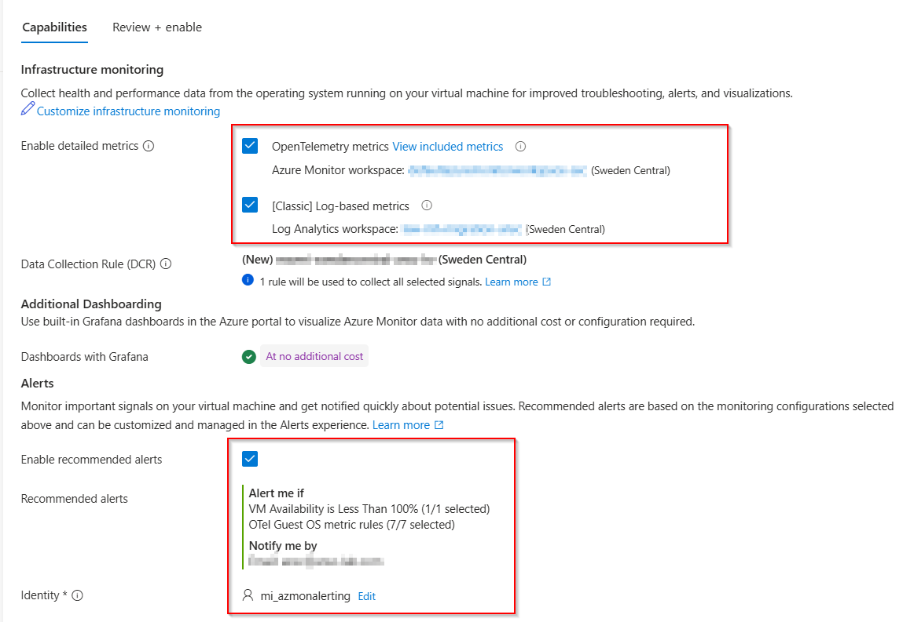

# Walkthrough Challenge 7 - Operate the migrated workloads with intelligent observability

[Previous Challenge Solution](../challenge-06/solution-06.md) - **[Home](../../Readme.md)** - [Next Challenge Solution](../challenge-08/solution-08.md)

Duration: 70 minutes

## Task 1: Validate both workloads and complete preflight (5 minutes)

Record both VM names, their region, and their Azure resource IDs. Connect to each VM with Azure Bastion.

### Windows/IIS baseline

Run in Windows PowerShell as administrator:

```powershell
$service = Get-Service -Name W3SVC
$response = Invoke-WebRequest -Uri 'http://localhost/' -UseBasicParsing -TimeoutSec 10

$service | Select-Object Name, Status, StartType
$response | Select-Object StatusCode

if ($service.Status -ne 'Running' -or $response.StatusCode -ne 200) {
    throw 'The IIS baseline is not healthy.'
}
```

### Linux/Apache baseline

Run in Bash:

```bash
set -euo pipefail

sudo systemctl is-active apache2
curl --fail --silent --show-error --output /dev/null \
  --write-out 'HTTP %{http_code}\n' http://localhost/
pgrep -a -x apache2
```

Opening each page before the incident both proves the baseline and warms IIS/Apache. Keep both Bastion sessions available for the recovery task.

### Azure Copilot and permissions

Azure Copilot access is treated as available for this Hack. Confirm:

1. The portal **Copilot** entry opens and the current region is listed in the [Observability Agent regions](https://learn.microsoft.com/azure/azure-monitor/aiops/observability-agent-overview#regions).
2. Your account can read both VMs and their monitoring data and create the lab monitoring resources. Contributor or Owner is sufficient for the Hack.
3. The client network allows WebSocket connections to `https://directline.botframework.com`.
4. A managed identity is available for the query-based metric alerts and can be assigned **Monitoring Reader** on each scoped VM or the Azure Monitor workspace.

> [!IMPORTANT]
> Observability Agent, deep investigations, Azure Monitor issues, and query-based metric alerts include preview experiences. A deep investigation can use up to 300 Azure Agent Credits. Portal labels and availability can vary by tenant and region.

No Azure OpenAI deployment or autonomous Observability Agent resource is required.

## Task 2: Enable modern infrastructure monitoring (15 minutes)

Azure Monitor provides two different guest-monitoring models:

| | OpenTelemetry metrics-based | Classic logs-based |
| --- | --- | --- |
| Data store | Azure Monitor workspace | Log Analytics workspace |
| Query | PromQL | KQL |
| Latency | Near real-time | Typically 1-3 minutes |
| Cost | Default metric set is free; additional metrics can incur cost | Standard log ingestion and retention charges |
| Best fit | New deployments and consistent Windows/Linux metrics | Multi-VM views and single-query metric/log correlation |
| Current limitation | Metrics and logs require separate queries; built-in multi-VM views are limited | Platform-specific counters and higher ingestion cost |

Use the recommended OpenTelemetry experience for both VMs. Windows also needs Log Analytics for the authoritative service-control event; this challenge doesn't query classic performance tables.

### Onboard the Windows VM

1. Open the Windows VM and select **Monitor**. If enhanced monitoring isn't enabled, select **Configure**.
2. Select **Customize infrastructure monitoring**.
3. Keep **OpenTelemetry metrics** selected.
4. Optionally select the OpenTelemetry detailed or per-process option to explore the cross-platform schema. The Windows alert doesn't use process metrics, and enabling them can incur ingestion cost.
5. Also select **Classic Log-based metrics** for the Windows VM so the portal selects or creates a compatible regional default Log Analytics workspace for the Windows Event DCR and Logs-scoped agent experience. This also enables classic performance ingestion as a side effect and can incur Log Analytics cost. Do not create a separately named lab workspace first.
6. Use the default regional Azure Monitor workspace, Log Analytics workspace, and generated DCR proposed by the portal.
7. Keep **Dashboards with Grafana** and **Recommended alerts** selected when offered. Recommended alerts cover infrastructure health; they don't replace the service-specific alerts created in Task 3.
8. Select the managed identity for the OpenTelemetry query-based alerts. It needs **Monitoring Reader** on the VM or Azure Monitor workspace.
9. Review and enable monitoring.

Before continuing, confirm that the review page names an Azure Monitor workspace, a compatible regional default Log Analytics workspace, and the generated DCR. If no Log Analytics workspace appears, return to customization and confirm **Classic Log-based metrics** is selected. If the portal still doesn't propose a default workspace, stop and ask your instructor to provide the lab's compatible default; don't independently recreate the obsolete custom-workspace flow.



> [!NOTE]
> As part of Azure Monitor Agent installation, Azure can assign a system-managed identity to the VM if it doesn't have one. Query-based metric alerts support system-assigned and user-assigned identities, but the selected alert identity still needs **Monitoring Reader** on its alert scope.

### Onboard the Linux VM

Repeat the Infrastructure monitoring flow for the Linux VM:

1. Keep **OpenTelemetry metrics** and its detailed/per-process option selected.
2. Leave **Classic Log-based metrics** off; Apache uses an OpenTelemetry process signal and doesn't require a Log Analytics workspace.
3. Let the portal select or create the same regional default Azure Monitor workspace.
4. Accept the generated DCR, dashboard, and recommended alerts.
5. Select the managed identity and enable monitoring.

The portal installs `AzureMonitorWindowsAgent` or `AzureMonitorLinuxAgent`. Provisioning, DCR association, and the first metric samples take several minutes.

### Verify and customize the generated OpenTelemetry DCR

1. Open **Monitor** > **Data Collection Rules** > **Resources**.
2. Locate each VM and open its associated DCR whose name follows `MSVMOtel-<region>-<name>`.
3. For the Linux DCR, open **Data sources** > **OpenTelemetry Performance Counters**.
4. Select **Custom** and confirm that `process.uptime` is included. Add it if it isn't present.
5. Optionally include `process.cpu.utilization` and `process.memory.usage` for richer investigation evidence.
6. Keep the default 60-second sampling interval and save.

Default OpenTelemetry metrics such as `system.uptime`, `system.cpu.time`, and `system.memory.usage` are free. `process.uptime` and other metrics beyond the default set can incur ingestion cost. Remove unneeded additional metrics after the Hack.

### Verify metrics on both VMs

From each VM, open **Metrics** and choose **View Azure Monitor workspace metrics in editor**, or open the Azure Monitor workspace PromQL editor. When the query is launched from a VM resource, Azure applies that VM's resource scope.

Run:

```promql
{"system.uptime"}
```

On the Linux VM, also run:

```promql
count({"process.uptime", "process.executable.name"="apache2"})
```

The first query must return recent data for each VM. The Linux query must return a value greater than zero. `process.executable.name` is an enabled per-process resource attribute, and `process.uptime` is a gauge measured in seconds.

> [!NOTE]
> Azure Monitor PromQL uses Prometheus 3 UTF-8 syntax. Metric and label names containing dots are quoted inside braces, for example `{"process.uptime", "process.executable.name"="apache2"}`.

## Task 3: Create service-specific alert paths (15 minutes)

Reuse the action group created by recommended monitoring alerts, or create `ag-mh-operators` in `destination-rg` with an email receiver you can check.

### Windows/IIS: collect the authoritative service event

Create a focused DCR:

1. Open **Monitor** > **Data Collection Rules** and select **Create**.
2. Name it `dcr-iis-service-events`, use `destination-rg`, the VM's region, and platform type **Windows**.
3. On **Resources**, add the Windows VM. Leave **Enable Data Collection Endpoints** off unless your network design requires a DCE.
4. Add a **Windows Event Logs** data source.
5. Select **Custom** and enter:

   ```text
   System!*[System[(EventID=7036)]]
   ```

6. Set the destination to **Azure Monitor Logs** and select the compatible default Log Analytics workspace chosen during Windows onboarding.
7. Create the DCR and verify its VM association.

Confirm that the DCR's **Resources** page shows the Windows VM. You can use the Log Analytics workspace's **Logs** page to inspect any service-control records collected after the association:

```kusto
Event
| where TimeGenerated >= ago(30m)
| where EventLog == "System" and EventID == 7036
| where _ResourceId =~ "<windows-vm-resource-id>"
| project TimeGenerated, Computer, RenderedDescription, _ResourceId
| order by TimeGenerated desc
```

Zero rows are valid when no service has changed state since the DCR became active. The deterministic ingestion gate is the `W3SVC` stopped event generated and queried in Task 4; don't create a false service interruption only to populate this preflight query.

Create a **Custom log search** scheduled-query alert from the workspace:

```kusto
Event
| where TimeGenerated >= ago(10m)
| where EventLog == "System" and EventID == 7036
| where RenderedDescription has "World Wide Web Publishing Service"
    or RenderedDescription has "W3SVC"
    or ParameterXml has "W3SVC"
| where RenderedDescription has "stopped" or ParameterXml has "stopped"
| where _ResourceId =~ "<windows-vm-resource-id>"
| project TimeGenerated, Computer, RenderedDescription, _ResourceId
```

Configure:

| Setting | Value |
| --- | --- |
| Alert name | `IIS W3SVC stopped` |
| Measure | Table rows |
| Aggregation | Count over 10 minutes |
| Condition | Greater than `0` |
| Evaluation frequency | 5 minutes |
| Severity | 2 - Warning |
| Action group | `ag-mh-operators` |
| Enable | Selected |

Enable automatic resolution when offered. Do not alert on `w3wp.exe` absence: application-pool idle timeout can remove the worker process while `W3SVC` and the site remain healthy.

### Linux/Apache: alert only when every Apache process disappears

Open **Monitor** > **Alerts** > **Create** > **Alert rule** and scope the rule to the Linux VM. Select the query-based metric alert condition and use:

```promql
absent_over_time({"process.uptime", "process.executable.name"="apache2"}[5m])
```

Configure:

| Setting | Value |
| --- | --- |
| Alert name | `Apache processes absent` |
| Condition | Query result greater than `0` |
| Evaluation frequency | 1 minute |
| Failing period | 1 minute |
| Auto resolution | Enabled |
| Severity | 2 - Warning |
| Managed identity | Identity with **Monitoring Reader** on the VM or Azure Monitor workspace |
| Action group | `ag-mh-operators` |

`apache2` normally has a parent and multiple workers, each with its own `process.uptime` series. `absent_over_time` returns no result while any matching series exists and returns `1` only after all matching series have been absent for the full five-minute window. Allow up to 10 minutes after the stop command for the final sample, absence window, collection, and alert evaluation before treating a missing alert as a configuration problem.

## Task 4: Induce and prove both controlled incidents (10 minutes)

Warm both pages once more before stopping either service. Process/service telemetry proves component state, while the local HTTP request proves user-visible impact in this private lab. Neither signal is a substitute for production synthetic availability monitoring.

### Stop IIS and prove impact

Run in elevated Windows PowerShell:

```powershell
$incidentStart = Get-Date
Stop-Service -Name W3SVC -Force
$service = Get-Service -Name W3SVC

$siteFailed = $false
try {
    Invoke-WebRequest -Uri 'http://localhost/' -UseBasicParsing -TimeoutSec 10 -ErrorAction Stop | Out-Null
}
catch {
    $siteFailed = $true
    Write-Host "Expected local IIS failure: $($_.Exception.Message)"
}

if ($service.Status -ne 'Stopped' -or -not $siteFailed) {
    throw "The controlled IIS incident wasn't proven."
}

Get-WinEvent -FilterHashtable @{
    LogName   = 'System'
    Id        = 7036
    StartTime = $incidentStart
} | Where-Object {
    $_.Message -match 'World Wide Web Publishing Service|W3SVC'
} | Select-Object TimeCreated, Id, Message
```

Wait for the stopped event to appear in the Task 3 KQL query, then wait for `IIS W3SVC stopped` to appear under **Monitor** > **Alerts** > **Alert instances**.

### Stop Apache and prove impact

Run in Bash:

```bash
set -euo pipefail

sudo systemctl stop apache2

if systemctl is-active --quiet apache2 || pgrep -x apache2 >/dev/null; then
  echo "Apache unexpectedly remained active." >&2
  exit 1
fi

if curl --fail --silent --show-error --max-time 10 http://localhost/ >/dev/null; then
  echo "The local Apache site unexpectedly remained available." >&2
  exit 1
else
  echo "Expected local Apache HTTP failure confirmed."
fi
```

In the Linux VM's resource-scoped PromQL editor, compare:

```promql
count({"process.uptime", "process.executable.name"="apache2"})
```

```promql
absent_over_time({"process.uptime", "process.executable.name"="apache2"}[5m])
```

The count disappears after the final process series stops reporting. The absence query becomes `1` only after the complete five-minute gap. Allow up to 10 minutes from the stop command for `Apache processes absent` to fire.

> [!NOTE]
> If either alert doesn't fire, keep the services stopped only long enough to verify DCR association, identity authorization, query scope, ingestion, and alert evaluation. Task 6 contains independent recovery commands and can be run at any time.

## Task 5: Investigate, decide, and preserve context with AI (15 minutes)

Open each fired alert and select **Investigate**. Review the Azure Agent Credit notice, select **Start chat**, and let the Observability Agent complete its deep investigation.

### Investigate the IIS alert

```text
Investigate this IIS availability incident on the Windows VM. Build an evidence-backed
timeline from the alert, Windows System event ID 7036 for W3SVC, OpenTelemetry host
metrics, Resource Health, Activity Log, and related alerts. State the user impact and
blast radius. Determine the most likely root cause, list plausible hypotheses that the
evidence rules out, and cite the resource and timestamps used. Recommend the safest
human-executed remediation, rollback, validation steps, and alert-tuning or prevention
improvements. Do not change resources or restart services.
```

### Investigate the Apache alert

```text
Investigate this Apache availability incident on the Ubuntu VM. Confirm that all
process.uptime series with process.executable.name=apache2 disappeared for the alert
window, then correlate that signal with OpenTelemetry host metrics, Resource Health,
Activity Log, and related alerts. State the user impact and blast radius. Determine the
most likely root cause, list hypotheses ruled out by the evidence, and cite resources
and timestamps. Recommend the safest human-executed remediation, rollback, validation,
and alert-tuning or prevention improvements. Do not change resources or start services.
```

Then ask from either investigation:

```text
Compare the two incidents. Did they share a platform, network, capacity, or regional
failure, or were they independent service-level failures? Separate observed evidence
from inference and identify any telemetry gap that prevents a firm conclusion.
```

Confirm that the report contains impact, scope, chronology, supporting evidence, a likely cause, ruled-out alternatives, safe remediation, rollback, and prevention guidance. Use **Create Issue** when available to preserve the investigation report and conversation as an Azure Monitor issue.

> [!IMPORTANT]
> This lab uses controlled autonomy. The agent can chat, correlate telemetry, run a user-invoked investigation, create issues, and recommend actions. It doesn't restart services, modify production resources, or resolve the incident automatically. The human operator evaluates and executes remediation.

Do not create an autonomous Observability Agent resource. In the current preview, the portal scopes that resource to Application Insights, and new VM-only scope isn't a supported configuration for this Hack.

### Concise manual fallback

If agent output is unavailable, retain the same evidence standard:

1. Use the IIS stopped-event KQL query from Task 3.
2. Use the Linux `count` and `absent_over_time` PromQL queries from Task 4.
3. At each VM's incident time, inspect the default host signals:

   ```promql
   {"system.uptime"}
   ```

   ```promql
   sum by (state) (rate({"system.cpu.time"}[5m]))
   ```

   ```promql
   sum by (state) ({"system.memory.usage"})
   ```

4. Review each VM's **Resource Health**, **Activity log**, and Grafana dashboard for the same window.

Continuing system uptime and normal host signals, combined with a stopped service signal and local HTTP failure, support a service-level diagnosis. Record evidence that rules out VM restart, resource exhaustion, Azure platform impact, or an unrelated configuration change before choosing remediation.

## Task 6: Restore, validate, and improve the runbook (10 minutes)

The operator, not the agent, restores both services.

### Restore IIS

Run in elevated Windows PowerShell:

```powershell
Set-Service -Name W3SVC -StartupType Automatic
Start-Service -Name W3SVC

$service = Get-Service -Name W3SVC
$response = Invoke-WebRequest -Uri 'http://localhost/' -UseBasicParsing -TimeoutSec 10

$service | Select-Object Name, Status, StartType
$response | Select-Object StatusCode

if ($service.Status -ne 'Running' -or $response.StatusCode -ne 200) {
    throw 'IIS recovery validation failed.'
}
```

Verify the running event:

```kusto
Event
| where TimeGenerated >= ago(30m)
| where EventLog == "System" and EventID == 7036
| where RenderedDescription has "World Wide Web Publishing Service"
    or RenderedDescription has "W3SVC"
    or ParameterXml has "W3SVC"
| where RenderedDescription has "running" or ParameterXml has "running"
| where _ResourceId =~ "<windows-vm-resource-id>"
| project TimeGenerated, Computer, RenderedDescription, ParameterXml, _ResourceId
| order by TimeGenerated desc
```

### Restore Apache

Run in Bash:

```bash
set -euo pipefail

sudo systemctl enable --now apache2
systemctl is-active --quiet apache2
pgrep -a -x apache2
curl --fail --silent --show-error --output /dev/null \
  --write-out 'HTTP %{http_code}\n' http://localhost/
```

Verify that process telemetry returns:

```promql
count({"process.uptime", "process.executable.name"="apache2"})
```

The value must again be greater than zero. Use Bastion to validate both web pages and confirm their hostname, platform, and web-server details remain correct.

The Apache alert can resolve after process samples return. The IIS alert resolves only after the stopped event leaves its query window and a later evaluation succeeds. Review the alert timelines rather than forcing closure.

Ask the agent in the saved investigation or issue:

```text
Create a concise post-incident summary for both service failures. Include impact,
timeline, authoritative evidence, root cause, remediation and validation, rollback,
alert behavior, remaining telemetry gaps, and three prioritized runbook or alert-tuning
improvements. Clearly state that local HTTP validation isn't continuous synthetic
availability monitoring.
```

### Cleanup and handoff

Keep monitoring while completing Challenge 8. After the Hack:

* Remove the two lab service alerts, their action-group links, and the Windows service-event DCR if they aren't shared.
* Remove additional per-process metrics if they were enabled only for this lab and their ongoing cost isn't justified.
* Don't delete portal-created Azure Monitor or Log Analytics workspaces, generated DCRs, managed identities, dashboards, or action groups until you confirm no other resources use them.

Continue to Challenge 8, where you select either recovered workload for the guided replatforming exercise.

You successfully completed Challenge 7.
