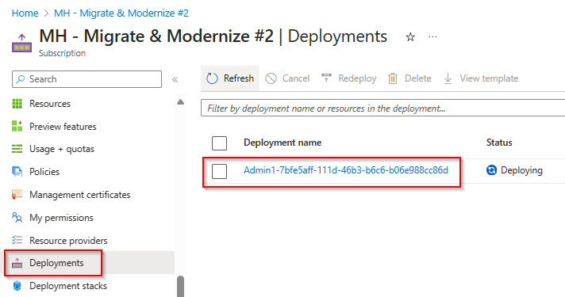

# Walkthrough Challenge 1 - Prerequisites and Landing Zone

Duration: 30 minutes

## Prerequisites

- Please ensure that you successfully verified the [General prerequisits](../../Readme.md#general-prerequisites) before continuing with this challenge.
- The Azure CLI is required to deploy the Bicep configuration of the Micro Hack.
- Clone the Github repository or download the [Resources](../../resources) directory to your local PC.

> [!IMPORTANT]
> **Many of the resource deployments in this Microhack are adapted from the [Jumpstart ArcBox for IT Pros](https://jumpstart.azure.com/azure_jumpstart_arcbox/ITPro). Special thanks to the [Jumpstart Team](https://aka.ms/arcjumpstart) for their excellent work.**

### **Task 1: Deploy the Landing Zone for the MicroHack**

- Open the [Azure Portal](https://portal.azure.com) and login using a user account with at least Contributor permissions on a Azure Subscription. Start the Azure Cloud Shell from the Menu bar on the top.


> [!NOTE]
> You can also use your local PC but make sure to install [Azure CLI](https://learn.microsoft.com/en-us/cli/azure/install-azure-cli).

- If this is the first time that Cloud Shell is beeing started, select *Bash* and clicking on *No storage account required* and click on apply.


- Make sure to select *Bash*.


- Clone the MicroHack Github repository using the following command

```bash
git clone https://github.com/microsoft/MicroHack.git
```


- Change into to desired Microhack directory of the cloned repository using the command:

```bash 
cd MicroHack/03-Azure/01-03-Infrastructure/06_Migration_Secure_AI_Ready/resources/bicep
```

> [!IMPORTANT]
> **Please update the REGION variable with your desired region - defaulting to swedencentral. Please update the USERPASSWORD parameter with your desired password.**

- Execute the following commands to set the target region and your desired password and start the deployment:
```bash
REGION="swedencentral"
USERPASSWORD="<REPLACE-WITHYOUR-PASSWORD>"
az deployment sub create --name "$(az ad signed-in-user show --query userPrincipalName -o tsv | cut -d "@" -f 1 | tr '[:upper:]' '[:lower:]')-MHBox" --location $REGION --template-file ./main.bicep --parameters windowsAdminPassword=$USERPASSWORD
```


- Wait for the deployment to finish. You can view the deployment from the Azure portal by selecting the Azure Subscription and click on *Deployments* from the navigation pane on the left.



- You can also click on the deployment name to see the detailed deployment steps


> [!NOTE]
> Please note that the deployment may take up to 15 minutes. After the deployment, multiple scripts are executed on the VM to install the required roles and to download the nested guest VMs. This process might take additional 20 minutes. The deployment will be finished if the **DeploymentProgress** tag shows a value of **Deployment Completed**


You can also logon to the MHBox-HV system during the deployment to follow the steps. 


### **Task 2: Verify the deployed VM resources**
After the deployment has been completed, from the MHBox-HV open the *Hyper-V Manager* and ensure that 4 VMs are running.
+ MHBox-AzMigSrv
    + This system will be used later to deploy the Azure Migrate Appliance which is required for the Discovery process.
+ MHBox-SQL
    + This system hosts an Microsoft SQL Server installation to demonstrate the SQL assessment capabilities.    
+ MHBox-Ubuntu-01
    + This system hosts an Ubuntu server with an installed Apache Web Server.
+ MHBox-Win2K22
    + This system hosts an Microsoft Windows Server 2022 with an installed IIS Web Server.      

The following credentials are beeing used inside the nested VMs

**Windows virtual machine credentials:**

```text
Username: Administrator
Password: JS123!!
```

**Ubuntu virtual machine credentials:**

```text
Username: jumpstart
Password: JS123!!
```


You can also open the Edge browser and navigate to the IP of the *MHBox-Win2K22* or *MHBox-Ubuntu-01* system to see the Demo Web App which was deployed.


### **Task 3: Verify the deployed Azure resources**

The bicep deployment should have created the following Azure resources

- source-rg Resource Group containing the follwing resources
    + Virtual Network *source-vnet*
    + Virtual Machine *MHBox-HV* with Hyper-V role installed and all required nested VMs
    + Azure Bastion *source-bastion*
    + Azure Key Vault containing username and password for VM login
    + NAT Gateway for outbound internet access
   
- destination-rg Resource Group containing the follwing resources
    + Virtual Network *destination-vnet*
    + Azure Bastion *destination-bastion*
    + NAT Gateway for outbound internet access
    
The deployed architecture looks like following diagram:


You successfully completed challenge 1! 🚀🚀🚀

 **[Home](../../Readme.md)** - [Next Challenge Solution](../challenge-2/solution.md)
