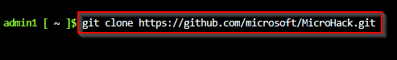
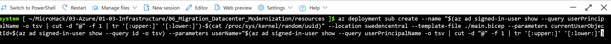

# Walkthrough Challenge 1 - Prerequisites and Landing Zone

Duration: 30 minutes

## Prerequisites

- Please ensure that you successfully verified the [General prerequisits](../../Readme.md#general-prerequisites) before continuing with this challenge.
- The Azure CLI is required to deploy the Bicep configuration of the Micro Hack.
- Download the \*.bicep files from the [Resources](../../resources) to your local PC.

### **Task 1: Deploy the Landing Zone for the Micro Hack**

- Open the [Azure Portal](https://portal.azure.com) and login using a user account with at least Contributor permissions on a Azure Subscription. Start the Azure Cloud Shell from the Menu bar on the top.

> [!NOTE]
> You can also use your local PC but make sure to install [Azure CLI](https://learn.microsoft.com/en-us/cli/azure/install-azure-cli).

- If this is the first time that Cloud Shell is beeing started, create the required Storage Account by selecting _Bash_ and clicking on _Create storage_ and wait until the Storage Accounts has been created.

- Make sure to select _Bash_.

- Clone the MicroHack Github repository using the `git clone https://github.com/microsoft/MicroHack.git` command.

- Change into to Migrate & Modernize Microhack directory of the cloned repository using the `cd MicroHack/03-Azure/01-03-Infrastructure/06_Migration_Secure_AI_Ready/resources` command.

- Execute `az deployment sub create --name "$(az ad signed-in-user show --query userPrincipalName -o tsv | cut -d "@" -f 1 | tr '[:upper:]' '[:lower:]')-$(cat /proc/sys/kernel/random/uuid)" --location swedencentral --template-file ./main.bicep --parameters currentUserObjectId=$(az ad signed-in-user show --query id -o tsv) --parameters userName="$(az ad signed-in-user show --query userPrincipalName -o tsv | cut -d "@" -f 1 | tr '[:upper:]' '[:lower:]')"`

- Wait for the deployment to finish. You can view the deployment from the Azure portal by selecting the Azure Subscription and click on _Deployments_ from the navigation pane on the left.

> [!NOTE]
> Please note that the deployment may take up to 10 minutes.

### **Task 2: Verify the deployed resources**

The bicep deployment should have created the following resources

- source-rg Resource Group containing the follwing resources
  - Virtual Network _source-vnet_
  - Virtual Machine _Win-fe1_ with installed web server on a Windows Server System
  - Virtual Machine _Lx-fe2_ with installed web server on a REHL System
  - Public Load Balancer _plb-frontend_ with configured backend pool containing _frontend1_ and _frontend2_ VM
  - Azure Bastion _source-bastion_
  - Azure Key Vault _source-kv-_ containing username and password for VM login
- destination-rg Resource Group containing the follwing resources
  - Virtual Network _destination-vnet_
  - Azure Bastion _destination-bastion_

The deployed architecture looks like following diagram:

### **Task 3: Verify Web Server availability**

- Open _source-rg_ Resource Group
- Select _plb-frontend_ Load Balancer
- Navigate to _Frontend IP configuration_ under _Settings_ section on the left
- Note and copy public IP address of _LoadBalancerFrontEnd_
- Open web browser and navigate to http://LoadBalancerFrontEnd-IP-Address
- A simple website containing the server name of the frontend1 or frontend2 VM should be displayed

You successfully completed challenge 1! 🚀🚀🚀

**[Home](../../Readme.md)** - [Next Challenge Solution](../challenge-2/solution.md)
