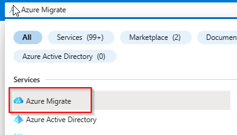
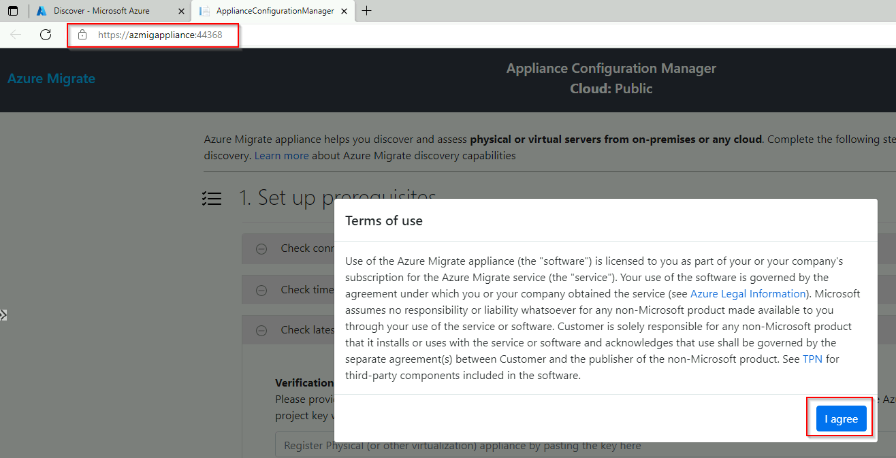
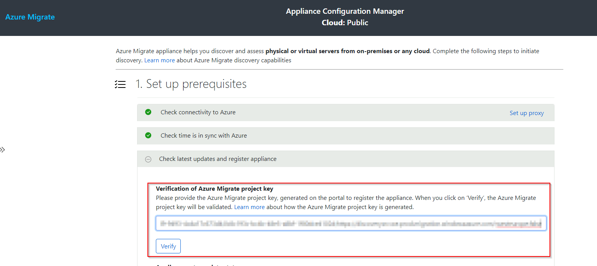
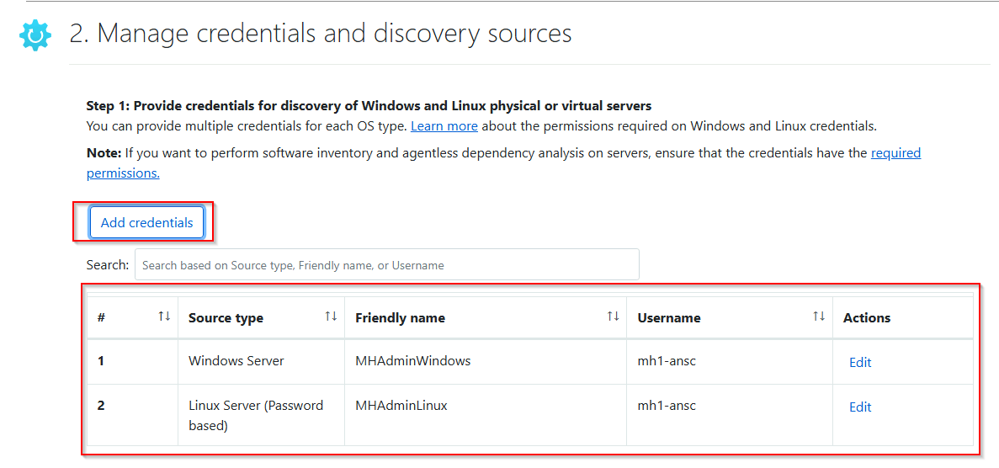
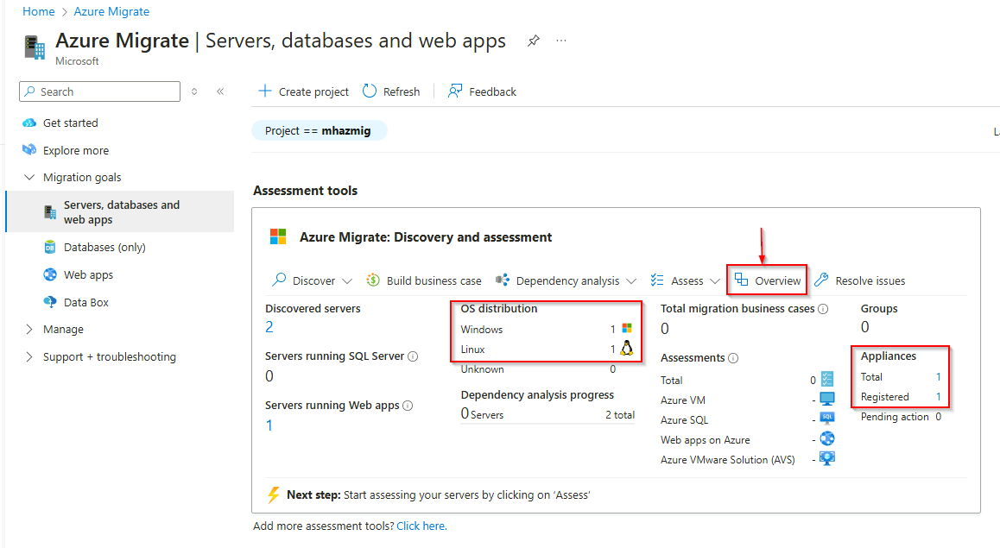

# Walkthrough Challenge 2 - Discover the virtualized servers for the migration

Duration: 60 minutes

## Prerequisites

Please make sure thet you successfully completed [Challenge 1](../challenge-1/solution.md) before continuing with this challenge.

### **Task 1: Create a Azure Migrate Project**

Open the [Azure Portal](https://portal.azure.com) and login using a user account with at least Contributor permissions on a Azure Subscription.

In the search bar enter *Azure Migrate* and select Azure Migrate from the list of services



Select *All projects* from the navigation pane on the left and click on *Create project*


> [!IMPORTANT]
> To be able to create a Business Case, make sure to select **Europe** as the Geography for the Azure Migrate Project

Select the *destination-rg* Resource Group, specify a name for the Azure Migrate Project and also select a geography where the data will be stored.


Wait until the Azure Migrate Project has been created. Select *All projects* from the navigation pane on the left.
Your previousley created Azure Migrate project should be listed. Click on it to open the project.


### **Task 2: Install the Azure Migrate Appliance software**

To start physical server discovery you must install the Azure Migrate Appliance on your on-premises. The Azure Migrate Appliance can be downloaded as a OVA or VHD template or you can download a ZIP file containing a PowerShell script to install it on an already existing server. For the purpose of this MicroHack we will install the Azure Migrate Appliance via the PowerShell script on the already deployed Server **MHBOX-AzMigSrv**.

> [!IMPORTANT]
> Please make sure to check the [prerequisites](https://learn.microsoft.com/en-us/azure/migrate/tutorial-discover-physical#prerequisites) of the Azure Migrate Appliance.

In the Azure Portal select *Virtual machines* from the navigation pane on the left. Select the *MHBox-HV* system and logon via Azure Bastion with you credentials:

> [!NOTE]
> You can also select *Password from Azure KeyVault* under *Authentication Type* to sekect the secret stored in the KeyVault.


Start the Hyper-V Manager and connect to the **MHBOX-AzMigSrv** server.

The following credentials are beeing used inside the nested VMs

**Windows virtual machine credentials:**

```text
Username: Administrator
Password: JS123!!
```

**Ubuntu virtual machine credentials:**

```text
Username: jumpstart
Password: JS123!!
```

> [!IMPORTANT]
> Please make sure to run the following commands inside of the **MHBOX-AzMigSrv** virtual machine that was created for the mirgration appliance during the deployment.


Open Microsoft Edge on the Windows Server 2022 system and navigate and login to the [Azure Portal](https://portal.azure.com).
In the search bar enter *Azure Migrate* and select Azure Migrate from the list of services


 Select *All projects* from the navigation pane on the left. Your previousley created Azure Migrate project should be listed. Click on it to open the project.
 


Select *Start Discovery -> Using appliance -> for Azure*.


Select *Yes, with Hyper-V* from the *Are your servers virtualized* drop down. Enter a name into the *Name your appliance* field and clicke *Generate*. Wait until the Project key has been created. Copy the Project key and click *Download*, to download the ZIP file containing the PowerShell script to install the Azure Migrate Appliance.


Open the folder containing the download and extract the ZIP file.


Start an evelvated PowerShell session and change the PowerShell directory to the folder where the contents have been extraceted.
Run the script named AzureMigrateInstaller.ps1 and select *R* to confirm script execution.

Select Option 2 for *Hyper-V*


Select Option 1 for *Azure Public*


Select Option 1 for *public endpoint* and confirm your selection to start the installation.


Select *R* again and continue the installation.


Select *Y* again to uninstall IE11 and continue the installation.


The system will reboot automatically. Installation is now complete.


Wait for the reboot to complete, log-in again and proceed to Task 4.

### **Task 4: Configure the Azure Migrate Appliance**

Open Azure Migrate Appliance Configuration Manager using the icon on the Desktop.


Agree the terms of use.



Paste the previously copied Azure Migrate project key and click *Verify*. Once successfully verified the latest appliance updates will be installed.

> [!IMPORTANT]
> If you forgott to copy the key, go back to the Azure Migrate Project, Select *Action center* from the left, klick on *Pending actions* and then on *Register* to copy the key again




Wait for the Appliance to check and install required updates. Once completed log in to Azure using the provieded code.


After successfull authentication, the appliance will be registered with the Azure Migrate project.


Next you need to specify the credentials that will be used to connect to the hypervisor for discovery of the guest-VMs.

> [!NOTE]
> For the Username and Password check the secrets within the KeyVault.



Next you need to map the credential to the hyper-V host. Make sure that validation is successfull.


Next you need to provide the individual credentials that will be used to perform guest discovery on the guest VMs.


To start discovery click *Start discovery*.

After discovery has been successfully initiated, go to the Azure portal to review the discovered inventory.



> [!NOTE]
> If no inventory data is available, click Refresh to refresh inventory data.

You successfully completed challenge 2! 🚀🚀🚀

The deployed architecture now looks like the following diagram.


 **[Home](../../Readme.md)** - [Next Challenge Solution](../challenge-3/solution.md)
