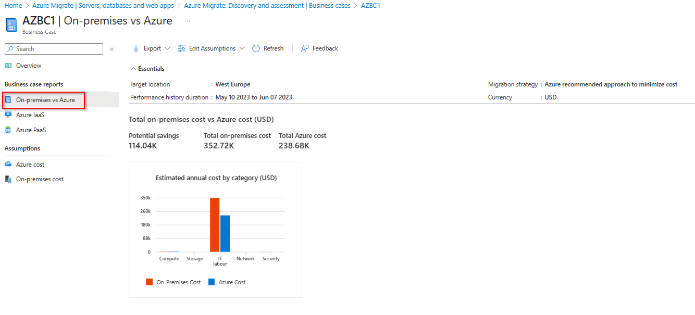
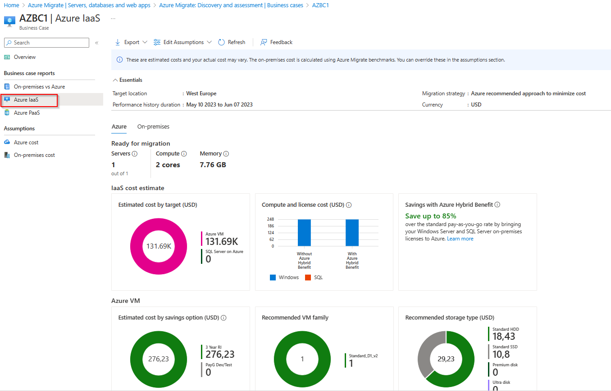

# Walkthrough Challenge 3 - Create a Business Case

Duration: 40 minutes

## Prerequisites

Please make sure thet you successfully completed [Challenge 2](../challenge-2/solution.md) before continuing with this challenge.
Please also make sure to review the [prerequisites](https://learn.microsoft.com/en-us/azure/migrate/how-to-build-a-business-case#prerequisites) for the business case.

### **Task 1: Build a business case**

Open the [Azure Portal](https://portal.azure.com) and navigate to the previously created Azure Migrate project. Select your Azure Migrate project and expand the *Decide and plan* navigation pane on the right. Select *Business case* and click *Build business case* on the top.

Provide a name for the business case and select a *Entire datacenter* for the scope.

Provide addtional details like the preffered target region, your migration preference and any saving options and click *Build business case*

> [!NOTE]
> Please note that business case creation can take up to 30 minutes.

### **Task 2: Review a business case**

There are multiple reports that you need to review:

- Overview: This report is an executive summary of the business case and covers:
  + Potential savings (TCO).
  + Estimated year on year cashflow savings based on the estimated migration completed that year.
  + Savings from unique Azure benefits like Azure Hybrid Benefit.
  + Discovery insights covering the scope of the business case.

- On-premises vs future: This report covers the breakdown of the total cost of ownership by cost categories and insights on savings.

- Azure IaaS: This report covers the Azure and on-premises footprint of the servers and workloads recommended for migrating to Azure IaaS.

- This report covers the breakdown of the total cost of ownership for your on-premises estate with and without Arc.

### **Task 3: Adjust business case assumptions**

The business case is calculated based on some [assumptions](https://learn.microsoft.com/en-us/azure/migrate/concepts-business-case-calculation#total-cost-of-ownership-steady-state). To better fit your current scenario, you can adjust those assumptions.

**Azure cost**

**On-premises cost**

You can adjust those parameters what would recalculate the business case or you can create additional new business cases to review different options.

You successfully completed challenge 3! 🚀🚀🚀

 **[Home](../../Readme.md)** - [Next Challenge Solution](../challenge-4/solution.md)
