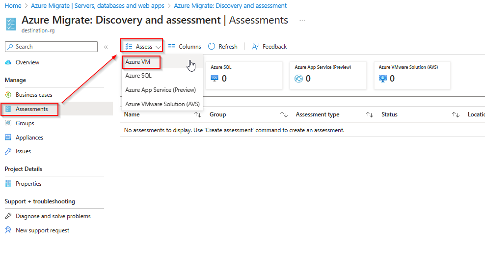
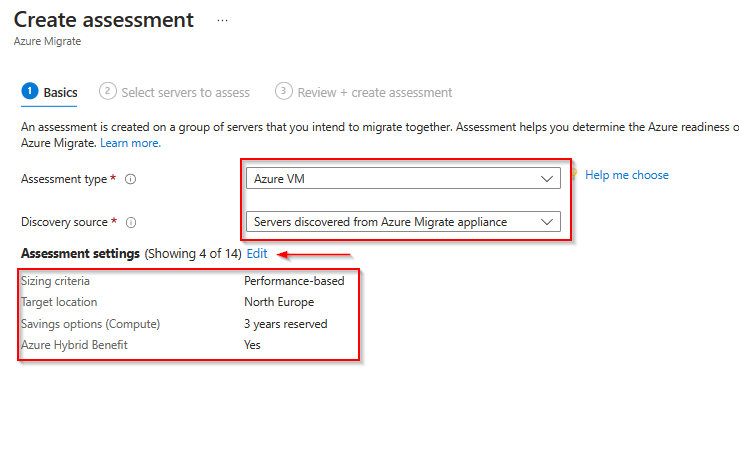
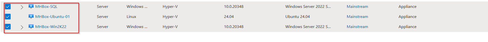
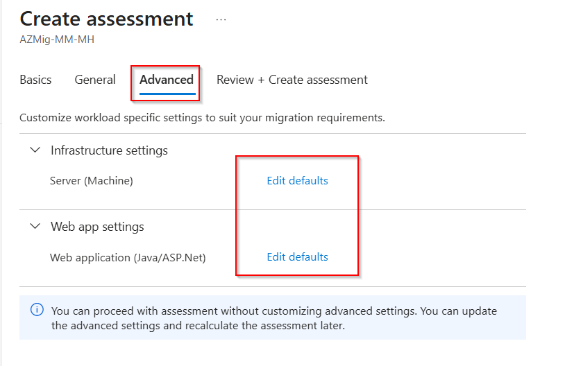
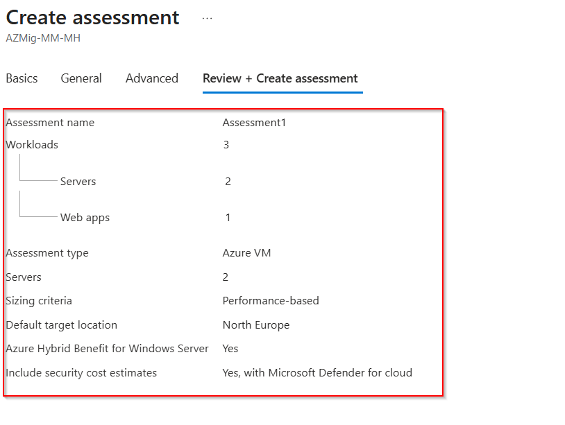
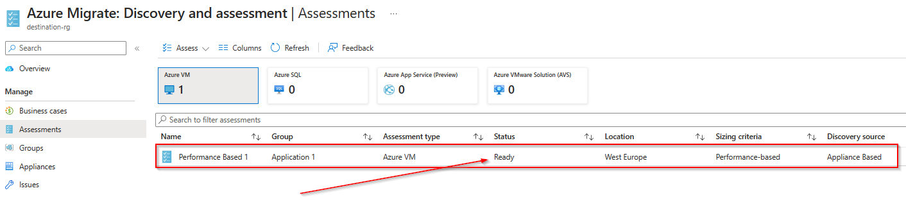
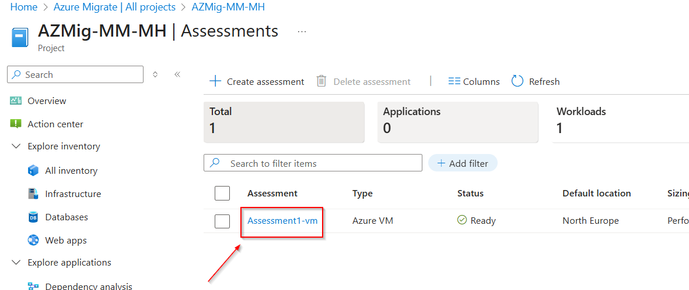
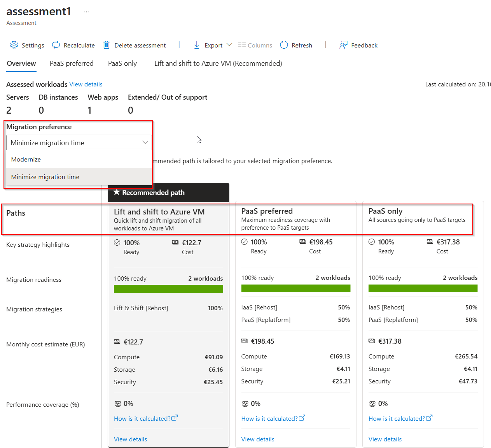
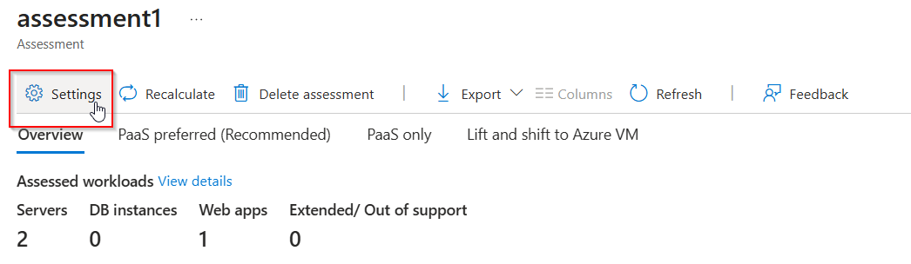
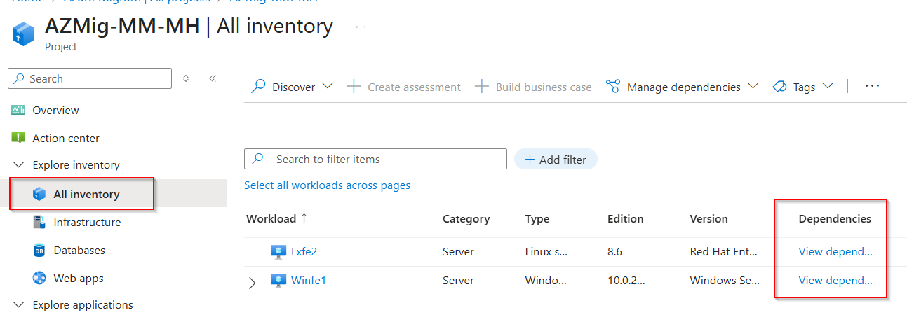

# Walkthrough Challenge 4 - Assess VM´s for the migration

Duration: 40 minutes

## Prerequisites

Please make sure thet you successfully completed [Challenge 3](../challenge-3/solution.md) before continuing with this challenge.

### **Task 1: Create an Azure VM assessment**

To create an assessment select *Assessments* from the navigation pane on the left, click on *Create assessment*.

Provide a name and click on *Add workloads* to add the recently discovered systems to the assessment. Click *Next* to proceed to the next step.

 

You can adjust the target environment settings like the target location, the VM size and pricing options.
When finished click on *Next* to continue.

Under *Advanced* you can adjust the workload specific settings to suit your migration requirements e.g., VM and disk sizes. Feel free to review the options, otherwise keep the default and proceed to *Review + Create assessment*.

Review your selection and click on *Create assessment*.

> [!NOTE]
> Please note that the computation of the assessment can take a few minutes.

When finished the assessment will show up with the status *Ready*.

### **Task 2: Review assessment output and reccomendations**

Click on the assessment name to open it.

The Azure VM assessment overview provides details about:

* Azure readiness: Whether servers are suitable for migration to Azure.
* Monthly cost estimation: The estimated monthly compute and storage costs for running the VMs in Azure.
* Details about different migration paths.

Click on *View details* for *Lift and Shift to Azure VM* to get more insights.

In *Servers to Azure VM (Lift and Shift)*, verify the assessment results like the estimated cost or the readiness of the server including the suggested sizing options.

In the overview section, cou can also click *Settings* to update the configuration of the assessment e.g., the target region.

### **Task 4: Review Dependency Analysis**

Dependency analysis identifies dependencies between discovered on-premises servers. 

There are two options for deploying dependency analysis

* Agentless
* Agent-based

Agentless dependency analysis works by capturing TCP connection data from servers for which it's enabled. No agents are installed on servers. Connections with the same source server and process, and destination server, process, and port are grouped logically into a dependency. You can visualize captured dependency data in a map view, or export it as a CSV. No agents are installed on servers you want to analyze.

For agent-based analysis, Azure Migrate: Discovery and assessment uses the Service Map solution in Azure Monitor. You install the Microsoft Monitoring Agent/Log Analytics agent and the Dependency agent, on each server you want to analyze.

In this Microhack we will use the agentless dependency analysis.

> [!NOTE]
> Agentless dependency analysis feature is automatically enabled for the discovered servers when the prerequisite checks are successful. Unlike before, you no longer need to manually enable this feature on servers.

Once the dependency data has been uploaded to Azure Migrate, you should be able to show the different dependencies of the discovered servers.

In the project, you can review dependencies for each server either through the All inventory or Infrastructure inventory view.

> [!NOTE]
> Please note that it could take some time for the dependency data to show up. After servers are automatically enabled for agentless dependency analysis, appliance collects dependency data from the server every 5 mins. It then sends a combined data point **every six hours**. It is recommended that you wait for atleast **24 hours** to allow for enough dependency data to be gathered for your servers and show in a visualization

You successfully completed challenge 4! 🚀🚀🚀

 **[Home](../../Readme.md)** - [Next Challenge Solution](../challenge-5/solution.md)
