# Walkthrough Challenge 5 - Migrate machines to Azure

Duration: 90 minutes

## Prerequisites

Please make sure thet you successfully completed [Challenge 4](../challenge-4/solution.md) before continuing with this challenge.

### **Task 1: Create and prepare Windows Server 2019 for the Azure Replication Appliance**

To start physical server migration you must install the Azure Replication Appliance on your on-premises. The Azure Replication Appliance can be downloaded as a OVA template or you can download the appliance installer to install it on a already existing server. For the purpose of this MicroHack we will install the Azure Replication Appliance via the installer on a new Windows Server 2019 system.

> [!IMPORTANT]
> Please make sure to check the [prerequisites](https://learn.microsoft.com/en-us/azure/migrate/migrate-replication-appliance) of the Azure
> Replication Appliance.

> [!IMPORTANT]
> Please note that it is currently [not supported](https://learn.microsoft.com/en-us/azure/migrate/common-questions-appliance#can-the-azure-migrate-appliancereplication-appliance-connect-to-the-same-vcenter) to install the Azure Migrate Replication Appliance on the same system as the Azure Migrate Appliance.

In the Azure Portal select _Virtual machines_ from the navigation pane on the left. Select _Create -> Azure virtual machine_

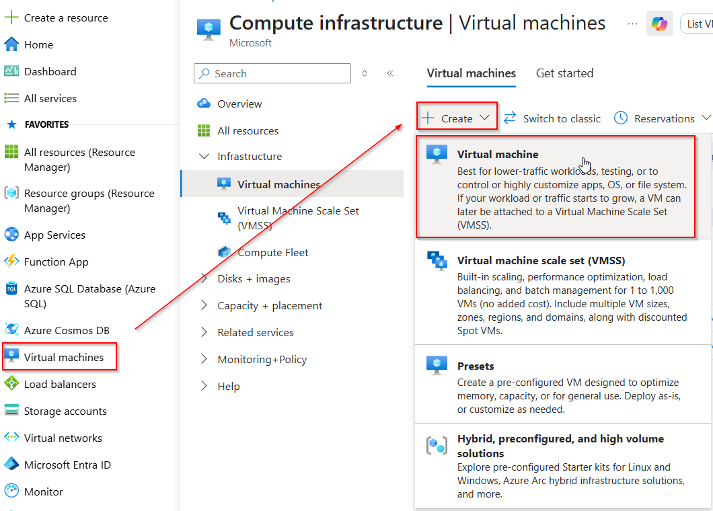

Under Basics select the _source-rg_ Resource Group and provide a name for the server. Select _Windows Server 2019 Datacenter - x64 Gen2_ for the Image.

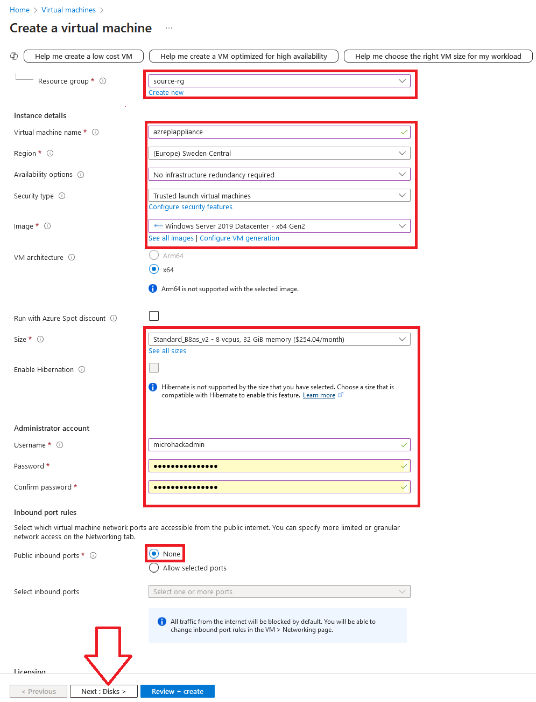

> [!NOTE]
> For the Username and Password you can either select a combination of your choice or check the secrets within the KeyVault.

Add an additional 1024GiB Standard HDD LRS data disk to the Virtual Machine and click _Next_


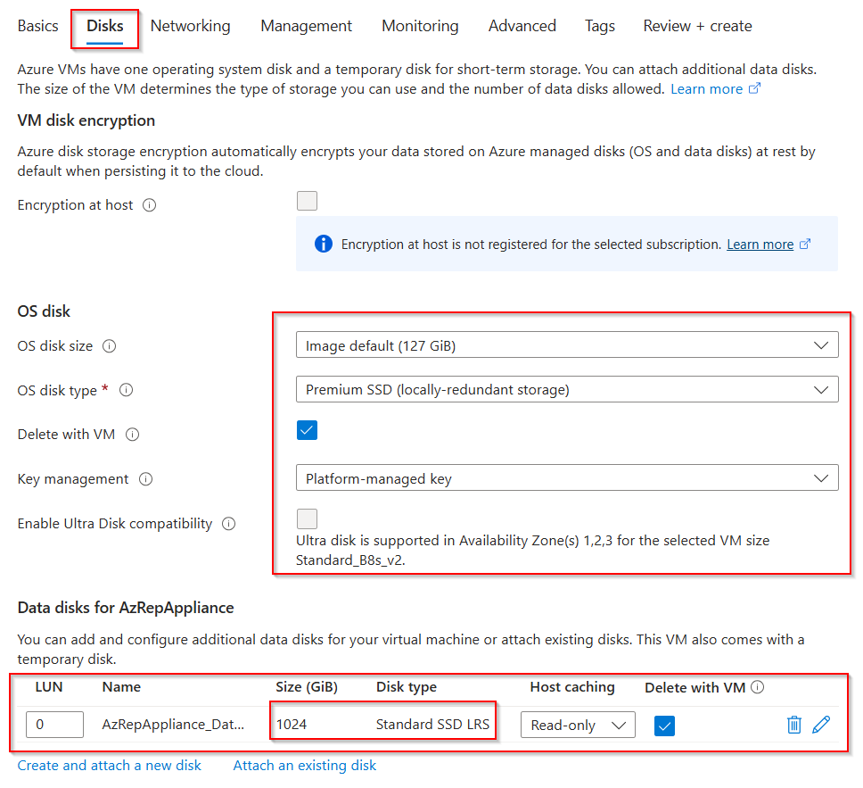

In the _Networking_ tab, select the _source-vnet_ Virtual Network and the _source-subnet_ Subnet and make sure to select _None_ for the Public IP and NIC network security group.

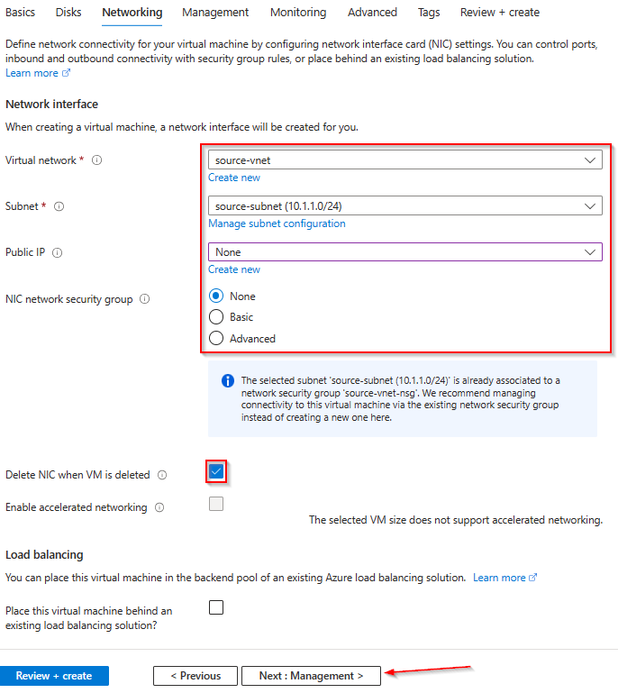

Accept the default settings for the remaining tabs, select _Review + create_ and click _Create_.

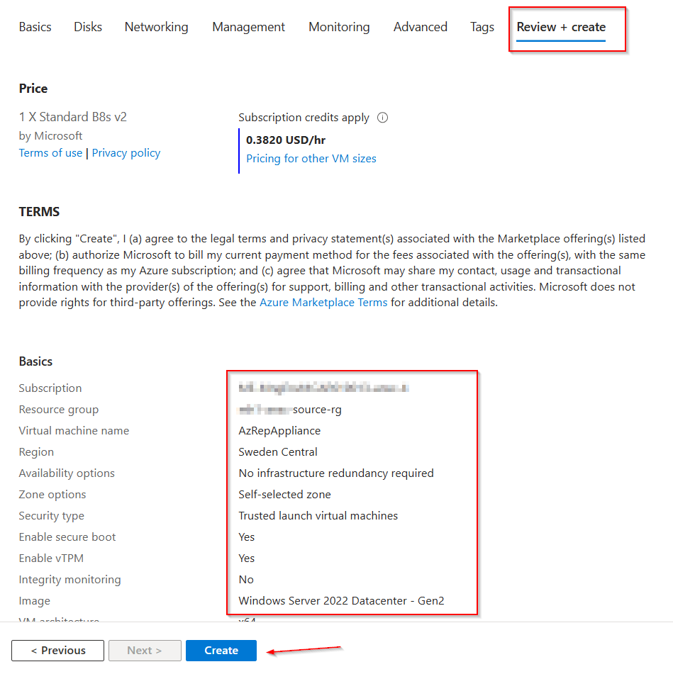

Wait until the deployment has been successfully completed and select _Go to resource_

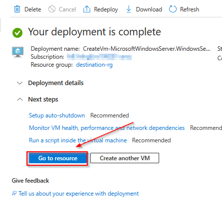

Select _Bastion_ from the navigation pane on the left, provide the credentials to login to the Azure Migrate Replication VM and select _Connect_. A new browser tab should open with a remote session to the Windows Server 2019 system.


> [!NOTE]
> You can also select _Password from Azure KeyVault_ under _Authentication Type_ if you set the password during VM creation to match the secret stored in the KeyVault.

### **Task 2: Setup the Azure Replication Appliance**

To prepare for physical server migration, you need to verify the physical server settings, and prepare to deploy a replication appliance.

First we need to initialize and format the data disk that was attached during the VM creation.
Open Windows Disk Management using the _diskmgmt.msc_ command.

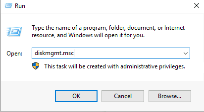

A popup should arise to initialize the disk.

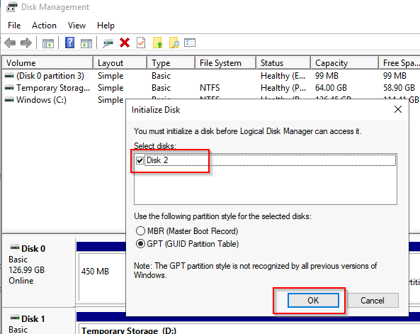

Select the initialized disk and create a new simple vplume on it.

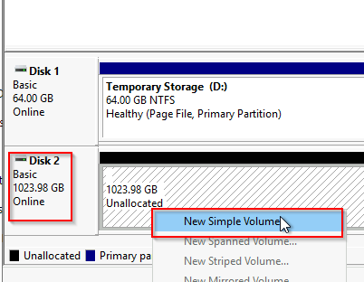

Acceppt the default values, name the Volume _ASR_ and click _Finish_ to format the disk.

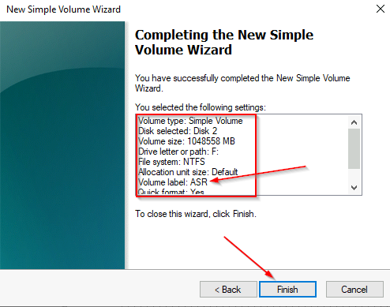

Wait until the operation is completed successfully.

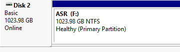

Open the [Azure Portal](https://portal.azure.com) on the Azure Replication Appliance using the Microsoft Edge browser and navigate to the previousley created Azure Migrate project. Select _Servers, databases and web apps_, make sure that the right Azure Migrate Project is selected and click _Discover_ in the _Migration tools_ box.


> [!IMPORTANT]
> Please double check your preferred target region as this cannot be changed afterwards. In doubt check the region of your destination Resource Group and vNet.

Select _Physical or other..._ in the _Are your machines virtualized_ drop down and select _Your Target Region_ as the _Target Region_.
Make sure to check the confirmation checkbox and click _Create resources_.


Wait until the deployment has been successfully completed. Next under _1. Download and install the repliaction appliance software_ click _Download_ to download the Azure Migrate Repplication Appliance installer.
You also need to download the registration key that is required to register the replication appliance under _2. Configure the replication appliance and register it to the project_.


Next start the installation of the Azure Migrate Replication Appliance by double cklicking the _MicrosoftAzureSiteRecoveryUnifiedSetup.exe_


Select _Install the configuration server and process server_ and click _Next_


Check the _I acceppt..._ checkbox and click _Next_


Browse and select the previousley downloaded registration key and click _Next_


Accept the default _Internet connection_ configuration


Review the prerequisites check of the installer. Note that you can safely ignore the static IP warning.


Specify the required passwords and note the password requirements.

> [!NOTE]
> For the Username and Password you can either select a combination of your choice or check the secrets within the KeyVault.

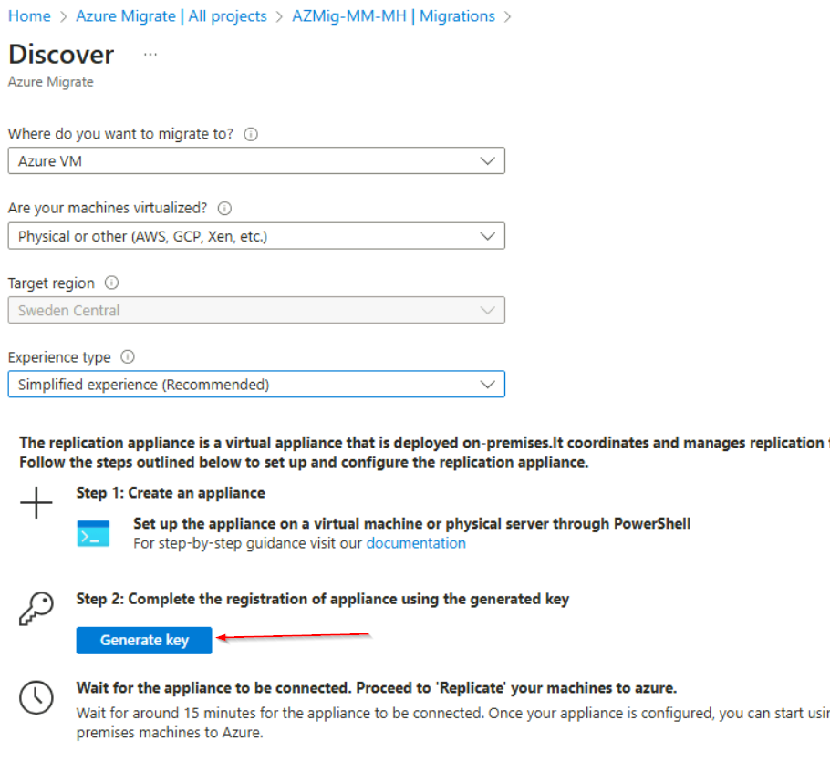

Select _No_ for _Do you want to protect VMware virtual machines_ and click _Next_

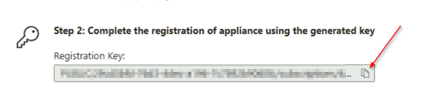

Verify the _Install location_. The installer should automatically pre-select the largest disk, in our case the 1024 GiB data disk that was created during VM creation.

> [!IMPORTANT]
> The additional data disk needs to be initialized first using the [Windows Disk Management tool](https://learn.microsoft.com/en-us/windows-server/storage/disk-management/initialize-new-disks#initialize-a-new-disk). You can open the tool side by side with the installer if you have not initialized the disk beforehand.

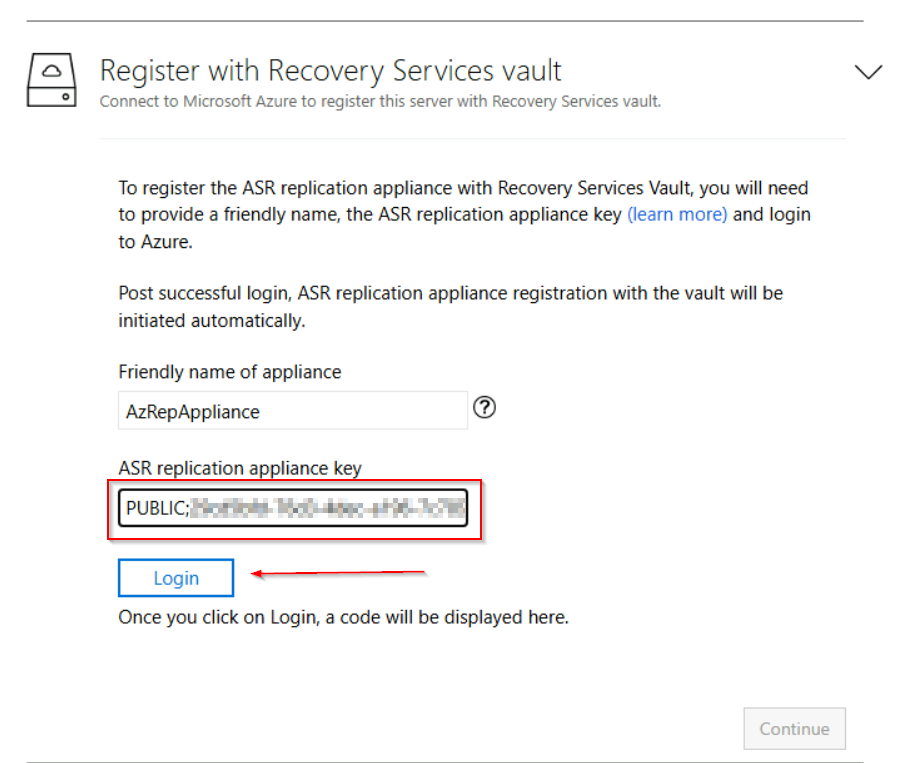

Select the appropriate NICs (We only have 1 in our case).

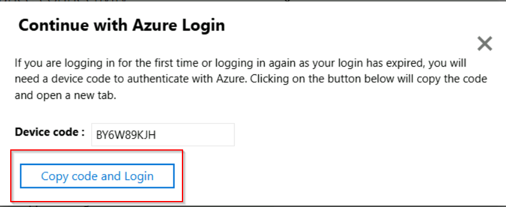

Verify the installation summary and click _Install_ to start the installation.

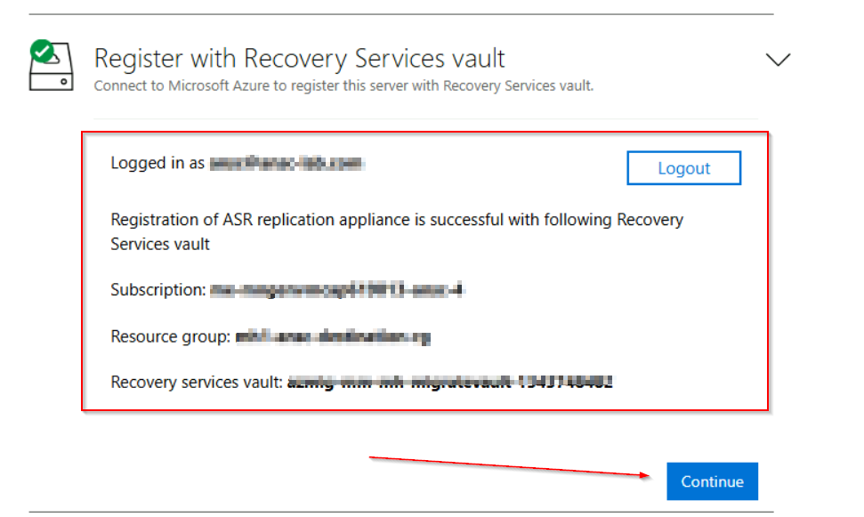

Wait until the installation progress is finished.

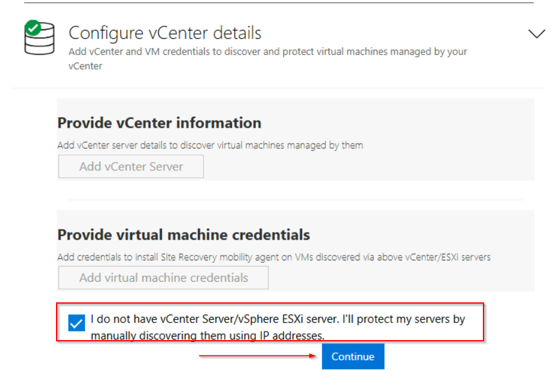

After the successfull installation a configuration server connection passphrase will be displayed. Copy the passphrase and save it as a new secret in the source-rg Resource Group KeyVault.

> [!NOTE]
> If you forgot to copy the passphrase you can obtain it by executing the following Powershell command on the VM hosting the replication appliance
>
> ```powershell
> Windows PowerShell
> Copyright (C) Microsoft Corporation. All rights > reserved.
> C:\ProgramData\ASR\home\svsystems\bin\genpassphrase.exe -v
> ```

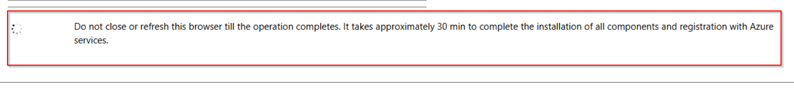

After the installation completes, the Appliance configuration wizard will be launched automatically.
You can add the local administrator account credentials of the source servers (stored secrets in the source KeyVault).


The last step is to finalize the registration. Refresh the Azure Portal page where you've downloaded the installer and registration keys and select the _azreplappliance_ from the drop down list and click on _Finalize registration_.

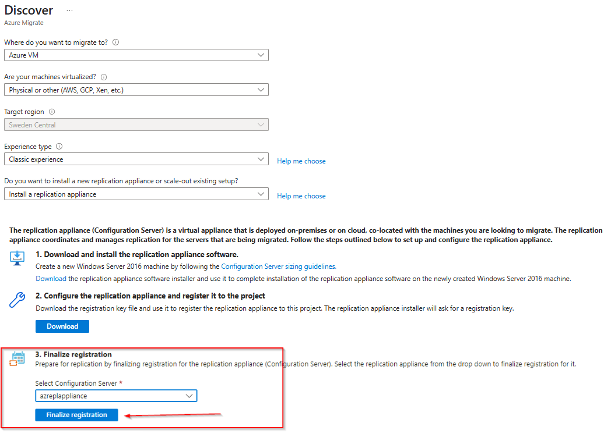

### **Task 3: Setup the Mobility Service Agent to your Windows Server**

On machines you want to migrate, you need to install the Mobility service agent. The agent installers are available on the replication appliance in the _%ProgramData%\ASR\home\svsystems\pushinstallsvc\repository_ directory.

#### **Task 3.1: Transfer Agent to Server**

To copy the Mobility service agent to the Windows machine follow the following steps

1. Sign in to the Windows Server source VM.
2. Open Powershell and run the following command

```powershell
Windows PowerShell
Copyright (C) Microsoft Corporation. All rights reserved.
Copy-Item \\10.1.1.7\C$\ProgramData\ASR\home\svsystems\pushinstallsvc\repository\Microsoft-ASR_UA*Windows*_Release.exe $env:USERPROFILE\Downloads\ -Force
```

#### **Task 3.2: Install the Mobility service on the Windows VM**

> [!NOTE]
> During the installation you need to provide the passphrase that was created during the Replication Appliance installation.
> If you forgot to copy the passphrase you can obtain it from inside the Replication Appliance via the following Powershell command.
>
> ```powershell
> Windows PowerShell
> Copyright (C) Microsoft Corporation. All rights > reserved.
> C:\ProgramData\ASR\home\svsystems\bin\genpassphrase.exe -v
> ```

> [!WARNING]
> Don't regenerate the passphrase. This will break connectivity and you will have to reregister the replication appliance.

1. Extract the contents of installer file to a local folder (for example C:\Temp) on the machine, as follows:

```powershell
Windows PowerShell
Copyright (C) Microsoft Corporation. All rights reserved.
cd $env:USERPROFILE\Downloads\
Rename-Item .\Microsoft-ASR_UA_9.63.0.0_Windows_GA_21Oct2024_Release.exe MobilityServiceInstaller.exe
.\MobilityServiceInstaller.exe /q /x:C:\Temp\Extracted
cd C:\Temp\Extracted
```

2. Run the Mobility Service Installer:

```powershell
Windows PowerShell
Copyright (C) Microsoft Corporation. All rights reserved.
.\UnifiedAgent.exe /Role "MS" /Platform "VmWare" /Silent /CSType CSLegacy
```

> [!IMPORTANT]
> You need to specify _VmWare_ for the _Platform_ parameter also for physical servers.

3. Register the agent with the replication appliance:

```powershell
Windows PowerShell
Copyright (C) Microsoft Corporation. All rights reserved.
cd "C:\Program Files (x86)\Microsoft Azure Site Recovery\agent"
set-Content .\password.txt <REPLACE WITH PASSPHRASE> -Force # This is the password you received during the installation of the Azure Replication Appliance, replace it with your password.
.\UnifiedAgentConfigurator.exe /CSEndPoint 10.1.1.7 /PassphraseFilePath "C:\Program Files (x86)\Microsoft Azure Site Recovery\agent\password.txt"
```

### **Task 4: Setup the Mobility Service Agent to your Linux Server**

On machines you want to migrate, you need to install the Mobility service agent. The agent installers are available on the replication appliance in the _%ProgramData%\ASR\home\svsystems\pushinstallsvc\repository_ directory.

#### **Task 4.1: Transfer Agent to Server**

To copy the Mobility service agent to the Linux machine follow the following steps

1. Sign in to the Linux Server source VM.
2. Run the following command. Replace the Username and the correct filename.

```bash
#List the correct file
smbclient -U <ReplaceWIthAdminUserName> //10.1.1.7/c$ -c "dir ProgramData\ASR\home\svsystems\pushinstallsvc\repository\*ASR*RHEL8*"
#Copy the filename to next command and copy it to tmp directory
smbclient '//10.1.1.7/c$' -c 'lcd /tmp; cd ProgramData\ASR\home\svsystems\pushinstallsvc\repository; get Microsoft-ASR_UA_9.63.0.0_RHEL8-64_GA_21Oct2024_Release.tar.gz' -U <ReplaceWIthAdminUserName>
cd /tmp
ls
```

> [!NOTE]
> You might need to install smbclient on your linux environment to complete the above step.
> For example :

```bash
Ubuntu : sudo apt-get install smbclient
RedHat : sudo yum install samba-client samba-common cifs-utils
```

#### **Task 4.2: Install the Mobility service on the Linux VM**

> [!NOTE]
> During the installation you need to provide the passphrase that was created during the Replication Appliance installation.
> If you forgot to copy the passphrase you can obtain it from inside the Replication Appliance via the following Powershell command.
>
> ```powershell
> Windows PowerShell
> Copyright (C) Microsoft Corporation. All rights > reserved.
> C:\ProgramData\ASR\home\svsystems\bin\genpassphrase.exe -v
> ```

> [!WARNING]
> Don't regenerate the passphrase. This will break connectivity and you will have to reregister the replication appliance.

Now you need to log in to the source Linux VM to finish the installation of the mobility service agent.

Log into the Linux VM with Azure Bastion and install the mobility service agent.

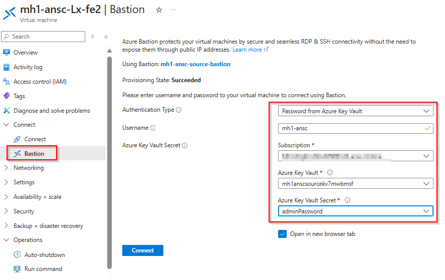

```bash
mkdir MobSvcInstaller
tar -C ./MobSvcInstaller -xvf /tmp/Microsoft-ASR_UA_9.63.0.0_RHEL8-64_GA_21Oct2024_Release.tar.gz
cd MobSvcInstaller
sudo ./install -r MS -v VmWare -q -c CSLegacy # You need to specify VmWare as the platform also for physical servers.
```

```bash
echo <REPLACE WITH PASSPHRASE> > password.txt # This is the password you received during the installation of the Azure Replication Appliance, replace it with your password.
sudo /usr/local/ASR/Vx/bin/UnifiedAgentConfigurator.sh -i 10.1.1.7 -P password.txt -c CSLegacy # IP 10.1.1.7 is the IP of the Azure Replication Appliance Windows VM you created.
logout
```

### **Task 5: Enable Replication**

Open the [Azure Portal](https://portal.azure.com) and navigate to the previousley created Azure Migrate project. Select _Servers, databases and web apps_, make sure that the right Azure Migrate Project is selected and click _Replicate_ under _Migration Tools_.

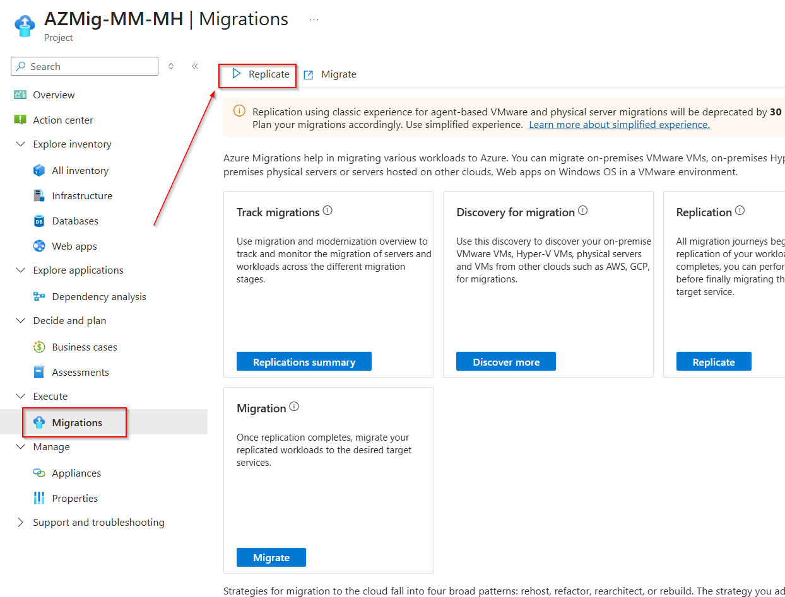

Select _Servers or virtual machines (VM)_ and _Azure VM_ and click _Continue_.

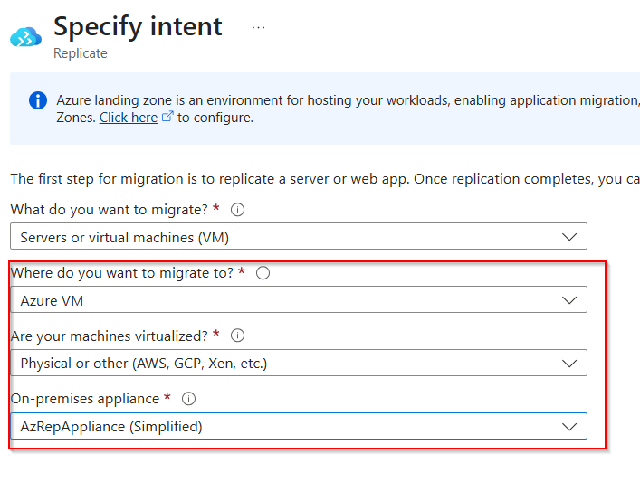

In the _Basics_ page select the previousley created Azure Migrate Replication appliance and specify the Guest Credentials and click next:

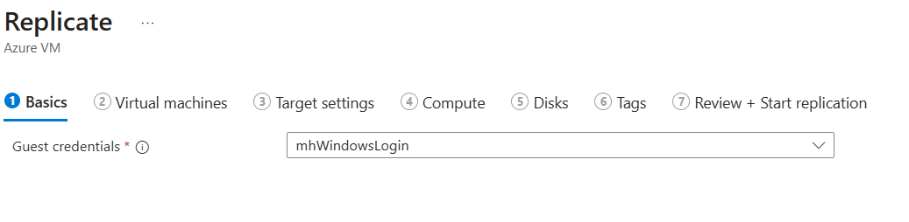

Under _Virtual Machines_ select _No I'll specify the migration settings manually_ and select the _frontend1_ and _frontend2_ server from the list.

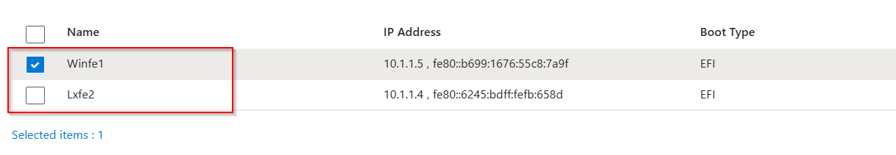

Under _Traget Settings_ select the _destination-rg_ Resource Group and the _destination-vnet_ vNet and select next.

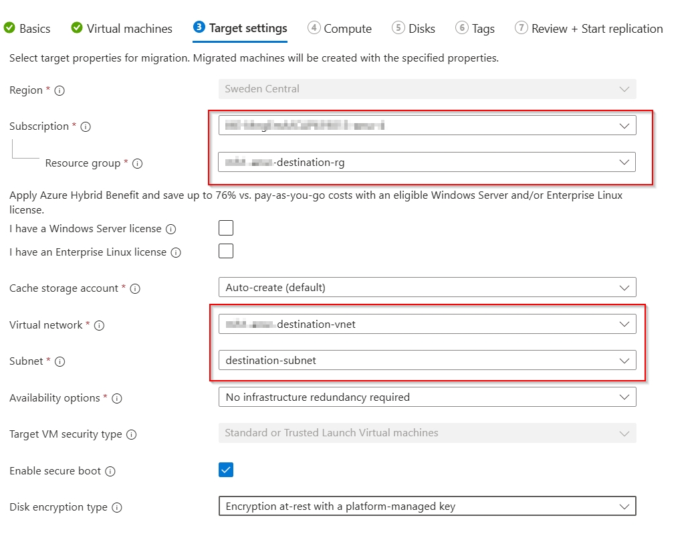

Under _Compute_ acceppt the defaults and click next.

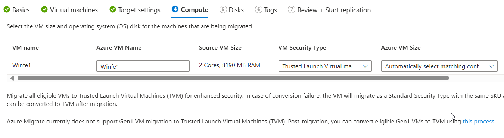

Under _Disks_ change the Disk Type to _Standard SSD_ and click next.

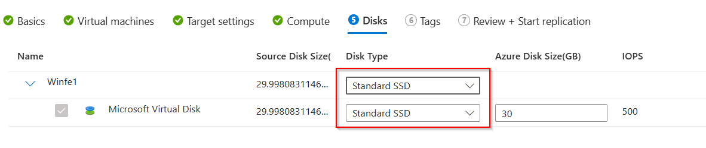

Acceppt the defaults for _Tags_ and proceed to _Review + Start Replication_. Click _Replicate_ to start the replication.

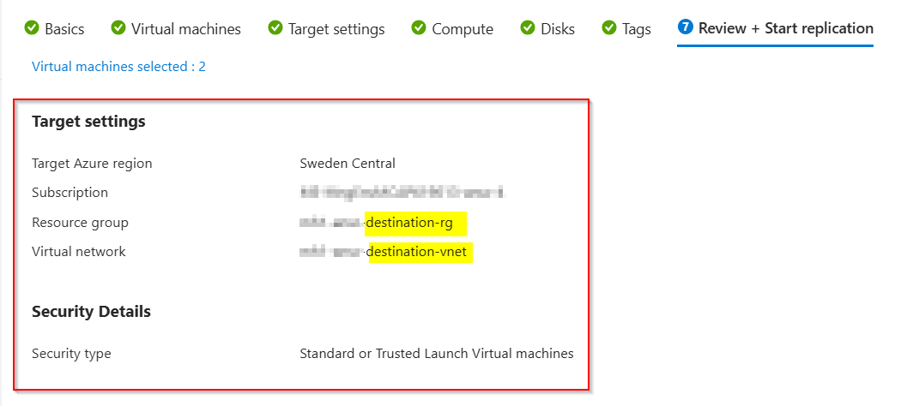

Wait until the replication has been successfully initiated.

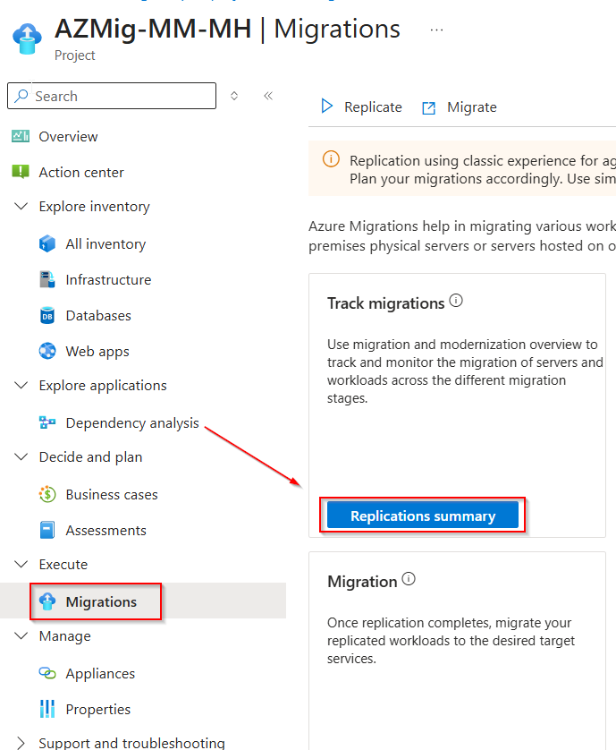

Under _Migration Tools_ you should know see that 2 Server are beeing replicated. Click on _Overview_ to see more details.

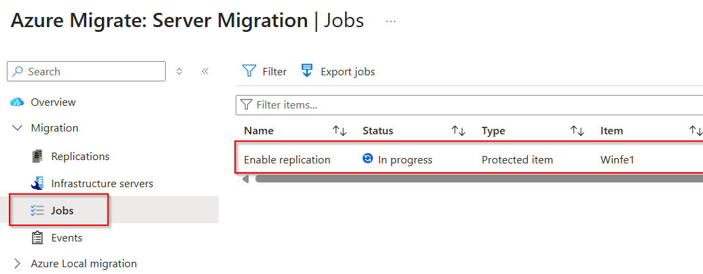

Select _Replicating Machines_ from the navigation pane on the left. You should now see the 2 servers and their status.

> [!IMPORTANT]
> Please note that the initial replication might take some time. Within the MicroHack environment it should not take longer than 30 minutes.

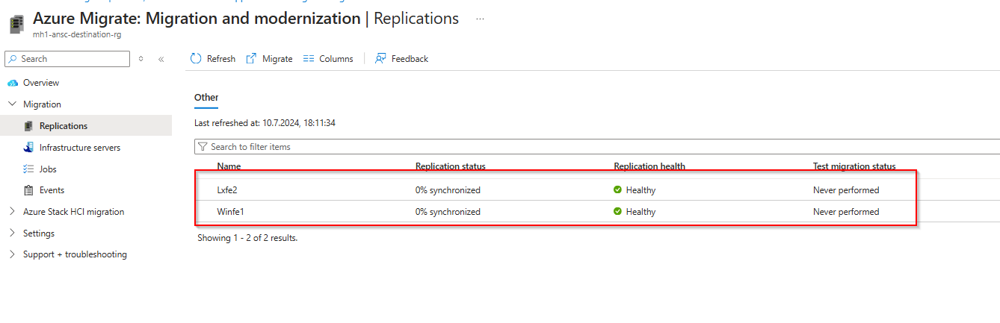

### **Task 5: Perform Test Migration**

When delta replication begins, you can run a test migration for the VMs, before running a full migration to Azure. We highly recommend that you do this at least once for each machine, before you migrate it.

- Running a test migration checks that migration will work as expected, without impacting the on-premises machines, which remain operational, and continue replicating.
- Test migration simulates the migration by creating an Azure VM using replicated data (usually migrating to a non-production VNet in your Azure subscription).
- You can use the replicated test Azure VM to validate the migration, perform app testing, and address any issues before full migration.

Open the [Azure Portal](https://portal.azure.com) and navigate to the previousley created Azure Migrate project. Select _Servers, databases and web apps_, make sure that the right Azure Migrate Project is selected and click _Overview_ in the _Migration tools_ box.

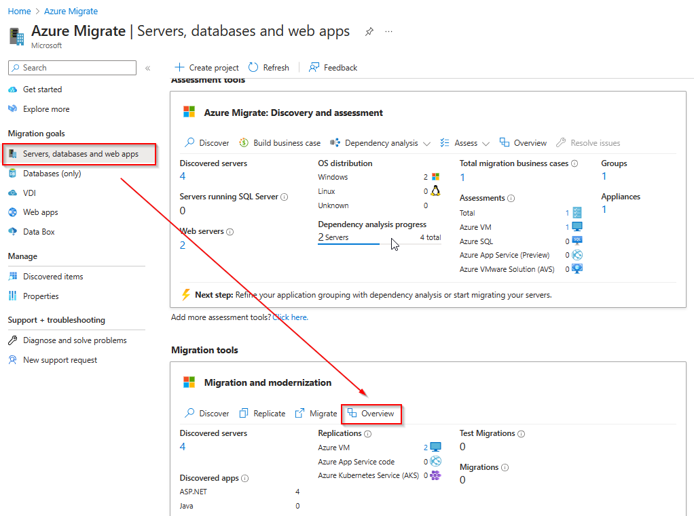

Select _Perform more test migrations_ under _Step 2: Test migration_.


Click on the 3 dots on the right corner of each server and select _Test migration_ from the drop down.


Select the _destination-vnet_ and click on _Test migration_.

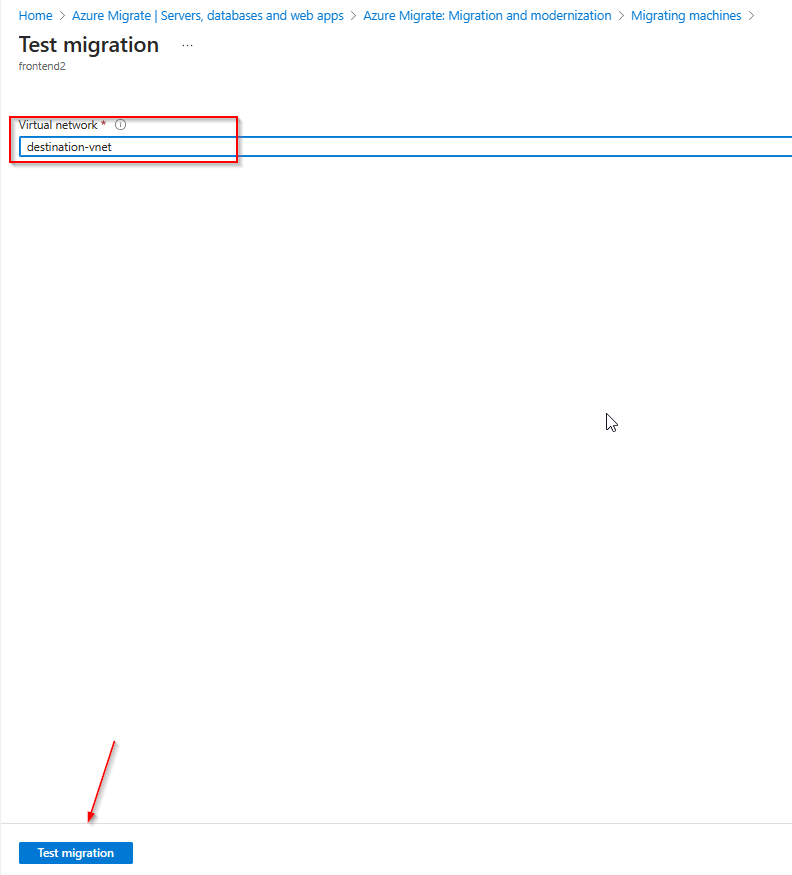

Repeat the above steps for the remaining server and wait until the test migration has been successfully finished.

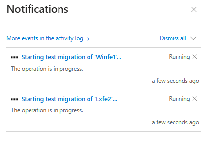

Switch back to the _Overview_ section of the _Azure Migrate: Migration and modernization_ page. The Cleanup should be pending for the 2 servers.


Select _Virtual machines_ from the navigation pane on the left. There will be 2 additional servers _frontend1-test_ and _frontend2-test_. Those servers were created during test migration.

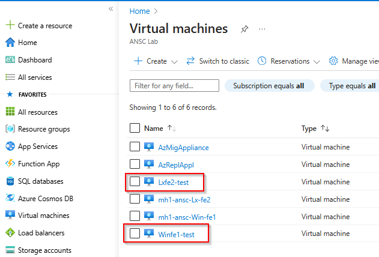

Click on the _frontend1-test_ server, select _Bastion_ and provide the login credentials for the server. Select _Connect_ to initiate the connection.

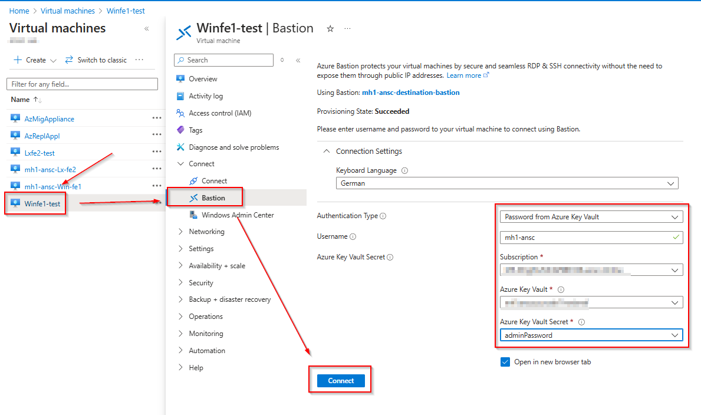

Open the Microsoft Edge browser on the server, enter _localhost_ in the address bar and make sure that the web server is running.

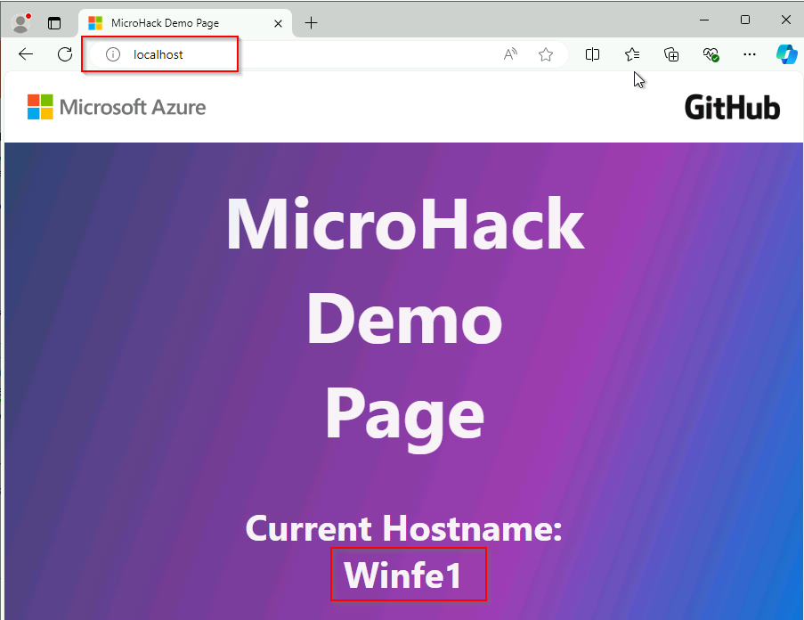

Repeat the above steps for the _Lxfe2-test_ system. Once you've confirmed that the applications on the systems are running as expected you can perfom a cleanup for the test migration. Change back to the _Azure Migrate: Migration and modernization_ overview page, click on the 3 dots on the end of each row of the replicating servers and select _Clean up test migration_.

> [!NOTE] You can use the IP address of the Linux machine in this browser or connect to the Linux machine and use `curl localhost` to see i fthe server responds correctly.

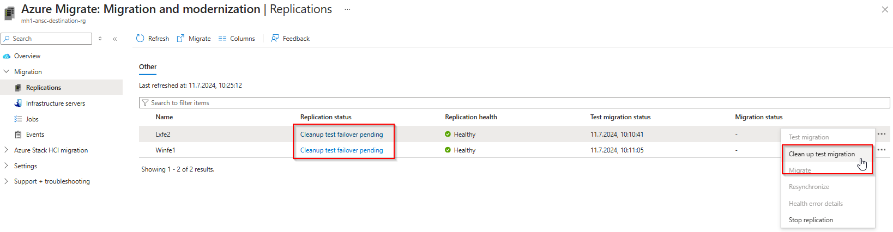

Select _Testing complete. Delete test virtual machine_ and select _Cleanup Test_. Reapeat the step for the remainig server and wait until the cleanup has been successfully processed.

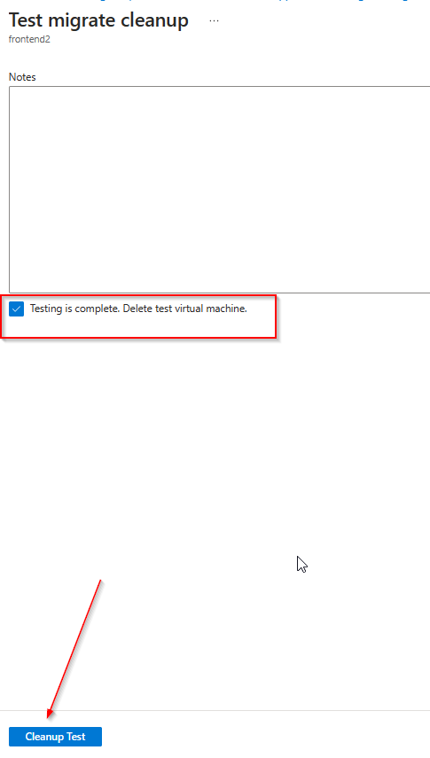

### **Task 6: Prepare Final Migration**

Currently the two frontend servers are published via an Azure Public Load Balancer. After the migration, the original server will be turned off. Therefore the access to the system via the Azure Public Load Balancer will be broken. To prepare for the migration and to keep downtime as short as possible some pre-migration steps should be performed.

#### **Task 6.1: Create a new Azure Public Load Balancer in the destination environment**

From the Azure Portal open the Load Balancing blade, select Load Balancer on the Navigation pane on the left and click _Create_.

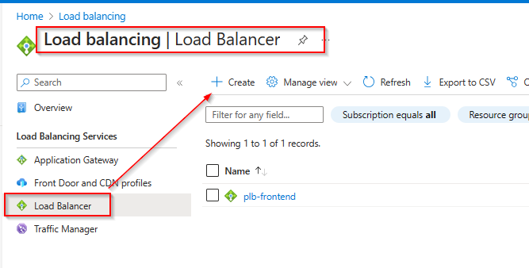

Under _Basics_ select the _destination-rg_ Resource Group and provide a name for the new Load Balancer.

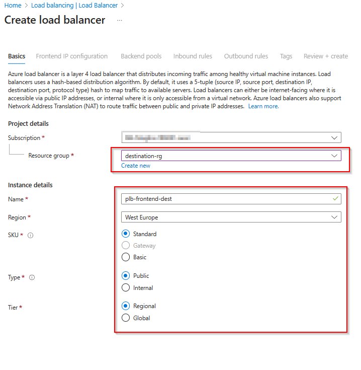

Under _Frontend IP configuration_, click _Add a frontend IP configuration_ and create a new Public IP address.

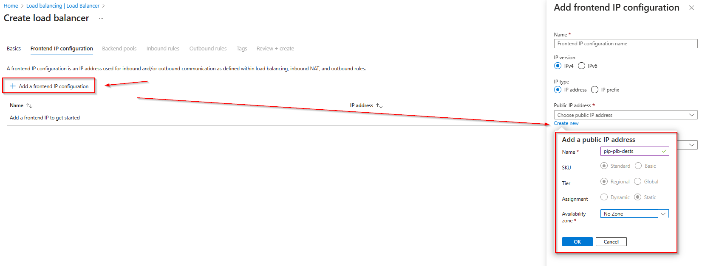

Under _Backend Pools_, select _Add a backend Pool_. Provide a name and select the _destination-vnet_ as the Virtual Network.
Add _10.2.1.4_ and _10.2.1.5_ as the IP addresses.

> [!NOTE]
> Please note: Azure reserves the first four addresses (0-3) in each subnet address range, and doesn't assign the addresses. Azure assigns the next available address to a resource from the subnet address range. So it is predictable which IP addresses will be assigned to the destination VMs after the migration.

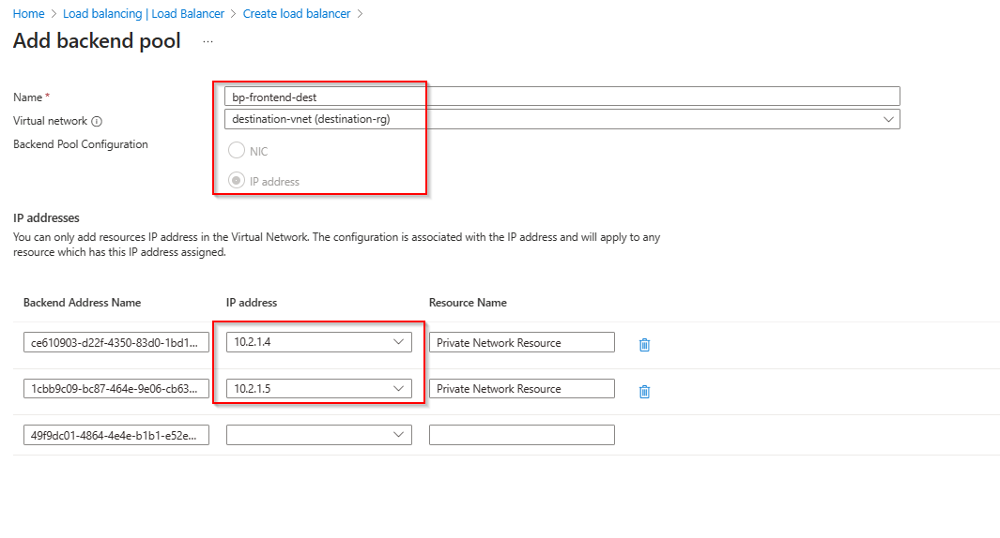

Under _Inbound rules_ click on _Add a load balancing rule_ and create the load balancing rule as illustrated on the following diagram.

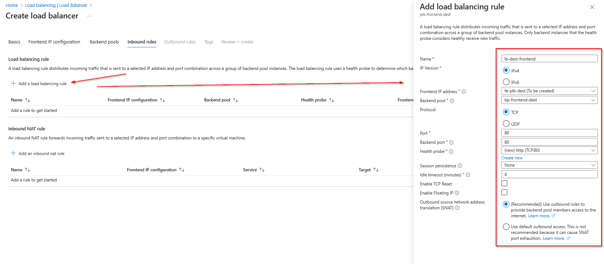

Under _Outbound rules_ click _Add an outbound rule_ and create the outbound rule as illustrated on the following diagram.

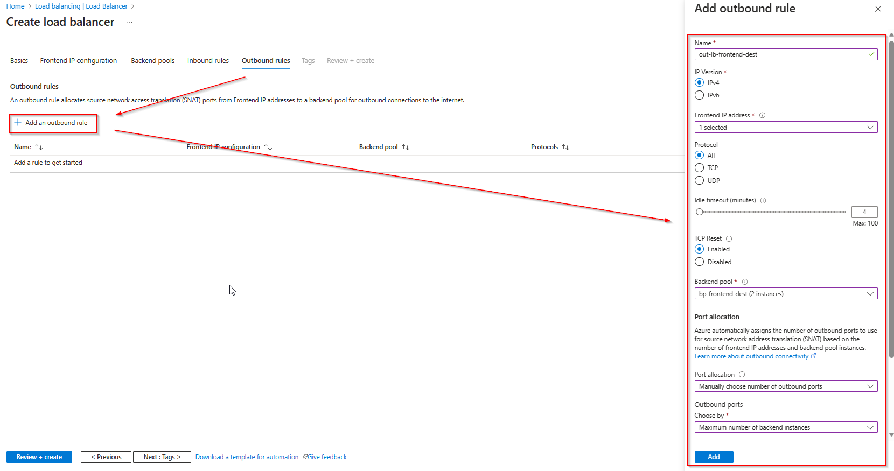

Proceed to the _Review + create_ section, review your configuration and click _Create_

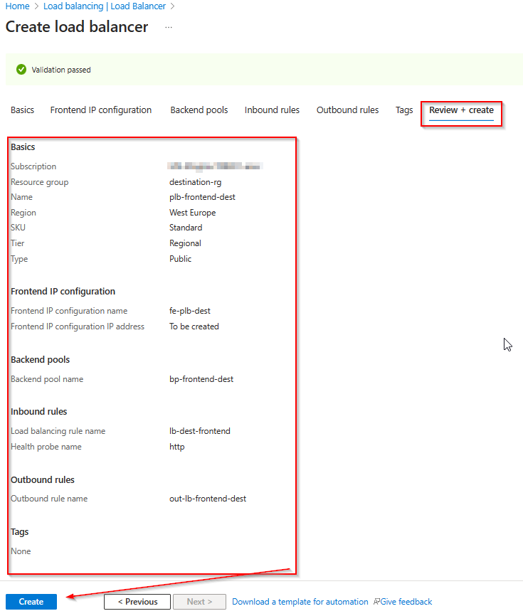

Wait until the load balancer has been created, cahnge back to the _Load balancing_ section, select the _plb-frontend_ Load Balancer and click _Frontend IP configuration_ from the navigation pane on the left. Note down the Public IP of the _LoadBalancerFrontEnd_ configuration. Repeat the step for the _plb-frontend-dest_ Load Balancer.

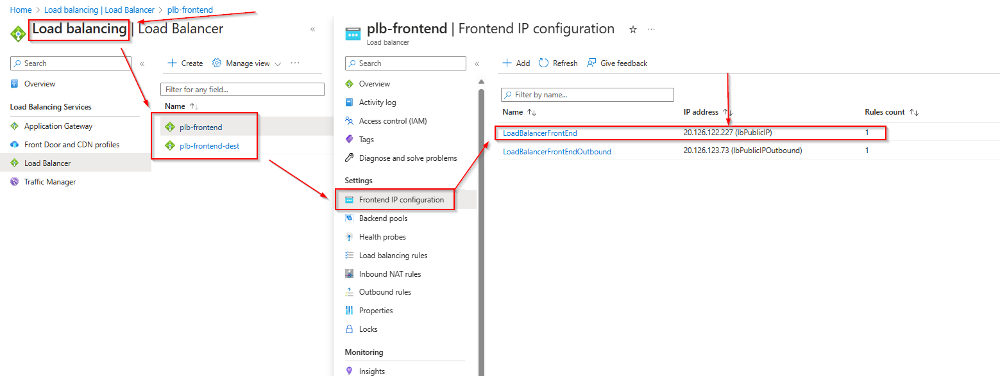

> [!NOTE]
> In the next task we will configure an Azure Traffic Manager Profile for load balancing. To be able to add the public IP addresses they need to be configured with an [DNS name lable](https://learn.microsoft.com/en-us/azure/dns/dns-custom-domain?toc=%2Fazure%2Fvirtual-network%2Ftoc.json#public-ip-address).

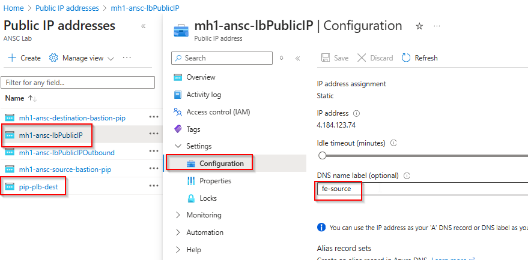

#### **Task 6.2: Create a new Azure Traffic Manager Profile**

Azure Traffic Manager is a DNS-based traffic load balancer. It allows us to distribute traffic to public facing endpoints like our two Public Load Balancer. Traffic Manager can be created in advance to distribute traffic among the old and new load balancer. The DNS conbfiguration of the application can be changed in advance to point to the Traffic Manager Profile instead to the Public IP of the Load Balancer. Using this approach makes sure that Traffic Manager automatically removes the old Load Balancer after the frontend servers were migrated.

From the Azure Portal open the Load Balancing blade, select Traffic Manager on the Navigation pane on the left and click _Create_.

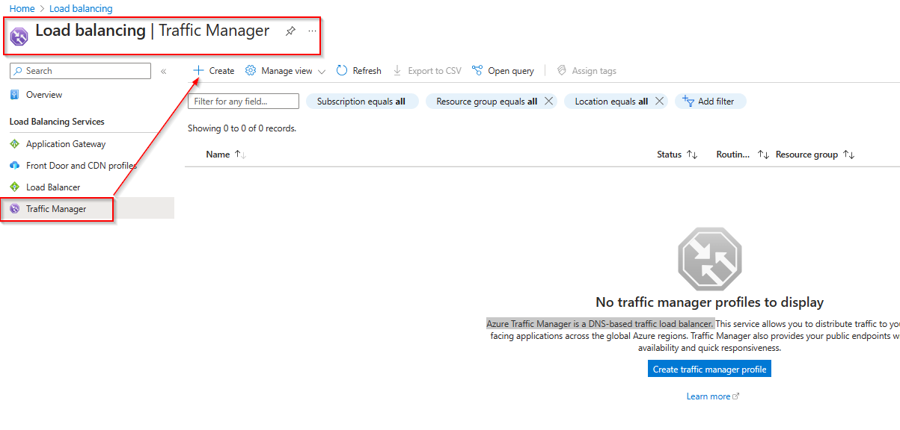

Select a name for the Traffic Manager profile and select the _destination-rg_ as the Resourec Group.


From the Load Balancing overview page select _Traffic Manager_ and select the previously created Traffic Manager profile.
Select _Endpoints_ and click _Add_. Add each public IP of the source and destination Load Balancer as separate endpoints.

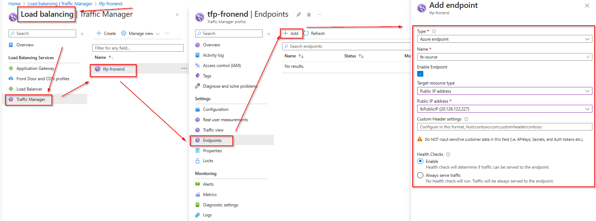

Check the Overview section under the navigation pane and note that the source load balancer is shown as _online_ whereas the
destination load balancer is shown as _degraded_. If you copy the DNS name of the Traffic Manager profile and paste it into your browser, you should be able to browse the source web servers through the Traffic Manager Profile.

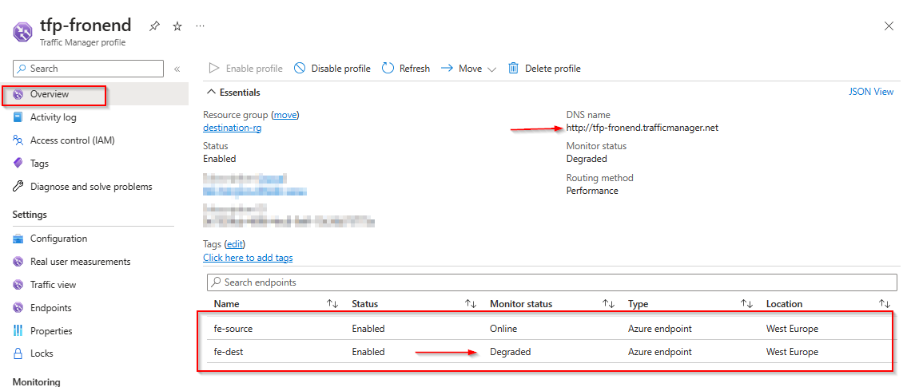

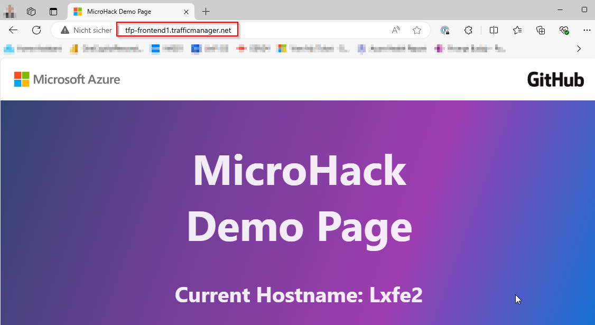

### **Task 7: Perform Final Migration**

Open the [Azure Portal](https://portal.azure.com) and navigate to the previousley created Azure Migrate project. Select _Servers, databases and web apps_, make sure that the right Azure Migrate Project is selected and click _Overview_ in the _Migration tools_ box. From the Overview section click in _Migrate_ under _Step 3: Migrate_.

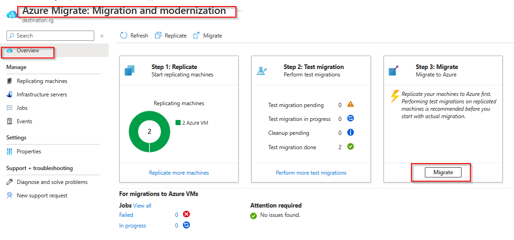

Select _AzureVM_ and click _Continue_.

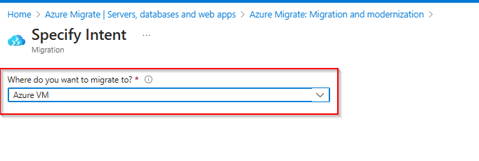

Select _No_ because shutdown of source machines is only supported for HyperVisor based migrations, select the two servers and click _Migrate_.

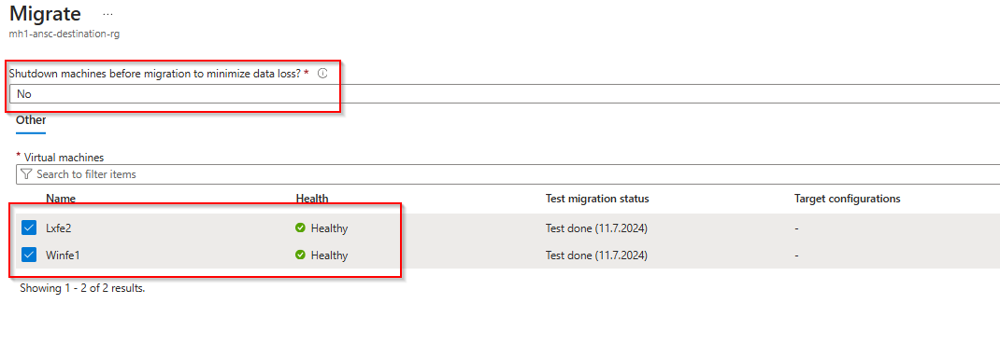

You can check the progress of the migration under the _Jobs_ section within the navigation pane.

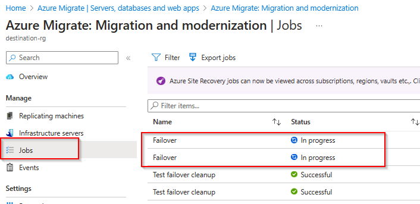

After a few minutes the migration should be successfully completed.

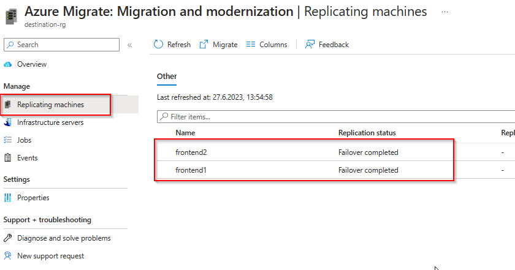

When you change to the _Virtual machine_ section within the Azure Portal you should now see 2 additional serves in the _destination-rg_ Resource Group.
Please select the original source Virtual Machines and click on _Stop_ to shutdown the source VMs.

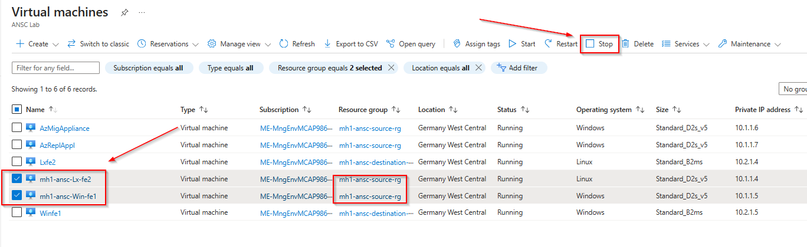

Change to the Azure Traffic Manager profile you've created previousley and look at the endpoints. Please note that the _fe-source_ endpoint is now shown as degraded and that the _fe-dest_ endpoint is shown as online.

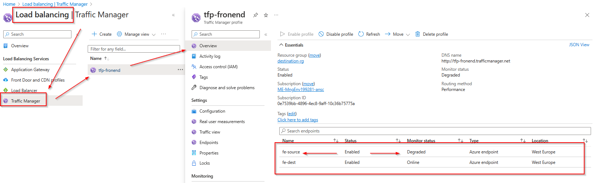

From a user perspective nothing changed. You're still able to browse the Traffic Manager profile DNS name and you will be transparently redirected to the web servers that are know running in Azure.

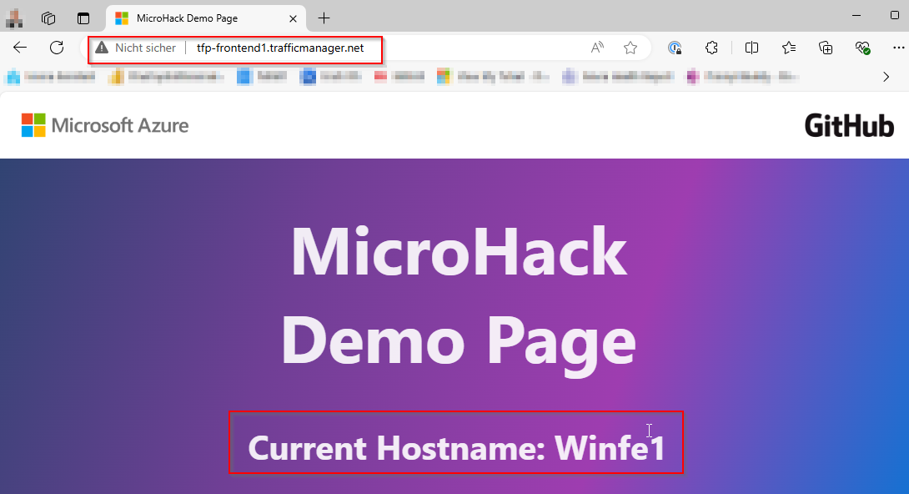

## 🚀 Congratulations, you've successfully migrated the frontend application to Azure.🚀

### **Task 8: Stopping Replcation**

After the successfull migration you can now stop replicating the source virtual machines. Open the [Azure Portal](https://portal.azure.com) and navigate to the previousley created Azure Migrate project. Select _Servers, databases and web apps_, make sure that the right Azure Migrate Project is selected and click _Overview_ in the _Migration tools_ box. In the _Azure Migrate: Migration and modernization_ pane, select _Replicating machines_ from the navigation pane on the left, click on the 3 dots on the end of each row of the replicating servers and select _Stop replicating_.

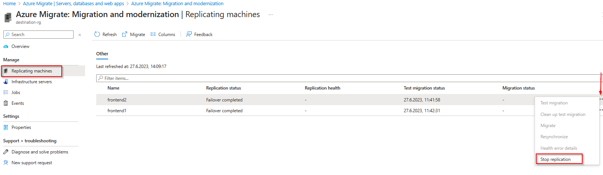

Select _Stop replication and remove replication settings_ from the drop down list and click _OK_. Repeat this step for the remaining Server.

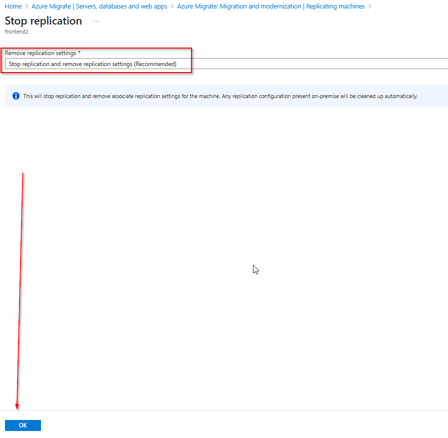

From the Traffic Manager Profile you can now also safley remove the endpoint for the source load balancer.

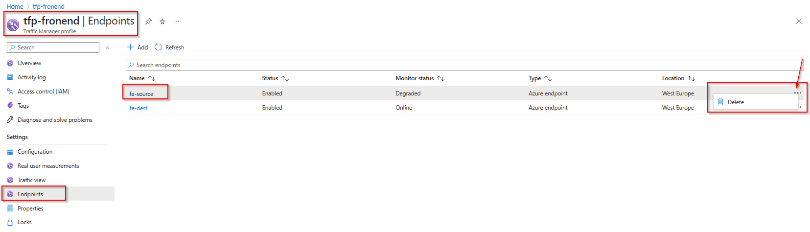

# 🚀 **Congratulations!**

You successfully completed the MicroHack.

The deployed architecture now looks like the following diagram.


### **Task 9 : Cleanup**

> [!NOTE]
>
> If you still want to continue, there are 2 additional bonus challenges to secure OR modernize the migrated environment.
>
> Continue with either [Bonus Challenge 6 solution](../challenge-6/solution.md)
> OR [Bonus Challenge 7 solution](../challenge-7/solution.md)

Otherwise please help us clean up the workhop environment. You can now safley remove the _source-rg_ and _destination-rg_ Resource Groups.

[Home](../../Readme.md)
