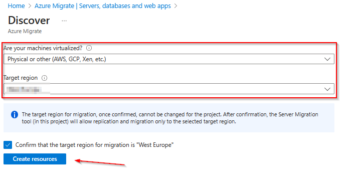

# Walkthrough Challenge 5 - Migrate machines to Azure

Duration: 90 minutes

## Prerequisites

Please make sure thet you successfully completed [Challenge 4](../challenge-4/solution.md) before continuing with this challenge.

> [!IMPORTANT]
> In Azure Migrate there exists a classic and simplified experience for physical server migration. The classic experience **retires on 30 September 2026**. The Microhack will focus on using the simplified experience which provides several key advantages e.g, a broader OS support and a more modern replication appliance. More details can be found [here](https://learn.microsoft.com/en-us/azure/migrate/simplified-experience-for-azure-migrate?view=migrate).

> [!IMPORTANT]
> For migrating Hyper-V VMs, the Migration and modernization tool installs software providers (Azure Site Recovery provider and Recovery Services agent) on Hyper-V hosts or cluster nodes. The Azure Migrate appliance isn't used for Hyper-V migration.

### **Task 1: Setup the software providers**

In the Azure Portal select *Virtual machines* from the navigation pane on the left. Select the **MHBox-HV** system and logon via Azure Bastion with you credentials:

> [!NOTE]
> You can also select *Password from Azure KeyVault* under *Authentication Type* to sekect the secret stored in the KeyVault.

Open Microsoft Edge on the Hyper-V Host and navigate and login to the [Azure Portal](https://portal.azure.com).
In the search bar enter *Azure Migrate* and select Azure Migrate from the list of services

 Select *All projects* from the navigation pane on the left. Your previousley created Azure Migrate project should be listed. Click on it to open the project.
 

Select *Migrations* from the navigation pane on the left and click on *Discover more*

Select *Azure VM* in the *Where do you want to migrate to?* and select *Yes, with Hyper-V* in the *Where do you want to migrate to?* field. 

> [!IMPORTANT]
> **Make sure to select the right target region. Double check with the destination resource group location. This can't be changed afterwards.**

Clicl on *Create resources*

Next download the binaries and the registration file.

Execute the *AzureSiteRecoveryProvider.exe* file to start the installation.

Register the Provider with the previousley downloaded registration file.

Complete the wizard an dwait for the the Provider to be successfully registered.

Go back to the Azure Portal and finalize the registration. You might need to refresh the page.

> [!Note]
> *This process might take up to 15 minutes to complete. Afterwards, the replication of VMs can be started.*

Once the registration is completed, change back to the Azure Migrate project in the Azure portal and select *Replication summary* from the *Migrations* section.

Click on *Infrastructre servers* and select the recently registered Hyper-v host.

If the *MARS agent version* is empty refresh the Server before you continue to enable replication.

### **Task 2: Enable Replication**

From the Azure Migrate project in the Azure portal  select *Replicate* from the *Migrations* section.

Specify the intent as shown on the diagram below:

Next select the Windows and the Linux System that host the Web Server with the Microhack Demo page.

Next select the destination resource group and the destination vNet & subnet.

In the Compute section you can adjust the target settings e.g., VM size.

In the Disk section you can adjust the target settings e.g., Standard SSD.

Proceed to the final summary and enable replication.

Wait until the Replication status shows *Protected*

### **Task 3: Perform Test Migration

When delta replication begins, you can run a test migration for the VMs, before running a full migration to Azure. We highly recommend that you do this at least once for each machine, before you migrate it.

+ Running a test migration checks that migration will work as expected, without impacting the on-premises machines, which remain operational, and continue replicating.
+ Test migration simulates the migration by creating an Azure VM using replicated data (usually migrating to a non-production VNet in your Azure subscription).
+ You can use the replicated test Azure VM to validate the migration, perform app testing, and address any issues before full migration.

Open the Azure Portal and navigate to the previousley created Azure Migrate project. Select *Migrations* and then click on *Replication Summary*. From the Summary page select *Test migration*.

From the new page make sure that the *Replication status* is *Protected*, click on the three dots at the end and click on *Test Migration*.

Select the destination network and click on *Test migration*

> [!Note]
> **Repeat the above steps for the other VM**

From the Azure Portal, select Virtual machines from the navigation pane on the left. There will be 2 additional servers ending with *-test*. Those servers were created during test migration.

Connect to the Windows VM via Azure Bastion.

On the VM open a browser and navigate to *http://localhost*. Make sure that the Microhack Demo Web App is running as expected.

Once confirmed that the systems are working as expected you can cleanup the test migration and proceed with the final migration.

Go back to the Test Migration section in the Azure Migrate project in the Azure Portal and click on *Cleanup test failover pending*

Provide a comment and click on *Cleanup test* to remove the previousley created resources.

> [!Note]
> **Repeat the above steps for the other VM**

### **Task 4: Prepare Final Migration**

Currently the two servers are not directly published and are not accessable directly. After the migration, the original server will be turned off. Therefore the access to the system needs to be updated. To prepare for the migration and to keep downtime as short as possible some pre-migration steps should be performed.

#### **Task 4.1: Create a new Azure Public Load Balancer in the destination environment**

From the Azure Portal open the Load Balancing blade, select Load Balancer on the Navigation pane on the left and click *Create*.

Under *Basics* select the *destination-rg* Resource Group and provide a name for the new Load Balancer.

Under *Frontend IP configuration*, click *Add a frontend IP configuration* and create a new Public IP address.

Under *Backend Pools*, select *Add a backend Pool*. Provide a name and select the *destination-vnet* as the Virtual Network.
Add *10.2.1.4* and *10.2.1.5* as the IP addresses.

> [!NOTE]
> Please note: Azure reserves the first four addresses (0-3) in each subnet address range, and doesn't assign the addresses. Azure assigns the next available address to a resource from the subnet address range. So it is predictable which IP addresses will be assigned to the destination VMs after the migration.

Under *Inbound rules* click on *Add a load balancing rule* and create the load balancing rule as illustrated on the following diagram.

We are already using a NAT GW to provide outbound Internet access. We don't need a Outbound rule and can skip this part.

Proceed to the *Review + create* section, review your configuration and click *Create*

Wait until the load balancer has been created, change back to the *Load balancing* section, select the Load Balancer and from the *Overview* pane copy the *Frontend IP address*. Note down the Public IP of the Load Balancer as we need it after the migration.

### **Task 7: Perform Final Migration**

Open the [Azure Portal](https://portal.azure.com) and navigate to the previousley created Azure Migrate project. Select *Migrations* from the navigation pane and click on *Migrate*.

Select *AzureVM* and click *Continue*.

Select the VMs you want to migrate and click on *Yes* to also shutdown the VMs on the Hyper-V host.

You can check the progress of the migration under the *Jobs* section within the *Replication Summary* section of the Azure Migrate Project.

You can also click on each job to review the current status of the migration. 

After a few minutes the migration should be successfully completed.

On the Hyper-V Host, the 2 VMs should also be turned off.

When you change to the *Virtual machine* section within the Azure Portal you should now see 2 additional serves in the *destination-rg* Resource Group.

You should now also be able to access the Web Server via the previousley created load balancer frontend IP.

🚀🚀🚀🚀🚀🚀 Congratulations, you've successfully migrated the frontend application to Azure.🚀🚀🚀🚀🚀🚀

### **Task 8: Cleanup**

After the successfull migration you can now stop replicating the source virtual machines. Open the [Azure Portal](https://portal.azure.com) and navigate to the previousley created Azure Migrate project. Select *Migrations -> Replication summary*. Click on *Replications* and then click on the 3 dots on the end of each row of the replicating servers and select *Stop replicating*.

Select *Stop replication and remove replication settings* from the drop down list and click *OK*. 

> [!NOTE]
> Repeat this step for the remaining Server.

🚀🚀🚀 You successfully completed challenge 5! 🚀🚀🚀

The deployed architecture now looks like the following diagram.

🚀🚀🚀 **!!!Congratulations!!! - You successfully completed the MicroHack. You can now safley remove the *source-rg* and *destination-rg* Resource Groups.** 🚀🚀🚀

🚀🚀🚀 **If you still want to continue we have 2 additional bonus challenges to modernize OR secure the migrated environment.**🚀🚀🚀

 **[Home](../../Readme.md)** - Continue with either [Bonus Challenge 6 solution](../challenge-6/solution.md) OR [Bonus Challenge 7 solution](../challenge-7/solution.md)
