# Walkthrough Challenge 5 - Migrate machines to Azure

Duration: 90 minutes

## Prerequisites

Please make sure thet you successfully completed [Challenge 4](../challenge-4/solution.md) before continuing with this challenge.

> [!IMPORTANT]
> In Azure Migrate there exists a classic and simplified experience for physical server migration. The classic experience **retires on 30 September 2026**. The Microhack will focus on using the simplified experience which provides several key advantages e.g, a broader OS support and a more modern replication appliance. More details can be found [here](https://learn.microsoft.com/en-us/azure/migrate/simplified-experience-for-azure-migrate?view=migrate).

### **Task 1: Create and prepare Windows Server 2022 for the Azure Replication Appliance**

To start physical server migration you must install the Azure Replication Appliance on your on-premises. The Azure Replication Appliance can be downloaded as a OVA template or you can download the appliance installer to install it on a already existing server. For the purpose of this MicroHack we will install the Azure Replication Appliance via the installer on a new Windows Server 2022 system.

> [!IMPORTANT]
> Please make sure to check the [prerequisites](https://learn.microsoft.com/en-us/azure/site-recovery/replication-appliance-support-matrix?view=migrate) of the Azure 
Replication Appliance.

> [!IMPORTANT]
> Please note that it is currently [not supported](https://learn.microsoft.com/en-us/azure/migrate/common-questions-appliance#can-the-azure-migrate-appliancereplication-appliance-connect-to-the-same-vcenter) to install the Azure Migrate Replication Appliance on the same system as the Azure Migrate Appliance.

In the Azure Portal select *Virtual machines* from the navigation pane on the left. Select *Create -> Virtual machine*

Under Basics select the *source-rg* Resource Group and provide a name for the server. Select *Windows Server 2022 Datacenter - x64 Gen2* for the Image.

Make sure to select a **Standard_B16s_v2** VM instance to adhere to the prerequisites of the Replication appliance.

> [!NOTE]
> For the Username and Password you can either select a combination of your choice or check the secrets within the KeyVault.

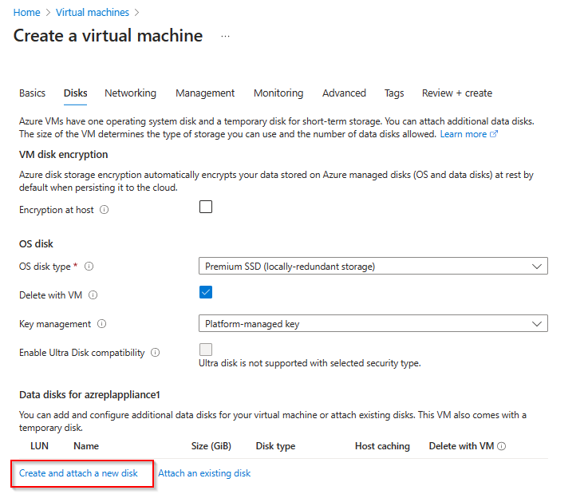

Add an additional 1024GiB Standard SSD LRS data disk to the Virtual Machine and click *Next*

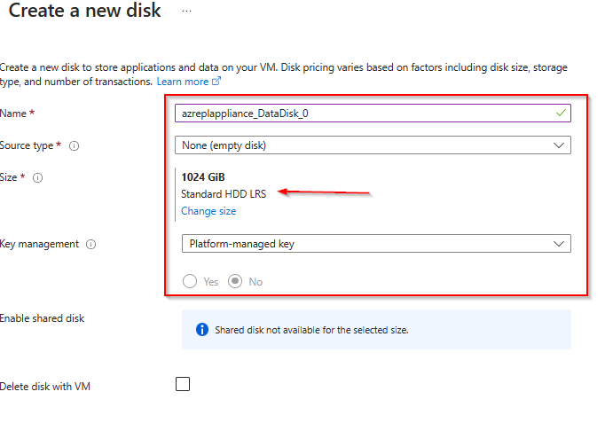

In the *Networking* tab, select the *source-vnet* Virtual Network and the *source-subnet* Subnet and make sure to select *None* for the Public IP and NIC network security group.

Accept the default settings for the remaining tabs, select *Review + create* and click *Create*.

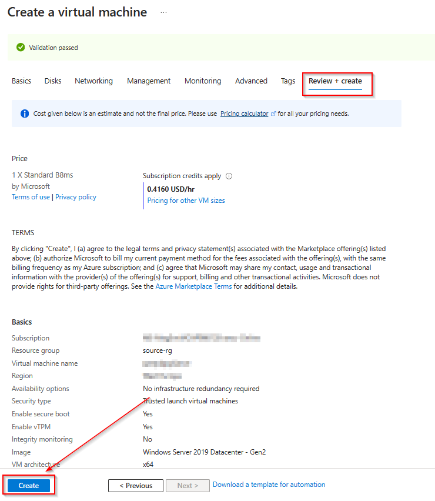

Wait until the deployment has been successfully completed and select *Go to resource*

Select *Bastion* from the navigation pane on the left, provide the credentials to login to the Azure Migrate Replication VM and select *Connect*. A new browser tab should open with a remote session to the Windows Server 2022 system.

> [!NOTE]
> You can also select *Password from Azure KeyVault* under *Authentication Type* if you set the password during VM creation to match the secret stored in the KeyVault.

### **Task 2: Setup the Azure Replication Appliance**

To prepare for physical server migration, you need to verify the physical server settings, and prepare to deploy a replication appliance.

First we need to initialize and format the data disk that was attached during the VM creation. 
Open Windows Disk Management using the `diskmgmt.msc` command.

A popup should arise to initialize the disk.

Select the initialized disk and create a new simple vplume on it.

Acceppt the default values, name the Volume *ASR* and click *Finish* to format the disk.

Wait until the operation is completed successfully.

Open the [Azure Portal](https://portal.azure.com) on the **Azure Replication Appliance** using the Microsoft Edge browser and navigate to the previousley created Azure Migrate project. Select *Migrate* from the navigation pane on the left and click *Discover more*.

> [!IMPORTANT]
> Please double check your preferred target region as this cannot be changed afterwards. **In doubt check the region of your destination Resource Group and vNet**.

Select *Azure VM* in the *Where do you want to migrate* drop down, select *Physical or other* in the *Are your machines virtulized* drop down and select **Your Target Region** as the *Target Region*.
Make sure to check the confirmation checkbox and click *Create resources*. 

Wait until the deployment has been successfully completed. Open the **documentation** link in a new tab and download the appliance installer from there.

After successfully downloading the zip folder, unzip and extract the components of the folder.

Go to the path in which the folder is extracted to and execute the following PowerShell script as an administrator e.g.:

~~~powershell
cd $env:userprofile\Downloads\DRAppliance\DRAppliance
.\DRInstaller.ps1
~~~

This will start the installation process of the replication appliance.

Once you create the appliance, Microsoft Azure appliance configuration manager is launched automatically. Use the following steps to register the appliance.

If the configuration manager does not start autommatically, then it can be also started manually from the link on the Desktop.

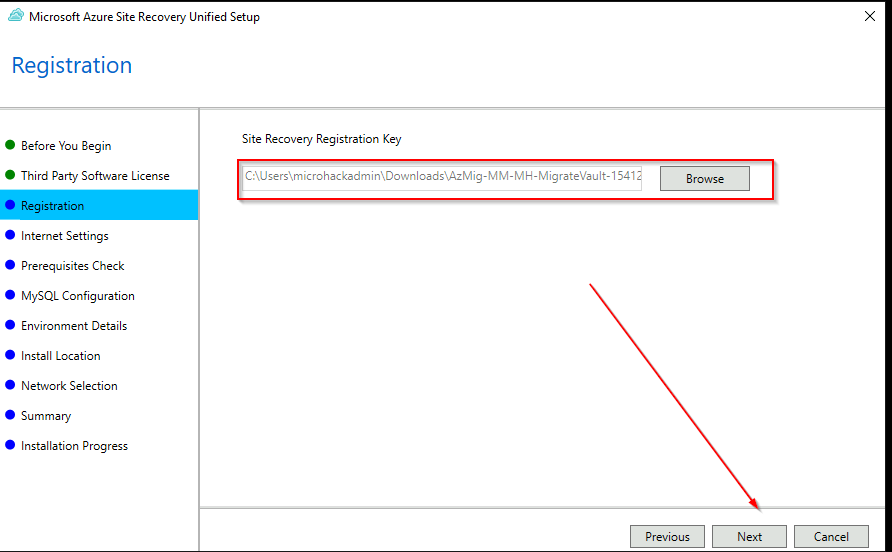

Next you need to register the appliance with the Azure Migrate project. For this a registration key is required. Go back to the Azure portal and generate a key.

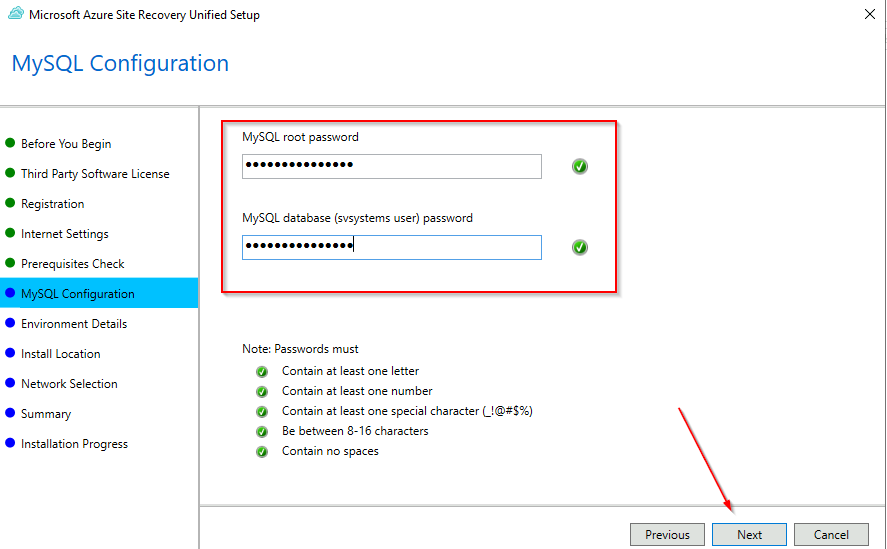

Complete the login to Azure and wait until the appliance is beeing registered.

As we do not have a vCenter in thie Microhack select *I do not have vCenter Server/vSphere ESXi server. I'll protect my servers by manually discovering them using IP addresses* and click *Continue*.

Next you need to provide the Server credentials and also map them to the source servers accordingly. Please note that root needs to be enabled on the Linux system.

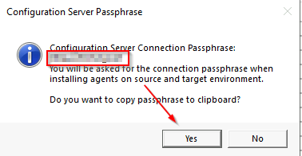

After successfully adding the details, select Continue to install all Azure Site Recovery replication appliance components and register with Azure services. **This activity can take up to 30 minutes**.

Ensure you don't close the browser while configuration is in progress..

### **Task 3: Replicate machines**

> [!IMPORTANT]
> As our Windows and Linux systems are using different credentials, we need to enable them on by one. Start with the Windows system and repeat the steps afterwards with the Linux system and make sure to select the appropriate credentials.

In the Azure Migrate project, select *Execute > Migrations > Replicate*.

In Replicate, > Source settings > Are your machines virtualized?, select *Physical or other (AWS, GCP, Xen, etc.)*.

In *On-premises appliance*, select the name of the replication appliance that you set up and then select continue.

In Guest credentials, select the friendly name of the credentials created previously during the replication appliance setup and then select Next: Virtual machines.

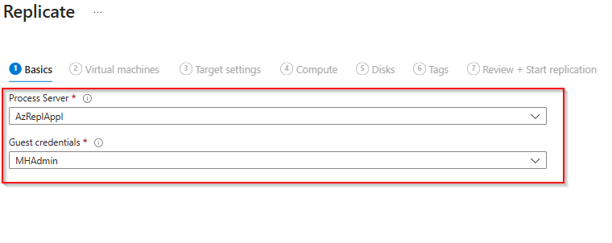

Next select the source server. 

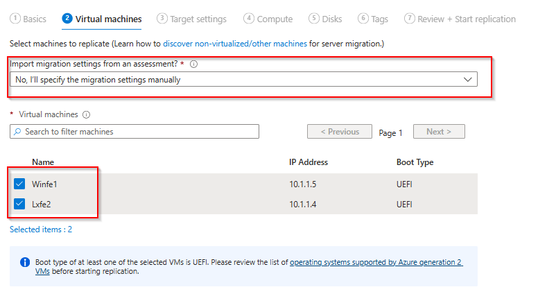

In **Target settings**, select the subscription to which you'll migrate. (The region is set to your selection in the previous step and can't be modified.) Specify the **destination** resource group in which the Azure VMs will reside after migration.

In **Virtual Network**, select the **destination** virtual network/subnet to which the Azure VMs will be joined after migration.

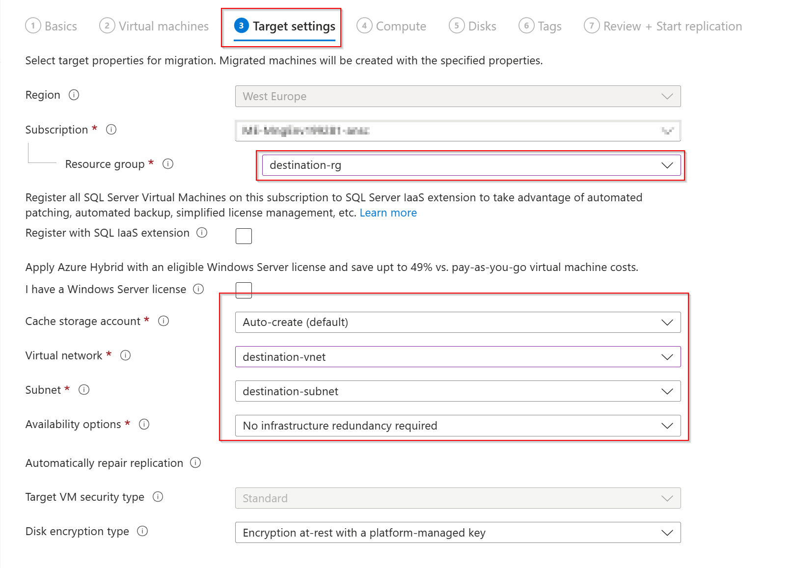

In **Compute**, review the VM name, size, OS and disk type. VMs must conform with Azure requirements.

In Disks, specify whether the VM disks should be replicated to Azure. Select the disk type Standard SSD in Azure. Then select Next.

Proceed to *Review + Start replication* and review your settings. Make sure you've selected the **destination** Resource Group and vNet.

**Please repeat the above steps now for the Linux server.**

To track the status, in the Azure Migrate project, select *Execute > Migrations > Replications summary*.

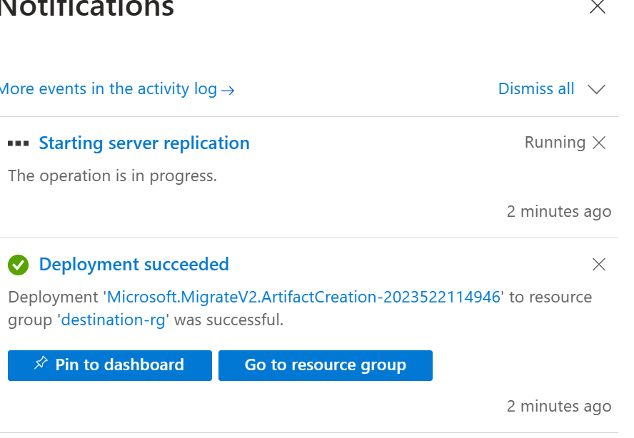

From the list select the server to get more details.

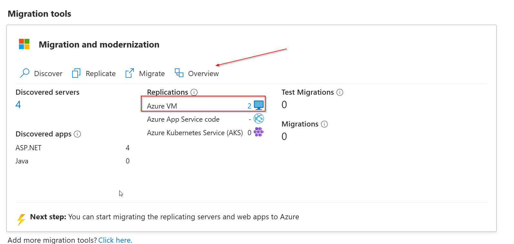

> [!IMPORTANT]
> The push installation of the mobility service has a few prerequisites. If the installation fails please review the [documentation](https://learn.microsoft.com/en-us/azure/site-recovery/vmware-azure-install-mobility-service).

### **Task 6: Prepare Final Migration**

Currently the two frontend servers are published via an Azure Public Load Balancer. After the migration, the original server will be turned off. Therefore the access to the system via the Azure Public Load Balancer will be broken. To prepare for the migration and to keep downtime as short as possible some pre-migration steps should be performed.

#### **Task 6.1: Create a new Azure Public Load Balancer in the destination environment**

From the Azure Portal open the Load Balancing blade, select Load Balancer on the Navigation pane on the left and click *Create*.

Under *Basics* select the *destination-rg* Resource Group and provide a name for the new Load Balancer.

Under *Frontend IP configuration*, click *Add a frontend IP configuration* and create a new Public IP address.

Under *Backend Pools*, select *Add a backend Pool*. Provide a name and select the *destination-vnet* as the Virtual Network.
Add *10.2.1.4* and *10.2.1.5* as the IP addresses.

> [!NOTE]
> Please note: Azure reserves the first four addresses (0-3) in each subnet address range, and doesn't assign the addresses. Azure assigns the next available address to a resource from the subnet address range. So it is predictable which IP addresses will be assigned to the destination VMs after the migration.

Under *Inbound rules* click on *Add a load balancing rule* and create the load balancing rule as illustrated on the following diagram.

Under *Outbound rules* click *Add an outbound rule* and create the outbound rule as illustrated on the following diagram.

Proceed to the *Review + create* section, review your configuration and click *Create*

Wait until the load balancer has been created, cahnge back to the *Load balancing* section, select the *plb-frontend* Load Balancer and click *Frontend IP configuration* from the navigation pane on the left. Note down the Public IP of the *LoadBalancerFrontEnd* configuration. Repeat the step for the *plb-frontend-dest* Load Balancer.

#### **Task 6.2: Create a new Azure Traffic Manager Profile**

Azure Traffic Manager is a DNS-based traffic load balancer. It allows us to distribute traffic to public facing endpoints like our two Public Load Balancer. Traffic Manager can be created in advance to distribute traffic among the old and new load balancer. The DNS conbfiguration of the application can be changed in advance to point to the Traffic Manager Profile instead to the Public IP of the Load Balancer. Using this approach makes sure that Traffic Manager automatically removes the old Load Balancer after the frontend servers were migrated.

From the Azure Portal open the Load Balancing blade, select Traffic Manager on the Navigation pane on the left and click *Create*.

Select a name for the Traffic Manager profile and select the *destination-rg* as the Resourec Group.

From the Load Balancing overview page select *Traffic Manager* and select the previously created Traffic Manager profile. 
Select *Endpoints* and click *Add*. Add each public IP of the source and destination Load Balancer as separate endpoints.

> [!NOTE]
> Please note: To be able to add the public IP addresses they need to be configured with an [DNS name lable](https://learn.microsoft.com/en-us/azure/dns/dns-custom-domain?toc=%2Fazure%2Fvirtual-network%2Ftoc.json#public-ip-address).

Check the Overview section under the navigation pane and note that the source load balancer is shown as *online* whereas the 
destination load balancer is shown as *degraded*. If you copy the DNS name of the Traffic Manager profile and paste it into your browser, you should be able to browse the source web servers through the Traffic Manager Profile.

### **Task 7: Perform Final Migration**

Open the [Azure Portal](https://portal.azure.com) and navigate to the previousley created Azure Migrate project. Select *Servers, databases and web apps*, make sure that the right Azure Migrate Project is selected and click *Overview* in the *Migration tools* box. From the Overview section click in *Migrate* under *Step 3: Migrate*.

Select *AzureVM* and click *Continue*.

Select *No* because shutdown of source machines is only supported for HyperVisor based migrations, select the two servers and click *Migrate*.

You can check the progress of the migration under the *Jobs* section within the navigation pane.

After a few minutes the migration should be successfully completed.

When you change to the *Virtual machine* section within the Azure Portal you should now see 2 additional serves in the *destination-rg* Resource Group.
Please select the original source Virtual Machines and click on *Stop* to shutdown the source VMs.

Change to the Azure Traffic Manager profile you've created previousley and look at the endpoints. Please note that the *fe-source* endpoint is now shown as degraded and that the *fe-dest* endpoint is shown as online.

From a user perspective nothing changed. You're still able to browse the Traffic Manager profile DNS name and you will be transparently redirected to the web servers that are know running in Azure.

🚀🚀🚀🚀🚀🚀 Congratulations, you've successfully migrated the frontend application to Azure.🚀🚀🚀🚀🚀🚀

### **Task 8: Cleanup**

After the successfull migration you can now stop replicating the source virtual machines. Open the [Azure Portal](https://portal.azure.com) and navigate to the previousley created Azure Migrate project. Select *Servers, databases and web apps*, make sure that the right Azure Migrate Project is selected and click *Overview* in the *Migration tools* box. In the *Azure Migrate: Migration and modernization* pane, select *Replicating machines* from the navigation pane on the left, click on the 3 dots on the end of each row of the replicating servers and select *Stop replicating*.

Select *Stop replication and remove replication settings* from the drop down list and click *OK*. Repeat this step for the remaining Server.

From the Traffic Manager Profile you can now also safley remove the endpoint for the source load balancer.

🚀🚀🚀 You successfully completed challenge 5! 🚀🚀🚀

The deployed architecture now looks like the following diagram.

🚀🚀🚀 **!!!Congratulations!!! - You successfully completed the MicroHack. You can now safley remove the *source-rg* and *destination-rg* Resource Groups.** 🚀🚀🚀

🚀🚀🚀 **If you still want to continue we have 2 additional bonus challenges to modernize OR secure the migrated environment.**🚀🚀🚀

 **[Home](../../Readme.md)** - Continue with either [Bonus Challenge 6 solution](../challenge-6/solution.md) OR [Bonus Challenge 7 solution](../challenge-7/solution.md)
