# Walkthrough Challenge 5 - Migrate machines to Azure

Duration: 90 minutes

## Prerequisites

Please make sure thet you successfully completed [Challenge 4](../challenge-4/solution.md) before continuing with this challenge.

### **Task 1: Create and prepare Windows Server 2019 for the Azure Replication Appliance**

To start physical server migration you must install the Azure Replication Appliance on your on-premises. The Azure Replication Appliance can be downloaded as a OVA template or you can download the appliance installer to install it on a already existing server. For the purpose of this MicroHack we will install the Azure Replication Appliance via the installer on a new Windows Server 2019 system.

> [!IMPORTANT]
> Please make sure to check the [prerequisites](https://learn.microsoft.com/en-us/azure/migrate/migrate-replication-appliance) of the Azure 
Replication Appliance.

> [!IMPORTANT]
> Please note that it is currently [not supported](https://learn.microsoft.com/en-us/azure/migrate/common-questions-appliance#can-the-azure-migrate-appliancereplication-appliance-connect-to-the-same-vcenter) to install the Azure Migrate Replication Appliance on the same system as the Azure Migrate Appliance.

In the Azure Portal select *Virtual machines* from the navigation pane on the left. Select *Create -> Azure virtual machine*

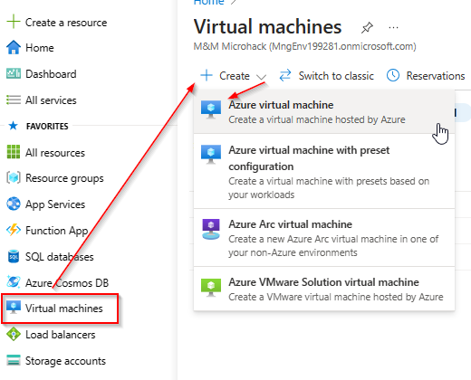

Under Basics select the *source-rg* Resource Group and provide a name for the server. Select *Windows Server 2019 Datacenter - x64 Gen2* for the Image.

> [!NOTE]
> For the Username and Password you can either select a combination of your choice or check the secrets within the KeyVault.

Add an additional 1024GiB Standard HDD LRS data disk to the Virtual Machine and click *Next*

In the *Networking* tab, select the *source-vnet* Virtual Network and the *source-subnet* Subnet and make sure to select *None* for the Public IP and NIC network security group.

Accept the default settings for the remaining tabs, select *Review + create* and click *Create*.

Wait until the deployment has been successfully completed and select *Go to resource*

Select *Bastion* from the navigation pane on the left, provide the credentials to login to the Azure Migrate Replication VM and select *Connect*. A new browser tab should open with a remote session to the Windows Server 2019 system.

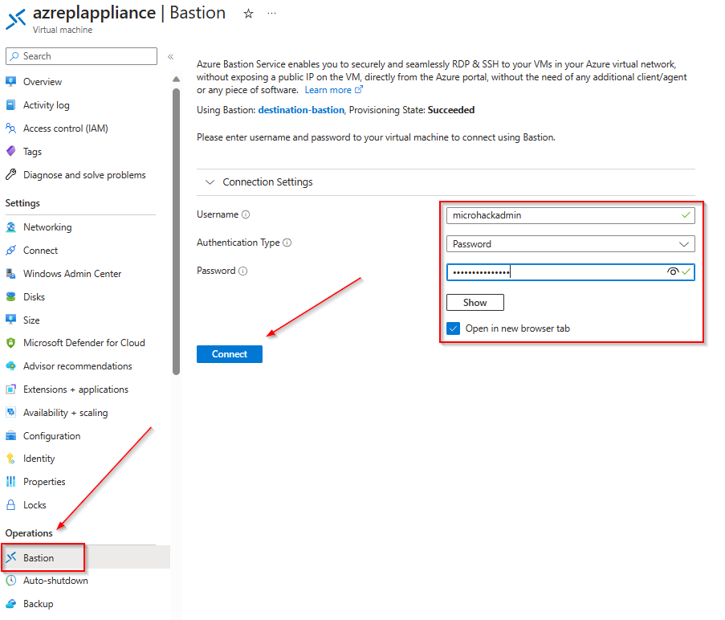

> [!NOTE]
> You can also select *Password from Azure KeyVault* under *Authentication Type* if you set the password during VM creation to match the secret stored in the KeyVault.

### **Task 2: Setup the Azure Replication Appliance**

To prepare for physical server migration, you need to verify the physical server settings, and prepare to deploy a replication appliance.

First we need to initialize and format the data disk that was attached during the VM creation. 
Open Windows Disk Management using the *diskmgmt.msc* command.

A popup should arise to initialize the disk.

Select the initialized disk and create a new simple vplume on it.

Acceppt the default values, name the Volume *ASR* and click *Finish* to format the disk.

Wait until the operation is completed successfully.

Open the [Azure Portal](https://portal.azure.com) on the Azure Replication Appliance using the Microsoft Edge browser and navigate to the previousley created Azure Migrate project. Select *Servers, databases and web apps*, make sure that the right Azure Migrate Project is selected and click *Discover* in the *Migration tools* box.

> [!IMPORTANT]
> Please double check your preferred target region as this cannot be changed afterwards. In doubt check the region of your destination Resource Group and vNet.

Select *Physical or other...* in the *Are your machines virtualized* drop down and select *Your Target Region* as the *Target Region*.
Make sure to check the confirmation checkbox and click *Create resources*. 

Wait until the deployment has been successfully completed. Next under *1. Download and install the repliaction appliance software* click *Download* to download the Azure Migrate Repplication Appliance installer. 
You also need to download the registration key that is required to register the replication appliance under *2. Configure the replication appliance and register it to the project*.

Next start the installation of the Azure Migrate Replication Appliance by double cklicking the *MicrosoftAzureSiteRecoveryUnifiedSetup.exe*

Select *Install the configuration server and process server* and click *Next*

Check the *I acceppt...* checkbox and click *Next*

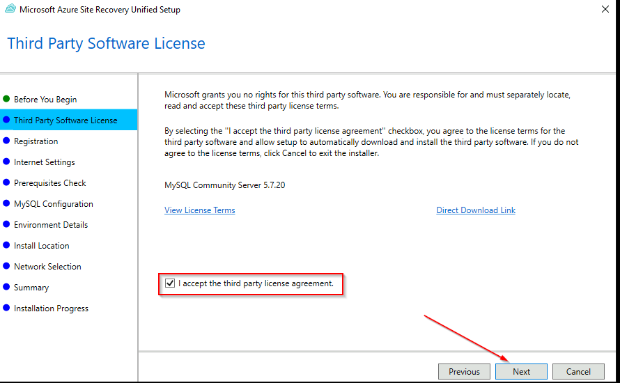

Browse and select the previousley downloaded registration key and click *Next*

Accept the default *Internet connection* configuration

Review the prerequisites check of the installer. Note that you can safely ignore the static IP warning.

Specify the required passwords and note the password requirements. 

> [!NOTE]
> For the Username and Password you can either select a combination of your choice or check the secrets within the KeyVault.

Select *No* for *Do you want to protect VMware virtual machines* and click *Next*

Verify the *Install location*. The installer should automatically pre-select the largest disk, in our case the 1024 GiB data disk that was created during VM creation.

> [!IMPORTANT]
> The additional data disk needs to be initialized first using the [Windows Disk Management tool](https://learn.microsoft.com/en-us/windows-server/storage/disk-management/initialize-new-disks#initialize-a-new-disk). You can open the tool side by side with the installer if you have not initialized the disk beforehand.

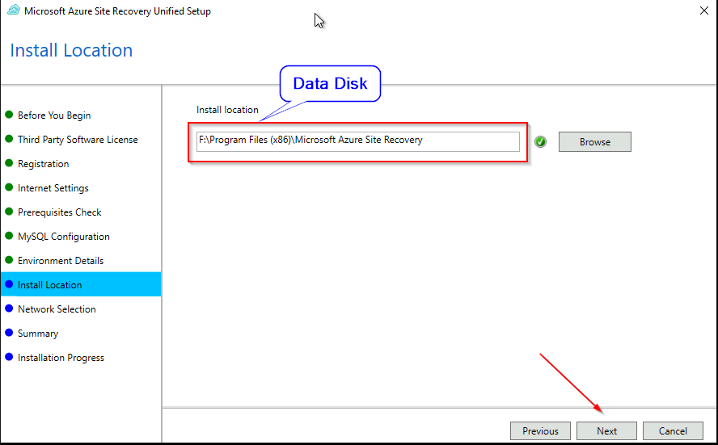

Select the appropriate NICs (We only have 1 in our case).

Verify the installation summary and click *Install* to start the installation.

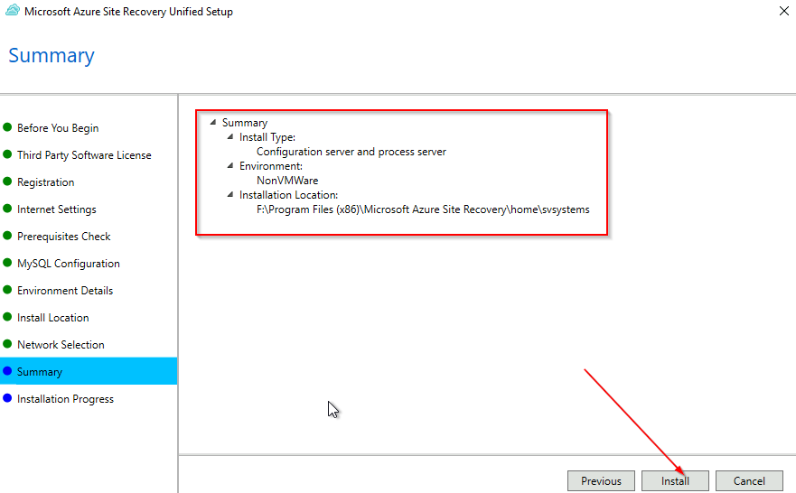

Wait until the installation progress is finished.

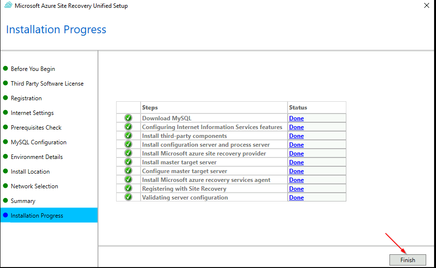

After the successfull installation a configuration server connection passphrase will be displayed. Copy the passphrase and save it as a new secret in the source-rg Resource Group KeyVault.

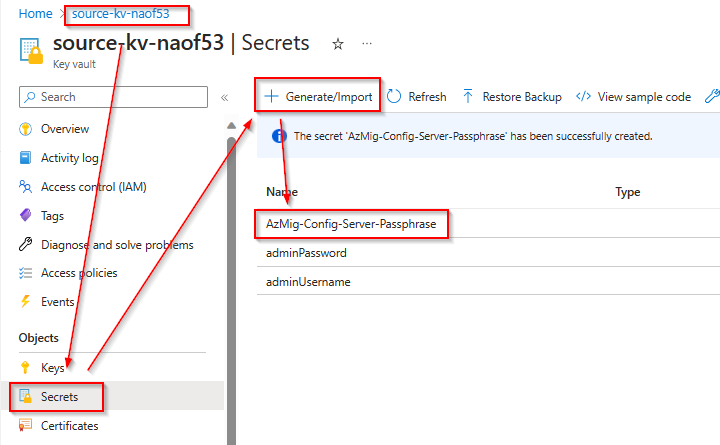

After the installation completes, the Appliance configuration wizard will be launched automatically.
You can add the local administrator account credentials of the source servers (stored secrets in the source KeyVault).

The last step is to finalize the registration. Refresh the Azure Portal page where you've downloaded the installer and registration keys and select the *azreplappliance* from the drop down list and click on *Finalize registration*.

### **Task 3: Copy the Mobility Service Agent to the source server**

On machines you want to migrate, you need to install the Mobility service agent. The agent installers are available on the replication appliance in the *%ProgramData%\ASR\home\svsystems\pushinstallsvc\repository* directory.

**Windows**
To copy the Mobility service agent to the Windows machine follow the following steps

1. Sign in to the Windows Server source VM.
2. Open Powershell and run the following command

~~~powershell
Windows PowerShell
Copyright (C) Microsoft Corporation. All rights reserved.
Copy-Item \\10.1.1.7\C$\ProgramData\ASR\home\svsystems\pushinstallsvc\repository\Microsoft-ASR_UA*Windows*_Release.exe $env:USERPROFILE\Downloads\ -Force
~~~

**Linux**
To copy the Mobility service agent to the Linux machine follow the following steps

1. Sign in to the Linux Server source VM.
2. Run the following command. Replace the Username and the correct filename.

~~~bash
#List the correct file
smbclient -U <ReplaceWIthAdminUserName> //10.1.1.7/c$ -c "dir ProgramData\ASR\home\svsystems\pushinstallsvc\repository\*ASR*RHEL8*"
#Copy the filename to next command and copy it to tmp directory
smbclient '//10.1.1.7/c$' -c 'lcd /tmp; cd ProgramData\ASR\home\svsystems\pushinstallsvc\repository; get Microsoft-ASR_UA_9.63.0.0_RHEL8-64_GA_21Oct2024_Release.tar.gz' -U <ReplaceWIthAdminUserName>
cd /tmp
ls
~~~

#### **Task 3.1: Install the Mobility service on the Windows VM**

> [!NOTE]
> During the installation you need to provide the passphrase that was created during the Replication Appliance installation.
> If you forgot to copy the passphrase you can obtain it from inside the Replication Appliance via the following Powershell command. 
> ~~~powershell
> Windows PowerShell
> Copyright (C) Microsoft Corporation. All rights > reserved.
> C:\ProgramData\ASR\home\svsystems\bin\genpassphrase.exe -v
> ~~~

> [!WARNING]
> Don't regenerate the passphrase. This will break connectivity and you will have to reregister the replication appliance.

1. Extract the contents of installer file to a local folder (for example C:\Temp) on the machine, as follows:

~~~powershell
Windows PowerShell
Copyright (C) Microsoft Corporation. All rights reserved.
cd $env:USERPROFILE\Downloads\
Rename-Item .\Microsoft-ASR_UA_9.63.0.0_Windows_GA_21Oct2024_Release.exe MobilityServiceInstaller.exe
.\MobilityServiceInstaller.exe /q /x:C:\Temp\Extracted
cd C:\Temp\Extracted
~~~

2. Run the Mobility Service Installer:
~~~powershell
Windows PowerShell
Copyright (C) Microsoft Corporation. All rights reserved.
.\UnifiedAgent.exe /Role "MS" /Platform "VmWare" /Silent /CSType CSLegacy
~~~

> [!IMPORTANT]
> You need to specify *VmWare* for the *Platform* parameter also for physical servers.

3. Register the agent with the replication appliance:
~~~powershell
Windows PowerShell
Copyright (C) Microsoft Corporation. All rights reserved.
cd "C:\Program Files (x86)\Microsoft Azure Site Recovery\agent"
set-Content .\password.txt <REPLACE WITH PASSPHRASE> -Force # This is the password you received during the installation of the Azure Replication Appliance, replace it with your password.
.\UnifiedAgentConfigurator.exe /CSEndPoint 10.1.1.7 /PassphraseFilePath "C:\Program Files (x86)\Microsoft Azure Site Recovery\agent\password.txt"
~~~
 
#### **Task 3.2: Install the Mobility service on the Linux VM**

> [!NOTE]
> During the installation you need to provide the passphrase that was created during the Replication Appliance installation.
> If you forgot to copy the passphrase you can obtain it from inside the Replication Appliance via the following Powershell command. 
> ~~~powershell
> Windows PowerShell
> Copyright (C) Microsoft Corporation. All rights > reserved.
> C:\ProgramData\ASR\home\svsystems\bin\genpassphrase.exe -v
> ~~~

> [!WARNING]
> Don't regenerate the passphrase. This will break connectivity and you will have to reregister the replication appliance.

Now you need to log in to the source Linux VM to finish the installation of the mobility service agent.

Log into the Linux VM with Azure Bastion and install the mobility service agent.

~~~bash
mkdir MobSvcInstaller
tar -C ./MobSvcInstaller -xvf /tmp/Microsoft-ASR_UA_9.63.0.0_RHEL8-64_GA_21Oct2024_Release.tar.gz
cd MobSvcInstaller
sudo ./install -r MS -v VmWare -q -c CSLegacy # You need to specify VmWare as the platform also for physical servers.
~~~

~~~bash
echo <REPLACE WITH PASSPHRASE> > password.txt # This is the password you received during the installation of the Azure Replication Appliance, replace it with your password.
sudo /usr/local/ASR/Vx/bin/UnifiedAgentConfigurator.sh -i 10.1.1.7 -P password.txt -c CSLegacy # IP 10.1.1.7 is the IP of the Azure Replication Appliance Windows VM you created.
logout
~~~

### **Task 4: Enable Replication**

Open the [Azure Portal](https://portal.azure.com) and navigate to the previousley created Azure Migrate project. Select *Servers, databases and web apps*, make sure that the right Azure Migrate Project is selected and click *Replicate* under *Migration Tools*.

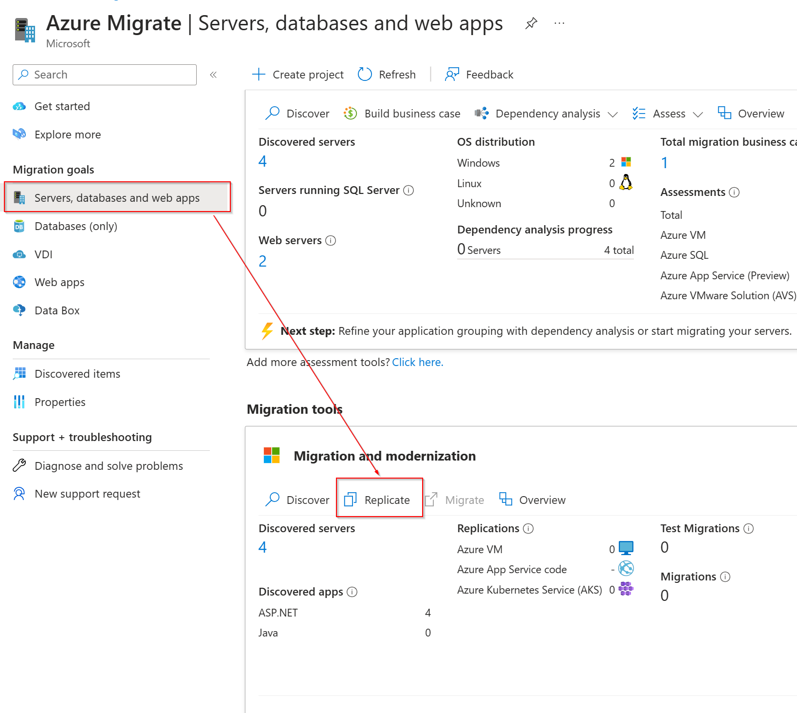 

Select *Servers or virtual machines (VM)* and *Azure VM* and click *Continue*.

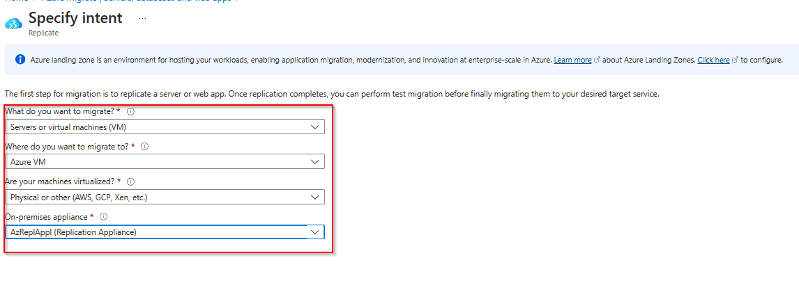 

In the *Basics* page select the previousley created Azure Migrate Replication appliance and specify the Guest Credentials and click next:

Under *Virtual Machines* select *No I'll specify the migration settings manually* and select the *frontend1* and *frontend2* server from the list.

Under *Traget Settings* select the *destination-rg* Resource Group and the *destination-vnet* vNet and select next.

Under *Compute* acceppt the defaults and click next.

Under *Disks* change the Disk Type to *Standard SSD* and click next.

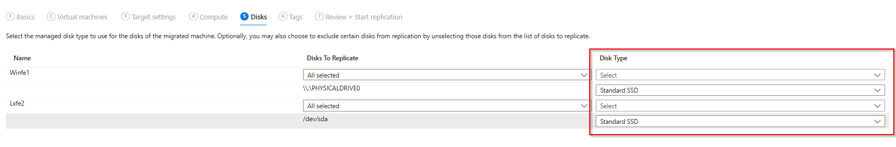

Acceppt the defaults for *Tags* and proceed to *Review + Start Replication*. Click *Replicate* to start the replication.

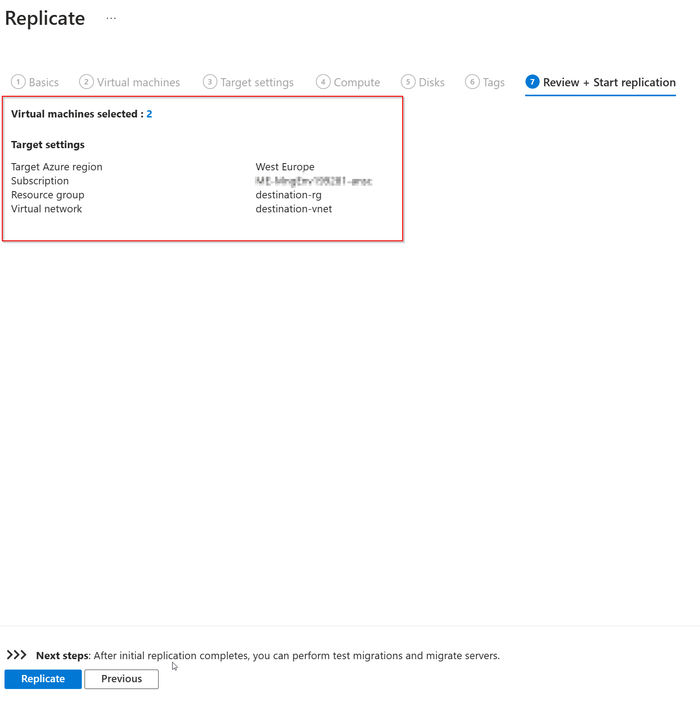

Wait until the replication has been successfully initiated.

Under *Migration Tools* you should know see that 2 Server are beeing replicated. Click on *Overview* to see more details.

Select *Replicating Machines* from the navigation pane on the left. You should now see the 2 servers and their status.

> [!IMPORTANT]
> Please note that the initial replication might take some time. Within the MicroHack environment it should not take longer than 30 minutes.

### **Task 5: Perform Test Migration**

When delta replication begins, you can run a test migration for the VMs, before running a full migration to Azure. We highly recommend that you do this at least once for each machine, before you migrate it.

* Running a test migration checks that migration will work as expected, without impacting the on-premises machines, which remain operational, and continue replicating.
* Test migration simulates the migration by creating an Azure VM using replicated data (usually migrating to a non-production VNet in your Azure subscription).
* You can use the replicated test Azure VM to validate the migration, perform app testing, and address any issues before full migration.

Open the [Azure Portal](https://portal.azure.com) and navigate to the previousley created Azure Migrate project. Select *Servers, databases and web apps*, make sure that the right Azure Migrate Project is selected and click *Overview* in the *Migration tools* box.

Select *Perform more test migrations* under *Step 2: Test migration*.

Click on the 3 dots on the right corner of each server and select *Test migration* from the drop down.

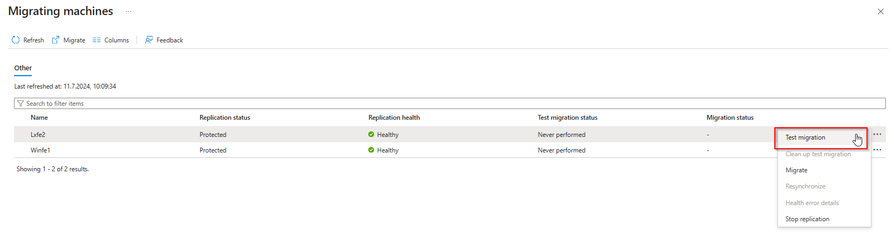

Select the *destination-vnet* and click on *Test migration*.

Repeat the above steps for the remaining server and wait until the test migration has been successfully finished.

Switch back to the *Overview* section of the *Azure Migrate: Migration and modernization* page. The Cleanup should be pending for the 2 servers.

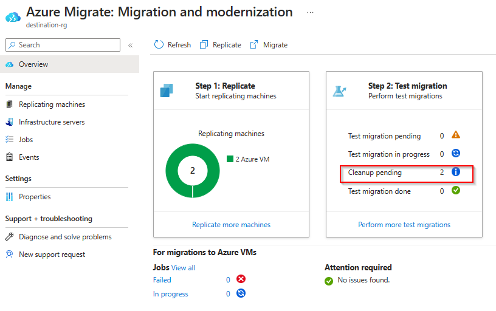

Select *Virtual machines* from the navigation pane on the left. There will be 2 additional servers *frontend1-test* and *frontend2-test*. Those servers were created during test migration.

Click on the *frontend1-test* server, select *Bastion* and provide the login credentials for the server. Select *Connect* to initiate the connection.

Open the Microsoft Edge browser on the server, enter *localhost* in the address bar and make sure that the web server is running.

Repeat the above steps for the *Lxfe2-test* system. Once you've confirmed that the applications on the systems are running as expected you can perfom a cleanup for the test migration. Change back to the *Azure Migrate: Migration and modernization* overview page, click on the 3 dots on the end of each row of the replicating servers and select *Clean up test migration*.

Select *Testing complete. Delete test virtual machine* and select *Cleanup Test*. Reapeat the step for the remainig server and wait until the cleanup has been successfully processed.

### **Task 6: Prepare Final Migration**

Currently the two frontend servers are published via an Azure Public Load Balancer. After the migration, the original server will be turned off. Therefore the access to the system via the Azure Public Load Balancer will be broken. To prepare for the migration and to keep downtime as short as possible some pre-migration steps should be performed.

#### **Task 6.1: Create a new Azure Public Load Balancer in the destination environment**

From the Azure Portal open the Load Balancing blade, select Load Balancer on the Navigation pane on the left and click *Create*.

Under *Basics* select the *destination-rg* Resource Group and provide a name for the new Load Balancer.

Under *Frontend IP configuration*, click *Add a frontend IP configuration* and create a new Public IP address.

Under *Backend Pools*, select *Add a backend Pool*. Provide a name and select the *destination-vnet* as the Virtual Network.
Add *10.2.1.4* and *10.2.1.5* as the IP addresses.

> [!NOTE]
> Please note: Azure reserves the first four addresses (0-3) in each subnet address range, and doesn't assign the addresses. Azure assigns the next available address to a resource from the subnet address range. So it is predictable which IP addresses will be assigned to the destination VMs after the migration.

Under *Inbound rules* click on *Add a load balancing rule* and create the load balancing rule as illustrated on the following diagram.

Under *Outbound rules* click *Add an outbound rule* and create the outbound rule as illustrated on the following diagram.

Proceed to the *Review + create* section, review your configuration and click *Create*

Wait until the load balancer has been created, cahnge back to the *Load balancing* section, select the *plb-frontend* Load Balancer and click *Frontend IP configuration* from the navigation pane on the left. Note down the Public IP of the *LoadBalancerFrontEnd* configuration. Repeat the step for the *plb-frontend-dest* Load Balancer.

#### **Task 6.2: Create a new Azure Traffic Manager Profile**

Azure Traffic Manager is a DNS-based traffic load balancer. It allows us to distribute traffic to public facing endpoints like our two Public Load Balancer. Traffic Manager can be created in advance to distribute traffic among the old and new load balancer. The DNS conbfiguration of the application can be changed in advance to point to the Traffic Manager Profile instead to the Public IP of the Load Balancer. Using this approach makes sure that Traffic Manager automatically removes the old Load Balancer after the frontend servers were migrated.

From the Azure Portal open the Load Balancing blade, select Traffic Manager on the Navigation pane on the left and click *Create*.

Select a name for the Traffic Manager profile and select the *destination-rg* as the Resourec Group.

From the Load Balancing overview page select *Traffic Manager* and select the previously created Traffic Manager profile. 
Select *Endpoints* and click *Add*. Add each public IP of the source and destination Load Balancer as separate endpoints.

> [!NOTE]
> Please note: To be able to add the public IP addresses they need to be configured with an [DNS name lable](https://learn.microsoft.com/en-us/azure/dns/dns-custom-domain?toc=%2Fazure%2Fvirtual-network%2Ftoc.json#public-ip-address).

Check the Overview section under the navigation pane and note that the source load balancer is shown as *online* whereas the 
destination load balancer is shown as *degraded*. If you copy the DNS name of the Traffic Manager profile and paste it into your browser, you should be able to browse the source web servers through the Traffic Manager Profile.

### **Task 7: Perform Final Migration**

Open the [Azure Portal](https://portal.azure.com) and navigate to the previousley created Azure Migrate project. Select *Servers, databases and web apps*, make sure that the right Azure Migrate Project is selected and click *Overview* in the *Migration tools* box. From the Overview section click in *Migrate* under *Step 3: Migrate*.

Select *AzureVM* and click *Continue*.

Select *No* because shutdown of source machines is only supported for HyperVisor based migrations, select the two servers and click *Migrate*.

You can check the progress of the migration under the *Jobs* section within the navigation pane.

After a few minutes the migration should be successfully completed.

When you change to the *Virtual machine* section within the Azure Portal you should now see 2 additional serves in the *destination-rg* Resource Group.
Please select the original source Virtual Machines and click on *Stop* to shutdown the source VMs.

Change to the Azure Traffic Manager profile you've created previousley and look at the endpoints. Please note that the *fe-source* endpoint is now shown as degraded and that the *fe-dest* endpoint is shown as online.

From a user perspective nothing changed. You're still able to browse the Traffic Manager profile DNS name and you will be transparently redirected to the web servers that are know running in Azure.

🚀🚀🚀🚀🚀🚀 Congratulations, you've successfully migrated the frontend application to Azure.🚀🚀🚀🚀🚀🚀

### **Task 8: Cleanup**

After the successfull migration you can now stop replicating the source virtual machines. Open the [Azure Portal](https://portal.azure.com) and navigate to the previousley created Azure Migrate project. Select *Servers, databases and web apps*, make sure that the right Azure Migrate Project is selected and click *Overview* in the *Migration tools* box. In the *Azure Migrate: Migration and modernization* pane, select *Replicating machines* from the navigation pane on the left, click on the 3 dots on the end of each row of the replicating servers and select *Stop replicating*.

Select *Stop replication and remove replication settings* from the drop down list and click *OK*. Repeat this step for the remaining Server.

From the Traffic Manager Profile you can now also safley remove the endpoint for the source load balancer.

🚀🚀🚀 You successfully completed challenge 5! 🚀🚀🚀

The deployed architecture now looks like the following diagram.

🚀🚀🚀 **!!!Congratulations!!! - You successfully completed the MicroHack. You can now safley remove the *source-rg* and *destination-rg* Resource Groups.** 🚀🚀🚀

🚀🚀🚀 **If you still want to continue we have 2 additional bonus challenges to modernize OR secure the migrated environment.**🚀🚀🚀

 **[Home](../../Readme.md)** - Continue with either [Bonus Challenge 6 solution](../challenge-6/solution.md) OR [Bonus Challenge 7 solution](../challenge-7/solution.md)
