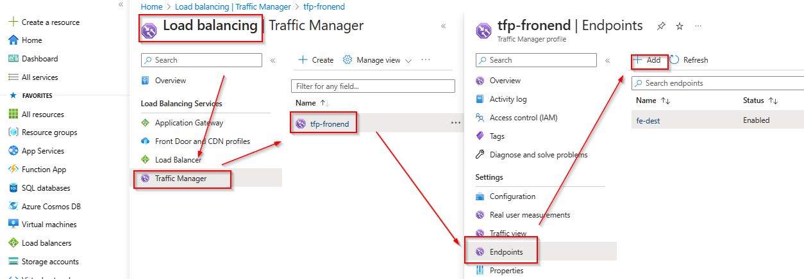
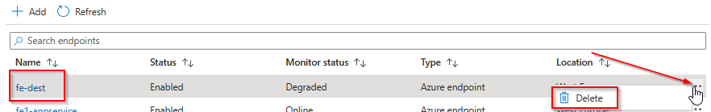

# Modernizing with Azure - Git-based deployment

In this solution apporach you will use the "Local Git" deployment model to transfer the content of the current Web app. While this solution is usig direct Git push to the App service, a more common way would be to push the code into a central Git repo (if not already used for deployment) and deploy it from there to App Service.

## Materials

- https://learn.microsoft.com/en-us/azure/app-service/deploy-local-git?tabs=cli

## Task 1 - Install Git

1. Connect to the migrated Windows server using Bastion
2. [Download the Git client](https://www.git-scm.com/downloads) and install, using the default settings for the installer.
3. Open a command prompt or PowerShell to test git to see if install available
4. Configure Credential Manager

   `git config --global credential.helper wincred`

## Task 2 - Create Azure App Service

The following commands are easiest sumbitted using _Cloud Shell_ in Azure Portal.

1. Create App Service Plan

   ```
   az appservice plan create \
   --name mh1-asp-test \
   --resource-group mh-rg1 \
   --sku P0v3
   ```

2. Create Web app, with "Local Git" deployment model

   ```
   az webapp create \
   --resource-group mh-rg1 \
   --name mh1-app \
   --plan mh1-asp \
   --deployment-local-git
   ```

3. Enable Basic Auth and set Deployment Password

   ```
   az webapp deployment user set \
   --user-name mh1-deploy \
   --password "mh1-Deploy"
   ```

4. Fetch Git URL
   ```
   az webapp deployment source config-local-git \
   --resource-group mh-rg1 \
   --name mh1-app \
   --query url \
   --output tsv
   ```

## Task 3 - Initialize Git repo for the current app

Back on the Windows server you need to convert the code base to a Git repo and connect it to the App Service.

1. Change to the home folder of the Web app

   ```
   cd C:\inetpub\wwwrootebroot
   ```

2. Initialize Repo

   ```
    git init
   ```

3. Legitimize webroot directory

   ```
    git config --global --add safe.directory C:/inetpub/wwwroot
   ```

4. Connect to Azure App Service

   ```
    git remote add azure https://mh1-app.scm.azurewebsites.net:443/mh1-app.git
   ```

5. personalize git repo

   ```
   git config --global user.email "you@example.com"
   git config --global user.name "Your Name"
   ```

6. Commit initial files

   ```
    git commit -m "initial commit"
   ```

7. Push content

   ```
    git push azure master
   ```

> [!NOTE] You will be challenged for the deployment credentials.

## **Task 3 : Disable Basic Auth for SCM**

Since _BasicAuth_ does have security implications it is a good idea to disable it, once no longer needed for deployments.

    az resource update \
    --resource-group mh-rg1 \
    --name scm \
    --namespace Microsoft.Web \
    --resource-type basicPublishingCredentialsPolicies \
    --parent sites/mh1-app \
    --set properties.allow=false

> [!NOTE] To re-enable, simply change the parameter accordingly. Once you have re-enabled it, you will need to create a new set of credentials using the command from Task 1, Step 3.
>
> ```
> -set properties.allow=true
> ```

### **Task 2: Update Traffic Manager profile**

The Traffic Manager profile is still pointing to the previousley migrated Virtual Machines. You can now update the endpoints within the profile to point to the App Services instead of the VMs.

From the Azure Portal open the Load Balancing blade, select Traffic Manager on the navigation pane and select the previously created _tfp-frontend_ Traffic Manager profile. Select _Endpoints_ and click _Add_.



Select _Azure endpoint_, provide a name, select _App Service_ and select the previousley created App Service.


Next delete the endpoints for the Virtual Machines.



You can now browse to the Traffic Manager profile. Again, from a user perspective nothing changed but you are now browsing the web site content that is hosted on Azure App Service instead of Virtual Machines.

You successfully completed challenge 7! 🚀🚀🚀

🚀 **Congratulations!**

You successfully completed the MicroHack. You can now safeley remove the _source-rg_ and _destination-rg_ Resource Groups.\*\* 🚀🚀🚀

**[Home](../../Readme.md)**
