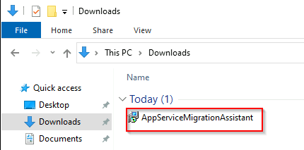
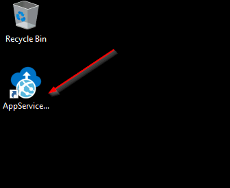
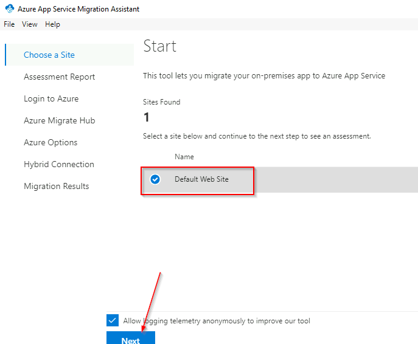
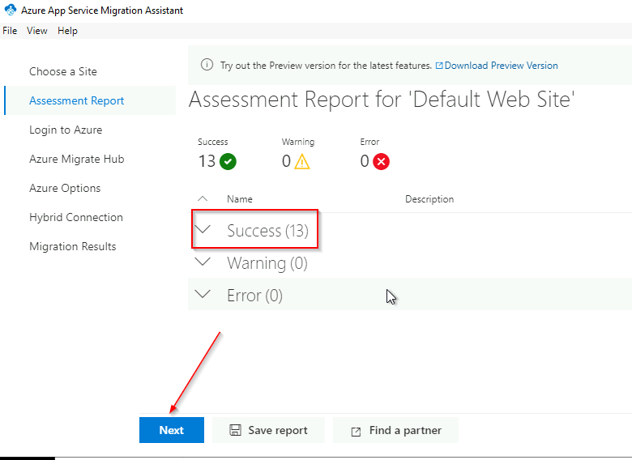
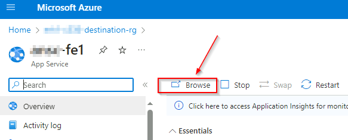
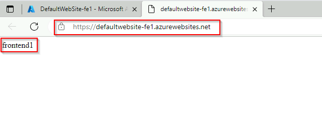
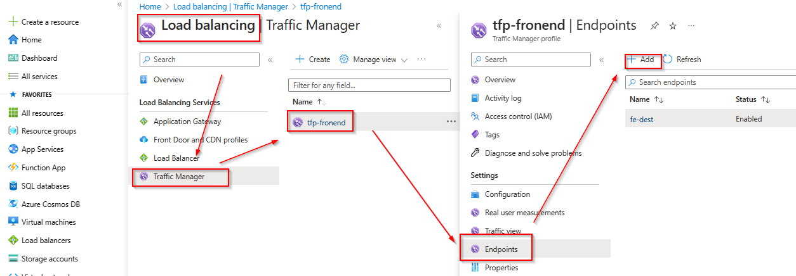

# Modernizing with Azure - Azure App Service Migration Assistant

Azure App Service Migration Assistant is a tool to help you to quickly and easily do a one-time migration of your web application to an Azure App Service. The following steps will guide you through the process.

> [!NOTE]
> The server names below are for illustration purposes only. The steps should be performed on the windows server you migrated in Challenge 5.

### **Task 1 : Set up Azure App Service Migration Assistant**

Login to the Virtual Machine _frontend1_ in the _destination-rg_ Resource Group via Azure Bastion, open the [Azure Portal](https://portal.azure.com) from the _frontend1_ VM and navigate to the previousley created Azure Migrate project. Select _Servers, databases and web apps_, **make sure that the right Azure Migrate Project is selected** and click on _Replicate_ within the _Migration tools_ box.

On the next page select _ASP.NET web apps_, _Azure App Service code_, _Pyhsical or others (AWS, GCP, Xen, etc)_ and click on the link below to be redirected to the [App Service migration assistant tool](https://learn.microsoft.com/en-us/azure/app-service/app-service-asp-net-migration).

Navigate to _App Service migration tools and resources_ and click on the link to download the [App Service Migration Assistant](https://appmigration.microsoft.com/api/download/windows/AppServiceMigrationAssistant.msi) (1) and after the file was downloaded click on the link to be redirectioed to the [documentation](https://github.com/Azure/App-Service-Migration-Assistant/wiki/PowerShell-Scripts) (2) for the App Service Migration Assistant.

Change to your download location e.g. \<userprofile\>\\Downloads and double-click the AppServiceMigrationAssistant.msi file.

The installation should finish without any input requirements. After the installation you will find a shortcut on the Desktop to start the App Service Migration Assistant. Double-click on the shortcut to start the App Service Migration Assistant.

Under _Choose a Site_ select _Default Web Site_ and click next.

Wait until the assessment report is finished and click next under _Assessment Report_

Under _Login to Azure_, click on _Copy Code & Open Browser_ and login to Azure using your credentials.

Select _Continue_ when prompted to allow to sign in to the _Azure App Service Migration Assistant_ application. You can then close the browser.

Select the correct Azure Migrate project and click next.

Under _Azure Options_, select the correct Azure Subscription and Resource Group. Next specify a unique name for your web app. Select to create a new App Service Plan and choose the region of your choise. Click _Migrate_ to start the migration.

The migration should complete successfully. You can now click on _Go to your website_ to open the migrated web app now running on Azure App Services.

Change back to the Azure Portal and open the Resource Group _destination-rg_. You should now see a App Service and a App Service Plan resource. Click on the App Service and select _Browse_ to open your web app again.

You should now see the web site content that was previously running on Windows Server IIS.

### **Task 2: Update Traffic Manager profile**

The Traffic Manager profile is still pointing to the previousley migrated Virtual Machines. You can now update the endpoints within the profile to point to the App Services instead of the VMs.

From the Azure Portal open the Load Balancing blade, select Traffic Manager on the navigation pane and select the previously created _tfp-frontend_ Traffic Manager profile. Select _Endpoints_ and click _Add_.

Select _Azure endpoint_, provide a name, select _App Service_ and select the previousley created App Service.

Next delete the endpoints for the Virtual Machines.

You can now browse to the Traffic Manager profile. Again, from a user perspective nothing changed but you are now browsing the web site content that is hosted on Azure App Service instead of Virtual Machines.

You successfully completed challenge 7! 🚀🚀🚀

The deployed architecture now looks like the following diagram.

🚀🚀🚀 **!!!Congratulations!!! - You successfully completed the MicroHack. You can now safeley remove the _source-rg_ and _destination-rg_ Resource Groups.** 🚀🚀🚀

**[Home](../../Readme.md)** -
