# Walkthrough Challenge 7 - Modernize with Azure

Duration: 40 minutes

## Prerequisites

Please make sure thet you successfully completed [Challenge 5](../challenge-5/solution.md) before continuing with this challenge.

### **Task 1: Create an App Service Assessment**

The Azure Migrate tool offers additional capabilities that make it easier for you to move applications from on-premises environments to Azure App Service and Azure Kubernetes Service.

Azure App Service bulk migration capabilities are now available as an Azure Migrate feature:

* Discover and assess ASP.NET web apps in addition to categorizing which apps are ready for migration.
* Suggest a destination for migration and provide a guided content and configuration experience for ASP.NET web apps to Azure App Service.
* Discover and migrate with Java Tomcat applications to App Service Linux and to Azure Kubernetes Service.
* Containerize your ASP.NET web apps and move them to either Windows Containers on App Service or to Azure Kubernetes Service.

> [!WARNING]
> **Currently this feature has a few [limitations](https://learn.microsoft.com/en-us/azure/migrate/concepts-migration-webapps#limitations) and therefore it can't be used to migrate web apps directly from physical servers. However, we can use it at least to perform the assessment of our web apps and use the [App Service migration assistant tool](https://learn.microsoft.com/en-us/azure/app-service/app-service-asp-net-migration) for the migration. Please note that this will only work for the migrated Windows VM**

> [!WARNING]
> **Please note that this challenge will only work for the migrated Windows VM. Currently we do not support direct migrations from Linux VMs**

Open the [Azure Portal](https://portal.azure.com) and navigate to the previousley created Azure Migrate project. Select *Servers, databases and web apps*, **make sure that the right Azure Migrate Project is selected** and click on *Assess* and select *Web Apps on Azure* from the drop down list.

Under *Basics* select *Web Apps on Azure* and *Web apps to App Service* and provide your desired assessment settings.

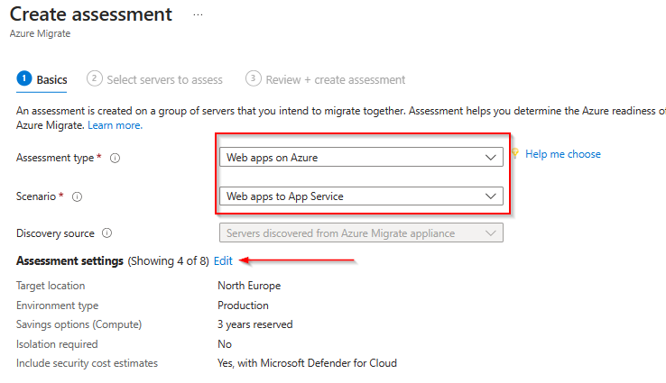

Under *Select servers to assess*, provide a Assessment name and select the previously created Group.

Proceed to the last section *Review + create assessment* and click *Create assessment*

From the *Azure Migrate:Discovery and assessment* page select the *Web apps on Azure* assessment.

On the next page click on the previously created assessment.

Review the output of the assessment to see if the web app currently running on Windows Server IIS is suitable and ready for Azure App Services.

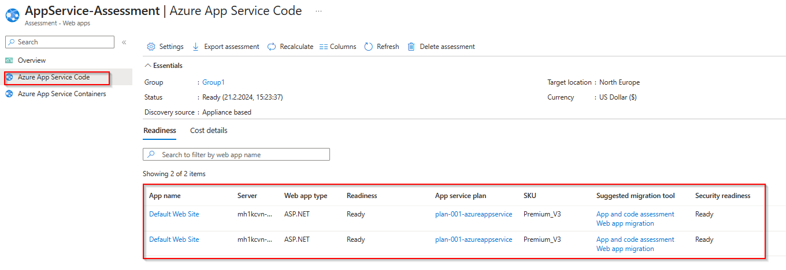

### **Task 2: Modernize web app to Azure App Service Code**

> [!WARNING]
> **As mentioned above, the current [limitations](https://learn.microsoft.com/en-us/azure/migrate/concepts-migration-webapps#limitations) will not allow the direct migration of web apps running on physical machines. Therefore, we will use the [App Service migration assistant tool](https://learn.microsoft.com/en-us/azure/app-service/app-service-asp-net-migration) for the migration.**

Login to the Virtual Machine *frontend1* in the *destination-rg* Resource Group via Azure Bastion, open the [Azure Portal](https://portal.azure.com) from the *frontend1* VM and navigate to the previousley created Azure Migrate project. Select *Servers, databases and web apps*, **make sure that the right Azure Migrate Project is selected** and click on *Replicate* within the *Migration tools* box.

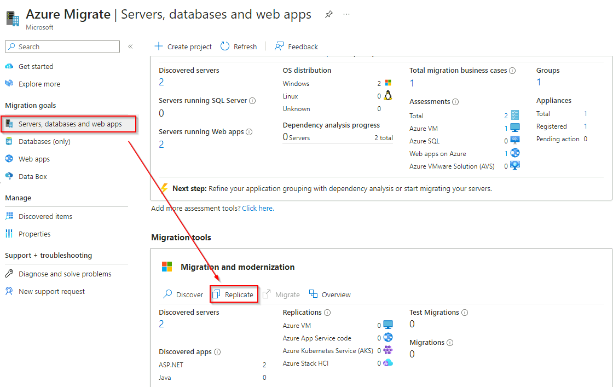

On the next page select *ASP.NET web apps*, *Azure App Service code*, *Pyhsical or others (AWS, GCP, Xen, etc)* and click on the link below to be redirected to the [App Service migration assistant tool](https://learn.microsoft.com/en-us/azure/app-service/app-service-asp-net-migration).

Navigate to *App Service migration tools and resources* and click on the link to download the [App Service Migration Assistant](https://appmigration.microsoft.com/api/download/windows/AppServiceMigrationAssistant.msi) (1) and after the file was downloaded click on the link to be redirectioed to the [documentation](https://github.com/Azure/App-Service-Migration-Assistant/wiki/PowerShell-Scripts) (2) for the App Service Migration Assistant.

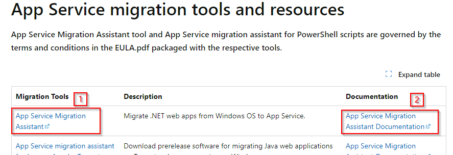

Change to your download location e.g. \<userprofile\>\\Downloads and double-click the AppServiceMigrationAssistant.msi file.

The installation should finish without any input requirements. After the installation you will find a shortcut on the Desktop to start the App Service Migration Assistant. Double-click on the shortcut to start the App Service Migration Assistant.

Under *Choose a Site* select *Default Web Site* and click next.

Wait until the assessment report is finished and click next under *Assessment Report*

Under *Login to Azure*, click on *Copy Code & Open Browser* and login to Azure using your credentials.

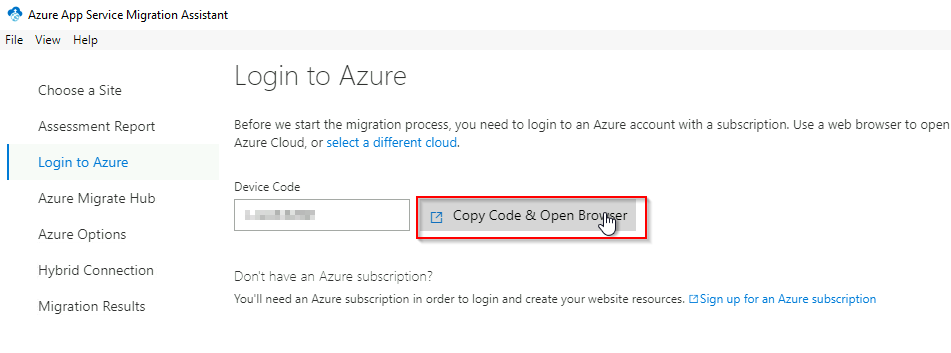

Select *Continue* when prompted to allow to sign in to the *Azure App Service Migration Assistant* application. You can then close the browser.

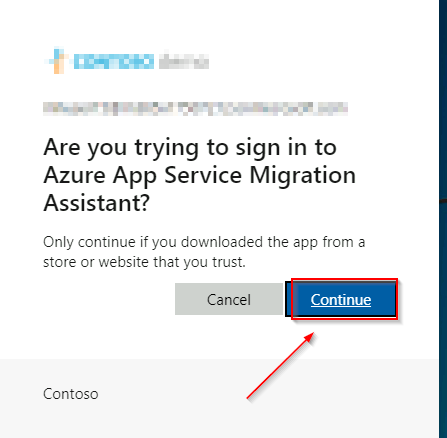

Select the correct Azure Migrate project and click next.

Under *Azure Options*, select the correct Azure Subscription and Resource Group. Next specify a unique name for your web app. Select to create a new App Service Plan and choose the region of your choise. Click *Migrate* to start the migration.

The migration should complete successfully. You can now click on *Go to your website* to open the migrated web app now running on Azure App Services.

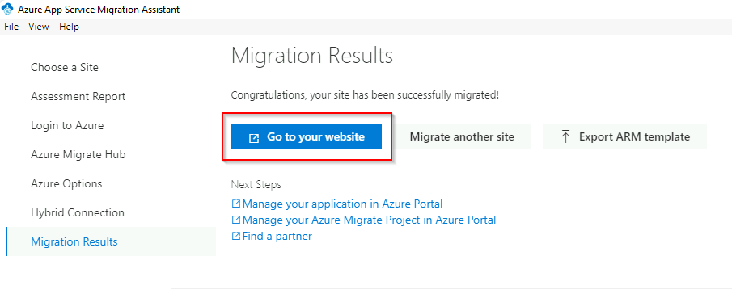

Change back to the Azure Portal and open the Resource Group *destination-rg*. You should now see a App Service and a App Service Plan resource. Click on the App Service and select *Browse* to open your web app again.

You should now see the web site content that was previously running on Windows Server IIS.

**Repeat the above steps for the frontend2 VM**

### **Task 3: Update Traffic Manager profile**

The Traffic Manager profile is still pointing to the previousley migrated Virtual Machines. You can now update the endpoints within the profile to point to the App Services instead of the VMs.

From the Azure Portal open the Load Balancing blade, select Traffic Manager on the navigation pane and select the previously created *tfp-frontend* Traffic Manager profile. Select *Endpoints* and click *Add*.

Select *Azure endpoint*, provide a name, select *App Service* and select the previousley created App Service.

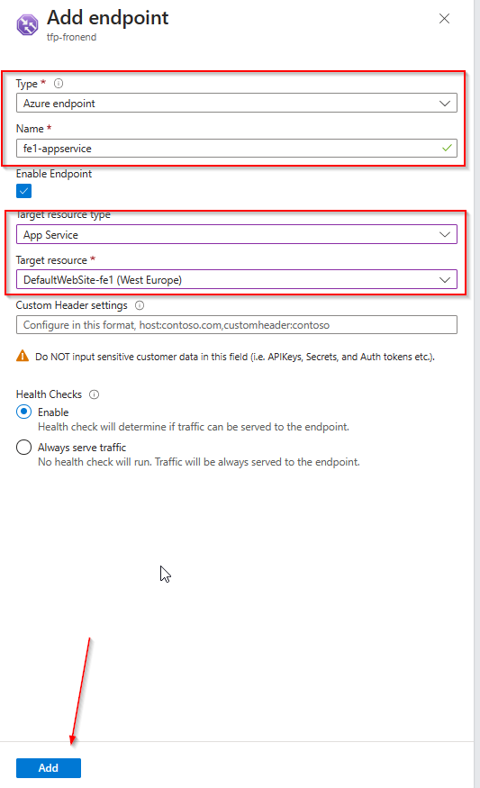

Next delete the endpoints for the Virtual Machines.

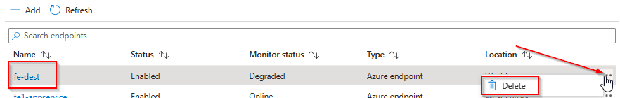

You can now browse to the Traffic Manager profile. Again, from a user perspective nothing changed but you are now browsing the web site content that is hosted on Azure App Service instead of Virtual Machines.

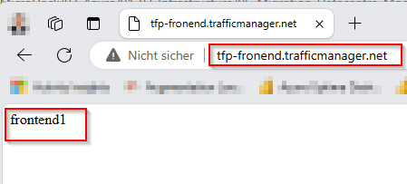

You successfully completed challenge 6! 🚀🚀🚀

The deployed architecture now looks like the following diagram.

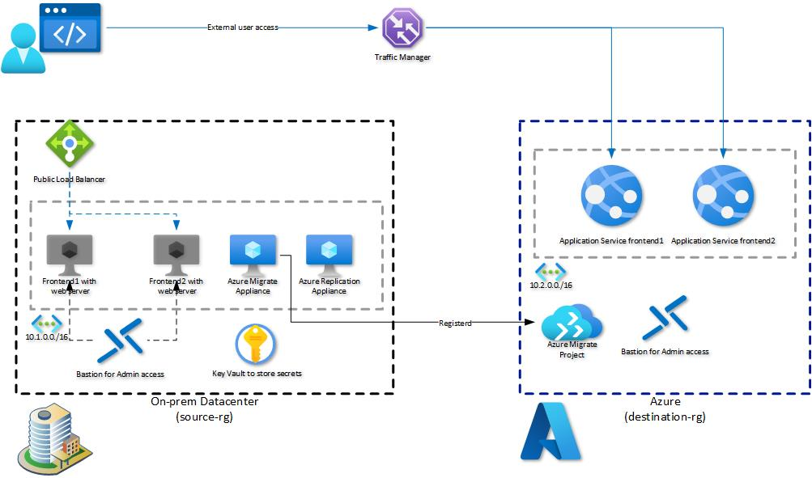

🚀🚀🚀 **!!!Congratulations!!! - You successfully completed the MicroHack. You can now safley remove the *source-rg* and *destination-rg* Resource Groups.** 🚀🚀🚀

 **[Home](../../Readme.md)** -