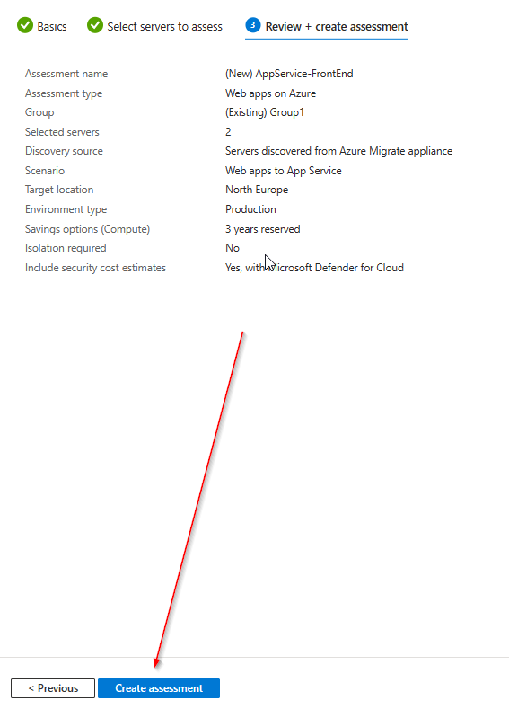

# Walkthrough Challenge 7 - Modernize with Azure

Duration: 40 minutes

## Prerequisites

Please make sure thet you successfully completed [Challenge 5](../challenge-5/solution.md) before continuing with this challenge.

### **Task 1: Create an App Service Assessment**

The Azure Migrate tool offers additional capabilities that make it easier for you to move applications from on-premises environments to Azure App Service and Azure Kubernetes Service.

Azure App Service bulk migration capabilities are now available as an Azure Migrate feature:

- Discover and assess ASP.NET web apps in addition to categorizing which apps are ready for migration.
- Suggest a destination for migration and provide a guided content and configuration experience for ASP.NET web apps to Azure App Service.
- Discover and migrate with Java Tomcat applications to App Service Linux and to Azure Kubernetes Service.
- Containerize your ASP.NET web apps and move them to either Windows Containers on App Service or to Azure Kubernetes Service.

> [!WARNING]
>
> **Currently this feature has a few [limitations](https://learn.microsoft.com/en-us/azure/migrate/concepts-migration-webapps#limitations) and therefore it can't be used to migrate web apps directly from physical servers. However, we can use it at least to perform the assessment of our web apps and use the [App Service migration assistant tool](https://learn.microsoft.com/en-us/azure/app-service/app-service-asp-net-migration) for the migration. Please note that this will only work for the migrated Windows VM**

> [!WARNING]
>
> **Please note that this challenge will only work for the migrated Windows VM. Currently we do not support direct migrations from Linux VMs**

Open the [Azure Portal](https://portal.azure.com) and navigate to the previousley created Azure Migrate project. Select _Servers, databases and web apps_, **make sure that the right Azure Migrate Project is selected** and click on _Assess_ and select _Web Apps on Azure_ from the drop down list.

Under _Basics_ select _Web Apps on Azure_ and _Web apps to App Service_ and provide your desired assessment settings.

Under _Select servers to assess_, provide a Assessment name and select the previously created Group.

Proceed to the last section _Review + create assessment_ and click _Create assessment_

From the _Azure Migrate:Discovery and assessment_ page select the _Web apps on Azure_ assessment.

On the next page click on the previously created assessment.

Review the output of the assessment to see if the web app currently running on Windows Server IIS is suitable and ready for Azure App Services.

### **Task 2: Modernize web app to Azure App Service Code**

> [!WARNING]
>
> **As mentioned above, the current [limitations](https://learn.microsoft.com/en-us/azure/migrate/concepts-migration-webapps#limitations) will not allow the direct migration of web apps running on physical machines. Therefore, we will use the [App Service migration assistant tool](https://learn.microsoft.com/en-us/azure/app-service/app-service-asp-net-migration) for the migration.**

There are multiple different ways to migrate legacy Web apps to Azure:

- **Code-Migration** : via [Git-based](gitDeploy.md) to Azure App Service or by using the [Azure App Service Migration Assistant](./migrationAssistantDeploy.md)
- **Containerization** : Azure Container Apps, Azure Kubernetes Service, Azure App Service for Containers, Azure Container Instance
