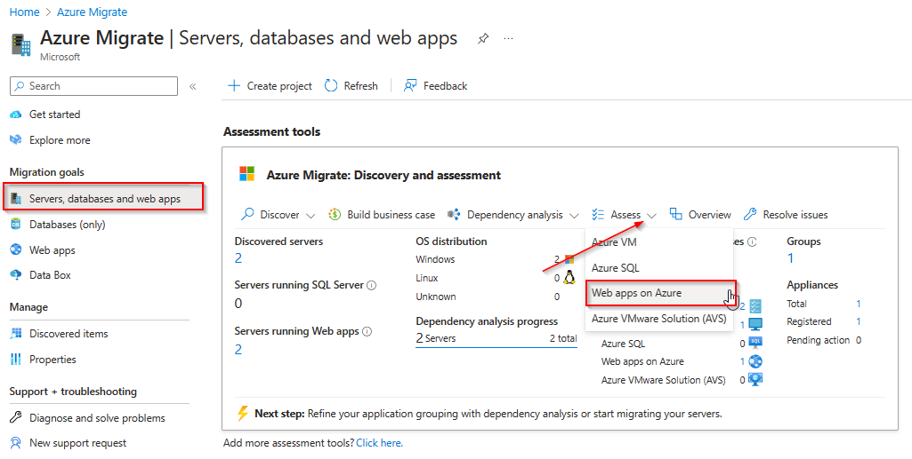
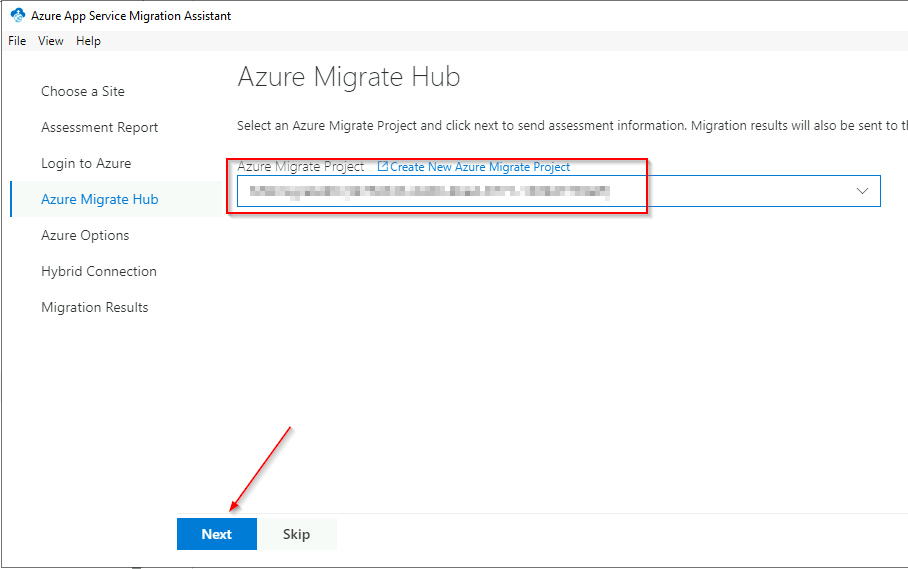
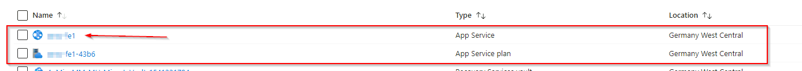

# Walkthrough Challenge 7 - Modernize with Azure

Duration: 40 minutes

## Prerequisites

Please make sure thet you successfully completed [Challenge 5](../challenge-5/solution.md) before continuing with this challenge.

### **Task 1: Create an App Service Assessment**

The Azure Migrate tool offers additional capabilities that make it easier for you to move applications from on-premises environments to Azure App Service and Azure Kubernetes Service.

Azure App Service bulk migration capabilities are now available as an Azure Migrate feature:

* Discover and assess ASP.NET web apps in addition to categorizing which apps are ready for migration.
* Suggest a destination for migration and provide a guided content and configuration experience for ASP.NET web apps to Azure App Service.
* Discover and migrate with Java Tomcat applications to App Service Linux and to Azure Kubernetes Service.
* Containerize your ASP.NET web apps and move them to either Windows Containers on App Service or to Azure Kubernetes Service.

> [!WARNING]
> **Currently this feature has a few [limitations](https://learn.microsoft.com/en-us/azure/migrate/concepts-migration-webapps#limitations) and therefore it can't be used to migrate web apps directly from physical servers. However, we can use it at least to perform the assessment of our web apps and use the [App Service migration assistant tool](https://learn.microsoft.com/en-us/azure/app-service/app-service-asp-net-migration) for the migration. Please note that this will only work for the migrated Windows VM**

> [!WARNING]
> **Please note that this challenge will only work for the migrated Windows VM. Currently we do not support direct migrations from Linux VMs**

Open the [Azure Portal](https://portal.azure.com) and navigate to the previousley created Azure Migrate project. Select *Assessments* and click on *Create assessment*.

Click *Add workload* and select the Default Web Site of the Windows Server 2022 VMs.

Adjust the *General* settings as required.

Under *Advanced* review te options to adjust the assessment.

Proceed to *Review + Create assessment* and start the assessment creation.

Wait until the Assessment ready and click on it to open it.

Review the output of the assessment to see if the web app currently running on Windows Server IIS is suitable and ready for Azure App Services.

### **Task 2: Modernize web app to Azure App Service Code**

> [!WARNING]
> **As mentioned above, the current [limitations](https://learn.microsoft.com/en-us/azure/migrate/concepts-migration-webapps#limitations) will not allow the direct migration of web apps running on physical machines. Therefore, we will use the [App Service migration assistant tool](https://learn.microsoft.com/en-us/azure/app-service/app-service-asp-net-migration) for the migration.**

Login to the Windows Virtual Machine hosting the IIS Web Site in the *destination-rg* Resource Group via Azure Bastion.

Open the Edge Browser and download the [App Service migration assistant tool](https://appmigration.microsoft.com/api/download/windowspreview/AppServiceMigrationAssistant.msi).

Change to your download location e.g. \<userprofile\>\\Downloads and double-click the AppServiceMigrationAssistant.msi file.

The installation should finish without any input requirements. After the installation you will find a shortcut on the Desktop to start the App Service Migration Assistant. Double-click on the shortcut to start the App Service Migration Assistant.

Under *Choose a Site* select *Default Web Site* and click next.

Wait until the assessment report is finished and click next under *Assessment Report*

Under *Login to Azure*, click on *Copy Code & Open Browser* and login to Azure using your credentials.

Select *Continue* when prompted to allow to sign in to the *Azure App Service Migration Assistant* application. You can then close the browser.

Select the correct Azure Migrate project and click next.

Under *Azure Options*, select the correct Azure Subscription and Resource Group. Next specify a unique name for your web app. Select to create a new App Service Plan and choose the region of your choise. Click *Migrate* to start the migration.

The migration should complete successfully. You can now click on *Go to your website* to open the migrated web app now running on Azure App Services.

Change back to the Azure Portal and open the Resource Group *destination-rg*. You should now see a App Service and a App Service Plan resource. Click on the App Service and select *Browse* to open your web app again.

You should now see the web site content that was previously running on Windows Server IIS.

You successfully completed challenge 6! 🚀🚀🚀

The deployed architecture now looks like the following diagram.

🚀🚀🚀 **!!!Congratulations!!! - You successfully completed the MicroHack. You can now safley remove the *source-rg* and *destination-rg* Resource Groups.** 🚀🚀🚀

 **[Home](../../Readme.md)** -