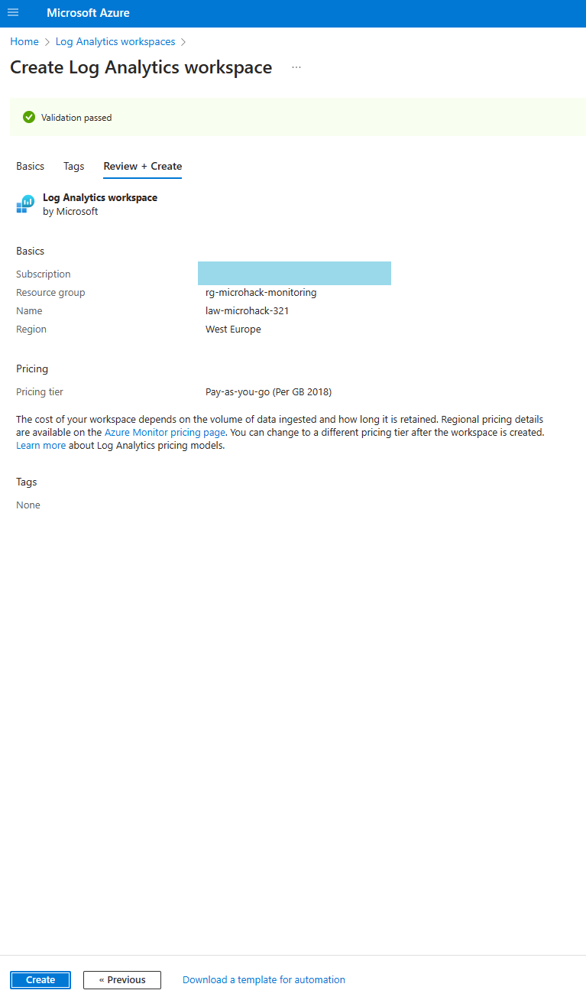
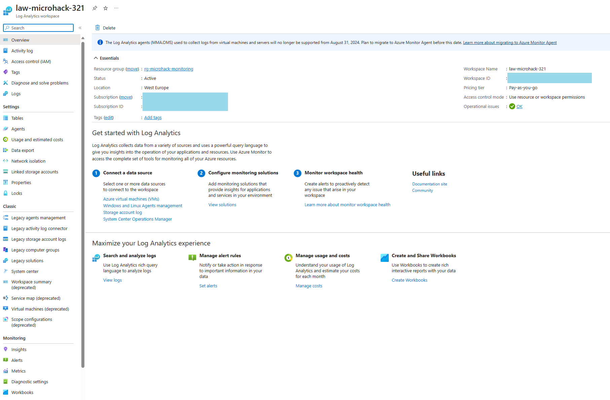
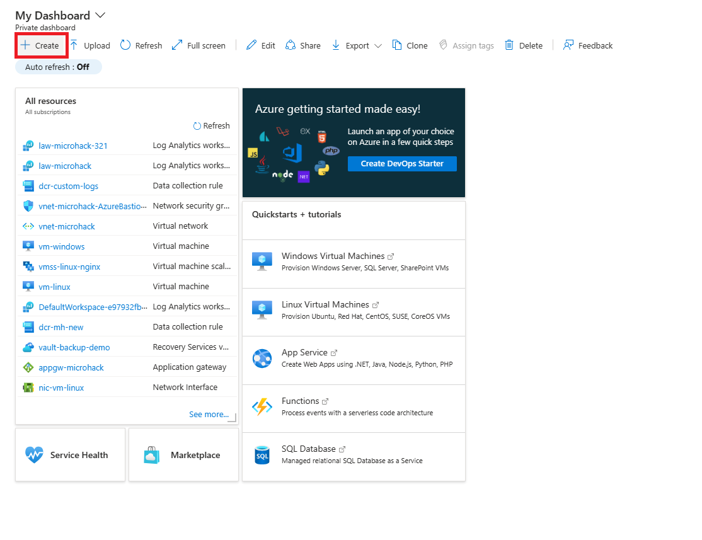
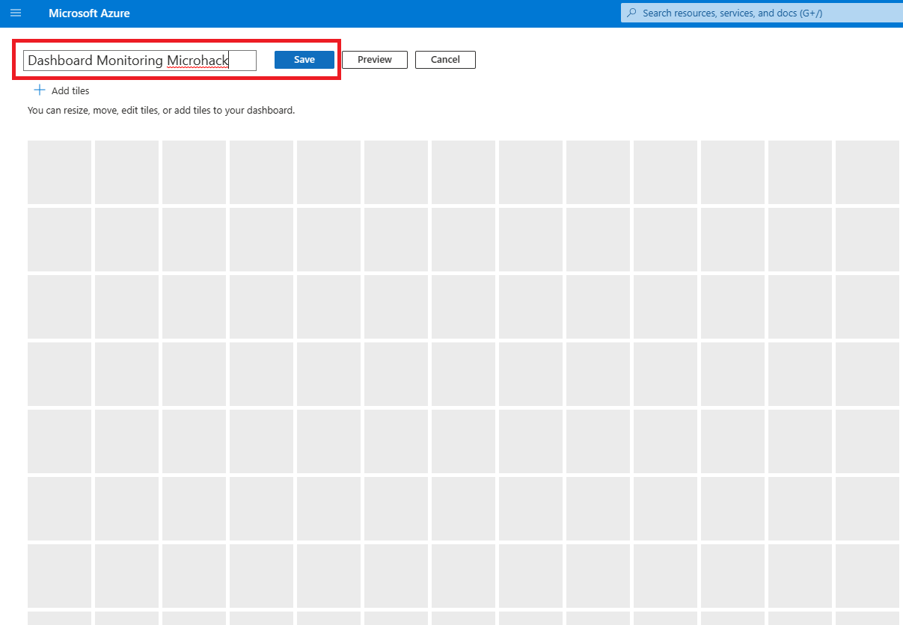
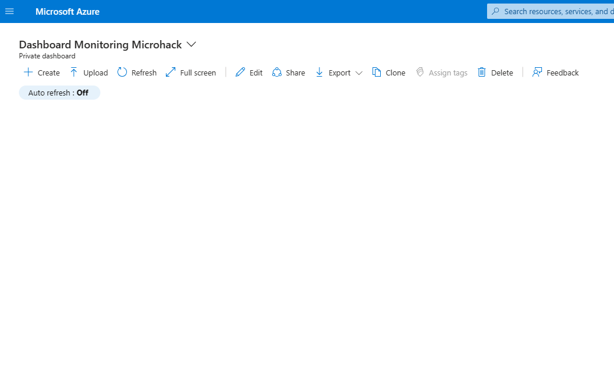
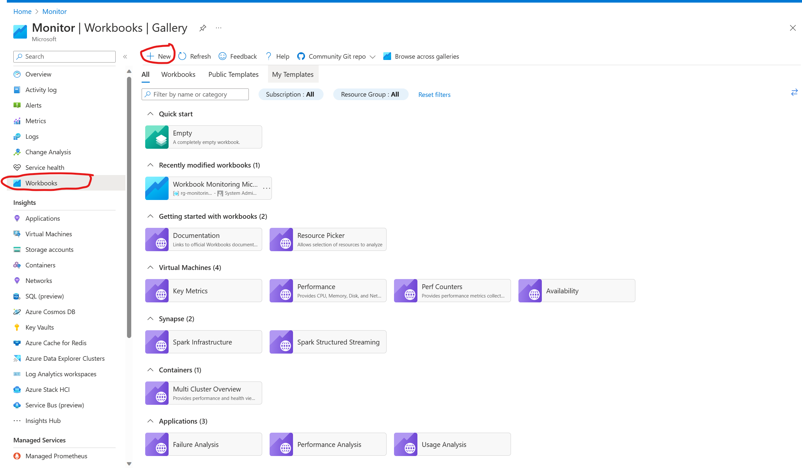

# Walkthrough Challenge 0

*Duration: 20 Minutes*

- [Walkthrough Challenge 0](#walkthrough-challenge-0)
  - [Task 1: Explore and ensure successful deployment](#task-1-explore-and-ensure-successful-deployment)
  - [Task 2: Create Log Analytics workspace](#task-2-create-log-analytics-workspace)
  - [Task 3: Create an empty Azure Dashboard](#task-3-create-an-empty-azure-dashboard)
  - [Task 4: Create an emptpy Monitoring Workbook](#task-4-create-an-emptpy-monitoring-workbook)
  - [Links](#links)

## Task 1: Explore and ensure successful deployment

Go to the Azure Portal and navigate to the resource group `rg-microhack-monitoring`. Look at the resources that have been deployed and think about possbile monitoring scenarios:

Q: What kind of resources have been deployed (IaaS, PaaS)?

A: IaaS: VMs, VMSS PaaS: Application Gateway, Bastion Host 

Q: How would you monitor the resources?

A: Log Analytics, Azure Monitor, Azure Diagnostics, Azure Metrics

Q: What kind of logs and metrics have you in mind to monitor?

A: Application logs, OS logs, Azure Diagnostics, Azure Metrics

Q: How do I get informed about downtime and failures?

A: Azure Monitor, Azure Alerts

## Task 2: Create Log Analytics workspace

- *Create a Log Analytics workspace `law-microhack` in the same resource group as the other resources. **Use the same Azure region as the other resources.***

    

- Ensure the workspace is created successfully.

    

## Task 3: Create an empty Azure Dashboard

- *Create an empty Azure Dashboard `Dashboard Monitoring Microhack`*
- See documentation [Create a dashboard in the Azure portal](https://learn.microsoft.com/en-us/azure/azure-portal/azure-portal-dashboards)

- Walkthrough steps
  
    

    

    

    

    

- [***Optional***] Publish it and share it with other users in your organization

    

## Task 4: Create an emptpy Monitoring Workbook

## Links

For detailed information check the [documenation page](https://learn.microsoft.com/en-us/azure/azure-monitor/logs/quick-create-workspace?tabs=azure-portal)