# Walkthrough Challenge  1

*Duration: 45 Minutes*

- [Walkthrough Challenge  1](#walkthrough-challenge--1)
  - [Task 1 \& 2](#task-1--2)
  - [*\[Optional\]* Task 3: Enable VM Insights for `vmss-linux-nginx` automatically](#optional-task-3-enable-vm-insights-for-vmss-linux-nginx-automatically)
  - [Task 4: Validate tables in Log Analytics Workspace](#task-4-validate-tables-in-log-analytics-workspace)
  - [Task 5: Availability rate check](#task-5-availability-rate-check)
  - [Links](#links)

## Task 1 & 2

- Create a data collection rule

    

- Add resources and associate resources to the data collection rule.

    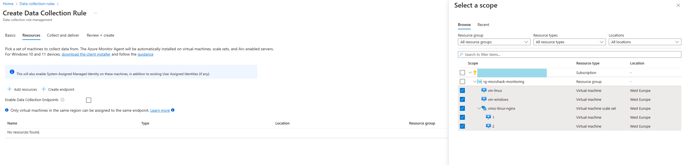

- On the Collect and deliver tab, select Add data source to add a data source and set a destination. Select a Data source type.

    *Linux*
    

    *Windows*
    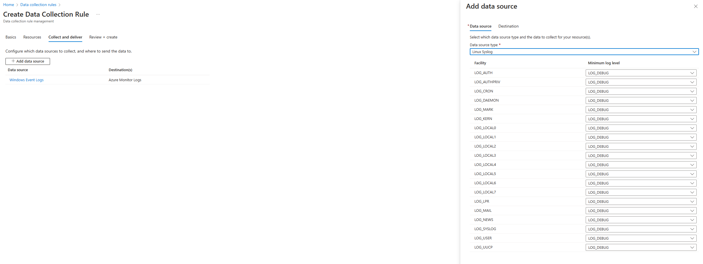

- On the Destination tab, add `law-microhack`.

    *You can select multiple destinations of the same or different types. For instance, you can select multiple Log Analytics workspaces, which is also known as multihoming. You can send Windows event and Syslog data sources to Azure Monitor Logs only.*

    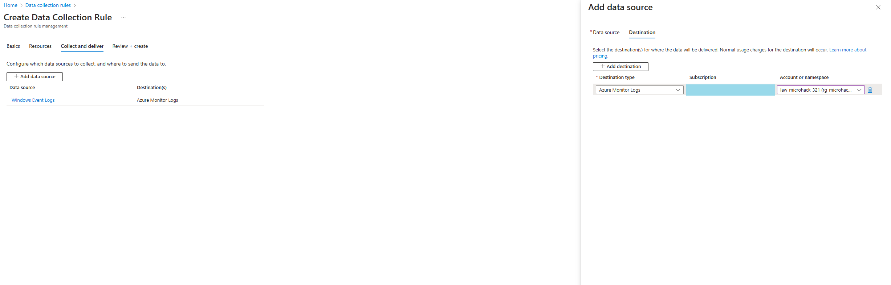

- Select **Review + create** to review the details of the data collection rule and association with the set of virtual machines. Select **Create** to create the data collection rule.

    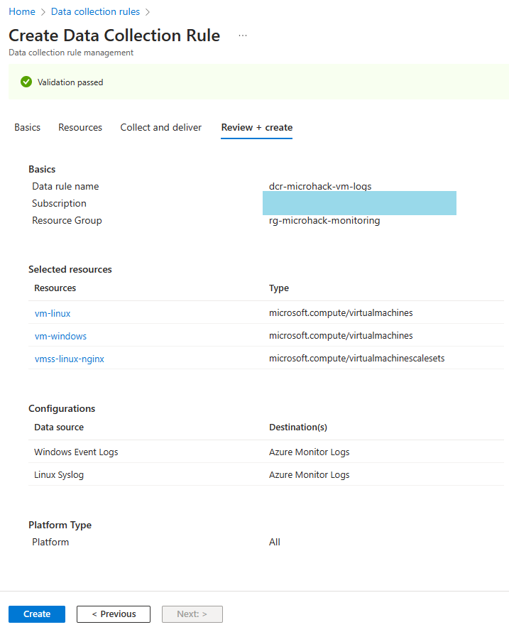

- Verify Data Collection Rule configuration

    *Data Sources*
    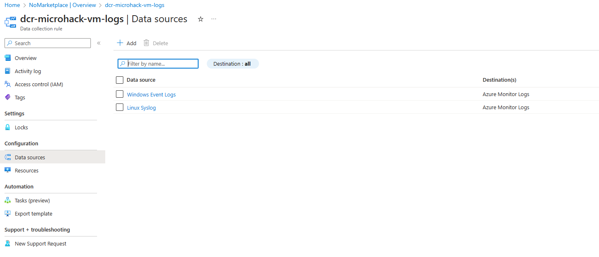

    *Resources*
    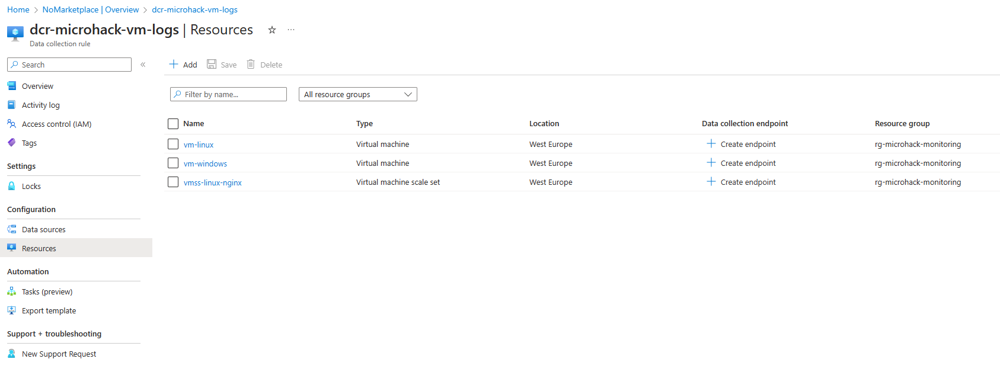

    *VM Extensions + applications*
    

## *[Optional]* Task 3: Enable VM Insights for `vmss-linux-nginx` automatically

> :warning: **RBAC and Permissions Requirement**: Based on the policy definition, it requires managed identity to have “Contributor” and “User Access Administrator” role on **subscription level** to execute the remediation task for Policy `Assign Built-In User-Assigned Managed Identity to Virtual Machine Scale Sets`.

- Enable Azure Monitor for VMSS with Azure Monitoring Agent(AMA) on new virtual machine scale set in your Azure environment.
- Assign the initiative to the resource group `rg-monitoring-microhack` to install the agents on the virtual machines in the defined scope automatically.
- Please be patient, it takes a while for the policies to synchronise all dependencies and show resources in the remmediation section.

> :warning:
> Check if you VMSS istances running on the latest model. If not, update the model to the latest version manually. Otherwise no logs will be pushed to the Log Analytics Workspace.

--------

- Assign the initiative to the resource group `rg-monitoring-microhack` to install the agents on the virtual machines in the defined scope automatically.

    

    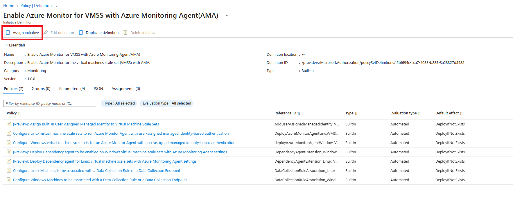

    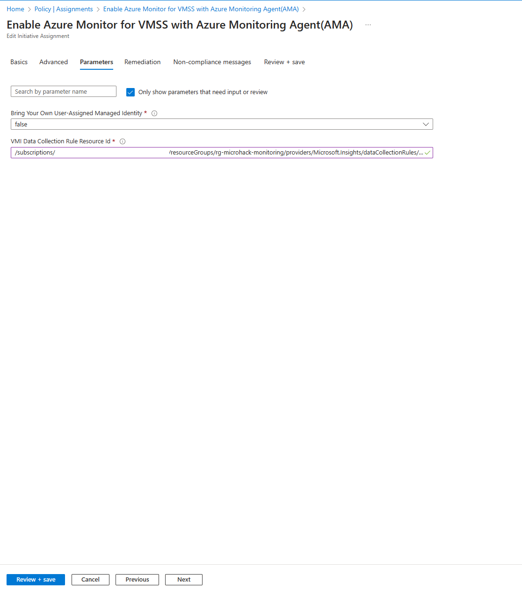

    

    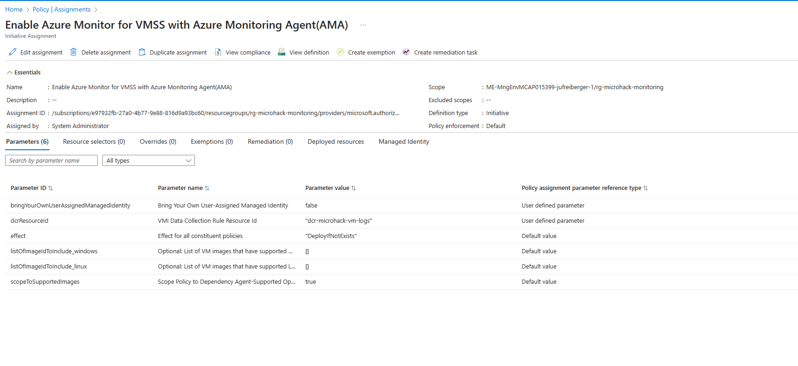

- Assign the managed identity of the initiative “Contributor” and “User Access Administrator” role on **subscription level**

    

- Create remmediation task for the following policies

    

    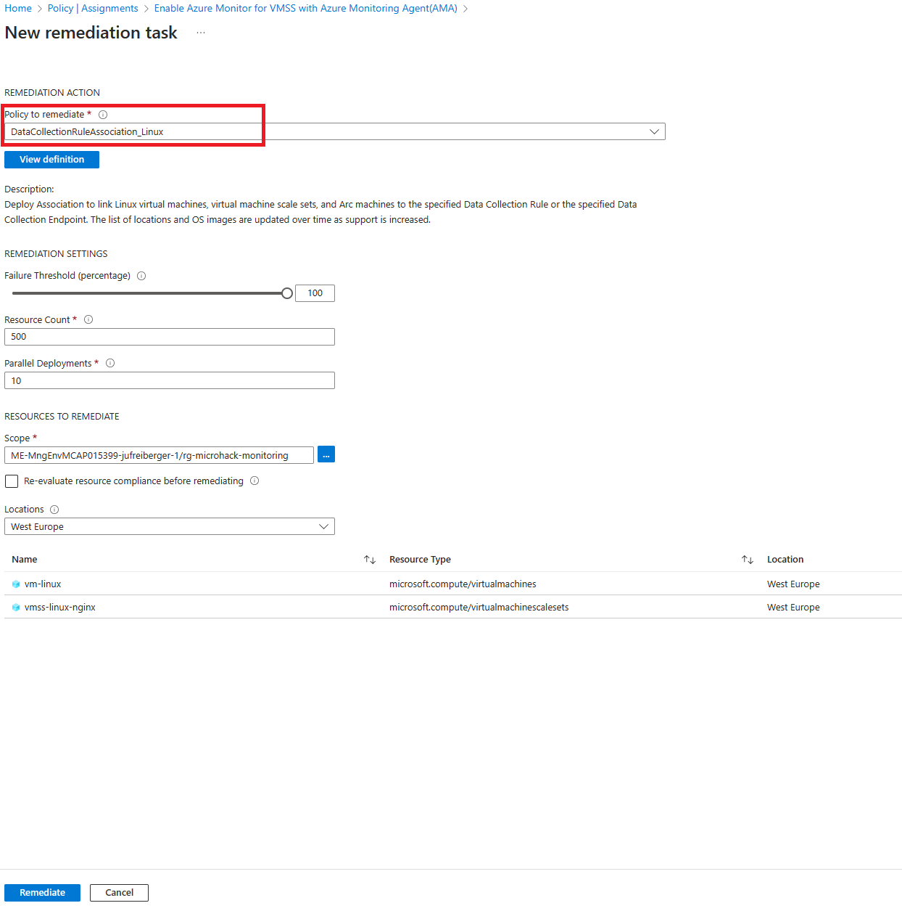

    

- Verify Data Collection Rule configuration and check tables if logs are showing up vor `vmss-linux-nginx`

## Task 4: Validate tables in Log Analytics Workspace

- Which table includes Windows Events?

    

- Which table includes Linux Logs?

    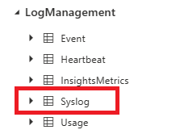

- Which table shows AMA reporting status?

    

## Task 5: Availability rate check

```powershell
Heartbeat
| summarize heartbeatPerHour = count() by bin_at(TimeGenerated, 1h, ago(24h)), Computer
| extend availablePerHour = iff(heartbeatPerHour > 0, true, false)
| summarize totalAvailableHours = countif(availablePerHour == true) by Computer
| extend availabilityRate = totalAvailableHours*100/24
| project-rename Availability_in_Percent=availabilityRate
```

## Links

For detailed information check the [documenation page](https://learn.microsoft.com/en-us/azure/azure-monitor/agents/data-collection-rule-azure-monitor-agent?tabs=portal)
