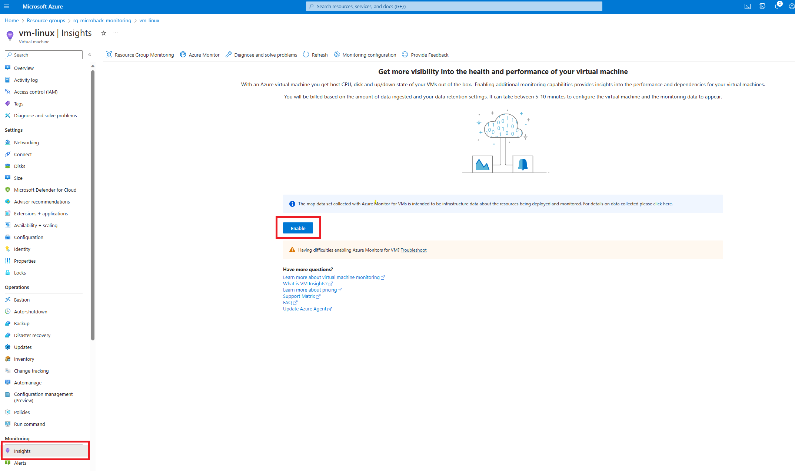
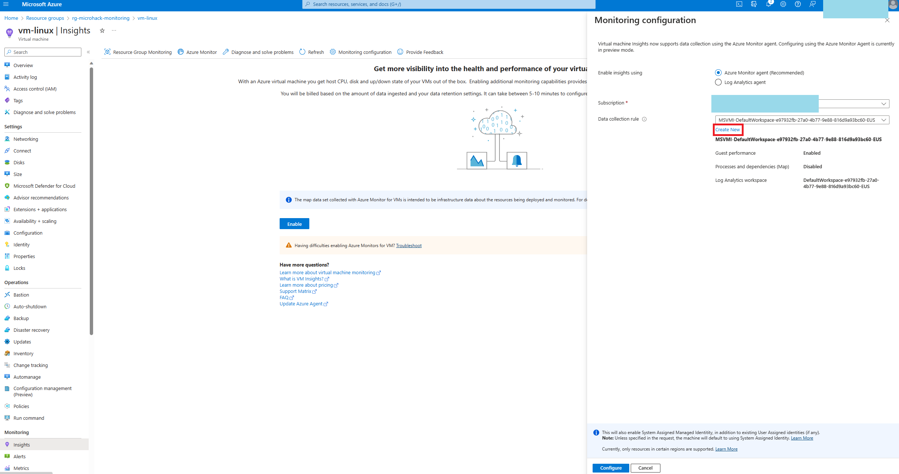
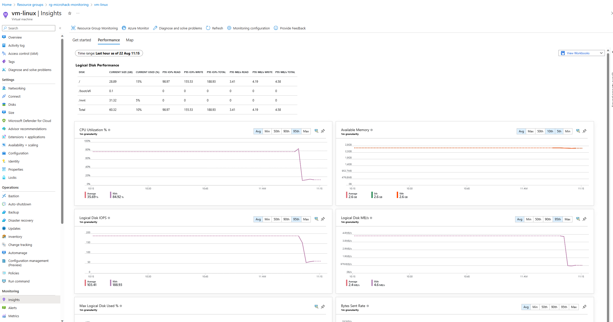
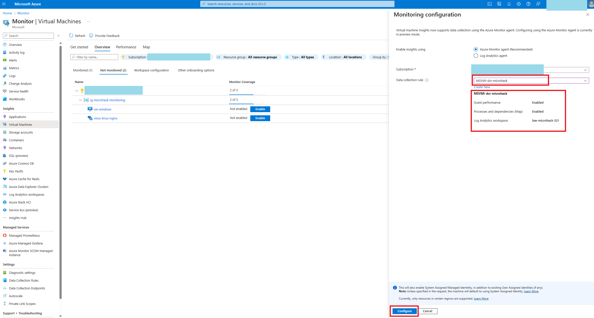
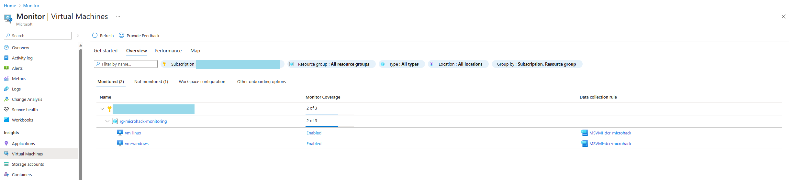
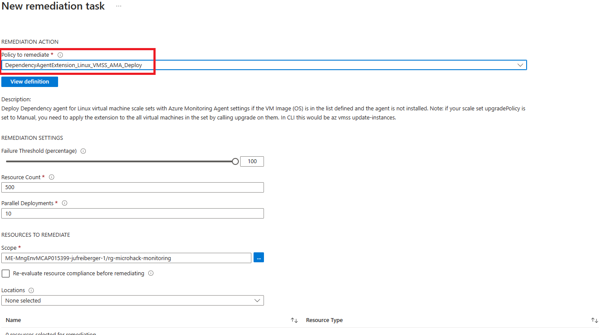

# Walkthrough Challenge 2

*Duration: 30 Minutes*

- [Walkthrough Challenge 2](#walkthrough-challenge-2)
  - [Task 1: Enable VM Insights for `vm-linux`](#task-1-enable-vm-insights-for-vm-linux)
  - [Task 2: Enable VM Insights on unmonitored `vm-windows`](#task-2-enable-vm-insights-on-unmonitored-vm-windows)
  - [*\[Optional\]* Task 3: Enable VM Insights for `vmss-linux-nginx` automatically](#optional-task-3-enable-vm-insights-for-vmss-linux-nginx-automatically)
  - [Task 4: Log search and visualize](#task-4-log-search-and-visualize)

## Task 1: Enable VM Insights for `vm-linux`

- Enable VM Insights on monitored machines

    

- Create a Data Collection Rule and configure to use the Log Analytics Workspace and enable processes and dependencies (Map)

    

    

- View Performance tab after successful deployment

    

## Task 2: Enable VM Insights on unmonitored `vm-windows`

- From Azure Monitor blade there is a way to enable VM Insights, too.
- From the Monitor menu in the Azure portal, select Virtual Machines > Overview > Not Monitored.
- See [Enable VM insights for Log Analytics agent](https://learn.microsoft.com/en-us/azure/azure-monitor/vm/vminsights-enable-portal#enable-vm-insights-for-log-analytics-agent)

    

    

    

    

## *[Optional]* Task 3: Enable VM Insights for `vmss-linux-nginx` automatically

- Run remmediation task to install the Dependency agent on new virtual machine scale set in your Azure environment.

    

## Task 4: Log search and visualize

- Check for the correct log query

    

- Create a chart with CPU usage trends by computer. Calculate CPU usage patterns over the last hour, chart by percentiles. Add the chart to your dashboard.

    
