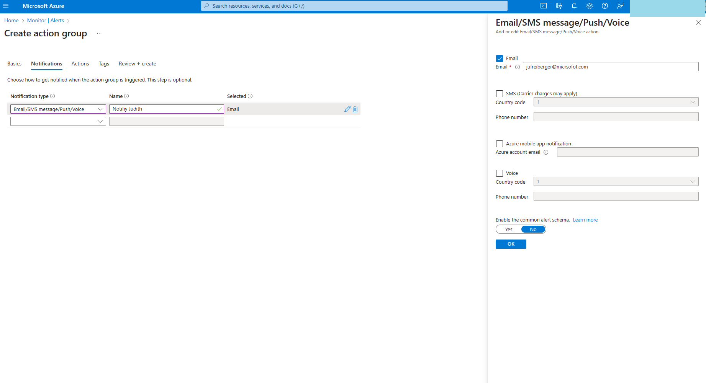
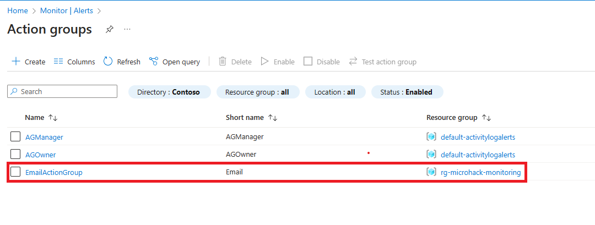
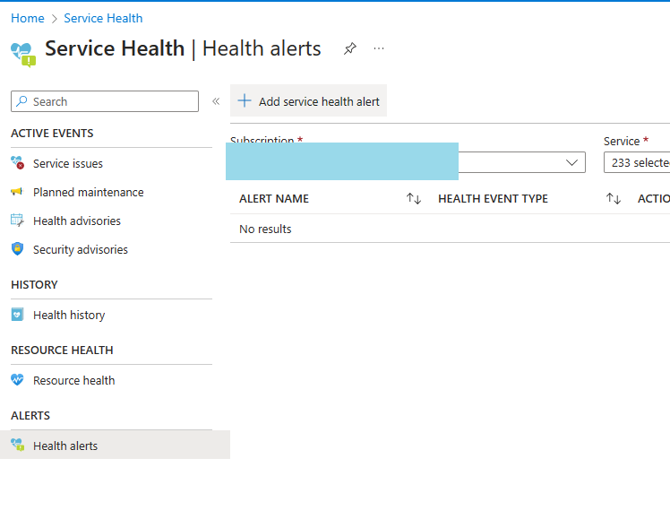
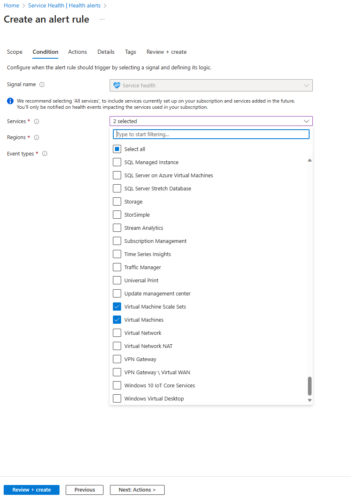
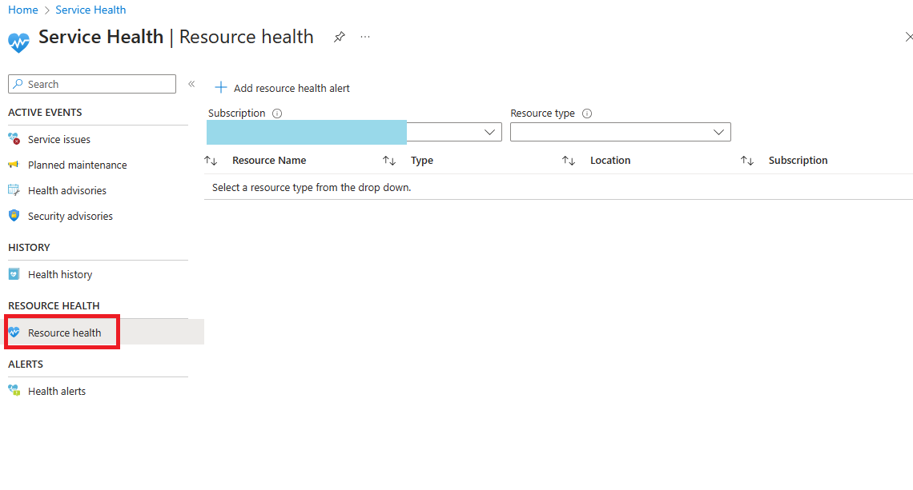
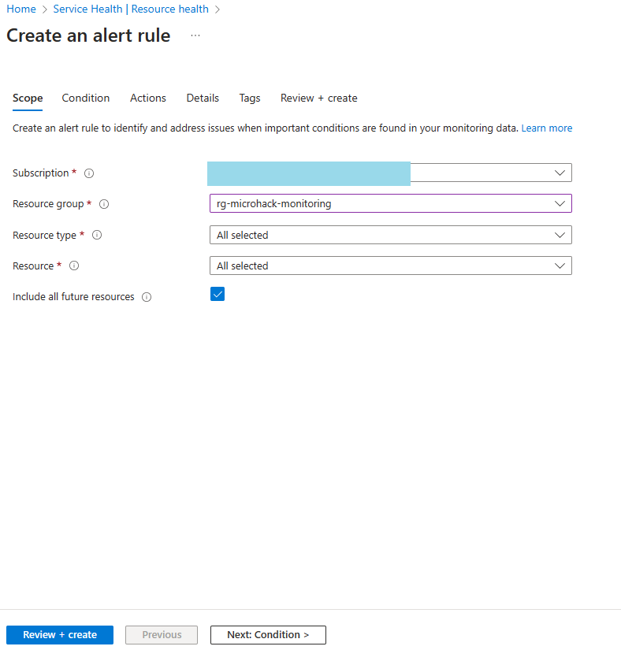
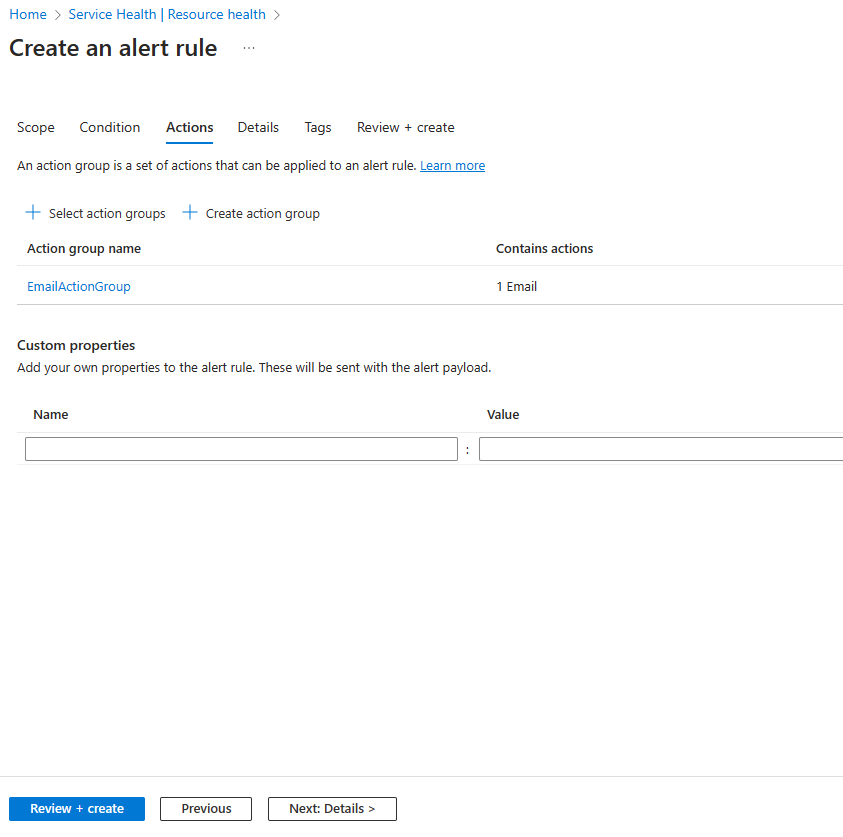
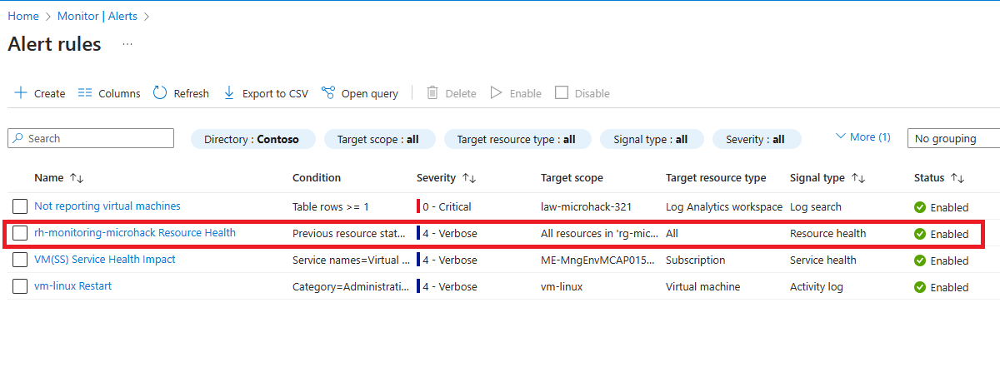
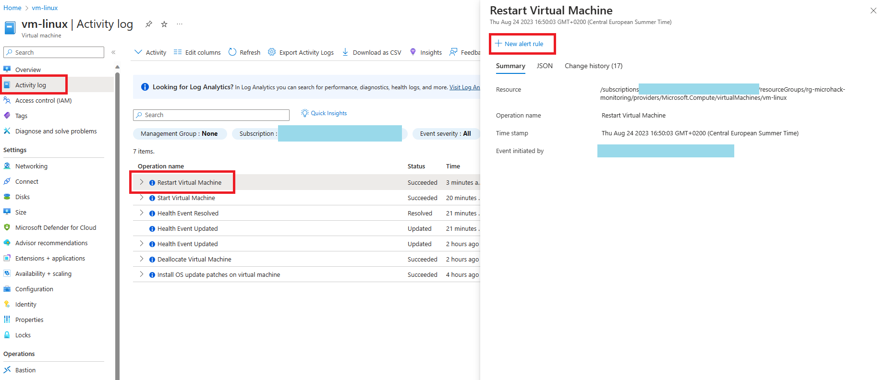

# Walkthrough Challenge 3

*Duration: 45 Minutes*

- [Walkthrough Challenge 3](#walkthrough-challenge-3)
  - [Prerequiste](#prerequiste)
  - [Task 1: Create an alert for not reporting virtual machines](#task-1-create-an-alert-for-not-reporting-virtual-machines)
  - [Task 2: Create a Service Health Alert](#task-2-create-a-service-health-alert)
  - [Task 3: Create a Resource Health Alert](#task-3-create-a-resource-health-alert)
  - [Task 4: Create an alert which notifies you when the `vm-linux` gets restarted](#task-4-create-an-alert-which-notifies-you-when-the-vm-linux-gets-restarted)
  - [Task 5: Knowledge Questions](#task-5-knowledge-questions)

## Prerequiste

- Before starting the tasks create an `Action Group` to send Emails.

    

    

    

- `Review + Create` the `Action Group`
- To verify if the `Action Group` is created successfully, go to the `Action Group` blade and check if the `Action Group` is listed.

    

- Run a test alert to verify if the `Action Group` is working as expected.

    

## Task 1: Create an alert for not reporting virtual machines

- Create an alert for unresponsive virtual machines. The alert should be triggered when the virtual machine is not reporting for 5 minutes.

- Test the alert by stopping one of the virtual machines.

- First check the `Heartbeat` table to see if the virtual machine is reporting and get the log query for the `Heartbeat` table.
  
    

    

- Create a new `Alert rule` by clicking on `New alert rule` and select the `Heartbeat` table.

    

    

    

    

- To verify if the `Alert rule` is created successfully, go to the `Alert rule` blade and check if the `Alert rule` is listed.

- An email should be sent to the email address you specified in the `Action Group` after 5 minutes.

> **Note**
> After that, start the machine again.

## Task 2: Create a Service Health Alert

- Create a Service Health alert for the services `Virtual Machines` and `Virtual Machine Scale Sets`. The alert should be triggered when the service in the region `West Europe` is not available or has issues (Service Issues).

    

    

    

    

- Verify if the `Service Health Alert` is created successfully.

    

## Task 3: Create a Resource Health Alert

- Create a Resource Health alert for all resources wihtin your resource group.
  
    

    

    

    

- Verify if the `Resource Health Alert` is created successfully.

    

## Task 4: Create an alert which notifies you when the `vm-linux` gets restarted

- Create an Activity log alert to track the reboot activity of the linux vm.
- First check the `Activity` table to see if the virtual machine is reporting and get the log query for the `Activity` table.
  
    

    

    

    

- Verify `Alerts` section if the `Alert Rule` was created.

    

    

## Task 5: Knowledge Questions

- Can you explain the difference between a metric alert and a log alert?
  - *Metric alerts are based on numerical metrics emitted by Azure resources, while log alerts are based on unstructured log data generated by Azure resources or custom applications.*
- Can you explain the difference between a Service Health alert and a Resource Health alert?
  - *Service Health alerts are based on the health of Azure services in a particular region, while Resource Health alerts are based on the health of individual Azure resources.*
- On which official Microsoft website can you find information about Azure Service Health for every single region worldwide?
  - *You can find information about Azure Service Health for every single region worldwide on the Azure Service Health page in the Azure portal. This page provides a global view of the health of Azure services and regions, as well as detailed information about any issues that may be affecting your resources. You can also set up Service Health alerts to receive notifications about any issues that may affect your resources.*
  - *Alternatively, you can also access Azure Service Health information through the Azure Status page, which provides a global view of the health of Azure services and regions. The Azure Status page also provides historical information about any past incidents and their resolutions.* -> [Azure Status page](https://azure.microsoft.com/en-us/get-started/azure-portal/service-health/#:~:text=The%20Azure%20status%20page%20is,Azure%20services%20in%20all%20regions.)
