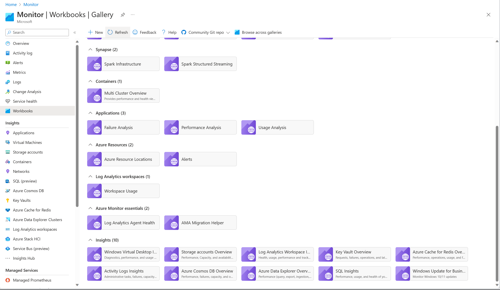
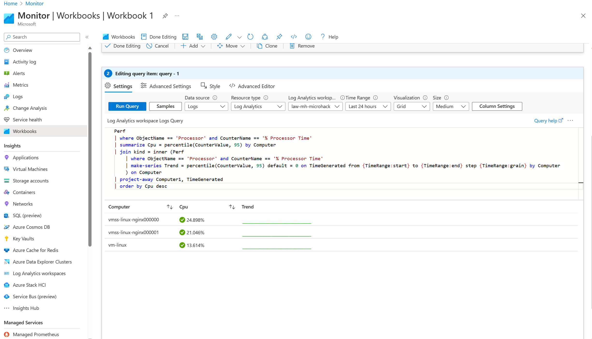
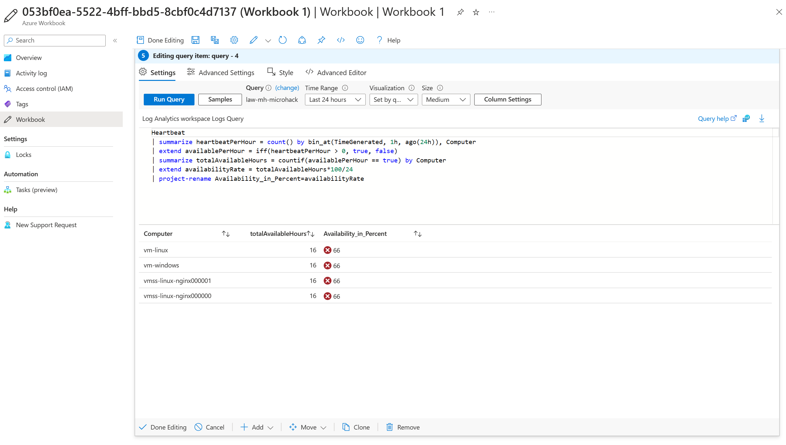

# Walkthrough Challenge 4

*Duration: 45 Minutes*

- [Walkthrough Challenge 4](#walkthrough-challenge-4)
  - [Task 1](#task-1)
  - [Task 2](#task-2)
  - [Task 3](#task-3)

## Task 1

- Create a new Monitoring Workbook named `Monitor Microhack`



## Task 2

- Add an Parameter names `Time Range` of type `Time Range Picker`


- Add a Query to the workbook and write the following query:

```kusto
Perf
| where ObjectName == 'Processor' and CounterName == '% Processor Time'
| summarize Cpu = percentile(CounterValue, 95) by Computer
| join kind = inner (Perf
    | where ObjectName == 'Processor' and CounterName == '% Processor Time'
    | make-series Trend = percentile(CounterValue, 95) default = 0 on TimeGenerated from {TimeRange:start} to {TimeRange:end} step {TimeRange:grain} by Computer
    ) on Computer
| project-away Computer1, TimeGenerated
| order by Cpu desc
```



In the **Columns Settings**, set:

Cpu

- Column renderer: Thresholds
- Custom number formatting: checked
- Units: Percentage
- Threshold settings (last two need to be in order):
- Icon: Success, Operator: Default
- Icon: Critical, Operator: >, Value: 80
- Icon: Warning, Operator: >, Value: 60

Trend

- Column renderer: Spark line
- Color palette: Green to Red
- Minimum value: 60
- Maximum value: 80

Click **Save and close** to commit the changes.

## Task 3

- Pin the workbook to the dashboard. Choose **Pin All** to pin all the tiles to the dashboard.


- Choose your Dashboard and verify that the workbook is pinned.


- End result


## Task 4

- Add the query to the workbook



- Configure the columns under **Column Settings**


