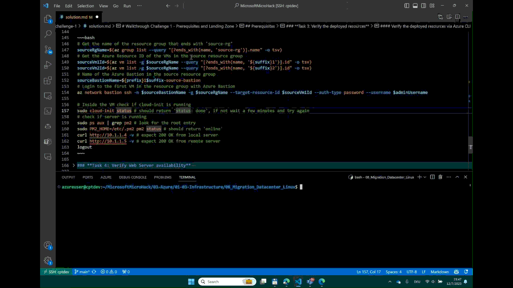
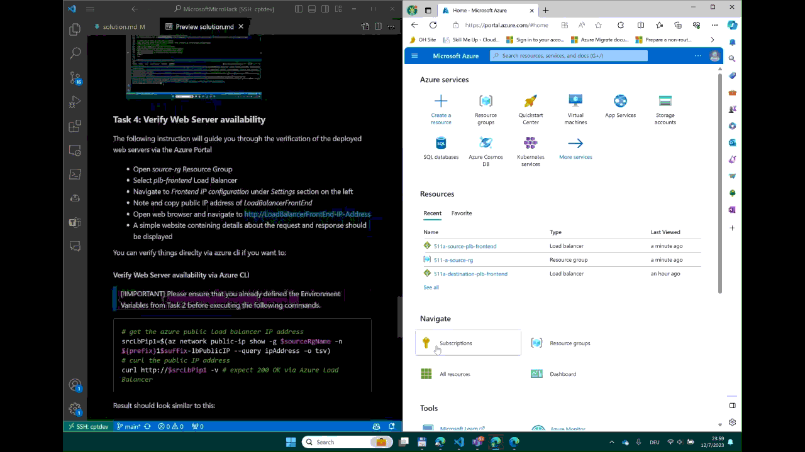

# Walkthrough Challenge 1 - Prerequisites and Landing Zone

~~~mermaid
flowchart LR
    task1["Task#1
    Get your enironment ready"]
    task2["Task#2
    Deploy Azure Landing Zone"]
    task3["Task#3
    Verify the Azure deployment"]
    task4["Task#4
    Verify Web Server availability"]
    task1 --> task2
    task2 --> task3
    task3 --> task4
~~~

Duration: 30 minutes

## Prerequisites

- Please ensure that you successfully verified the [General prerequisits](../../README.md#general-prerequisites) before continuing with this challenge.
- The Azure CLI is required to deploy the Bicep configuration of the Micro Hack.
- Download the *.bicep files from the [Resources](../../resources) to your local PC.

### ***Task 1: Get youre environment ready***

- Ensure you have access to the Azure Portal at https://portal.azure.com.

#### Start Cloud Shell

- Login to the Azure Portal at https://portal.azure.com.
- Launch **Cloud Shell** from the top navigation of the Azure portal.
   
- The first time you start Cloud Shell you're prompted to create an Azure Storage account for the Azure file share.
   
- Select the **Subscription** used to create the storage account and file share.
- Select **Create storage**.

   > [!NOTE]
   > By following these steps, Cloud Shell creates a standard storage account and allocates 5 GB of
   > storage for the file share. You can also create a storage account manually and specify the
   > storage account and file share to use. If you use a Premium storage account, Cloud Shell
   > allocates 100 GB of storage for the file share.
- Select your Bash shell environment
    Cloud Shell allows you to select either **Bash** or **PowerShell** for your command-line experience. Please selecte Bash for this MicroHack.

    
- Set your subscription
- List subscriptions you have access to with Azure CLI.
~~~bash
az account list
~~~
- Set your preferred subscription:
~~~bash
az account set --subscription '<REPLACE-WITH-YOUR-SUBSCRIPTION-NAME>'
~~~

#### OPTIONAL: Alternative you can install the Azure CLI on your local PC. Please refer to the following link for more information:

- Install the [Azure CLI](https://learn.microsoft.com/en-us/cli/azure/install-azure-cli) on your local PC
 - [How to install on on RHEL](https://access.redhat.com/documentation/en-us/red_hat_enterprise_linux/9/html/deploying_rhel_9_on_microsoft_azure/assembly_deploying-a-rhel-image-as-a-virtual-machine-on-microsoft-azure_cloud-content-azure#install-the-azure-cli_deploying-a-virtual-machine-on-microsoft-azure)
- Open a PowerShell (Windows) or Bash (Linux and macOS) terminal window
- Login to Azure via Azure CLI
~~~bash
az login
az login --use-device-code # If you are using a browser on a different machine
~~~

- List subscriptions you have access to with Azure CLI.
~~~bash
az account list
~~~
- Set your preferred subscription:
~~~bash
az account set --subscription '<REPLACE-WITH-YOUR-SUBSCRIPTION-NAME>'
~~~

### **Task 2: Deploy the Landing Zone for the Micro Hack**

The following command will deploy the landing zone for the Micro Hack. The landing zone contains all resources required for the Micro Hack. The deployment will take about 10 minutes.

> [!IMPORTANT] The following variables value should be changed to avoid conflicts with other deployments in your Azure subscription.

~~~bash
# Define prefix and suffix for all azure resources
prefix="1Team" # replace sm with your own prefix
suffix=a # replace a with your own suffix
# Have a look at all possible azure location with Azure CLI
az account list-locations -o table # List all possible Azure locations
# Define location for all azure resources
location=germanywestcentral
# Get our Entra ID Object ID, will be needed to assign us Admin rights to the azure VMs
currentUserObjectId=$(az ad signed-in-user show --query id -o tsv)
# Define VM admin password and username
adminPassword='demo!pass123'
adminUsername='microhackadmin'
# Create Azure Resources with Azure Bicep Resource Templates and Azure CLI 
az deployment sub create --location $location --template-file ./resources/main.bicep --parameters prefix=$prefix currentUserObjectId=$currentUserObjectId location=$location adminPassword=$adminPassword suffix=$suffix adminUsername=$adminUsername
~~~

### **Task 3: Verify the deployed resources**

The bicep deployment should have created the following resources

- source-rg Resource Group containing the follwing resources
    + Virtual Network *source-vnet*
    + 2 Virtual Machines with installed Node.js web App listing on port 80
    + 1 Azure Load Balancer *plb-frontend with configured backend pool containing both Virtual Machines.
    + 1 Azure Bastion *source-bastion* which will be used to login to the VMs via SSH.
    + 1 Azure Network Security Group *source-nsg* with configured rules to allow SSH and HTTP traffic.
    + 1 Azure Public IP Address *source-lbPublicIP* for the Azure Load Balancer.

You can get a list of all resources in the resource group with the following Azure CLI command:
~~~bash
# List all resource in the resource group
sourceRgName=$(az group list --query "[?starts_with(name, '$prefix') && ends_with(name, 'source-rg')].name" -o tsv)
az resource list -g $sourceRgName --output table
~~~

- destination-rg Resource Group containing the follwing resources
    + 1 Virtual Network *destination-vnet*
    + 1 Azure Bastion *destination-bastion* which will be used to login to the VMs via SSH.

You can get a list of all resources in the resource group with the following Azure CLI command:
~~~bash
# List all resource in the resource group
destinationRgName=$(az group list --query "[?starts_with(name, '$prefix') && ends_with(name, 'destination-rg')].name" -o tsv)
az resource list -g $destinationRgName -o table
~~~

The deployed architecture looks like following diagram:

#### Verify the deployed resources via Azure CLI

> [!IMPORTANT]
> Please ensure that you already defined the Environment Variables from Task 2 before executing the following commands.

The following commands will verify the deployed resources via Azure CLI. They also will show you how to login to a VM via Azure Bastion. Verify that the cloud-init script is running and the web server is available.

Log into the first VM in the resource group with Azure Bastion and install the mobility service agent.

~~~bash
# Get the name of the resource group that ends with 'source-rg'
sourceRgName=$(az group list --query "[?starts_with(name, '$prefix') && ends_with(name, 'source-rg')].name" -o tsv)
# Get the Azure Resource ID of the VMs in the source resource group
sourceVm1Id=$(az vm list -g $sourceRgName --query "[?ends_with(name, '${suffix}1')].id" -o tsv)
sourceVm2Id=$(az vm list -g $sourceRgName --query "[?ends_with(name, '${suffix}2')].id" -o tsv)
# Name of the Azure Bastion in the source resource group
TODO: Try to get the bastion name from the deployment output instead of hardcoding it.
sourceBastionName=${prefix}1$suffix-source-bastion
# Login to the first VM in the resource group with Azure Bastion
# IMPORTANT 
az network bastion ssh -n $sourceBastionName -g $sourceRgName --target-resource-id $sourceVm1Id --auth-type password --username $adminUsername
# Inside the VM check if cloud-init is running
sudo cloud-init status # should return 'status: done', if not wait a few minutes and try again
# check if server is running
sudo ps aux | grep pm2 # look for the root entry
sudo PM2_HOME=/etc/.pm2 pm2 status # should return 'online'
curl http://10.1.1.4 -v # expect 200 OK from local server
curl http://10.1.1.5 -v # expect 200 OK from remote server
logout
~~~

### **Task 4: Verify Web Server availability**

The following instruction will guide you through the verification of the deployed web servers via the Azure Portal
- Open *source-rg* Resource Group
- Select *plb-frontend* Load Balancer
- Navigate to *Frontend IP configuration* under *Settings* section on the left
- Note and copy public IP address of *LoadBalancerFrontEnd*
- Open web browser and navigate to http://LoadBalancerFrontEnd-IP-Address
- A simple website containing details about the request and response should be displayed

You can verify things direclty via azure cli if you want to:

#### Verify Web Server availability via Azure CLI

> [!IMPORTANT]
> Please ensure that you already defined the Environment Variables from Task 2 before executing the following commands.

~~~bash
# get the azure public load balancer IP address
srcLbPip1=$(az network public-ip show -g $sourceRgName -n ${prefix}1$suffix-lbPublicIP --query ipAddress -o tsv)
# curl the public IP address
curl http://$srcLbPip1 -v # expect 200 OK via Azure Load Balancer
~~~

Result should look similar to this:
~~~bash
*   Trying 172.201.72.62:80...
* TCP_NODELAY set
* Connected to 172.201.72.62 (172.201.72.62) port 80 (#0)
> GET / HTTP/1.1
> Host: 172.201.72.62
> User-Agent: curl/7.68.0
> Accept: */*
> 
* Mark bundle as not supporting multiuse
< HTTP/1.1 200 OK
< server: red
< Date: Thu, 30 Nov 2023 15:16:14 GMT
< Connection: keep-alive
< Keep-Alive: timeout=5
< Transfer-Encoding: chunked
< 
<body bgcolor="red">
Incoming Request URL: /
reqh:{
        "host": "172.201.72.62",
        "user-agent": "curl/7.68.0",
        "accept": "*/*"
}
resh:{
        "server": "red"
}
{
        "ladd": "10.1.1.5",
        "lport": 80,
        "radd": "108.143.12.226",
        "rport": 61516
}
</body>
* Connection #0 to host 172.201.72.62 left intac
~~~

### Useful Links
- [Learn about Azure CLI](https://learn.microsoft.com/en-us/cli/azure/)

You successfully completed challenge 1! 🚀🚀🚀

 **[Home](../../README.md)** - [Next Challenge Solution](../challenge-2/solution.md)
