# Walkthrough Challenge 2 - Discover physical servers for the migration

~~~mermaid
flowchart LR
    task1["Task#1
    Create Azure Migrate Project"]
    task2["Task#2
    Deploy Azure Windows VM"]
    task3["Task#3
    Install Azure Migration Appliance"]
    task4["Task#4
    Configure Azure Migration Appliance"]
    task1 --> task2
    task2 --> task3
    task3 --> task4
~~~

Duration: 60 minutes

## Prerequisites

Please make sure
- That you successfully completed [Challenge 1](../challenge-1/solution.md) before continuing with this challenge.
- Microsoft Azure RBAC Role [Contributor](https://learn.microsoft.com/en-us/azure/role-based-access-control/built-in-roles#contributor) on your current Subscription
- Microsoft Entra Role [Application Developer](https://learn.microsoft.com/en-us/entra/identity/role-based-access-control/permissions-reference#application-developer) to have sufficient permissions to register an application with your Microsoft Entra tenant, and assign to the application a role in your Azure subscription.

> [!NOTE]
> For the Microhack we will provide you with a user account with the required permissions.

### **Task 1: Create a Azure Migrate Project**

Open the [Azure Portal](https://portal.azure.com) and login using a user account.

In the search bar enter *Azure Migrate* and select Azure Migrate from the list of services

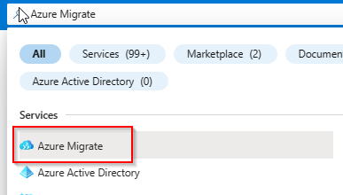

Select *Servers, databases and web app* from the navigation pane on the left and click on *Create project*

Select the *destination-rg* Resource Group, specify a name for the Azure Migrate Project and also select a geography where the data will be stored.

> [!IMPORTANT]
> Make sure to select the right subscription. In case there are several subscriptions available, please select the subscription that was used to deploy the Azure Landing Zone.

Wait until the Azure Migrate Project has been created. Select *Servers, databases and web apps* from the navigation pane on the left.
Your previously created Azure Migrate project should be preselected.

### **Task 2: Create and prepare Windows Server 2022 for the Azure Migrate Appliance**

To start physical server discovery you must install the Azure Migrate Appliance on your on-premises. The Azure Migrate Appliance can be downloaded as a OVA or VHD template or you can download a ZIP file containing a PowerShell script to install it on a already existing server. For the purpose of this MicroHack we will install the Azure Migrate Appliance via the PowerShell script on a Windows Server 2022 system.

> [!IMPORTANT]
> Please make sure to check the [prerequisites](https://learn.microsoft.com/en-us/azure/migrate/tutorial-discover-physical#prerequisites) of the Azure Migrate Appliance.

In the Azure Portal select *Virtual machines* from the navigation pane on the left. Select *Create -> Azure virtual machine*

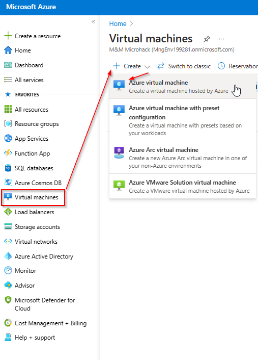

Under Basics select the *source-rg* Resource Group and provide a name for the server. Select *Windows Server 2019 Datacenter - x64 Gen2* for the Image.

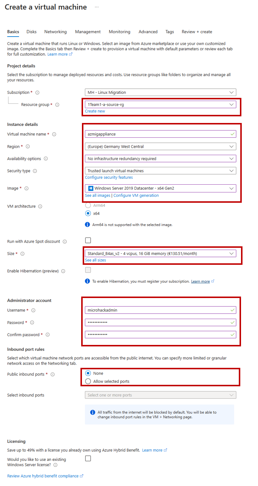

Accept the default disk settings and click next to select the *Networking* tab. Select the *source-vnet* Virtual Network, select the *source-subnet* Subnet and make sure to select *None* for the Public IP and NIC network security group.

Accept the default settings for the remaining tabs, select *Review + create* and click *Create*.

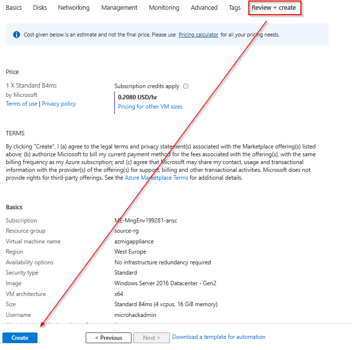

Wait until the deployment has been successfully completed and select *Go to resource*

#### [OPTIONAL] Create the Azure Migrate Appliance VM via Azure Resource Manager Template (Bicep) instead of the Azure Portal

You can also create the Azure Migrate Appliance VM via Azure Resource Manager Template (Bicep) instead of the Azure Portal. The following Bicep template can be used to create the Azure Migrate Appliance VM.

> [!IMPORTANT]
> Please ensure that you already defined the Environment Variables from Task 2 before executing the following commands.

~~~bash
# Define a name for the VM which will be used for the Azure Migrate Appliance
migVmName=${prefix}1${suffix}Mig
# Get the name of the resource group that ends with 'source-rg'
sourceRgName=$(az group list --query "[?starts_with(name, '$prefix') && ends_with(name, 'source-rg')].name" -o tsv)
# Get the name of the source vnet via Azure CLI
sourceVnetName=$(az network vnet list --query "[?ends_with(name, 'source-vnet')].name" -o tsv)
# Get the name of the source subnet
sourceSubnetName=$(az network vnet subnet list -g $sourceRgName --vnet-name $sourceVnetName --query [0].name -o tsv)
# Get the next free IP address in the source subnet
migVmPrivateIp=$(az network vnet subnet list-available-ips -g $sourceRgName --vnet-name $sourceVnetName --name $sourceSubnetName --query [0] --output tsv)
# Retrieve the Windows Server 2022 Azure Datacenter image reference
# Note, you could also use Windows Serverr 2019 instead
migVmImageReference=$(az vm image list --all --location $location --publisher Microsoft --offer WindowsServer --sku 2022-datacenter-azure-edition --query "[0].{publisher: publisher, offer: offer, sku: sku, version: version}")
echo $migVmImageReference
# Deploy the VM
az deployment group create -g $sourceRgName --template-file ./resources/vm.mig.bicep --parameters \
vmName=$migVmName \
vnetName=$sourceVnetName \
subnetName=$sourceSubnetName \
location=$location \
adminPassword=$adminPassword \
adminUsername=$adminUsername \
privateIp=$migVmPrivateIp \
userObjectId=$currentUserObjectId \
imageReference="$migVmImageReference"
~~~

#### Log into the Azure Migrate Appliance VM via Azure Bastion

Select *Bastion* from the navigation pane on the left, provide the credentials to login to the Azure Migrate Appliance VM and select *Connect*. A new browser tab should open with a remote session to the Windows Server 2019 system.

> [!IMPORTANT]
> Watch out Popup Blocker on your Browser.

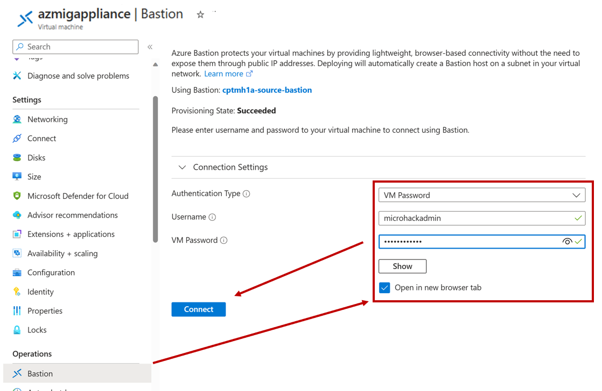

### **Task 3: Install the Azure Migrate Appliance**

> [!IMPORTANT]
You will need to install Microsoft Edge Browser or Chrome on the Azure Migrate Appliance VM. Internet Explorer 11 is not supported.
> - [New Windows 2019 server, how to install Microsoft Edge browser](https://learn.microsoft.com/en-us/answers/questions/937532/new-windows-2019-server-how-to-install-microsoft-e)

Open Microsoft Edge on the Windows Server 2019 system and navigate and login to the [Azure Portal](https://portal.azure.com).

In the search bar enter *Azure Migrate* and select Azure Migrate from the list of services

Select *Servers, databases and web apps*, make sure that the previously created Azure Migrate project is selected and click *Discover*

- Select *Physical or other (AWS, GCP,Xen, etc.)* from the *Are your servers virtualized* drop down.
- Enter a name into the *Name your appliance* field and click *Generate*.
- Wait until the Project key has been created.
- Copy the Project key
- click *Download*, to download the ZIP file containing the PowerShell script to install the Azure Migrate Appliance.

azmigappliance;PROD;0ba83d3d-0644-4916-98c0-d513e10dc917;f474dec9-5bab-47a3-b4d3-e641dac87ddb;sm1-a-destination-rg;AzMig-MM-MH;0a95ca7d-132f-44a2-b8a0-0bf86d6a535d;4498dbb2-d22e-4c0d-abe6-dffaef7fa354;https://discoverysrv.ne.prod.migration.windowsazure.com/;northeurope;false

azmigappliance;PROD;0ba83d3d-0644-4916-98c0-d513e10dc917;f474dec9-5bab-47a3-b4d3-e641dac87ddb;sm1-a-destination-rg;AzMig-MM-MH;0a95ca7d-132f-44a2-b8a0-0bf86d6a535d;4498dbb2-d22e-4c0d-abe6-dffaef7fa354;https://discoverysrv.ne.prod.migration.windowsazure.com/;false

Open the folder containing the download and extract the ZIP file.

Start an elevated PowerShell session,
- type "powershell" at the taskbar input field
- right click the Windows PowerShell Icon
- select "Run as administrator"

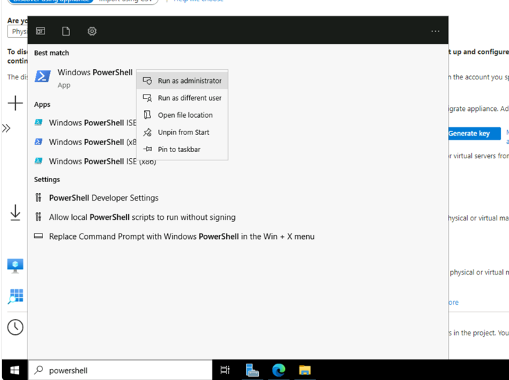

Change the PowerShell directory to the folder where the contents have been extracted.
Run the script named AzureMigrateInstaller.ps1 and select *A* to confirm script execution.

~~~powershell
Windows PowerShell
Copyright (C) Microsoft Corporation. All rights reserved.
cd .\AzureMigrateInstaller\
.\AzureMigrateInstaller.ps1
~~~

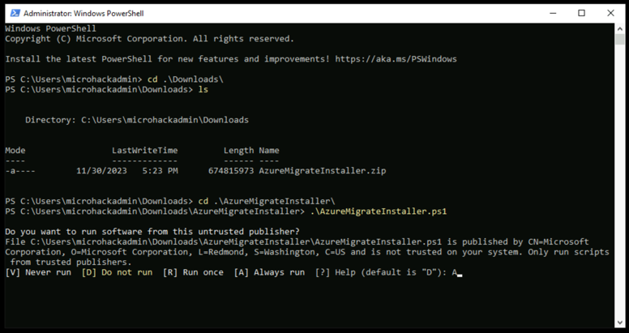

Select Option 3 for *Physical or other (AWS, GCP, Xen, etc.)*

Select Option 1 for *Azure Public*

Select Option 1 for *public endpoint* and confirm you selection to start the installation.

Select *N* for IE11 de-install.

> [!WARNING]
> Please note the Warning that IE11 is incompatible with latest Azure Migrate Appliance configuration manager and make sure using Microsoft Edge to configure the Azure Migrate appliance

### **Task 4: Configure the Azure Migrate Appliance**

Open a browser on any machine that can connect to the appliance, and open the URL of the appliance web app: https://<Azure-Migration-VM-Name> name or IP address: 44368.

~~~bash
https://sm1amig:44368/ # if your VM name is sm1amig
~~~

Alternately, you can open the app from the desktop by clicking the app shortcut.

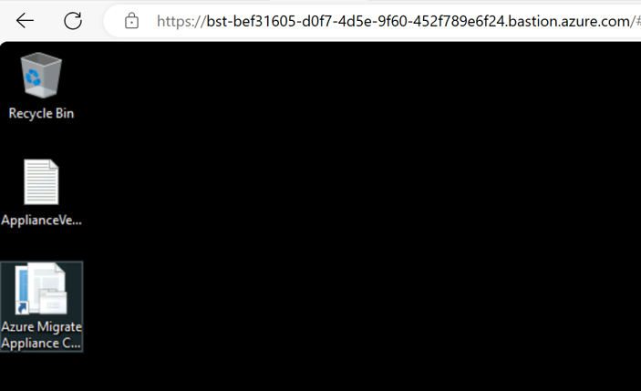

Accept the license terms, and read the third-party information.

Paste the previously copied Azure Migrate project key and click *Verify*. Once successfully verified the latest appliance updates will be installed.

Next log in to Azure using the provided code.

After successful authentication, appliance will be registered with the Azure Migrate project.

Next you need to create an credential object that will contain the Username and Password

Click on *Add Credentials* in the navigation pane on the left.
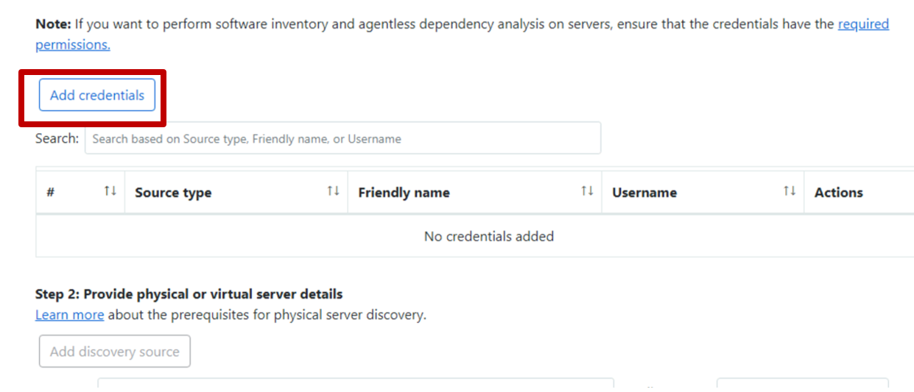

In our case the two source VMS have been setup with password-based authentication for Linux server.

- Therefore select the source type as "Linux Server (Password-based)".
- Specify a friendly name for credentials.
- Add the username used during the creation of the source VMs.
- Add the password used during the creation of the source VMs.
- Click on Save.
The friendly name will be used later on when specifying the individual systems.

> [!NOTE]
> For the Username and Password check the the environment parameter.
>
> ~~~bash
> echo $adminPassword
> echo $adminUsername
> ~~~

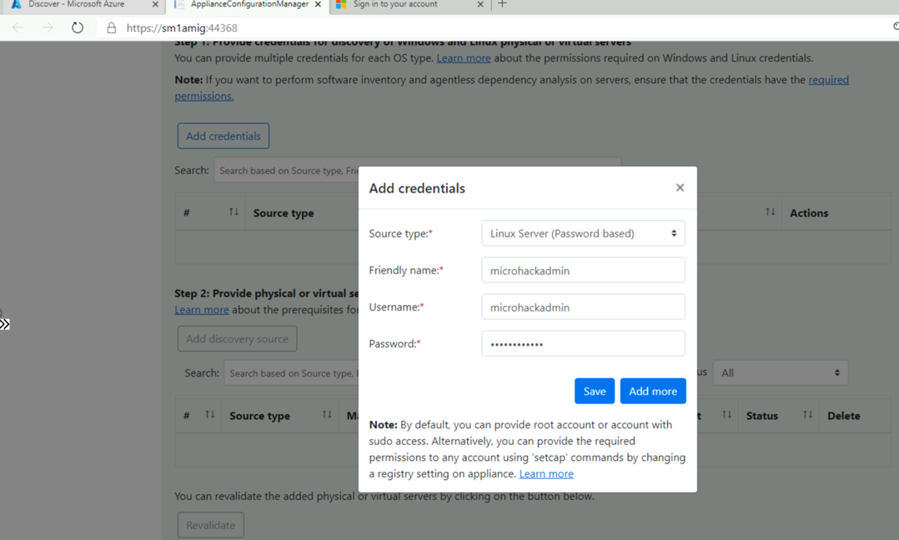

<!--  -->

Next you need to provide the individual source server details and map them to a specific set of credentials. Make sure that validation is successful.

# list all IPs of resource group source-rg

~~~bash
sourceRgName=$(az group list --query "[?starts_with(name, '$prefix') && ends_with(name, 'source-rg')].name" -o tsv)
az vm list-ip-addresses -g $sourceRgName -o table
~~~

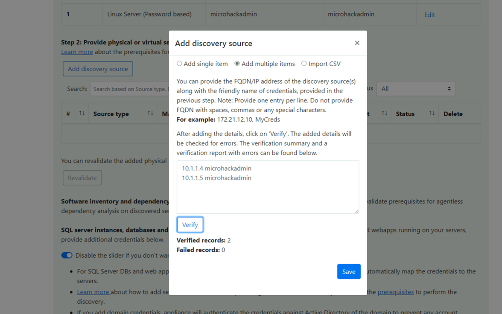

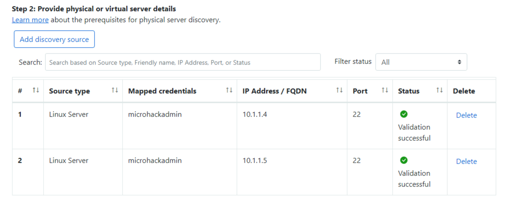

Click *Start discovery*.
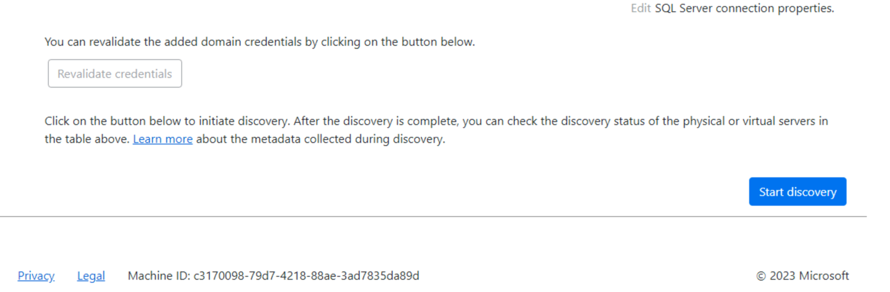
<!--  -->

After discovery has been successfully initiated, go to the Azure portal to review the discovered inventory.

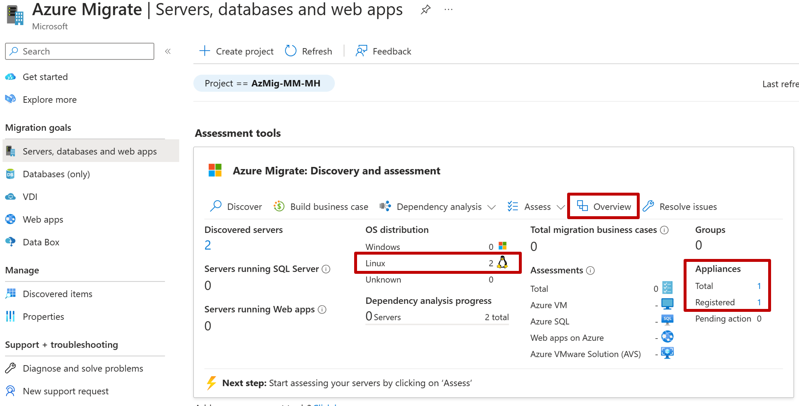

You can click *Overview* to get more insights on what information were discovered.

> [!NOTE]
> If no inventory data is available, click Refresh to refresh inventory data.

You successfully completed challenge 2! 🚀🚀🚀

The deployed architecture now looks like the following diagram.

 **[Home](../../README.md)** - [Next Challenge Solution](../challenge-3/solution.md)
 **[Home](../../README.md)** - [Next Challenge Solution](../challenge-3/solution.md)
