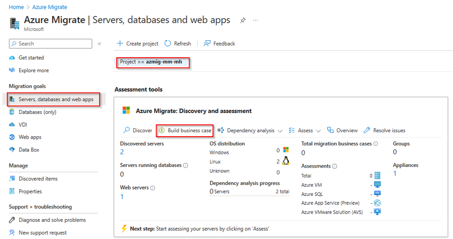
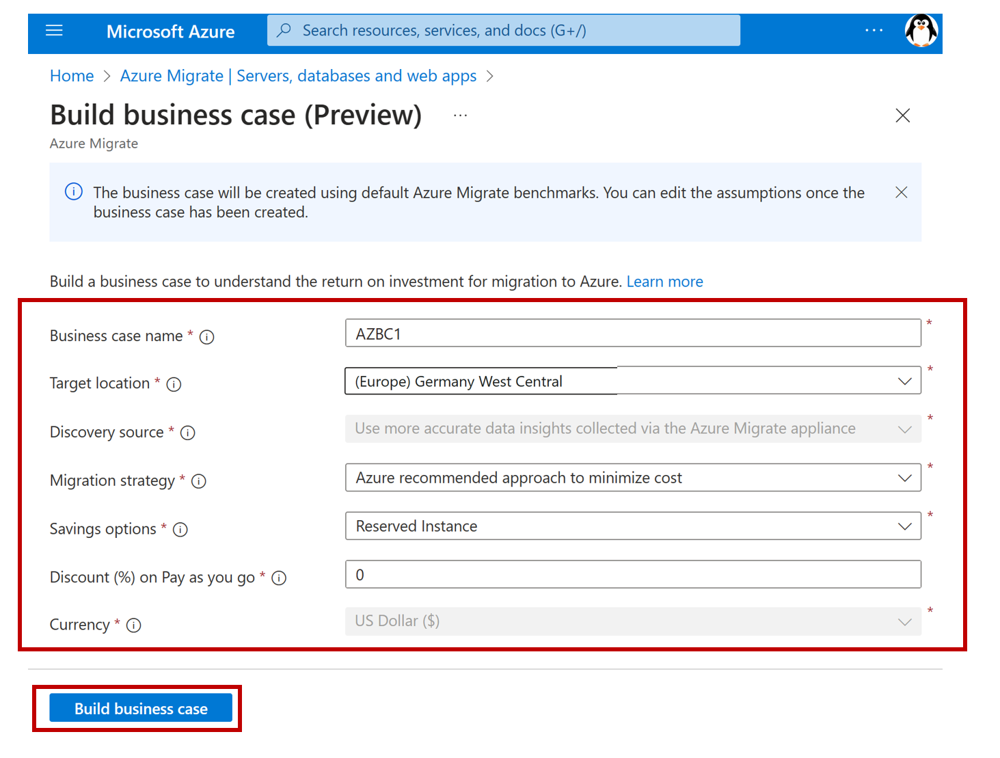
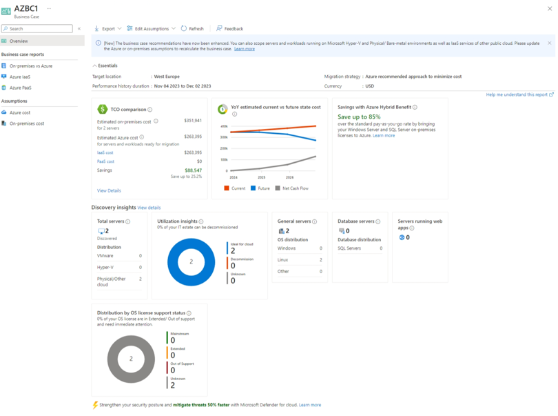
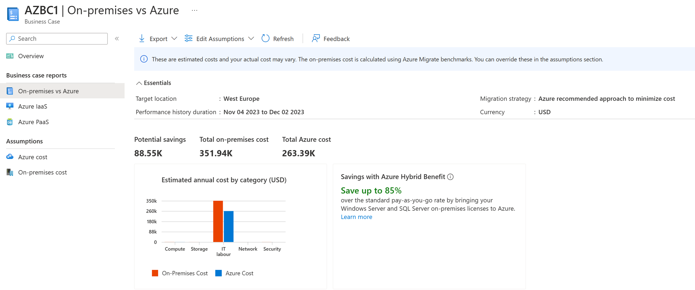
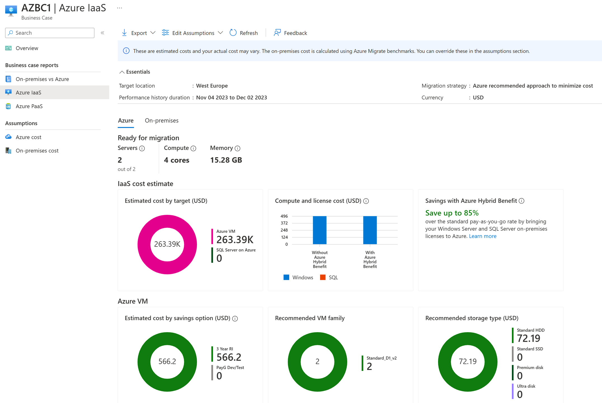
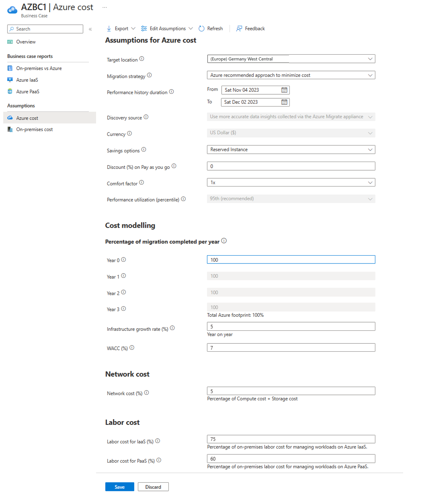
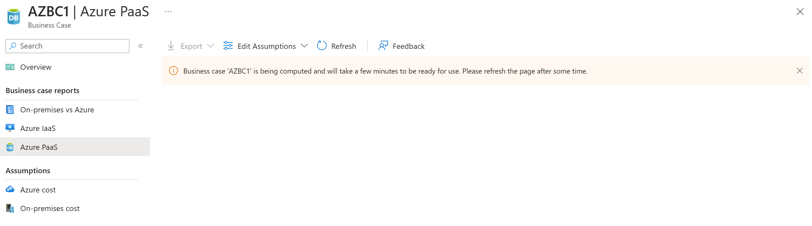
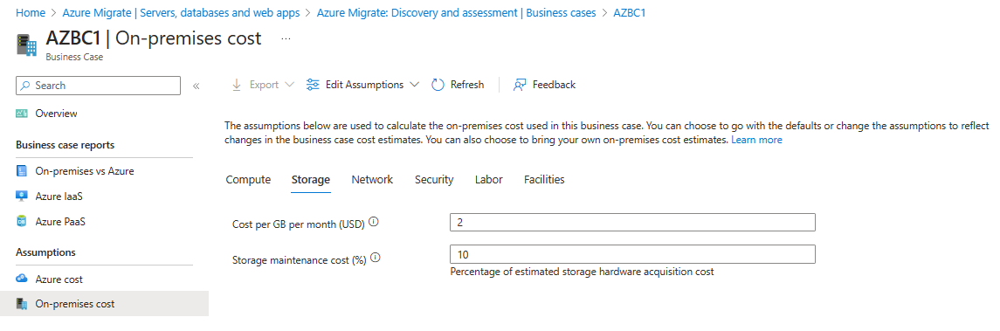

# Walkthrough Challenge 3 - Create a Business Case

~~~mermaid
flowchart LR
    task1["Task#1
    Azure Migrate Business Case"]
    task2["Task#2
    Review Business Case"]
    task3["Task#3
    Adjust Business Case"]
    task1 --> task2
    task2 --> task3
~~~

Duration: 40 minutes

## Prerequisites

Please make sure thet you successfully completed [Challenge 2](../challenge-2/solution.md) before continuing with this challenge.
Please also make sure to review the [prerequisites](https://learn.microsoft.com/en-us/azure/migrate/how-to-build-a-business-case#prerequisites) for the business case.

### **Task 1: Build a business case**

Open the [Azure Portal](https://portal.azure.com) and navigate to the previousley created Azure Migrate project. Select *Servers, databases and web apps*, make sure that the right Azure Migrate Project is selected and click *Build business case*.

Provide a name for the business case and select a target location. For the migration strategy select *Azure recommended approach to minimize cost*. You can select your desired saving options and discounts that may apply to your Azure Subscription.

Wait for the business case creation to complete and click on the business case name to open it.

> [!NOTE]
> Please note that business case creation can take up to 30 minutes.

~~~bash
# assign variables subid the current azure subscription id
subid=$(az account show --query id -o tsv)
# assign the variable destinationRgName the name of the resource group which does end on destination-rg
destinationRgName=$(az group list --query "[?starts_with(name, '$prefix') && ends_with(name, 'destination-rg')].name"
az rest --method get --uri "/subscriptions/$subid/resourceGroups/$destinationRgName/providers/Microsoft.Migrate/projects?api-version=2019-10-01"
~~~

### **Task 2: Review a business case**

There are four major reports that you need to review:

- Overview: This report is an executive summary of the business case and covers:
  + Potential savings (TCO).
  + Estimated year on year cashflow savings based on the estimated migration completed that year.
  + Savings from unique Azure benefits like Azure Hybrid Benefit.
  + Discovery insights covering the scope of the business case.

- On-premises vs Azure: This report covers the breakdown of the total cost of ownership by cost categories and insights on savings.

- Azure IaaS: This report covers the Azure and on-premises footprint of the servers and workloads recommended for migrating to Azure IaaS.

- Azure PaaS: This report covers the Azure and on-premises footprint of the workloads recommended for migrating to Azure PaaS.
In our case our application is based on Node.js. If our application would be based on .NET, Java or PHP we would see the recommendation to migrate to Azure App Service via the corresponding [Azure App Service Migration Assistant tool](https://azure.microsoft.com/en-us/products/app-service/migration-tools/).

In case we would have been runnig an .NET application we would see the following recommendation:

### **Task 3: Adjust business case assumptions**

The business case is calculated based on some [assumptions](https://learn.microsoft.com/en-us/azure/migrate/concepts-business-case-calculation#total-cost-of-ownership-steady-state). To better fit your current scenario, you can adjust those assumptions. In our case let us modify the Cost mdelling Percentage of migration completed per year to 100% for the first year.

**Azure cost**

You can adjust those parameters what would recalculate the business case.

> [!NOTE]
> Changing "Cost mdelling Percentage of migration completed per year to 100%" is not going to change the current Azure Cost. This is because the default assumption of our two VMs will be completed in the first year.

**Azure cost computation**

**On-premises cost**
> [!NOTE]
> As of now, Azure Migrate's business case feature does not provide the possibility to consider Azure Hybrid Benefits for Red Hat Enterprise Linux (RHEL) licenses. Azure Hybrid Benefit can be applied to Windows Server and SQL Server on Azure, but not for RHEL.

In case you own SUSE or RHEL licenses Azure Hybrid Benefit (AHB) for Linux lets you easily switch the software subscription model for your VM. You can remove licensing cost by bringing your Red Hat and SUSE Linux subscriptions directly to Azure, or utilize a model where you pay for subscriptions as you use them. Learn more about Azure Hybrid Benefit for Linux:
[Azure Hybrid Benefit for Red Hat Enterprise Linux (RHEL) and SUSE Linux Enterprise Server (SLES) virtual machines](https://learn.microsoft.com/en-us/azure/virtual-machines/linux/azure-hybrid-benefit-linux)

You can verify your current license type at Azure VMs by running the following commands:
~~~bash
# Get the name of the source resoure group which does end on source-rg
sourceRgName=$(az group list --query "[?starts_with(name, '$prefix') && ends_with(name, 'source-rg')].name" -o tsv)
# Get the name of the source vm
sourceVmIds=$(az vm list --resource-group $sourceRgName --query "[].id" -o tsv)
# Get the license type of the source VMs
az vm get-instance-view --ids $sourceVmIds --query [].licenseType -o tsv # Result should be empty as we do not make use of BYOL
~~~

We can set the license type of the Windows Server which does run the Azure Migration Appliance via Azure CLI.

> [!IMPORTANT]
> This change should only be applied if you own a valid Windows Server License. For the Microhack we did take care that your Azure Test Subscription does include a valid License.

~~~bash
# Get the id of the vm where the name end on Mig under the resource group sourceRgName
sourceVmMigId=$(az vm list --resource-group $sourceRgName --query "[?ends_with(name, 'Mig')].id" -o tsv)
# Set the license type of the source Migration Appliance Windows VM
az vm update --ids $sourceVmMigId --set licenseType=Windows_Server 
# Get the license type of the source vm
az vm get-instance-view --ids $sourceVmMigId -o tsv --query licenseType # Result should be Windows_Server
~~~

<!-- You can adjust those parameters what would recalculate the business case.

 -->

You successfully completed challenge 3! 🚀🚀🚀

 **[Home](../../README.md)** - [Next Challenge Solution](../challenge-4/solution.md)
