# Walkthrough Challenge 5 - Migrate machines to Azure

Duration: 90 minutes

## Prerequisites

Please make sure thet you successfully completed [Challenge 4](../challenge-4/solution.md) before continuing with this challenge.

### **Task 1: Create and prepare Windows Server 2019 for the Azure Replication Appliance**

To start physical server migration you must we will need another tool from the azure migrate tool box called Azure Replication Appliance.


You will need to install the Azure Replication Appliance on your on-premises, in our case the source resoure group.  The Azure Replication Appliance can be downloaded as a OVA template or you can download the appliance installer to install it on a already existing server. For the purpose of this MicroHack we will install the Azure Replication Appliance via the installer on a new Windows Server 2019 system.

If you like to learn more about how the Azure Replication Appliance works, please check the following [link](https://learn.microsoft.com/en-us/azure/migrate/agent-based-migration-architecture).


> [!IMPORTANT]
> Please make sure to check the [prerequisites](https://learn.microsoft.com/en-us/azure/migrate/migrate-replication-appliance) of the Azure 
Replication Appliance.

> [!IMPORTANT]
> Please note that it is currently [not supported](https://learn.microsoft.com/en-us/azure/migrate/common-questions-appliance#can-the-azure-migrate-appliancereplication-appliance-connect-to-the-same-vcenter) to install the Azure Migrate Replication Appliance on the same system as the Azure Migrate Appliance.

In the Azure Portal select *Virtual machines* from the navigation pane on the left. Select *Create -> Azure virtual machine*


Under Basics select the *source-rg* Resource Group and provide a name for the server. Select *Windows Server 2019 Datacenter - x64 Gen2* for the Image.

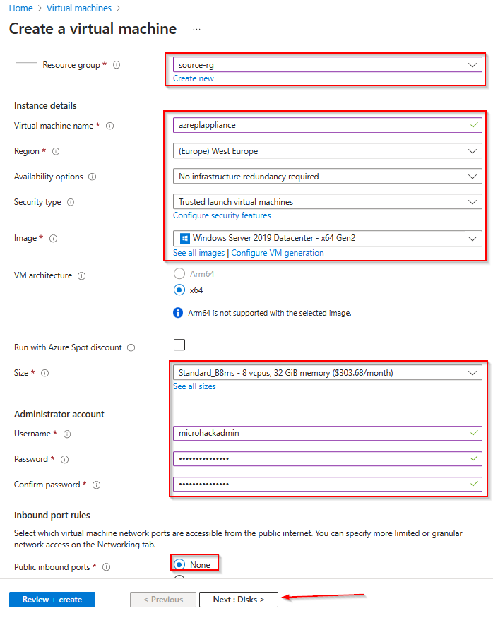

<!-- > [!NOTE]
> For the Username and Password you can either select a combination of your choice or check the secrets within the KeyVault. -->

Add an additional 1024GiB Standard HDD LRS data disk to the Virtual Machine and click *Next*


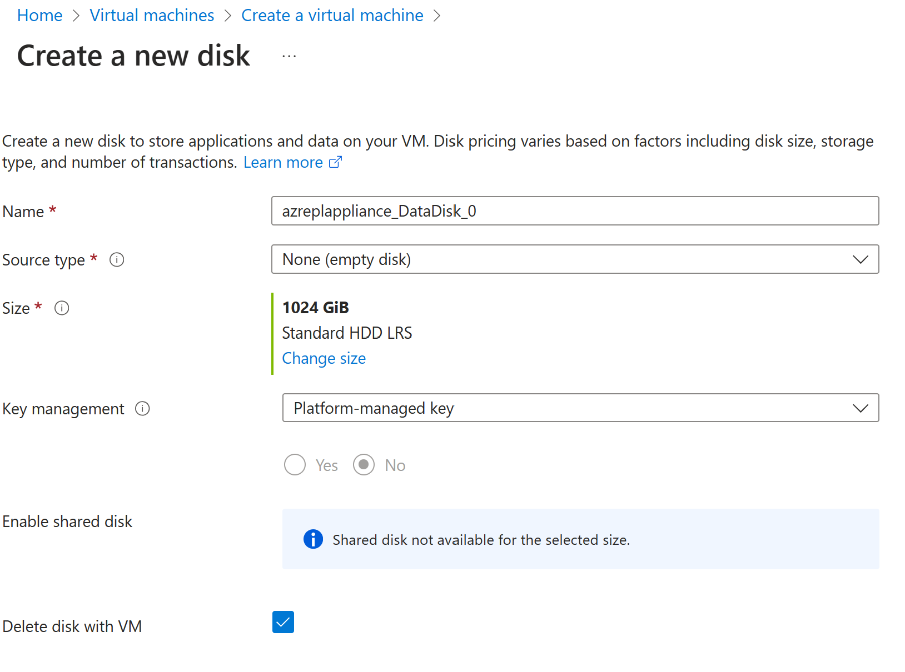

In the *Networking* tab, select the *source-vnet* Virtual Network and the *source-subnet* Subnet and make sure to select *None* for the Public IP and NIC network security group.

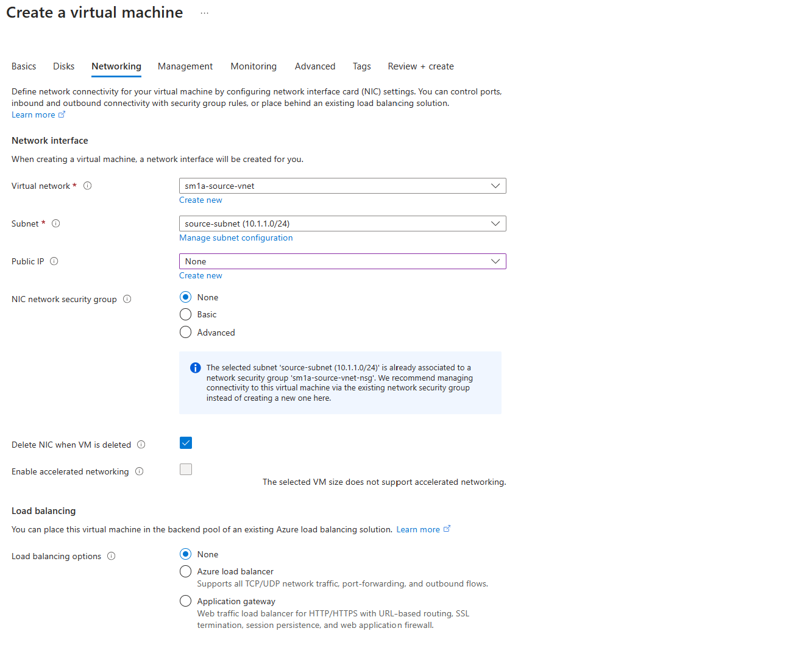

Accept the default settings for the remaining tabs, select *Review + create* and click *Create*.


Wait until the deployment has been successfully completed and select *Go to resource*


Select *Bastion* from the navigation pane on the left, provide the credentials to login to the Azure Migrate Replication VM and select *Connect*. A new browser tab should open with a remote session to the Windows Server 2019 system.


<!-- > [!NOTE]
> You can also select *Password from Azure KeyVault* under *Authentication Type* if you set the password during VM creation to match the secret stored in the KeyVault. -->

### **Task 2: Setup the Azure Replication Appliance**

To prepare for physical server migration, you need to verify the physical server settings, and prepare to deploy a replication appliance.

> [!NOTE]
> You will need to install the Microsoft Edge Browser on the new VM manually. You can download the installer from https://www.microsoft.com/en-us/edge/business/download.

- In the VM the Server Manager will open automatically, please navigate to “Local Server” and klick on “ON” under “IE Enhanced Security Configuration” .  

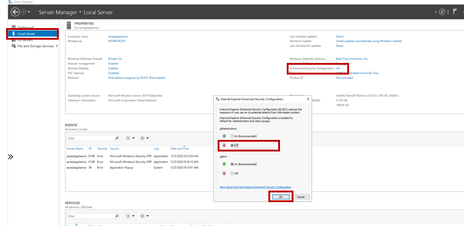

- Open Internet Explorer 11 and just hit OK when prompted 

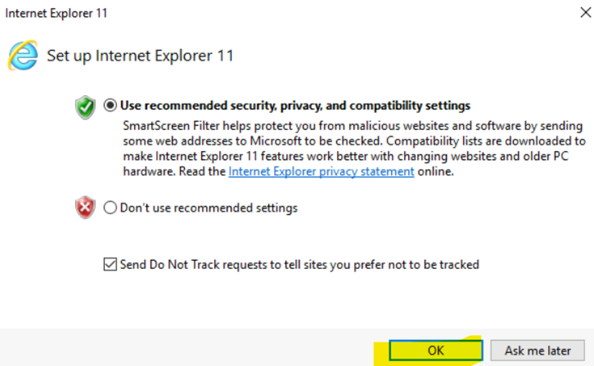

- Download Edge Browser via the following link https://www.microsoft.com/en-us/edge/business/download

- Accept and download

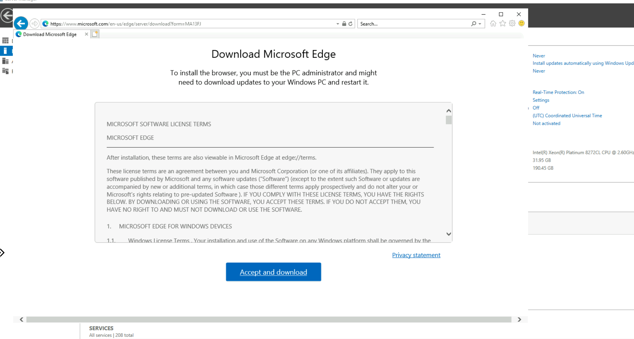

After finishing the Edge Browser installation open the Azure Portal (https://portal.azure.com). Navigate to the previousley created Azure Migrate project. Select *Servers, databases and web apps*, make sure that the right Azure Migrate Project is selected and click *Discover* in the *Migration tools* box.

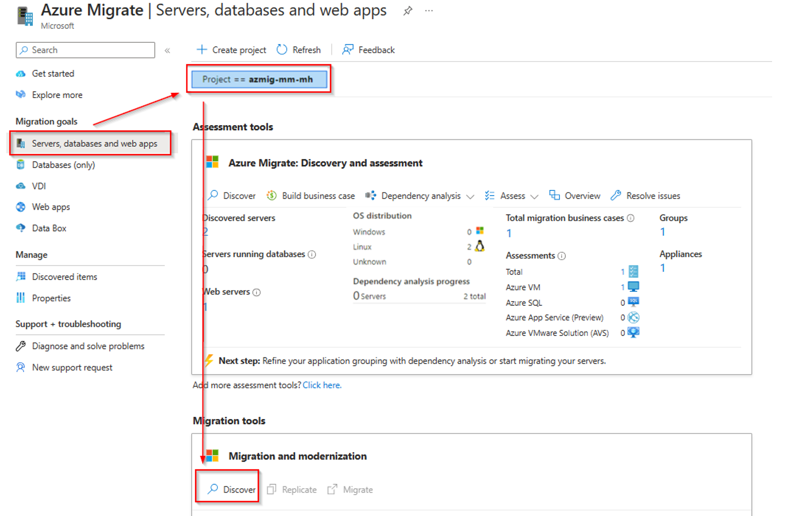

Select *Physical or other...* in the *Are your machines virtualized* drop down and select *West Europe* as the *Target Region*.
Make sure to check the confirmation checkbox and click *Create resources*. 
@myedge.org


Wait until the deployment has been successfully completed. Next under *1. Download and install the repliaction appliance software* click *Download* to download the Azure Migrate Repplication Appliance installer. 
You also need to download the registration key that is required to register the replication appliance under *2. Configure the replication appliance and register it to the project*.


Next start the installation of the Azure Migrate Replication Appliance by double cklicking the *MicrosoftAzureSiteRecoveryUnifiedSetup.exe*


Select *Install the configuration server and process server* and click *Next*


Check the *I acceppt...* checkbox and click *Next*

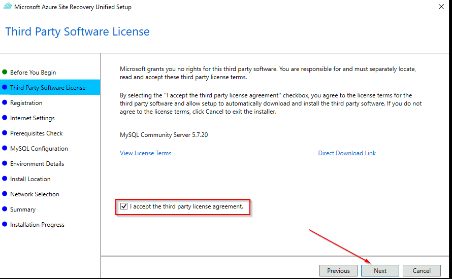

Browse and select the previousley downloaded registration key and click *Next*


Accept the default *Internet connection* configuration


Review the prerequisites check of the installer. Note that you can safely ignore the static IP warning.


Specify the required passwords and note the password requirements. 

> [!NOTE]
> For the Username and Password you can either select a combination of your choice or check the secrets within the KeyVault.


Select *No* for *Do you want to protect VMware virtual machines* and click *Next*


Verify the *Install location*. The installer should automatically pre-select the largest disk, in our case the 1024 GiB data disk that was created during VM creation.

> [!IMPORTANT]
> The additional data disk needs to be initialized first using the [Windows Disk Management tool](https://learn.microsoft.com/en-us/windows-server/storage/disk-management/initialize-new-disks#initialize-a-new-disk). You can open the tool side by side with the installer if you have not initialized the disk beforehand.


Select the appropriate NICs (We only have 1 in our case).

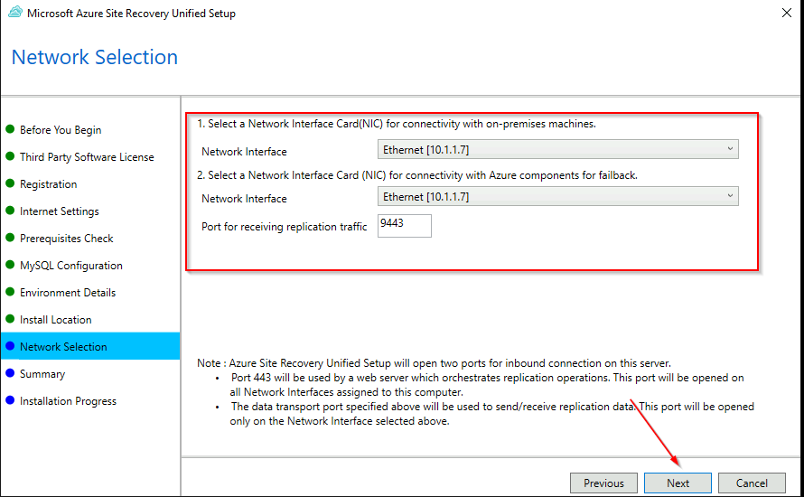

Verify the installation summary and click *Install* to start the installation.


Wait until the installation progress is finished.


After the successfull installation a configuration server connection passphrase will be displayed. Copy the passphrase and save it for later use.

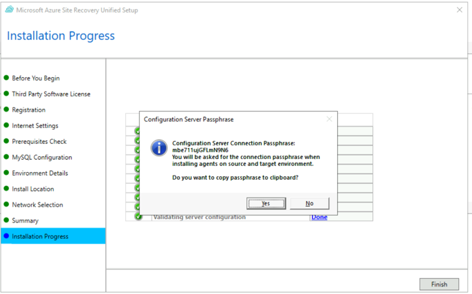

> [!NOTE]
> Password should look something like this: mbe711ujGFLmN9N6

<!-- as a new secret in the source-rg Resource Group KeyVault.

 -->

After the installation completes, the Appliance configuration wizard will be launched automatically and ask you to add an account.

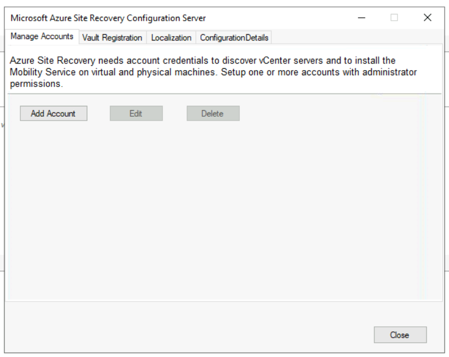

You can add the local administrator account credentials of the source servers.
 <!-- (stored secrets in the source KeyVault). -->

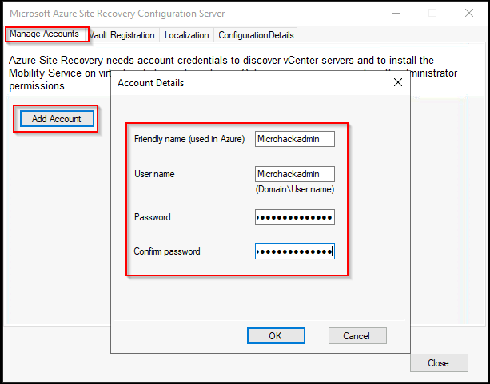


The last step is to finalize the registration. Refresh the Azure Portal page where you've downloaded the installer and registration keys and select the *azreplappliance* from the drop down list and click on *Finalize registration*.


### **Task 3: Install the Mobility service on the source server**
based on https://learn.microsoft.com/en-us/azure/migrate/tutorial-migrate-physical-virtual-machines#install-the-mobility-service-agent

On machines you want to migrate, you need to install the Mobility service agent. The agent installers are available on the replication appliance in the *%ProgramData%\ASR\home\svsystems\pushinstallsvc\repository* directory.

In case you did install the replication appliance under "F:\azure" you can fint the RHEL 7 Mobility service agent installers under the following path:
F:\azure\home\svsystems\pushinstallsvc\repository

~~~powershell
ls F:\azure\home\svsystems\pushinstallsvc\repository *ASR*RHEL7*

    Directory: F:\azure\home\svsystems\pushinstallsvc\repository


Mode                LastWriteTime         Length Name
----                -------------         ------ ----
-a----        7/11/2023   6:35 PM      115643359 Microsoft-ASR_UA_9.55.0.0_RHEL7-64_GA_11Jul2023_Release.tar.gz
~~~


Because our VMs are all running inside the same Azure Virtual Network [VNet] and we did not restrict access betweem the VMs inside the VNet we can use scp to upload the Mobility service agent installer via scp to Linux VMs.

~~~powershell
# connect via ssh to the source VM 10.1.1.4 with the user azuremigrateadmin and password demo!p12
$rhelmobi="F:\azure\home\svsystems\pushinstallsvc\repository\Microsoft-ASR_UA_9.55.0.0_RHEL7-64_GA_11Jul2023_Release.tar.gz"
scp $rhelmobi microhackadmin@10.1.1.4:/home/microhackadmin/
scp $rhelmobi microhackadmin@10.1.1.5:/home/microhackadmin/
~~~

Now you need to log in to the source Linux VMs to finish the installation of the mobility service agent.

> [!IMPORTANT]
> Please ensure that you already defined the Environment Variables from Task 2 before executing the following commands.

~~~bash
# Get the name of the resource group that ends with 'source-rg'
sourceRgName=$(az group list --query "[?ends_with(name, 'source-rg')].name" -o tsv)
# Name of the Azure Bastion in the source resource group
sourceBastionName=${prefix}1$suffix-source-bastion
~~~

Log into the first VM in the resource group with Azure Bastion and install the mobility service agent.

~~~bash
# Get the Azure Resource ID of Linux VM 1 in the source resource group
sourceVm1Id=$(az vm list -g $sourceRgName --query "[?ends_with(name, '${suffix}1')].id" -o tsv)
# Login to the 2. VM in the resource group with Azure Bastion
az network bastion ssh -n $sourceBastionName -g $sourceRgName --target-resource-id $sourceVm1Id --auth-type password --username $adminUsername
demo!pass123
mkdir MobSvcInstaller
tar -C ./MobSvcInstaller -xvf Microsoft-ASR_UA_9.55.0.0_RHEL7-64_GA_11Jul2023_Release.tar.gz
cd MobSvcInstaller
sudo ./install -r MS -v VmWare -q -c CSLegacy # You need to specify VmWare as the platform also for physical servers.
echo mbe711ujGFLmN9N6 > password.txt # This is the password you received during the installation of the Azure Replication Appliance, replace it with your password.
sudo /usr/local/ASR/Vx/bin/UnifiedAgentConfigurator.sh -i 10.1.1.7 -P password.txt -c CSLegacy # IP 10.1.1.7 is the IP of the Azure Replication Appliance Windows VM you created.
logout
~~~

Log into the secound VM in the resource group with Azure Bastion and install the mobility service agent.

~~~bash
# Get the Azure Resource ID of Linux VM 2 in the source resource group
sourceVm2Id=$(az vm list -g $sourceRgName --query "[?ends_with(name, '${suffix}2')].id" -o tsv)
# Login to the 2. VM in the resource group with Azure Bastion
az network bastion ssh -n $sourceBastionName -g $sourceRgName --target-resource-id $sourceVm2Id --auth-type password --username $adminUsername
demo!pass123
mkdir MobSvcInstaller
tar -C ./MobSvcInstaller -xvf Microsoft-ASR_UA_9.55.0.0_RHEL7-64_GA_11Jul2023_Release.tar.gz
cd MobSvcInstaller
sudo ./install -r MS -v VmWare -q -c CSLegacy # You need to specify VmWare as the platform also for physical servers.
echo mbe711ujGFLmN9N6 > password.txt # This is the password you received during the installation of the Azure Replication Appliance, replace it with your password.
sudo /usr/local/ASR/Vx/bin/UnifiedAgentConfigurator.sh -i 10.1.1.7 -P password.txt -c CSLegacy # IP 10.1.1.7 = replication appliance IP addressis the IP of the Azure Replication Appliance Windows VM you created.
logout
~~~

> [!NOTE]
> If you forgot to copy the Password you can obtain it from inside the Replication Appliance via the following Powershell command. 
> ~~~powershell
> C:\ProgramData\ASR\home\svsystems\bin\genpassphrase.exe -v
> ~~~


<!-- To install the Mobility service agent on the Windows machines follow the following steps

1. Sign in to the replication appliance.
2. Navigate to %ProgramData%\ASR\home\svsystems\pushinstallsvc\repository.
3. Find the installer for the machine operating system and version. Review [supported operating systems](https://learn.microsoft.com/en-us/azure/site-recovery/vmware-physical-azure-support-matrix#replicated-machines).
4. Copy the installer file to the machine you want to migrate.

**Windows**


5. Make sure that you have the passphrase that was generated when you deployed the appliance (You should have saved it as a KeyVault secret).
  * Store the key in a temporary text file and copy the file into the same direcotry on the source machines.
  * You can obtain the passphrase on the replication appliance. From the command line, run the following command to view the passphrase
     C:\ProgramData\ASR\home\svsystems\bin\genpassphrase.exe -v

 -->

> [!WARNING]
> Don't regenerate the passphrase. This will break connectivity and you will have to reregister the replication appliance.

<!-- #### **Task 3.1: Install the Mobility service on the Windows VMs**

1. Extract the contents of installer file to a local folder (for example C:\Temp) on the machine, as follows:
```shell
ren Microsoft-ASR_UA\*Windows\*release.exe MobilityServiceInstaller.exe
     
MobilityServiceInstaller.exe /q /x:C:\Temp\Extracted

cd C:\Temp\Extracted
```
2. Run the Mobility Service Installer:
```shell
UnifiedAgent.exe /Role "MS" /Platform "VmWare" /Silent /CSType CSLegacy
```
   
> [!IMPORTANT]
> You need to specify *VmWare* for the *Platform* parameter also for physical servers.

3. Register the agent with the replication appliance:
```shell
cd C:\Program Files (x86)\Microsoft Azure Site Recovery\agent

UnifiedAgentConfigurator.exe /CSEndPoint \<replication appliance IP address\> /PassphraseFilePath \<Passphrase File Path\>
```
     

> [!IMPORTANT]
> Repeat the above steps for the second Windows Server -->

### **Task 4: Enable Replication**

Open the [Azure Portal](https://portal.azure.com) and navigate to the previousley created Azure Migrate project. Select *Servers, databases and web apps*, make sure that the right Azure Migrate Project is selected and click *Replicate* under *Migration Tools*.

 

Select *Servers or virtual machines (VM)* and *Azure VM* and click *Continue*.

 

In the *Basics* page select the previousley created Azure Migrate Replication appliance and specify the Guest Credentials and click next:

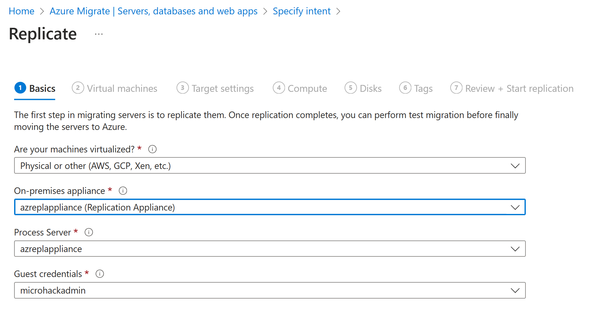

Under *Virtual Machines* select *No I'll specify the migration settings manually* and select the *frontend1* and *frontend2* server from the list.

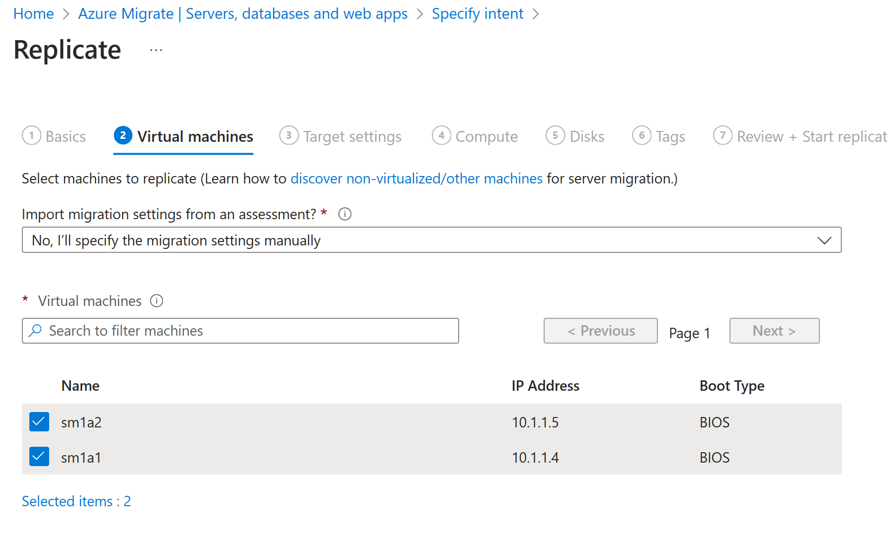

Under *Traget Settings* select the *destination-rg* Resource Group and the *destination-vnet* vNet and select next.

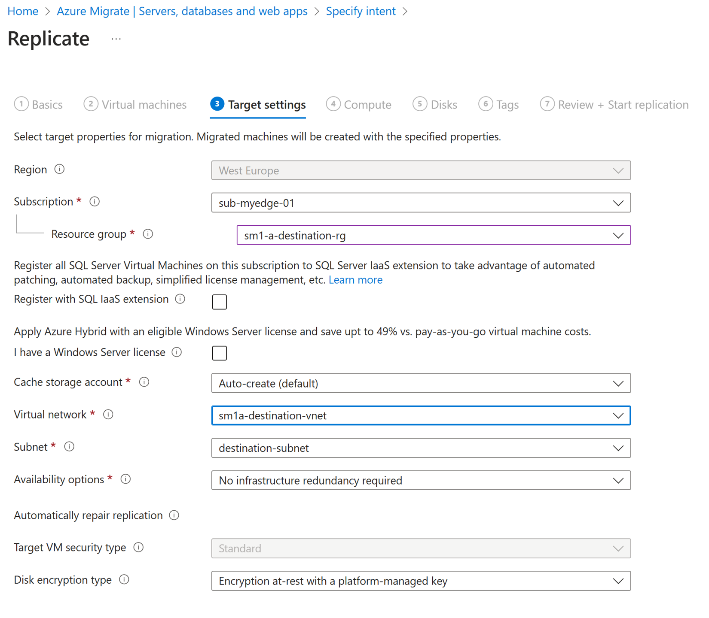

Under *Compute* acceppt the defaults and click next.

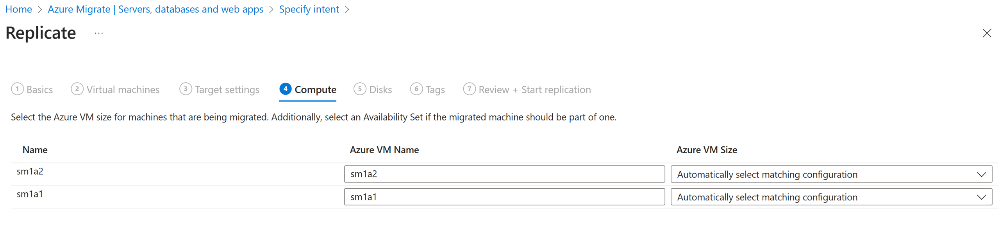

Under *Disks* change the Disk Type to *Standard SSD* and click next.

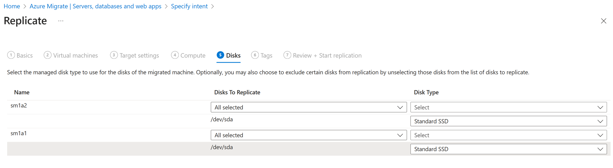

Acceppt the defaults for *Tags* and proceed to *Review + Start Replication*. Click *Replicate* to start the replication.

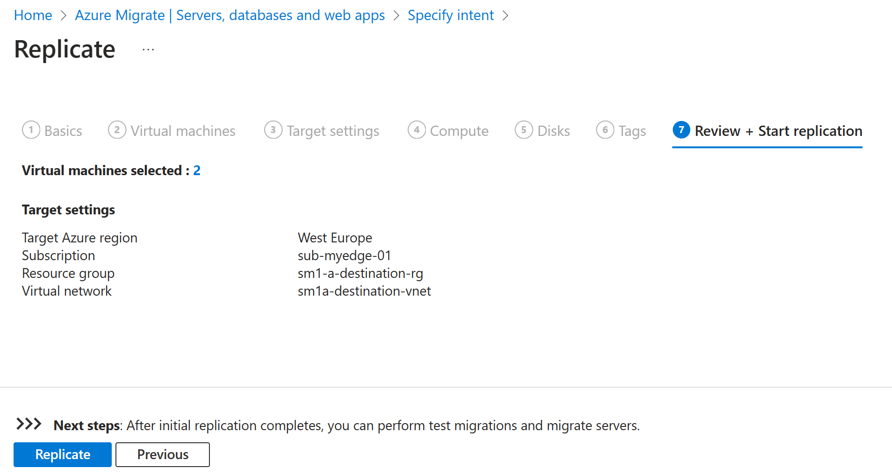

Wait until the replication has been successfully initiated.


Under *Migration Tools* you should know see that 2 Server are beeing repölicated. Click on *Overview* to see more details.


Select *Replicating Machines* from the navigation pane on the left. You should now see the 2 servers and their status.


### **Task 5: Perform Test Migration**

When delta replication begins, you can run a test migration for the VMs, before running a full migration to Azure. We highly recommend that you do this at least once for each machine, before you migrate it.

* Running a test migration checks that migration will work as expected, without impacting the on-premises machines, which remain operational, and continue replicating.
* Test migration simulates the migration by creating an Azure VM using replicated data (usually migrating to a non-production VNet in your Azure subscription).
* You can use the replicated test Azure VM to validate the migration, perform app testing, and address any issues before full migration.

Open the [Azure Portal](https://portal.azure.com) and navigate to the previousley created Azure Migrate project. Select *Servers, databases and web apps*, make sure that the right Azure Migrate Project is selected and click *Overview* in the *Migration tools* box.


Select *Perform more test migrations* under *Step 2: Test migration*.

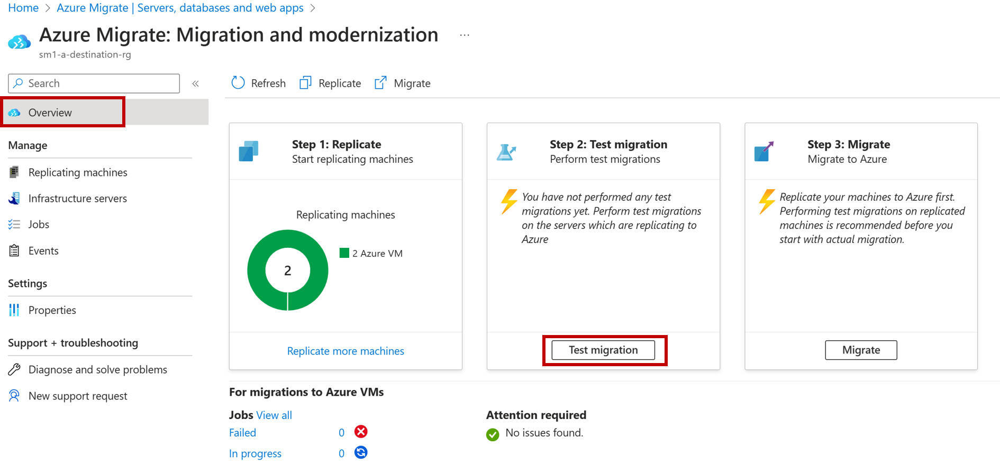

Click on the 3 dots on the right corner of each server and select *Test migration* from the drop down.

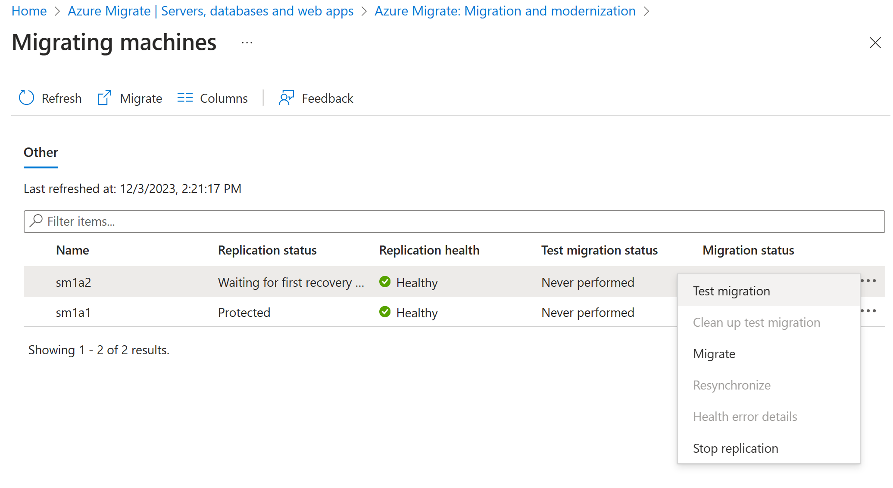

Select the *destination-vnet* and click on *Test migration*.

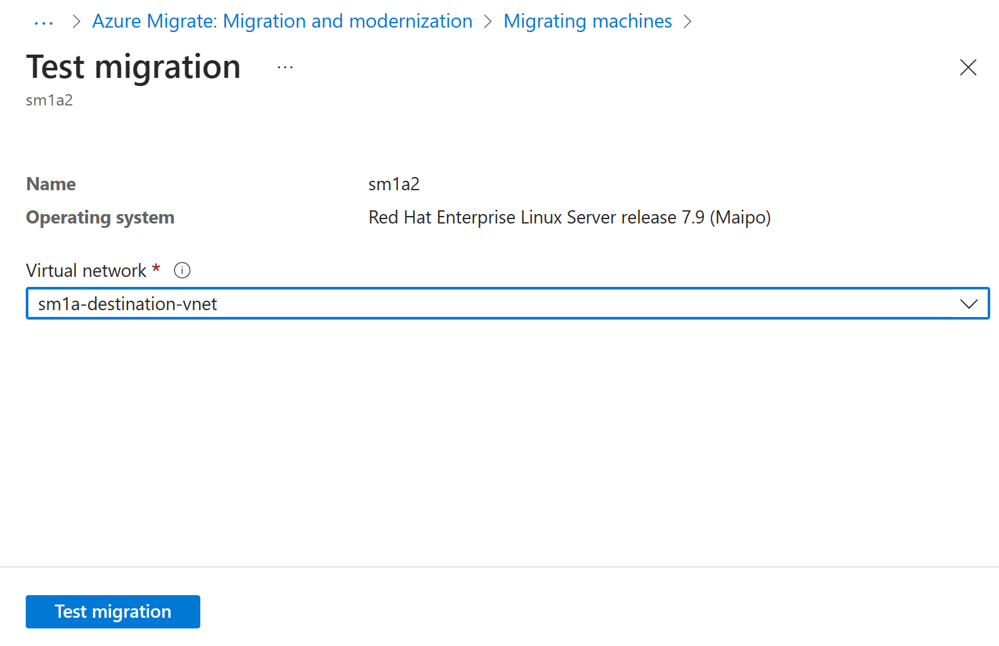

Repeat the above steps for the remaining server and wait until the test migration has been successfully finished.

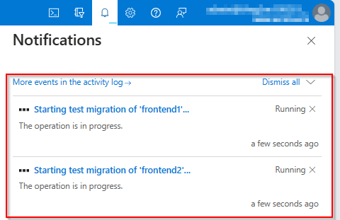

Switch back to the *Overview* section of the *Azure Migrate: Migration and modernization* page. The Cleanup should be pending for the 2 servers.

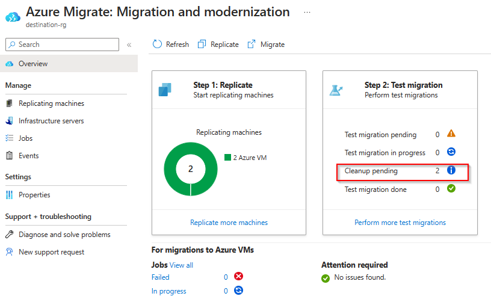


Test migration will create two corresponding VMs in the destination resource group. 
You can list the new test VMs via azure cli.

> [!IMPORTANT]
> Please ensure that you already defined the Environment Variables from Task 2 before executing the following commands.

~~~bash
# Get the name of the resource group that ends with 'destination-rg'
destinationRgName=$(az group list --query "[?ends_with(name, 'destination-rg')].name" -o tsv)
# list the new VMs in the destination resource group
az vm list -g $destinationRgName -o table
~~~

Let us verify that the web server is running on the test VMs 1.

~~~bash
# Get the name of the bastion in the destination resource group
destinationBastionName=${prefix}1$suffix-destination-bastion
# Get the Azure Resource ID of Linux VM 1 in the source resource group
destinationVm1TestId=$(az vm list -g $destinationRgName --query "[?ends_with(name, '${suffix}1-test')].id" -o tsv)
# Login to with Azure Bastion
az network bastion ssh -n $destinationBastionName -g $destinationRgName --target-resource-id $destinationVm1TestId --auth-type password --username $adminUsername
sudo ps aux | grep pm2 # look for the root entry
sudo PM2_HOME=/etc/.pm2 pm2 status # should return 'online'
curl http://localhost -v # expect 200 OK from local server
logout
~~~

Let us verify that the web server is running on the test VMs 2.

~~~bash
# Get the Azure Resource ID of Linux VM 2 in the source resource group
destinationVm2TestId=$(az vm list -g $destinationRgName --query "[?ends_with(name, '${suffix}2-test')].id" -o tsv)
# Login to with Azure Bastion
az network bastion ssh -n $destinationBastionName -g $destinationRgName --target-resource-id $destinationVm2TestId --auth-type password --username $adminUsername
sudo ps aux | grep pm2 # look for the root entry
sudo PM2_HOME=/etc/.pm2 pm2 status # should return 'online'
curl http://localhost -v # expect 200 OK from local server
logout
~~~

<!-- Select *Virtual machines* from the navigation pane on the left. There will be 2 additional servers *frontend1-test* and *frontend2-test*. Those servers were created during test migration.


Click on the *frontend1-test* server, select *Bastion* and provide the login credentials for the server. Select *Connect* to initiate the connection.


Open the Microsoft Edge browser on the server, enter *localhost* in the address bar and make sure that the web server is running.

 -->

<!-- Repeat the above steps for the *frontend2-test* system.  -->

Once you've confirmed that the applications on the systems are running as expected you can perfom a cleanup for the test migration. Change back to the *Azure Migrate: Migration and modernization* overview page, click on the 3 dots on the end of each row of the replicating servers and select *Clean up test migration*.

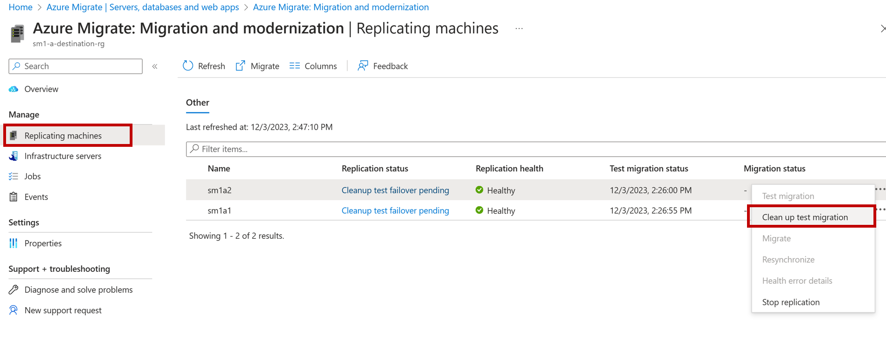

Select *Testing complete. Delete test virtual machine* and select *Cleanup Test*. Reapeat the step for the remainig server and wait until the cleanup has been successfully processed.

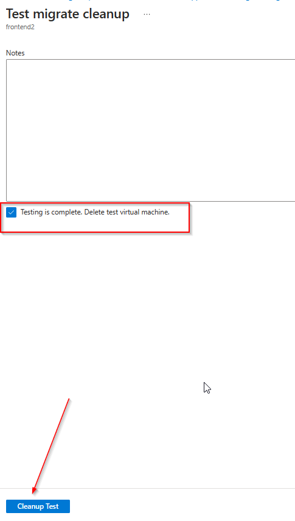

### **Task 6: Prepare Final Migration**

Currently the two frontend servers under the source Resource Group are published via an Azure Public Load Balancer. After the migration, we would like to serve the traffic via the two Linux VMs created under the destination Resource Group. Therefore we already created an Azure Public Load Balancer under the destination Resource group. The destination Public Loadbalancer does expect to serve Traffic via the two new Linux VMs via the IPs 10.2.1.4 and 10.2.1.5. 

Azure Migrate is going to create the new VMs with the next two free IPs under the destination virtual network, which will be exactly 10.2.1.4 and 10.2.1.5. 

> [!NOTE]
> Please note: Azure reserves the first four addresses (0-3) in each subnet address range, and doesn't assign the addresses. Azure assigns the next available address to a resource from the subnet address range. So it is predictable which IP addresses will be assigned to the destination VMs after the migration.


#### **Task 6.1: Create a new Azure Public Load Balancer in the destination environment**

If you like to see the already existing public Load balancer from the Azure Portal go to the destination Resource Group and select the already existiing Azure Loadbalancer.

> [!NOTE]
> You can use the Filter to look for "load*"

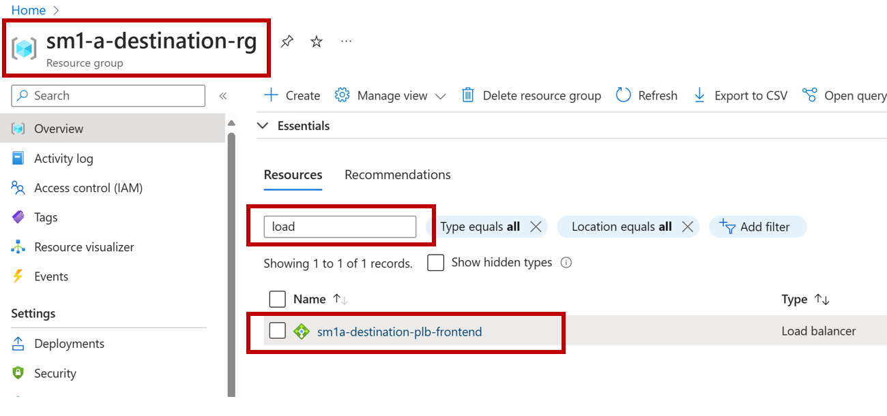

<!-- From the Azure Portal open the Load Balancing blade, select Load Balancer on the Navigation pane on the left and click *Create*.


Under *Basics* select the *destination-rg* Resource Group and provide a name for the new Load Balancer.


Under *Frontend IP configuration*, click *Add a frontend IP configuration* and create a new Public IP address.

 -->

Under *Backend Pools*, select *Add*. 

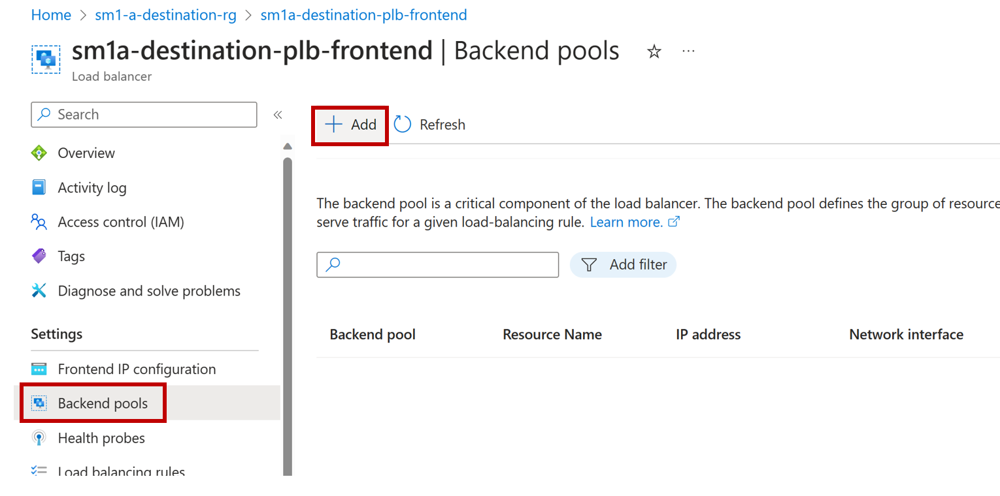

Add the following name *LoadBalancerBackEndPool* and select the *destination-vnet* as the Virtual Network.
Select "IP address" as the "Backend Pool Configuration.
Add *10.2.1.4* and *10.2.1.5* as the IP addresses.


> [!IMPORTANT]
> Please make sure to use name *LoadBalancerBackEndPool* to allow the already existing setups to work properly.

> [!NOTE]
> Please note: Azure reserves the first four addresses (0-3) in each subnet address range, and doesn't assign the addresses. Azure assigns the next available address to a resource from the subnet address range. So it is predictable which IP addresses will be assigned to the destination VMs after the migration.

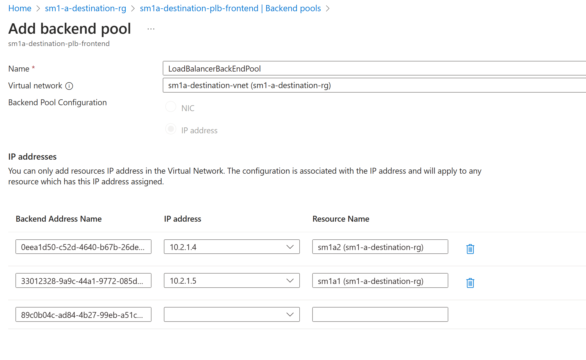

<!-- Under "Load balancing rules" select the already existing rule "myHTTPRule".

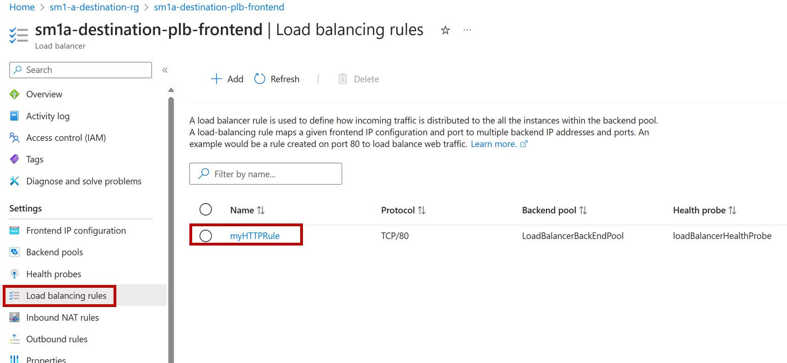 -->


<!-- 
Under *Inbound rules* click on *Add a load balancing rule* and create the load balancing rule as illustrated on the following diagram.

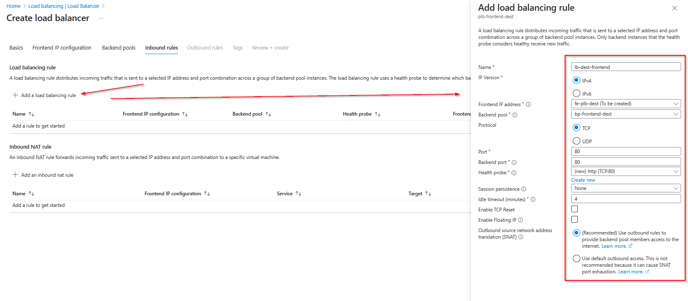

Under *Outbound rules* click *Add an outbound rule* and create the outbound rule as illustrated on the following diagram.


Proceed to the *Review + create* section, review your configuration and click *Create*


Wait until the load balancer has been created, cahnge back to the *Load balancing* section, select the *plb-frontend* Load Balancer and click *Frontend IP configuration* from the navigation pane on the left. Note down the Public IP of the *LoadBalancerFrontEnd* configuration. Repeat the step for the *plb-frontend-dest* Load Balancer.

 -->

#### **Task 6.2: Create a new Azure Traffic Manager Profile**

Azure Traffic Manager is a DNS-based traffic load balancer. It allows us to distribute traffic to public facing endpoints like our two Public Load Balancer. Traffic Manager can be created in advance to distribute traffic among the old and new load balancer. The DNS conbfiguration of the application can be changed in advance to point to the Traffic Manager Profile instead to the Public IP of the Load Balancer. Using this approach makes sure that Traffic Manager automatically removes the old Load Balancer after the frontend servers were migrated.

From the Azure Portal open the Load Balancing blade, select Traffic Manager on the Navigation pane on the left and click *Create*.


Select a name for the Traffic Manager profile and select the *destination-rg* as the Resourec Group.

> [!NOTE]
> Use routing method *Priority*, so we can make sure the traffic is only routed to the destination Load Balancer after the migration.

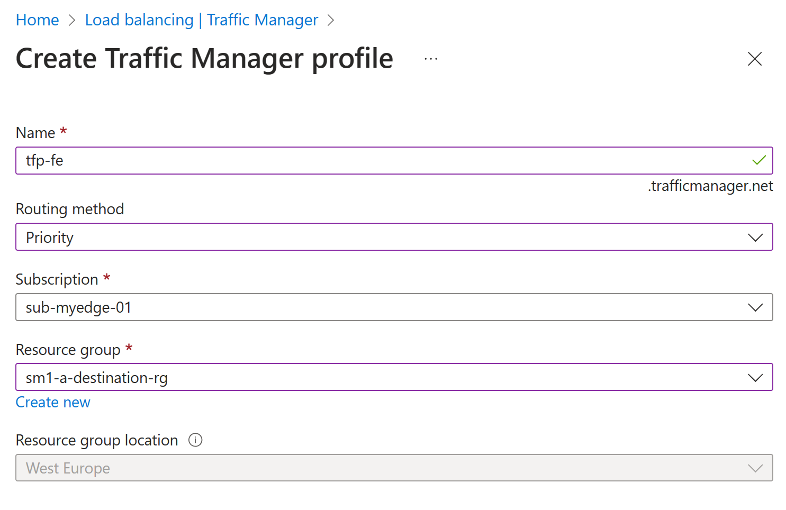

From the Load Balancing overview page select *Traffic Manager* and select the previously created Traffic Manager profile. 
Select *Endpoints* and click *Add*. Add each public IP of the source and destination Load Balancer as separate endpoints.

> [!NOTE]
> Make sure to set *Priority* value to 1 at the source load balancer.

Get the public ip of the load balancer in the destination resource group via azure cli.
~~~bash
# get public IP of the loadbalancer in the source resource group
az network public-ip list -g $sourceRgName --query "[?ends_with(name, 'lbPublicIP')].ipAddress" -o tsv # should return a public IP address
~~~

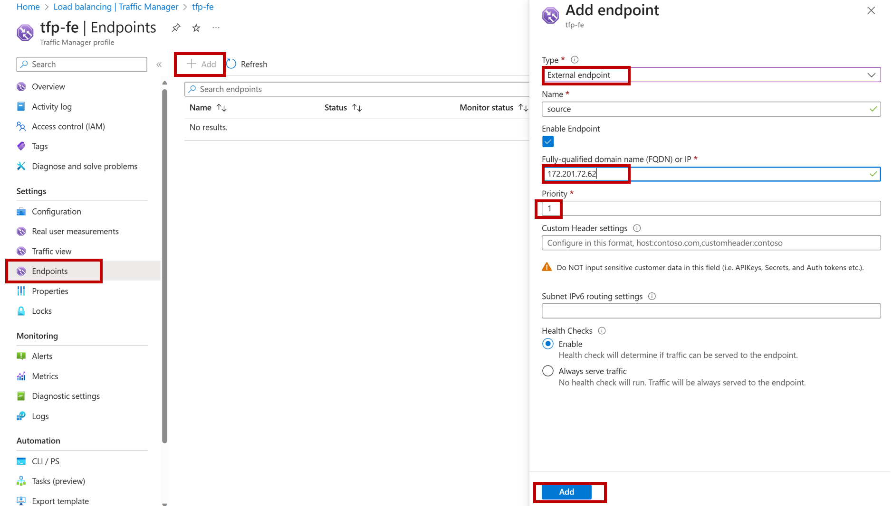

<!-- > [!NOTE]
> Please note: To be able to add the public IP addresses they need to be configured with an [DNS name lable](https://learn.microsoft.com/en-us/azure/dns/dns-custom-domain?toc=%2Fazure%2Fvirtual-network%2Ftoc.json#public-ip-address). -->

Repeat the step for the destination Load Balancer and set the *Priority* value to 2.

> [!NOTE]
> Make sure to set *Priority* value to 1 at the source load balancer.
> 

Get the public ip of the load balancer in the destination resource group via azure cli.
~~~bash
# get public IP of the loadbalancer in the source resource group
az network public-ip list -g $destinationRgName --query "[?ends_with(name, 'lbPublicIP')].ipAddress" -o tsv # should return a public IP address
~~~

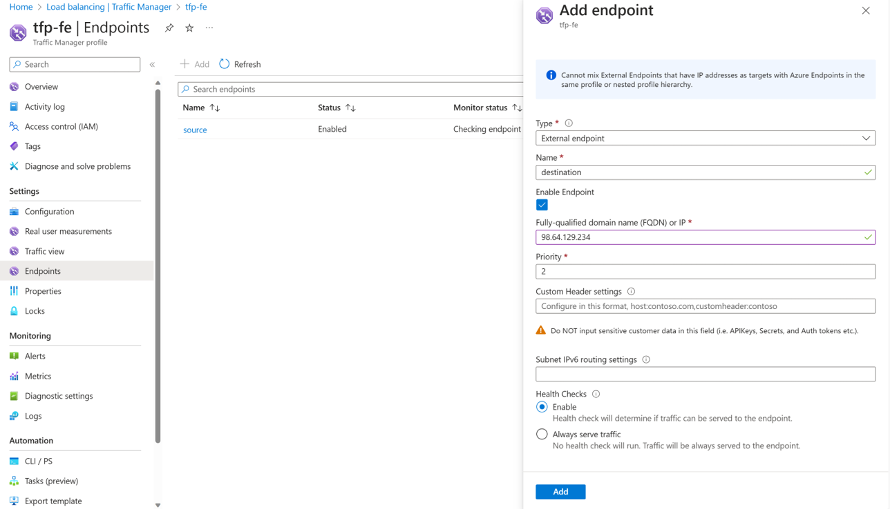

Check the Overview section under the navigation pane and note that the source load balancer is shown as *online* whereas the 
destination load balancer is shown as *degraded*. If you copy the DNS name of the Traffic Manager profile and paste it into your browser, you should be able to browse the source web servers through the Traffic Manager Profile.


<!-- 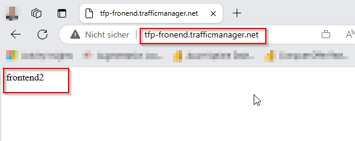 -->

You can verify if the source VMs are available via the Traffic Manager Profile by executing the following command.

~~~bash
# retrieve the name of the Traffic Manager profile inside the destination resource group
trafficManagerName=$(az network traffic-manager profile list -g $destinationRgName --query "[0].name" -o tsv)
# Get the fqdn of the Traffic Manager profile
trafficManagerFqdn=$(az network traffic-manager profile show -g $destinationRgName -n $trafficManagerName --query "dnsConfig.fqdn" -o tsv)
dig $trafficManagerFqdn
curl $trafficManagerFqdn -v
~~~

### **Task 7: Perform Final Migration**

Open the [Azure Portal](https://portal.azure.com) and navigate to the previousley created Azure Migrate project. Select *Servers, databases and web apps*, make sure that the right Azure Migrate Project is selected and click *Overview* in the *Migration tools* box. From the Overview section click in *Migrate* under *Step 3: Migrate*.


Select *Yes* to shutdown the source machines, select the two servers and click *Migrate*.

TODO: Not working to shut down the source vm, did send an ask to the product group.

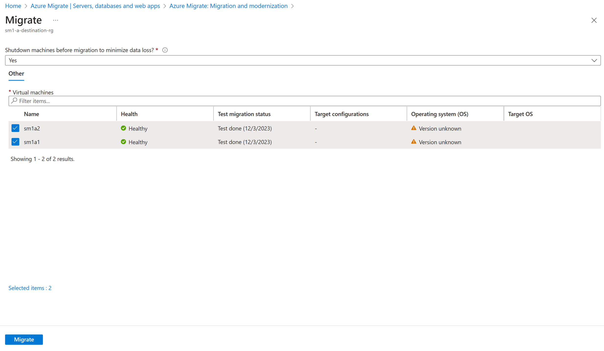

You can check the progress of the migration under the *Jobs* section within the navigation pane.

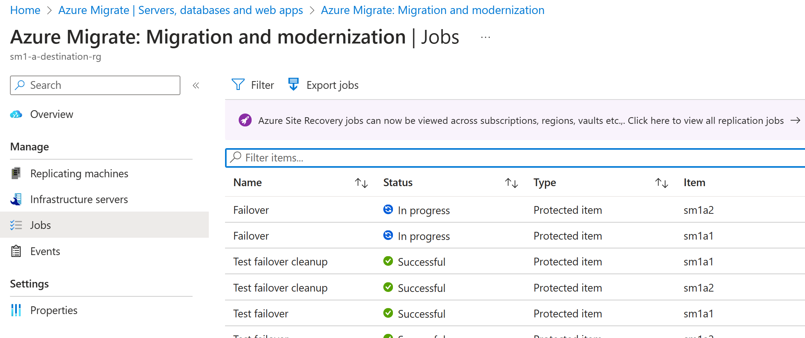

After a few minutes the migration should be successfully completed.

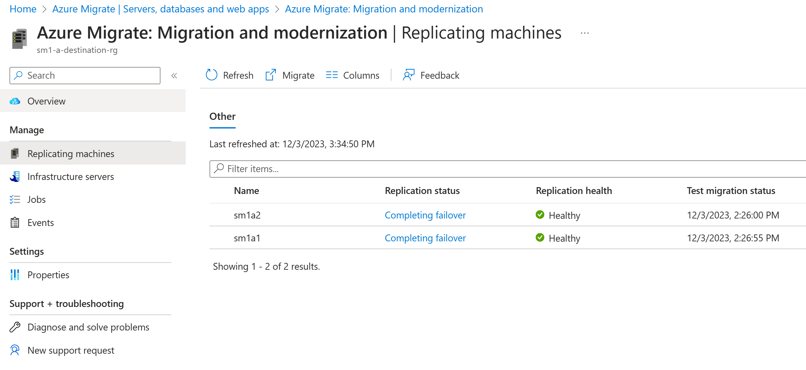

Migration will create two corresponding VMs in the destination resource group. 
You can list the new test VMs via azure cli.

> [!IMPORTANT]
> Please ensure that you already defined the Environment Variables from Task 2 before executing the following commands.

~~~bash
# Get the name of the resource group that ends with 'destination-rg'
destinationRgName=$(az group list --query "[?ends_with(name, 'destination-rg')].name" -o tsv)
# list the new VMs in the destination resource group
az vm list -g $destinationRgName -o table
~~~


You can also view the new VMs via the Azure Portal. When you change to the *Virtual machine* section within the Azure Portal you should now see 2 additional serves in the *destination-rg* Resource Group.

<!--  -->

After the migration is finish we can use Azure CLI to check the status of the endpoints in the Traffic Manager profile.

~~~bash
# retrieve the name of the Traffic Manager profile inside the destination resource group
trafficManagerName=$(az network traffic-manager profile list -g $destinationRgName --query "[0].name" -o tsv)
# Show azure traffic manager endpoints status via azure cli
az network traffic-manager endpoint list -g $destinationRgName --profile-name $trafficManagerName -o table --query "[].{Name:name, Status:endpointMonitorStatus}"
~~~

We do expect for both Traffic Manager Endpoints to be shown as *Online*:

~~~bash
Name       Status
---------  --------
migsource  Online
migdest    Online
~~~

As a final step we need to shut down the VMs in the source environment. 

~~~bash
# Get the Azure Resource ID of Linux VM 1 in the source resource group
sourceVm1Id=$(az vm list -g $sourceRgName --query "[?ends_with(name, '${suffix}1')].id" -o tsv)
sourceVm2Id=$(az vm list -g $sourceRgName --query "[?ends_with(name, '${suffix}2')].id" -o tsv)
# Stop the VMs in the source resource group
az vm stop --ids $sourceVm1Id $sourceVm2Id
# Verify once again the status on Azure Traffic Manager
az network traffic-manager endpoint list -g $destinationRgName --profile-name $trafficManagerName -o table --query "[].{Name:name, Status:endpointMonitorStatus}"
~~~


You can also see the same result via the Azure Portal. Change to the Azure Traffic Manager profile you've created previousley and look at the endpoints. 


Please note that the *fe-source* endpoint is now shown as degraded and that the *fe-dest* endpoint is shown as online.


From a user perspective nothing changed. You're still able to browse the Traffic Manager profile DNS name and you will be transparently redirected to the web servers that are know running in Azure.

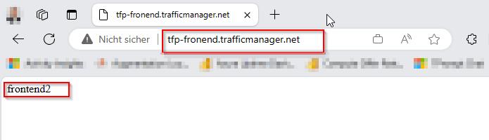

🚀🚀🚀🚀🚀🚀 Congratulations, you've successfully migrated the frontend application to Azure.🚀🚀🚀🚀🚀🚀

### **Task 8: Cleanup**

After the successfull migration you can now stop replicating the source virtual machines. Open the [Azure Portal](https://portal.azure.com) and navigate to the previousley created Azure Migrate project. Select *Servers, databases and web apps*, make sure that the right Azure Migrate Project is selected and click *Overview* in the *Migration tools* box. In the *Azure Migrate: Migration and modernization* pane, select *Replicating machines* from the navigation pane on the left, click on the 3 dots on the end of each row of the replicating servers and select *Stop replicating*.


Select *Stop replication and remove replication settings* from the drop down list and click *OK*. Repeat this step for the remaining Server.


From the Traffic Manager Profile you can now also safley remove the endpoint for the source load balancer.


> [!WARNING]
> **Please note: Normally it would be safe now to completley remove the *source-rg* Resource Group. However, we will reuse the source environment in [Challenge 6](https://github.com/microsoft/MicroHack/tree/MigrationModernizationMicroHack/03-Azure/01-03-Infrastructure/06_Migration_Datacentre_Modernization#challenge-6---modernize-with-azure) to see how Azure Migrate will help to modernize our infrastructure.**

You successfully completed challenge 5! 🚀🚀🚀

The deployed architecture now looks like the following diagram.


 **[Home](../../Readme.md)** - [Next Challenge Solution](../challenge-6/solution.md)
