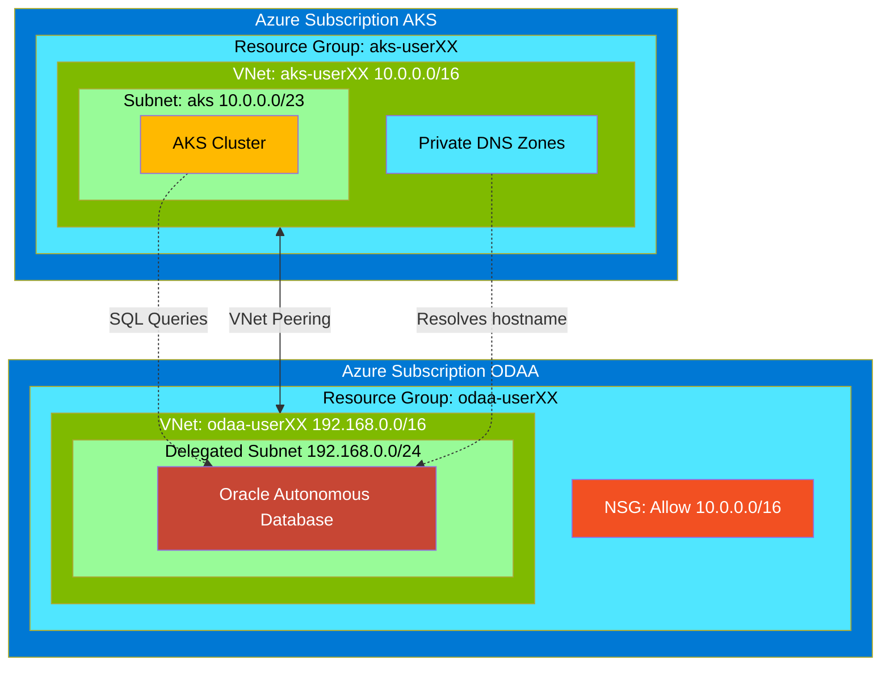
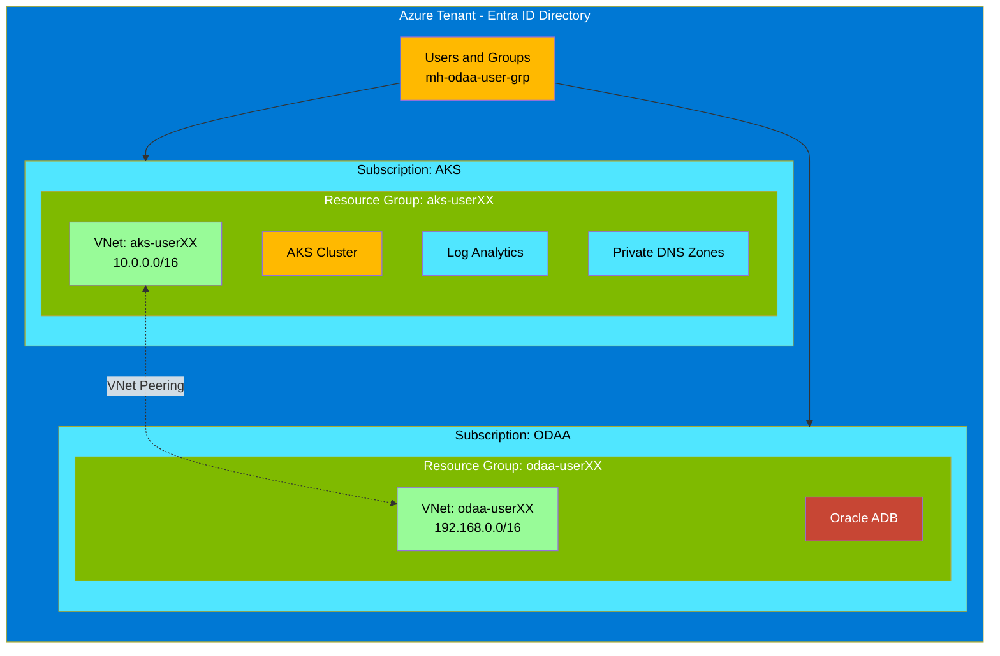
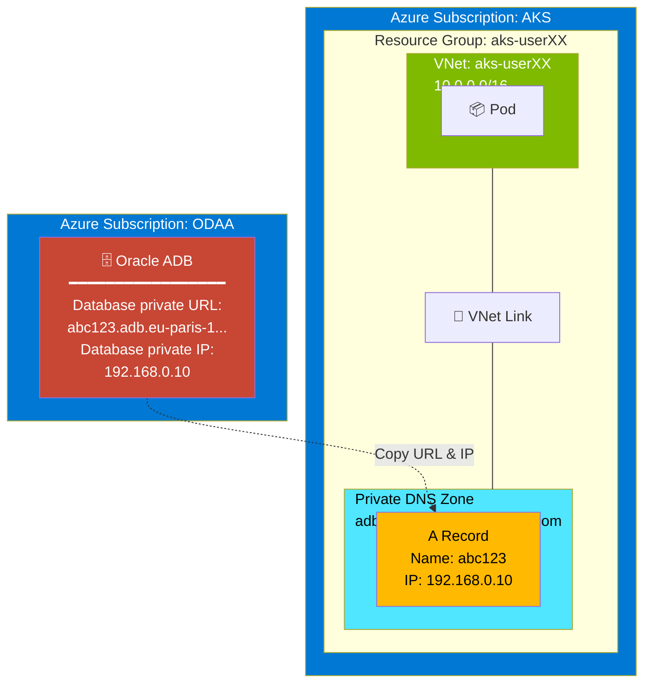
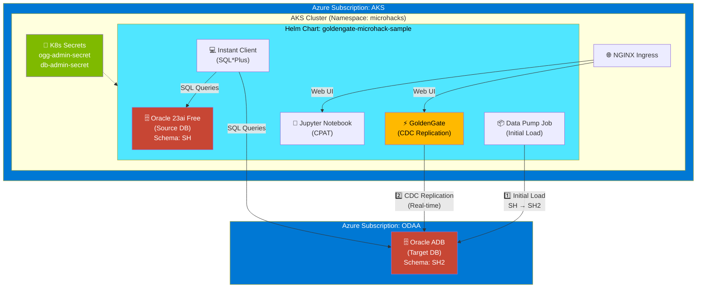



# 🚀 Microhack - Oracle Database @ Azure (ODAA)

## 📖 Introduction

This intro-level microhack (hackathon) helps you gain hands-on experience with Oracle Database@Azure (ODAA).

### What is Oracle Database at Azure
Oracle Database@Azure (ODAA) is the joint Oracle–Microsoft managed service that delivers different Database services - see [ODAA deployed Azure regions](https://apexadb.oracle.com/ords/r/dbexpert/multicloud-capabilities/multicloud-regions?session=412943632928469) running on Oracle infrastructure colocated in Azure regions while exposing native Azure management, networking, billing, integration with Azure Key Vault, Entra ID or Azure Sentinel. This microhack targets the first-tier partner solution play focused on Autonomous Database because Microsoft designates ODAA as a strategic, co-sell priority workload; the exercises give partner architects the end-to-end skills—subscription linking, delegated networking, hybrid connectivity, and performance validation—needed to confidently deliver that priority scenario for customers with Oracle-related workloads in Azure.

### What You Will Learn in the MicroHack
You will learn how to create and configure an Autonomous Database Shared of the offered Oracle Database@Azure services, how to deploy an Autonomous Database instance inside an Azure delegated subnet, update network security group (NSG) and DNS settings to enable connectivity from a simulated on-premises environment, and measure network performance to the Oracle Autonomous Database instance. To make the microhack more realistic, we will deploy the Application layer (AKS) and the Data layer (ODAA) in two different subscriptions to simulate a hub-and-spoke architecture. The following picture shows the high-level architecture of the microhack.


Furthermore, we will address the integration of ODAA into the existing Azure native services and how to use GoldenGate for migrations to ODAA and integration into Azure Fabric. 


## What is VNet Peering?

In our deployed scenario, we created in advance a VNet peering between the AKS VNet and the ADB VNet, which is required so the Kubernetes workloads can communicate privately and directly with the database.

### Architecture Diagram

The following diagram shows how VNet peering connects the AKS cluster to the Oracle Autonomous Database:



### What does VNet peering mean in detail

| Concept | Description |
|---------|-------------|
| **VNet isolation by default** | The AKS nodes run in one VNet and ADB sits in another; without peering, those address spaces are completely isolated and pods cannot reach the database IPs at all. |
| **Private, internal traffic** | Peering lets both VNets exchange traffic over private IPs only, as if they were one network. No public IPs, no internet exposure, no extra gateways are needed. |
| **Low latency, high bandwidth path** | Application-database calls stay on the cloud backbone, which is crucial for chatty OLTP workloads and for predictable performance. |
| **Simple routing model** | With peering, standard system routes know how to reach the other VNet's CIDR; you avoid managing separate VPNs, user-defined routes, or NAT just to reach the DB. |
| **Granular security with NSGs** | Even with peering in place, NSGs on subnets/NICs still control which AKS node subnets and ports (for example, 1521/2484) can reach ADB, giving you a simple but secure pattern. |

**In summary:** The peering is what turns two isolated networks (AKS and ADB) into a securely connected, private application-database path, which the scenario depends on for the workloads to function.

## Mapping between Azure and OCI

### Azure Resource Hierarchy Diagram

The following diagram shows how Azure organizes resources, mapped to our Terraform deployment:



> **Learn more:** [Azure resource organization](https://learn.microsoft.com/en-us/azure/cloud-adoption-framework/ready/azure-setup-guide/organize-resources)

### Comparison Table: Azure vs OCI

| Azure Concept | Description | OCI Equivalent |
|---------------|-------------|----------------|
| **Tenant** | Top-level identity boundary (Entra ID directory: users, groups, apps) | **Tenancy** (root container with identity domain/compartments) |
| **Subscription** | Billing + deployment boundary; holds resource groups and resources | **Tenancy + Compartments** with cost-tracking tags |
| **Resource Group** | Logical container for related resources; used for lifecycle, RBAC, policy, and tagging scope | **Compartment** (logical container for access control and organization) |
| **Region** | Geographic area containing one or more datacenters | **Region** |
| **Availability Zone** | Physically separate datacenter within a region | **Availability Domain** |

### Hierarchy Comparison

```
Azure:  Tenant --> Subscription --> Resource Group --> Resource
OCI:    Tenancy --> Compartment (nested) --> Resource
```

> **Note:** OCI compartments are closer to Azure resource groups + some subscription-scope concepts.

### Networking Concepts

| Azure | Description | OCI Equivalent |
|-------|-------------|----------------|
| **Virtual Network (VNet)** | A private network in Azure where you place resources (VMs, databases, etc.), similar to an on-premises LAN in the cloud | **Virtual Cloud Network (VCN)** |
| **Subnet** | A segment inside a VNet that groups resources and defines their IP range and routing boundaries | **Subnet** |
| **Network Security Group (NSG)** | A set of inbound/outbound rules that allow or block traffic to subnets or individual NICs, acting like a basic stateful firewall | **Security List / NSG** |
| **VNet Peering** | Connects two VNets so they can communicate using private IPs | **Local/Remote Peering** |

## Learning Objectives

- Understand how to onboard securely to Azure and prepare an account for Oracle Database@Azure administration.
- Learn the sequence for purchasing and linking an Oracle Database@Azure subscription with Oracle Cloud Infrastructure.
- Deploy an Autonomous Database instance inside an Azure network architecture and the required preparations.
- Apply required networking and DNS configurations to enable hybrid connectivity between Azure Kubernetes Service and Oracle Database@Azure resources.
- Operate the provided tooling (Helm, GoldenGate, Data Pump, SQL*Plus) to simulate data replication scenarios and measure connectivity performance.

## 📋 Prerequisites

- PowerShell Terminal
- 🔧 Install Azure CLI
- ⚓ Install kubectl
- Install Helm
- Install git and clone this repo by following the instructions in [Clone Partial Repository](docs/clone-partial-repo.md)

## 🎯 Challenges
 
### Challenge 0: Set Up Your User Account

The goal is to ensure your Azure account is ready for administrative work in the remaining challenges.

> [!IMPORTANT] Before using the AZ command line in your preferred GUI or CLI, please make sure to log out of any previous session by running the command: 
>
>```powershell 
>az logout 
>```

You will receive a user and password for your account from your microhack coach. You must change this password during the initial registration.

Start by browsing to the Azure Portal https://portal.azure.com.

Open a private browser session or create your own browser profile to sign in with the credentials you received, and register multi-factor authentication.

As a first check, you have to verify if the two resource groups for the hackathon are created via the Azure Portal https://portal.azure.com.

#### Actions

* Enable multi-factor authentication (MFA)
* Log in to the Azure portal with the assigned user
* Verify if the ODAA and AKS resource groups including resources are available
* Verify the user's roles
  
#### Success Criteria

* Download the Microsoft Authenticator app on your mobile phone
* Enable MFA for a successful login
* Check if the resource groups for AKS and ODAA are available and contain the resources via the Azure Portal https://portal.azure.com
* Check if the assigned user has the required roles in both resource groups.

#### Learning Resources

* [Sign in to the Azure portal](https://azure.microsoft.com/en-us/get-started/azure-portal)
* [Set up Microsoft Entra multi-factor authentication](https://learn.microsoft.com/azure/active-directory/authentication/howto-mfa-userdevicesettings)
* [Groups and roles in Azure](https://docs.oracle.com/en-us/iaas/Content/database-at-azure/oaagroupsroles.htm)

#### Solution

* Challenge 0: [Set Up Your User Account](./walkthrough/setup-user-account/setup-user-account.md)

### Challenge 1: Create an Oracle Database@Azure (ODAA) Subscription

> [!NOTE]
> **This is a theoretical challenge only.** No action is required from participants aside from reading the content. The ODAA subscription has already been created for you to save time.

Review the Oracle Database@Azure service offer, the required Azure resource providers, and the role of the OCI tenancy. By the end you should understand how an Azure subscription links to Oracle Cloud so database services can be created. Please consider that Challenge 1 is already realized for you to save time and is therefore a purely theoretical challenge.

#### Actions

* Move to the ODAA marketplace side. The purchasing is already done, but check out the implementation of ODAA on the Azure side.
* Check if the required Azure resource providers are enabled
  
#### Success Criteria

* Find the Oracle Database at Azure Service in the Azure Portal
* Make yourself familiar with the available services of ODAA and how to purchase ODAA

#### Learning Resources

* [ODAA in Azure an overview](https://www.oracle.com/cloud/azure/oracle-database-at-azure/)
* [Enhanced Networking for ODAA](https://learn.microsoft.com/en-us/azure/oracle/oracle-db/oracle-database-network-plan)

#### Solution

* Challenge 1: [Create an Oracle Database@Azure (ODAA) Subscription](./walkthrough/create-odaa-subscription/create-odaa-subscription.md)

### Challenge 2: Create an Oracle Database@Azure (ODAA) Autonomous Database (ADB) Instance

Walk through the delegated subnet prerequisites, select the assigned resource group, and deploy the Autonomous Database instance with the standard parameters supplied in the guide. Completion is confirmed when the database instance shows a healthy state in the portal.

#### Actions

* Verify that a delegated subnet of the upcoming ADB deployment is available

> [!IMPORTANT]
>
> Setup the ADB exactly with the following settings:
>
> **ADB Deployment Settings:**
> 1. Workload type: **OLTP**
> 2. Database version: **23ai**
> 3. ECPU Count: **2**
> 4. Compute auto scaling: **off**
> 5. Storage: **20 GB**
> 6. Storage autoscaling: **off**
> 7. Backup retention period in days: **1 day**
> 8. Administrator password: (do not use '!' inside your password)
> 9. License type: **License included**
> 10. Oracle database edition: **Enterprise Edition**

After you started the ADB deployment please clone the Github repository. Instructions are listed in the challenge 2 at the end of the ADB deployment section - see **IMPORTANT: While you are waiting for the ADB creation**

#### Success Criteria

* Delegated Subnet is available
* ADB Shared is successfully deployed

#### Learning Resources

* [How to provision an Oracle ADB in Azure](https://learn.microsoft.com/en-us/azure/oracle/oracle-db/oracle-database-provision-autonomous-database)
* [Deploy an ADB in Azure](https://docs.oracle.com/en/solutions/deploy-autonomous-database-db-at-azure/index.html)

#### Solution

* Challenge 2: [Create an Oracle Database@Azure (ODAA) Autonomous Database (ADB) Instance](./walkthrough/create-odaa-adb/create-odaa-adb.md)

### Challenge 3: Update the Oracle ADB NSG and DNS

Update the Network Security Group to allow traffic from the AKS environment and register the Oracle private endpoints in the AKS Private DNS zones. Validate connectivity from AKS after both security and DNS changes are applied.

#### Actions

* Set the NSG of the CIDR on the OCI side, to allow Ingress from the AKS on the ADB
* Extract the ODAA "Database private URL" (FQDN) and "Database private IP" and assign them to the "Azure Private DNS Zones" linked to the AKS VNet.

#### DNS Configuration Diagram

The following diagram shows how Private DNS enables AKS pods to resolve the Oracle ADB hostname:



**Steps:**

1. **Copy** the Database private URL and IP from the Azure Portal (ODAA ADB resource)
2. **Create an A record** in the Private DNS Zone with the hostname pointing to the private IP
3. **Pods in AKS** resolve the FQDN via the VNet-linked Private DNS Zone  

#### Success Criteria

* Set the NSG of the CIDR on the OCI side, to allow ingress from AKS to the ADB
* DNS is set up correctly.

> [!CAUTION]
> **Without a working DNS the next Challenge will fail.** Make sure DNS resolution is properly configured before proceeding.

#### Learning Resources

* [Network security groups overview](https://learn.microsoft.com/azure/virtual-network/network-security-groups-overview),
* [Private DNS zones in Azure](https://learn.microsoft.com/azure/dns/private-dns-privatednszone), 
* [Oracle Database@Azure networking guidance](https://docs.oracle.com/en-us/iaas/Content/database-at-azure/network.htm)

#### Solution

* Challenge 3: [Update the Oracle ADB NSG and DNS](./walkthrough/update-odaa-nsg-dns/update-odaa-nsg-dns.md)

### Challenge 4: Simulate the On-Premises Environment

Deploy the pre-built Helm chart into AKS to install the sample Oracle database, Data Pump job, GoldenGate services, and Instant Client. Manage the shared secrets carefully and verify that data flows from the source schema into the Autonomous Database target schema.

#### Architecture Diagram

The following diagram shows the components deployed via Helm and the data replication flow:



**Data Flow:**
1. **Data Pump** performs the initial bulk load of the SH schema to the SH2 schema in ADB
2. **GoldenGate** captures ongoing changes (CDC) and replicates them in near real-time
3. **Instant Client** provides SQL*Plus access to both source and target databases

#### Actions

* Deploy the AKS cluster with the responsible Pods, Jupyter notebook with CPAT, Oracle Instant Client and GoldenGate
* Verify AKS cluster deployment
* Check the connectivity from Instant Client to the ADB database and check if the SH schema from the 23ai Free Edition is migrated to the SH2 schema in the ADB
* Review the GoldenGate configuration

#### Success Criteria

* Successful AKS deployment with Pods
* Successful connection from the Instant Client to the ADB and source database
* Successful login to GoldenGate

#### Learning Resources

* [Connect to an AKS cluster using Azure CLI](https://learn.microsoft.com/azure/aks/learn/quick-kubernetes-deploy-cli),
*  [Use Helm with AKS](https://learn.microsoft.com/azure/aks/kubernetes-helm), 
*  [Oracle GoldenGate Microservices overview](https://docs.oracle.com/en/middleware/goldengate/core/23/coredoc/), 
*  [Oracle Data Pump overview](https://docs.oracle.com/en/database/oracle/oracle-database/26/sutil/oracle-data-pump-overview.html)

#### Solution

* Challenge 4: [Simulate the On-Premises Environment](./walkthrough/onprem-ramp-up/onprem-ramp-up.md)

---

### Challenge 5: Measure Network Performance to Your Oracle Database@Azure Autonomous Database

Use the Instant Client pod to run the scripted SQL latency test against the Autonomous Database and collect the round-trip results. Optionally supplement the findings with the lightweight TCP probe to observe connection setup timing.

#### Actions
* Log in to the Instant Client and execute a first performance test from the AKS cluster against the deployed ADB

#### Success Criteria
* Successful login to the ADB via the Instant Client
* Successful execution of the available performance scripts

#### Learning Resources
* [Connect to Oracle Database@Azure using SQL*Plus](https://docs.oracle.com/en-us/iaas/autonomous-database-serverless/doc/connect-sqlplus-tls.html), 
* [Diagnose metrics and logs for Oracle Database@Azure](https://learn.microsoft.com/en-us/azure/cloud-adoption-framework/scenarios/oracle-on-azure/oracle-manage-monitor-oracle-database-azure)

#### Solution
* Challenge 5: [Measure Network Performance to Your Oracle Database@Azure Autonomous Database](./walkthrough/perf-test-odaa/perf-test-odaa.md)

<!-- - 🔌 Challenge 4: **[Do performance test from inside the AKS cluster against the Oracle ADB instance](./walkthrough/c3-perf-test-odaa.md)**
- 🦫 Challenge 5: **[Review data replication via Beaver](./walkthrough/c5-beaver-odaa.md)**
- 🏗️ Challenge 6: **[Setup High Availability for Oracle ADB](./walkthrough/c6-ha-oracle-adb.md)**
- 📊 Challenge 7: **[(Optional) Use Estate Explorer to visualize the Oracle ADB instance](./walkthrough/c7-estate-explorer-odaa.md)**
- 🧵 Challenge 8: **[(Optional) Use Azure Data Fabric with Oracle ADB](./walkthrough/c8-azure-data-fabric-odaa.md)** -->
 
## Contributors

*To be added*

