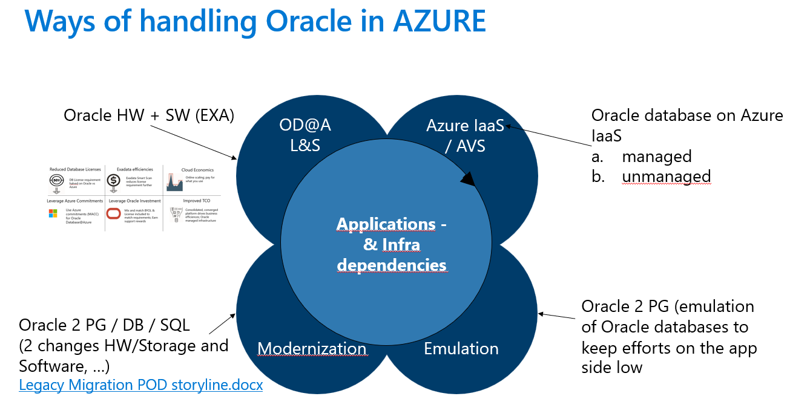

# Discovery and pre-assessment of Oracle database 

Oracle provides extended performance reports for their databases. Depending on the used database and available licenses you can choose between

1. Automatic Workload Repository Reports so called AWR's 
2. Statspack Report

For the discovery of Oracle databases we are created a parsing solution called ATROPOSS. The solution is running completely inside the browser. So, no backend is involved. The discovery of the reports can be extended with the outputs of RVTools and CSV outputs of SQL scripts. 

Information about the web tool ATROPOSS is available under the following online URL's.

## Online URL's
[ATROPOSS Homepage](https://atroposs.com/)

[ATROPOSS Documentation](https://atroposs-migration.github.io/)
[ATROPOSS application](https://app.atroposs.com/#/start)

Additional tool set to support discoveries / assessment 

[ORA2PG](https://ora2pg.darold.net/)
[oMigrator](https://github.com/cybertec-postgresql/ora_migrator)
[SSMA](https://learn.microsoft.com/de-de/sql/ssma/oracle/sql-server-migration-assistant-for-oracle-oracletosql?view=sql-server-ver16)

Furthermore a huge number of Microsoft partner eco systems can be leveraged to modernized Oracle database in the most apporpriate direction depending on the data strategy of the customer.

An highlevel overview is added subsequent.

