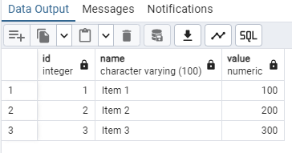

# Grant access to the on the demo_schema schema to user demo_schema

1. Connect to the PostgreSQL database as a superuser
psql -h microhack.postgres.database.azure.com -p 5432 -U postgres postgres

2. Grant usage and create privileges on the schema to the demo_schema user
GRANT USAGE ON SCHEMA demo_schema TO demo_schema;
GRANT CREATE ON SCHEMA demo_schema TO demo_schema;

3. Grant all privileges on all tables in the schema to the demo_schema user
GRANT ALL PRIVILEGES ON ALL TABLES IN SCHEMA demo_schema TO demo_schema;

4. Grant all privileges on all sequences in the schema to the demo_schema user
GRANT ALL PRIVILEGES ON ALL SEQUENCES IN SCHEMA demo_schema TO demo_schema;

5. Validate the available tables in the user Schema of PostgreSQL - demo_schema

~~~bash
SELECT table_name
FROM information_schema.tables
WHERE table_schema = 'demo_schema'
  AND table_name = 'ADDRESSES';

SELECT count(*) FROM "demo_schema"."ADDRESSES";
~~~

__Create the table if required__
~~~bash
CREATE TABLE addresses (
    address_id SERIAL PRIMARY KEY,
    street VARCHAR(100),
    city VARCHAR(50),
    state VARCHAR(50),
    zip_code VARCHAR(10)
);
~~~

6. Enablen of requested Extensions in PostgreSQL Flexible Server
 
   1. Enable the extension in the serverparameter of the PGFS and save the settings.

   2. Create the extension in the database where you want to use it.
   __create extension oracle_fdw;__
   __create extension orafce;__
   __create extension plpgsql;__

   Following a short explanation of the used extensions in PostgreSQL

__oracle_fdw__
The oracle_fdw (Foreign Data Wrapper) extension allows PostgreSQL to access data stored in Oracle databases. It enables you to create foreign tables in PostgreSQL that map to tables in an Oracle database, allowing you to query and manipulate Oracle data as if it were part of your PostgreSQL database.

Key Features:
Allows PostgreSQL to query Oracle tables.
Supports SELECT, INSERT, UPDATE, and DELETE operations on Oracle tables.
Enables integration between PostgreSQL and Oracle databases.

__orafce__
The orafce (Oracle Functions Compatibility Extension) extension provides a set of functions and packages that are compatible with Oracle's PL/SQL. It helps in migrating applications from Oracle to PostgreSQL by providing Oracle-compatible functions, packages, and data types.

Key Features:
Provides Oracle-compatible functions and packages.
Eases the migration of applications from Oracle to PostgreSQL.
Includes functions like DECODE, NVL, GREATEST, LEAST, and many others.

__plpgsql__
The plpgsql (Procedural Language/PostgreSQL) extension is the default procedural language for PostgreSQL. It allows you to write stored procedures, functions, and triggers using a syntax similar to Oracle's PL/SQL.

Key Features:

Enables the creation of stored procedures, functions, and triggers.
Provides control structures like loops, conditionals, and exception handling.
Supports complex business logic and data manipulation within the database.

# How to query remote date between Oracle and Azure PGFS

The following demo will show quickly how to use the PostgreSQL extension ORACLE_FDW to query remote table data from an Oracle database and ingest them into an AZURE PGFS. 

1. Delete in advance the remote example with oracle_fdw
~~~bash
DROP SERVER oracle_server CASCADE;
DROP USER MAPPING FOR demo_schema SERVER oracle_server;
DROP TABLE postgres_table;
DROP FOREIGN TABLE oracle_table;
~~~

2. Connect via SQLPlus on the oracle database and create in our case a small demo table for the test case.

__The following table creation can be skipped if the addressess table will be used!__
~~~bash
## Create the oracle_table

CREATE TABLE oracle_table (
    id NUMBER PRIMARY KEY,
    name VARCHAR2(100),
    value NUMBER
);
~~~

In the second step insert data into the created oracle table oracle_table:
~~~bash
INSERT INTO oracle_table (id, name, value) VALUES (1, 'Item 1', 100);
INSERT INTO oracle_table (id, name, value) VALUES (2, 'Item 2', 200);
INSERT INTO oracle_table (id, name, value) VALUES (3, 'Item 3', 300);
~~~

3. Connect as Admin on the PostgreSQL Flexible Server and enable the extension ORACLE_FDW if not already done.

Use the PostgreSQL CLI psql or PGADMIN

The connection to the Azure PostgreSQL database server depends on the used deployment method User/Password or Entra ID.
~~~bash
psql -h microhack.postgres.database.azure.com -p 5432 -U Maik.Sandmann@microsoft.com postgres
~~~

4. Enable the required extensions in PostgreSQL Server
~~~bash
CREATE EXTENSION oracle_fdw;
~~~

5. Grant rights to the database user
~~~bash
GRANT USAGE ON FOREIGN DATA WRAPPER oracle_fdw TO demo_schema;
GRANT CREATE ON DATABASE your_database TO demo_schema;
~~~

6. Connect as the created user demo_schema on the PostgreSQL database

7. Create a foreign server that points to the Oracle database use the ip address of the vm server

a. 48.209.90.102 or the fqdn
b. microhack.westeurope.cloudapp.azure.com

~~~bash
CREATE SERVER oracle_server
FOREIGN DATA WRAPPER oracle_fdw
OPTIONS (dbserver '//48.209.90.102:1521/XE');
~~~

8. Create a user mapping that maps a PostgreSQL user to an Oracle user.
~~~bash
CREATE USER MAPPING FOR demo_schema
SERVER oracle_server
OPTIONS (user 'demo_schema', password 'password');
~~~

9. Create foreign tables in PostgreSQL that map to the Oracle tables.

Oracle table names are case-sensitive. If the table was created without quotes, it is stored in uppercase. Ensure that the table name is specified correctly in the PostgreSQL foreign table definition.
~~~bash
CREATE FOREIGN TABLE oracle_table (
    id INTEGER,
    name VARCHAR(100),
    value NUMERIC
)
SERVER oracle_server
OPTIONS (schema 'DEMO_SCHEMA', table 'ORACLE_TABLE');
~~~

10. Create a PostgreSQL table
~~~bash
CREATE TABLE postgres_table (
    id INTEGER,
    name VARCHAR(100),
    value NUMERIC
);
~~~

11. Insert data from Oracle into PostgreSQL
~~~bash
INSERT INTO postgres_table (id, name, value)
SELECT id, name, value
FROM oracle_table;
~~~

12. Query the remote ingested data from the Oracle database
~~~bash
SELECT * from postgres_table;
~~~

 

