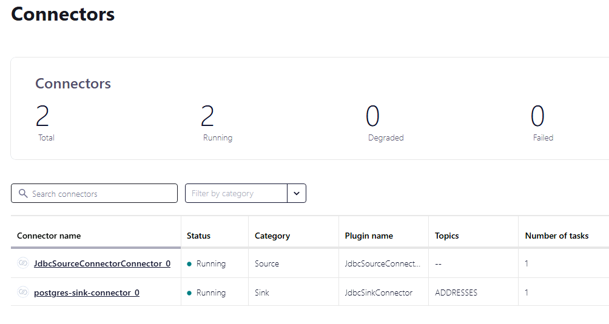
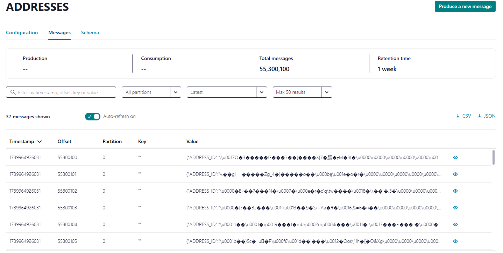
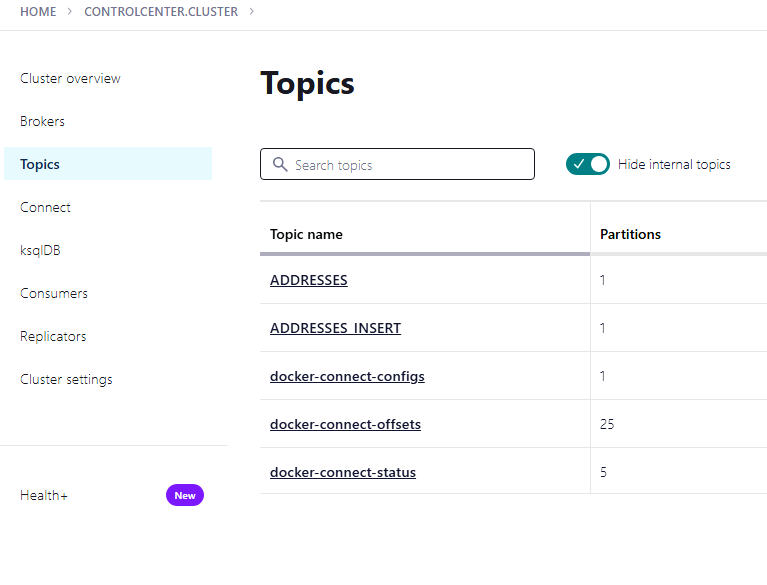
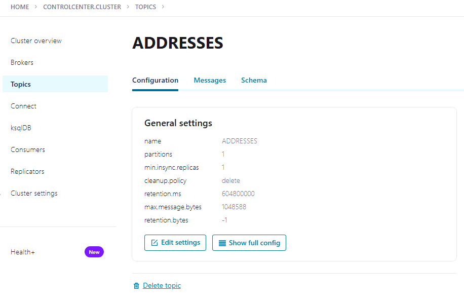

# online documentation 

https://docs.confluent.io/kafka-connectors/oracle-cdc/current/prereqs-validation.html#connect-oracle-cdc-source-prereqs-user-privileges

All required files should be already uploaded on the used VM servers under directory

__for the following example please change the responsible directory or add the path to the commands__

/challenge3
    /kafka
        /connectors
        /plugins
    /docker-compose
    /oracle
        /11g (express edition)
        /21c (express edition)
    /ora2pg
        /config
        /data

If files are missing use SCP command to copy them into on the remote linux docker-compose server

From local to remote:
    scp -C -i ./remoteServerKey.ppk -r <path_to_file> azuresuer@<ip>:/kafka
Form remote to local:
    scp -C -i ./remoteServerKey.ppk -r azureuser@<ip>:/kafka <path_to_file>

## Step 1: 
Set Up Kafka with or without Debezium 
    - choose confluent
    - choose kafka apache

Create a Docker Compose File: Create a docker-compose.yml file to set up Kafka, Zookeeper, and Debezium

see file docker-compose.yml

Check the docker-compose logs of the different container if errors happened.

docker-compose logs zookeeper
docker-compose logs kafka
docker-compose logs connect

If the container doesn't communicate well and you are using docker networks, you can delete existing created networks via:

~~~bash
docker network prune
~~~

~~~bash
docker-compose up --build -d 'service_name'
~~~

## Step 2:
Configure the Oracle database 

### a. Connect to the oracle docker container:
~~~bash
docker exec -it oracle-xe1 bash

su - oracle

mkdir -p /u01/app/oracle/admin/dpdump
chmod 755 /u01/app/oracle/admin/dpdump

## The path for the 21c Express Edition needs to be adopted
/opt/oracle/oradata/admin/ppdump
~~~

### b. Create database user which will be used for the challenge 3
~~~bash
sqlplus / as sysdba

CREATE USER demo_schema IDENTIFIED BY "password";
GRANT CONNECT, RESOURCE TO demo_schema;
~~~

### c. Create database schema - see orcl_setup01_oracle_schema.sql

If the datbase schema DEMO_SCHEMA is already created you can skip the step f and continue with step 3!
Execute initial data load

1. see [setup02_initial_dataload.sql](../../environment_setup/Oracle_Schema/setup01_oracle_schema.sql)
2. see [setup01_oracle_schema.sql](../../environment_setup/Oracle_Schema/setup02_initial_dataload.sql)
   
verify the data load ingested the demo data successfully

~~~bash
SELECT count(*) FROM DEMO_SCHEMA.EMPLOYEES;

    COUNT(*)
    ----------
    10000
~~~

Create demo table for testing purposes. See [ Demo table for Kafak setup ](./testtableforkafka.md)

For old Oracle release utl_file_dir can be used in newer release directory replaced utl_file_dir

### a. SET the utl_file_dir parameter if database is 11g:

~~~bash
ALTER SYSTEM SET utl_file_dir = '/u01/app/oracle/admin/dpdump' SCOPE=SPFILE;

SHUTDOWN IMMEDIATE
STARTUP
~~~

--------------------------------------------------------------------------------
    
Do not execute the following code snippet does not need to be considered in the challegen instead continue directly with (B) the creation of a directory (go to b.)
    SQL> declare
    file_open utl_file.file_type;
    begin
    file_open:=utl_file.fopen('LOGMINER_DIR','utl_file.ora', 'w');
    utl_file.fclose(file_open);
    end;
    /

    show parameter utl_file_dir;

    
    If you disable UTL_FILE execute the following steps:
    
    a. ALTER SYSTEM SET utl_file_dir = '' SCOPE=SPFILE;
    b. SHUTDOWN IMMEDIATE
    c. STARTUP

--------------------------------------------------------------------------------

### b. Use Directory instead of utl_file_dir if possible

~~~bash
## for oracle database 11g for example
show parameter utl_file_dir;
~~~

__Query and create directory for logminer
~~~bash
SET LINESIZE 150
COLUMN owner FORMAT A20
COLUMN directory_name FORMAT A25
COLUMN directory_path FORMAT A80

SELECT *
FROM   dba_directories
ORDER BY owner, directory_name;

CREATE OR REPLACE DIRECTORY logminer_dir AS '/u01/app/oracle/admin/dpdump';

GRANT READ, WRITE ON DIRECTORY logminer_dir TO public;
    
select * from dba_directories where directory_name like 'LOGMINER_DIR';
~~~

Create the LogMiner Dictionary:
~~~bash
EXECUTE DBMS_LOGMNR_D.BUILD('dictioniary.ora', 'LOGMINER_DIR');
~~~

### c: Enable SUPPLEMENTAL Logging in the oracle database:

~~~bash
ALTER DATABASE ADD SUPPLEMENTAL LOG DATA;

--- if newer oracle databases are used!!! In our case for an 11g Rel.2 not required.
ALTER SYSTEM SET ENABLE_GOLDENGATE_REPLICATION=TRUE SCOPE=BOTH;    
      
ALTER SYSTEM SWITCH LOGFILE;
~~~

Depending on the use database 11g vs 19c for example check the following parameter of the database:

~~~bash
SHOW PARAMETER ENABLE_GOLDENGATE_REPLICATION;

NAME                                 TYPE        VALUE
------------------------------------ ----------- ------------------------------
enable_goldengate_replication        boolean     TRUE

SHOW PARAMETER SUPPLEMENTAL_LOG_DATA;

NAME                                 TYPE        VALUE
------------------------------------ ----------- ------------------------------
supplemental_log_data_min            boolean     TRUE
supplemental_log_data_pk             boolean     TRUE
supplemental_log_data_ui             boolean     TRUE
~~~

### d:  Switch database in archive log mode

~~~bash
sqlplus / as sysdba
    
SELECT LOG_MODE FROM V$DATABASE;
    
LOG_MODE
------------
NOARCHIVELOG
    
show parameter LOG_ARCHIVE_DEST_1
    
NAME                                 TYPE        VALUE
------------------------------------ ----------- ------------------------------
log_archive_dest_1                   string
log_archive_dest_10                  string
log_archive_dest_11                  string
log_archive_dest_12                  string
log_archive_dest_13                  string
log_archive_dest_14                  string
log_archive_dest_15                  string
log_archive_dest_16                  string
log_archive_dest_17                  string
log_archive_dest_18                  string
log_archive_dest_19                  string
    

    
ALTER SYSTEM SET LOG_ARCHIVE_DEST_1 = 'LOCATION=USE_DB_RECOVERY_FILE_DEST' scope=both;
    
System altered.
~~~
    
Now you need to stop the Oracle database and to mount it.

~~~bash

SHUTDOWN IMMEDIATE

Database closed.
Database dismounted.
ORACLE instance shut down.

STARTUP MOUNT

ORACLE instance started.
    
Total System Global Area 1073738888 bytes
Fixed Size                  9143432 bytes
Variable Size             532676608 bytes
Database Buffers          524288000 bytes
Redo Buffers                7630848 bytes
Database mounted.
    

ALTER DATABASE ARCHIVELOG;
    
Database altered.

  
ALTER DATABASE OPEN;
    
Database altered.

  
ALTER SYSTEM SWITCH LOGFILE;

System altered.

So now you can check that archive log mode is enabled in your Oracle database.

SELECT NAME FROM V$ARCHIVED_LOG;
    
NAME
--------------------------------------------------------------------------------
/u01/app/oracle/fra/ORADB/archivelog/2021_04_10/o1_mf_1_19_j72qftrw_.arc
    

SELECT LOG_MODE FROM V$DATABASE;
    
LOG_MODE
------------
ARCHIVELOG
    
show parameter LOG_ARCHIVE_DEST_1
    
NAME                                 TYPE        VALUE
------------------------------------ ----------- ------------------------------
log_archive_dest_1                   string      LOCATION=USE_DB_RECOVERY_FILE_
                                                    DEST
log_archive_dest_10                  string
log_archive_dest_11                  string
log_archive_dest_12                  string
log_archive_dest_13                  string
log_archive_dest_14                  string
log_archive_dest_15                  string
log_archive_dest_16                  string
log_archive_dest_17                  string
log_archive_dest_18                  string
log_archive_dest_19                  string
~~~

Continue with -enable supplemental logging for specific table if needed!!!

------------------------------------------------------------------------------
Enable supplemental logging:
~~~bash
ALTER DATABASE ADD SUPPLEMENTAL LOG DATA (ALL) COLUMNS;
~~~

Verify that supplemental logging has been enabled:
~~~bash
SELECT SUPPLEMENTAL_LOG_DATA_MIN, SUPPLEMENTAL_LOG_DATA_PK, SUPPLEMENTAL_LOG_DATA_UI FROM V$DATABASE;
~~~

Enable minimal supplemental logging:
~~~bash
ALTER DATABASE ADD SUPPLEMENTAL LOG DATA (PRIMARY KEY) COLUMNS;
~~~
-------------------------------------------------------------------------------

Enable supplemental logging for specific tables if needed:
~~~bash
ALTER TABLE DEMO_SCHEMA.EMPLOYEES ADD SUPPLEMENTAL LOG DATA (ALL) COLUMNS;

BEGIN
   FOR t IN (SELECT table_name FROM all_tables WHERE owner = 'DEMO_SCHEMA') LOOP
      EXECUTE IMMEDIATE 'ALTER TABLE demo_schema.' || t.table_name || ' ADD SUPPLEMENTAL LOG DATA (ALL) COLUMNS';
   END LOOP;
END;
/
~~~

Check the logging table in schema demo_schema
~~~bash 
SELECT TABLE_NAME, LOG_GROUP_NAME, LOG_GROUP_TYPE, ALWAYS 
FROM DBA_LOG_GROUPS 
WHERE OWNER = 'DEMO_SCHEMA';
~~~

### e: Create a database user for debezium

There are different privileges required in Oracle for a replication with CDC. In general the privileges can be divided into:

    a.  Basic ones, like connect, resource
    b.  Directory access used for log mining
    c.  Table and Catalog access

~~~bash
CREATE USER debezium IDENTIFIED BY debezium;
GRANT CONNECT, RESOURCE TO debezium;
GRANT SELECT ANY TABLE TO debezium;
GRANT SELECT_CATALOG_ROLE TO debezium;
GRANT CREATE SESSION TO debezium;
GRANT EXECUTE_CATALOG_ROLE TO debezium;
GRANT FLASHBACK ANY TABLE TO debezium;
GRANT SELECT ANY TRANSACTION TO debezium;
GRANT READ, WRITE ON DIRECTORY logminer_dir TO debezium;
GRANT LOGMINING TO debezium;
~~~

For older databases like 11g rel.2 where the role logmining is not available grant the following roles:

~~~bash
CREATE USER debezium IDENTIFIED BY debezium;

GRANT READ, WRITE ON DIRECTORY logminer_dir TO debezium;
GRANT CONNECT, RESOURCE TO debezium;
GRANT SELECT ANY TABLE TO debezium;
GRANT SELECT_CATALOG_ROLE TO debezium;
GRANT CREATE SESSION TO debezium;
GRANT EXECUTE_CATALOG_ROLE TO debezium;
GRANT FLASHBACK ANY TABLE TO debezium;
GRANT SELECT ANY TRANSACTION TO debezium;
GRANT ALTER ANY TABLE TO debezium;
GRANT CREATE TABLE TO debezium;
GRANT LOCK ANY TABLE TO debezium;
GRANT CREATE SEQUENCE TO debezium;
GRANT CREATE TRIGGER TO debezium;
GRANT CREATE VIEW TO debezium;
GRANT UNLIMITED TABLESPACE TO debezium;
~~~

If the database user DEMO_SCHEMA is not already created during the DB part. If yes execute the ALTER commands.
~~~bash

ALTER USER demo_schema QUOTA UNLIMITED ON USERS;
ALTER USER demo_schema QUOTA 1000M ON USERS;
GRANT CONNECT, RESOURCE TO demo_schema;
GRANT READ, WRITE ON DIRECTORY logminer_dir TO demo_schema;
GRANT SELECT ANY TABLE TO demo_schema;
GRANT SELECT_CATALOG_ROLE TO demo_schema;
GRANT CREATE SESSION TO demo_schema;
GRANT EXECUTE_CATALOG_ROLE TO demo_schema;
GRANT FLASHBACK ANY TABLE TO demo_schema;
GRANT SELECT ANY TRANSACTION TO demo_schema;
GRANT ALTER ANY TABLE TO demo_schema;
GRANT CREATE TABLE TO demo_schema;
GRANT LOCK ANY TABLE TO demo_schema;
GRANT CREATE SEQUENCE TO demo_schema;
GRANT CREATE TRIGGER TO demo_schema;
GRANT CREATE VIEW TO demo_schema;
GRANT UNLIMITED TABLESPACE TO demo_schema;
CREATE ROLE CDC_PRIVS;
GRANT CREATE SESSION TO CDC_PRIVS;
GRANT LOGMINING TO CDC_PRIVS;
GRANT SELECT ON V_$DATABASE TO demo_schema;
GRANT SELECT ON V_$INSTANCE to demo_schema;
GRANT SELECT ON V_$THREAD TO demo_schema;
GRANT SELECT ON V_$PARAMETER TO demo_schema;
GRANT SELECT ON V_$NLS_PARAMETERS TO demo_schema;
GRANT SELECT ON V_$TIMEZONE_NAMES TO demo_schema;
GRANT SELECT ON V_$LOG TO demo_schema;
GRANT SELECT ON V_$LOGFILE TO demo_schema;
GRANT SELECT ON V_$LOGMNR_CONTENTS TO demo_schema;
GRANT SELECT ON V_$ARCHIVED_LOG TO demo_schema;
GRANT SELECT ON V_$ARCHIVE_DEST_STATUS TO demo_schema;
GRANT EXECUTE ON SYS.DBMS_LOGMNR TO demo_schema;
GRANT EXECUTE ON SYS.DBMS_LOGMNR_D TO demo_schema;
~~~

 
 

__Note: Zookeeper will be desupported and replaced soon. In the docker compose yaml file we already used KRAFT and or Zookeeper. At the moment it is still possible to use Zookeeper if desired. Information about Kraft is available on the Apache documentation see [here](https://kafka.apache.org/documentation/#kraft)__

 
 

# Step 3: 
Start the Kafka Cluster: Run the following command to start the Kafka cluster:

start the container zookeeper, kafka, connect 

 ~~~bash   
docker-compose ps zookeeper, kafka, connect
~~~

If not already done start the docker-compose container with the following command for the example:

~~~bash
docker compose -f 'kafka\docker-compose.yaml' up -d --build 'zookeeper'
~~~

The following command would start the complete containers -- don't use the one here docker-compose up -d

## Step 3a:

check the if the containers are reachable. if your are using docker on Windows use the WSL in Windows.

 ~~~bash  

## If Zookeeper is used in Debezium for Confluent deployment not required because KRAFT is used.
docker exec -it zookeeper bash

nc -zv zookeeper 2181

Ncat: Version 7.92 ( https://nmap.org/ncat )
Ncat: Connected to 172.18.0.2:2181.
Ncat: 0 bytes sent, 0 bytes received in 0.01 seconds.

nc -zv broker 9092

Ncat: Version 7.92 ( https://nmap.org/ncat )
Ncat: Connected to 172.18.0.3:9092.
Ncat: 0 bytes sent, 0 bytes received in 0.01 seconds.

nc -zv connect 8083

Ncat: Version 7.92 ( https://nmap.org/ncat )
Ncat: Connected to 172.18.0.4:8083.
Ncat: 0 bytes sent, 0 bytes received in 0.01 seconds.

nc -zv oracle-xe1 1521

Ncat: Version 7.92 ( https://nmap.org/ncat )
Ncat: Connected to 172.18.0.4:1521.
Ncat: 0 bytes sent, 0 bytes received in 0.01 seconds.
~~~

# Step 4: Test and execute a first message in kafka

1. open a new terminal/cmd and log into the kafka container

~~~bash   
docker exec -it  broker bash
~~~        

a. Create the test topic called test-topic
 ~~~bash   
 
/bin/kafka-topics --create --topic test-topic --bootstrap-server broker:9092 --partitions 1 --replication-factor 1
~~~

b. Create a producer to send a test message
 ~~~bash          
/bin/kafka-console-producer --broker-list broker:9092 --topic test-topic

Write in the producer the message: My first Kafka message!

My first KAFKA Topic!

~~~

c. open a new terminal/cmd and log into the kafka container 

~~~bash   
docker exec -it  broker bash
~~~

d. Now we will consumed the previous meesage using kafka shell.

~~~bash   
/bin/kafka-console-consumer --bootstrap-server broker:9092 --topic test-topic --from-beginning
~~~

e. Delete the topics
 ~~~bash  
kafka-topics --delete --topic test-topic --bootstrap-server broker:9092
~~~

2. Additonal kafka commands how the manage and maintain kafka

a. For later purpose potentially required 
~~~bash
kafka-topics --delete --topic test-topic --bootstrap-server broker:9092
~~~

b. set the retention time of a topic
 ~~~bash  

## Not required in the demo

kafka-configs.sh --alter --entity-type topics --entity-name schema-changes.oracle --add-config retention.ms=1000 --bootstrap-server localhost:9092
~~~

# Step 5: Configure the oracle connector of Debezium

oracle-source-connector-initial-Tableload-JDBC.json
    Identify the database.hostname by using docker inspect container-name (in our case oracle-xe)

{
  "name": "JdbcSourceConnectorConnector_0",
  "config": {
    "name": "JdbcSourceConnectorConnector_0",
    "connector.class": "io.confluent.connect.jdbc.JdbcSourceConnector",
    "tasks.max": "1",
    "connection.url": "jdbc:oracle:thin:@48.209.90.102:1521/xe",
    "connection.user": "demo_schema",
    "connection.password": "********",
    "table.whitelist": "ADDRESSES",
    "catalog.pattern": "DEMO_SCHEMA",
    "dialect.name": "OracleDatabaseDialect",
    "mode": "bulk",
    "table.types": "table"
  }
}

There are a lot of variables available with can be set for the connector definition. For demo purpose the configured connector will do an initial data load of a table from Oracle to Postgresql. Next to that CDC connectors can be used as well. In this case the demo data model needs to be extended and the table should have always primary keys and timestamp columns like (record created, changed).

Following some explanations of variables available for the connector creation:

    name: The name of the connector instance.
    connector.class: The fully qualified class name of the connector.
    tasks.max: The maximum number of tasks that should be created for this connector.
    database.server.name: A logical name that identifies the database server/cluster. This name is used to namespace all the Kafka topics generated by this connector.
    database.hostname: The hostname or IP address of the Oracle database server.
    database.port: The port number on which the Oracle database is listening.
    database.user: The username to connect to the Oracle database.
    database.password: The password to connect to the Oracle database.
    database.dbname: The SID (System Identifier) of the Oracle database.
    database.pdb.name: The name of the pluggable database (PDB) if applicable.
    database.out.server.name: The name of the Oracle LogMiner out server.
    database.history.kafka.bootstrap.servers: The Kafka bootstrap servers used for storing the database history.
    database.history.kafka.topic: The Kafka topic used for storing the database schema history.
    database.connection.adapter: The adapter to use for capturing changes. In this case, it is set to logminer.
    database.tablename.case.insensitive: Whether table names are case insensitive.
    database.history.store.only.monitored.tables.ddl: Whether to store DDL changes only for monitored tables.
    database.history.skip.unparseable.ddl: Whether to skip unparseable DDL statements.

---------------------------------------------------------------------------------------------------------

# Step6: Connector registration in Debezium / Confluent via curl 

please consider the curl command in powershell vs bash / cmd looks different. The following curl command is for a BASH / CMD execution.

How to create or recreate the oracle debezium connector

~~~bash
curl -i -X POST -H "Accept:application/json" -H "Content-Type:application/json" http://localhost:8083/connectors/ -d @oracle-source-connector-initial-Tableload-JDBC.json
~~~

Option: Display all registered connectors in Kafka Connect:
~~~bash
curl -X GET http://localhost:8083/connectors
~~~

Option: How to delete the oracle debezium /confluent connector if required and recreate the one 
~~~bash
curl -X DELETE http://localhost:8083/connectors/JdbcSourceConnectorConnector_0
~~~

Error management in case the oracle-connector can not be registered

If there are http 400 error you can test the oracle connection from the kafka-connect container by following the next steps:

~~~bash
docker exec -it connect /bin/bash
~~~

2. Create the following small java program:
~~~bash
The file can be found in the java folder in the challenge 3 directory.

        import java.sql.Connection;
        import java.sql.DriverManager;
        import java.sql.SQLException;

        public class OracleConnectionTest {
            public static void main(String[] args) {
                String jdbcUrl = "jdbc:oracle:thin:@oracle-xe1:1521:XE";
                String username = "demo_schema";
                String password = "password";

                try {
                    Connection connection = DriverManager.getConnection(jdbcUrl, username, password);
                    System.out.println("Connected to Oracle database!");
                    connection.close();
                } catch (SQLException e) {
                    e.printStackTrace();
                }
            }
        }
~~~

1. check the java verions on your docker conatiner kafka-connect via the following commands:

~~~bash
java -version
openjdk version "11.0.15" 2022-04-19

javac -source 11 -target 11 .\OracleConnectionTest.java
~~~

upload the compiled java class on the docker container
~~~bash
docker cp .\OracleConnectionTest.class connect:/tmp
~~~   

Execute the OracleConnectionTest file on the docker container
~~~bash
java -cp .:/kafka/plugins/ojdbc8.jar OracleConnectionTest

In case of an error verify the right timezone of the Java user!
java -Duser.timezone=UTC -cp .:/kafka/plugins/ojdbc8.jar OracleConnectionTest

Connected to Oracle database!
~~~
    
Further possibilities is to change the variable in oracle-connector.json

    - Instead of "database.dbname": "XE", try "database.SID": "XE"

    - Is the topic.prefix required in oracle-connector.json ? "topic.prefix": "oracle-"

    - Instead of using hostname, port, dbname you can try out -  "database.url": "jdbc:oracle:thin:@<ip address>:49161:XE",

    - In the /kafka/connect/debezium-connector-oracle of the kafka-connect container is the ojdbc8.jar missing. We have created a soft link here - 
  
        ~~~bash 
        ln -s ../ojdb8.jar /kafka/connect/debezium-connector-oracle/.
        ~~~

if the status displayed error the log level in the file oracle-connector.json can be set on DEBUG in the Config settings via the following command:
          
          CONNECT_LOG4J_ROOT_LOGLEVEL: DEBUG

    a. Typical error are for example ora-02248 if the database is not configured as a Multi-Tenancy database.
        
        If your database is not a multi-tenacy database removed in the oracle-connector.json file the like database.pdb.name
    
    b. The error ORA-18716: {0} not in any time zone.DATE indicates that there is an issue with the time zone configuration in your Oracle database

        online information about how to set time_zone in Oracle can be found here - https://oracle-base.com/articles/misc/setting-database-time-zones-in-oracle

### See Solution subsequent:

~~~bash
sqlplus / as sysdba

SELECT DBTIMEZONE FROM DUAL;

    DBTIMEZONE
    ----------
    +00:00

SELECT SESSIONTIMEZONE FROM DUAL;

    SESSIONTIMEZONE
    ---------------
    +00:00

SELECT * FROM V$TIMEZONE_FILE;

    FILENAME                VERSION     CON_ID
    -------------------- ---------- ----------
    timezlrg_32.dat             32          0
~~~

     
Set Time zone in the following example to UTC: 
~~~bash
ALTER DATABASE SET TIME_ZONE = 'UTC';

-- restart database if required:
         
SHUTDOWN IMMEDIATE
STARTUP
~~~

not required here:
~~~bash
ALTER SESSION SET TIME_ZONE = 'UTC';
~~~

Following the output if you don't have any issues.

    Output:
    HTTP/1.1 201 Created
    Date: Sun, 26 Jan 2025 10:13:22 GMT
    Location: http://localhost:8083/connectors/oracle-connector
    Content-Type: application/json
    Content-Length: 710
    Server: Jetty(9.4.44.v20210927)

        {

        "name": "JdbcSourceConnectorConnector_0",

        "config": {

        "name": "JdbcSourceConnectorConnector_0",

        "connector.class": "io.confluent.connect.jdbc.JdbcSourceConnector",

        "tasks.max": "1",

        "connection.url": "jdbc:oracle:thin:@<ip_address>:1521/demo_schema",

        "connection.user": "demo_schema",

        "connection.password": "*****",

        "table.whitelist": "ADDRESSES",

        "mode": "bulk"

        }

        }

## Step 6b: How to pause, resume and restart the connector

### Verify the connector status
~~~bash
curl -X GET http://localhost:8083/connectors/JdbcSourceConnectorConnector_0/status
~~~

Output:
{"name":"oracle-connector","connector":{"state":"RUNNING","worker_id":"172.18.0.4:8083"},"tasks":[{"id":0,"state":"RUNNING","worker_id":"172.18.0.4:8083"}],"type":"source"}

In case of an error see:
"state":"FAILED"

 
__In case the state flag is FAILED the connector needs to be DELETED and re-registered.__
 

### Pause the connector
~~~bash
curl -X PUT http://localhost:8083/connectors/JdbcSourceConnectorConnector_0/pause
~~~

### Resume the connector
~~~bash
curl -X PUT http://localhost:8083/connectors/JdbcSourceConnectorConnector_0/resume
~~~

### Alternatively, restart the connector
~~~bash
curl -X POST http://localhost:8083/connectors/JdbcSourceConnectorConnector_0/restart
~~~

### Potentially you can to delete and register the connector again. How to delete the oracle debezium connector if required and recreate the one 
~~~bash
curl -X DELETE http://localhost:8083/connectors/JdbcSourceConnectorConnector_0

curl -i -X POST -H "Accept:application/json" -H "Content-Type:application/json" http://localhost:8083/connectors/ -d @oracle-source-connector-initial-Tableload-JDBC.json

~~~

# Step 7: Check kafka connect logs
~~~bash
docker-compose logs connect 
    
docker logs <container-name>
~~~

Check if all tables are logged for supplemental logging?!
~~~bash
docker exec -it oracle-xe1 bash
su - oracle

sqlplus / as sysdba

ALTER TABLE DEMO_SCHEMA.TEST_TABLE ADD SUPPLEMENTAL LOG DATA (ALL) COLUMNS;
....
ALTER TABLE DEMO_SCHEMA.AUDIT_LOG ADD SUPPLEMENTAL LOG DATA (ALL) COLUMNS;
ALTER TABLE DEMO_SCHEMA.TRANSFORMED_EMPLOYEES ADD SUPPLEMENTAL LOG DATA (ALL) COLUMNS;
~~~

# Step8:

Check against if the connection is still working properly.

on windows / linux -> 
~~~bash
curl -X GET http://localhost:8083/connectors/JdbcSourceConnectorConnector_0/status

on linux (need to install JQ) ->
curl -s localhost:8083/connector-plugins|jq '.[].class'

~~~

Output:

    {"name":"JdbcSourceConnectorConnector_0",
    "connector":
    {
        "state":"RUNNING",
        "worker_id":"172.18.0.6:8083"
    },
        "tasks":
        [{
            "id":0,
            "state":"RUNNING",
            "worker_id":"172.18.0.6:8083"
        }],
        "type":"source"
    }

# Step 8a:

Check Kafka Broker Status
You can check the status of your Kafka broker by listing the topics available in the cluster. This can be done using the kafka-topics.sh script.

List Topics:
~~~bash
docker exec -it broker topics --bootstrap-server broker:9092 --list
~~~

Output:
__consumer_offsets
confluent_connect_configs
confluent_connect_offsets
confluent_connect_statuses
oracle-connector
__oracle-connector.DEMO_SCHEMA.ADDRESSES__
oracle-connector.DEMO_SCHEMA.AUDIT_LOG
oracle-connector.DEMO_SCHEMA.BANK_ACCOUNTS
oracle-connector.DEMO_SCHEMA.DEPARTMENTS
oracle-connector.DEMO_SCHEMA.EMPLOYEES
oracle-connector.DEMO_SCHEMA.EMPLOYEE_DEPARTMENTS
oracle-connector.DEMO_SCHEMA.LOG_MINING_FLUSH
schema-changes-inventory

Describe a Topic
To get more details about a specific topic, you can describe it using the kafka-topics.sh script.

Describe Topic
    

# Step 9: Create a PostgreSQL sink connector

    create postgres-sink-connector.json file and add the following parameter:

Registered the postgreSQL JDBC sink connector postgres-sink-connector-intial-Tableload-JDBC.json

{
  "name": "postgres-sink-connector_0",
  "config": {
    "name": "postgres-sink-connector_0",
    "connector.class": "io.confluent.connect.jdbc.JdbcSinkConnector",
    "tasks.max": "1",
    "topics": "addresses",
    "connection.url": "jdbc:postgresql://microhack.postgres.database.azure.com:5432/postgres",
    "connection.user": "demo_schema",
    "connection.password": "********",
    "insert.mode": "INSERT",
    "auto.create": "true",
    "auto.evolve": "true"
  }
}

__Please keep in mind the Topics will create the destination table in PostgreSQL Flexible server based naming (upper- or lower case).__

    name: The name of the connector.
    connector.class: The class name of the connector to use.
    tasks.max: The maximum number of tasks to create for this connector.
    topics: The Kafka topics to consume data from.
    connection.url: The JDBC connection URL for the PostgreSQL database.
    connection.user: The username to connect to the PostgreSQL database.
    connection.password: The password to connect to the PostgreSQL database.
    auto.create: Whether to automatically create the destination table.
    auto.evolve: Whether to automatically evolve the table schema.
    insert.mode: The insertion mode to use.
    pk.mode: The primary key mode to use.
    pk.fields: The fields to use as the primary key.
    delete.enabled: Whether to enable deletion of records.
    schema.enable: Whether to enable schema support.
    key.converter: The converter class to use for the key.
    key.converter.schemas.enable: Whether to enable schema support for the key converter.
    value.converter: The converter class to use for the value.
    value.converter.schemas.enable: Whether to enable schema support for the value converter.
    table.name.format: The format string for the destination table name.

## Verify that the search path in PostgreSQL is reflecting the correct database

~~~bash
ALTER ROLE demo_schema SET search_path TO demo_schema, public;
~~~

## Register the postgreSQL sink connector
~~~bash
curl -i -X POST -H "Accept:application/json" -H "Content-Type:application/json" http://localhost:8083/connectors/ -d @postgres-sink-connector-intial-Tableload-JDBC.json
~~~

    output:
    HTTP/1.1 201 Created
    Date: Mon, 27 Jan 2025 09:49:42 GMT
    Location: http://localhost:8083/connectors/postgres-sink-connector_0
    Content-Type: application/json
    Content-Length: 497
    Server: Jetty(9.4.44.v20210927)

    {"name":"postgres-sink-connector_0","config":
    {"connector.class":
    "io.confluent.connect.jdbc.JdbcSinkConnector","tasks.max":
    "1","topics":
    "schema-changes.oracle","connection.url":
    "jdbc:postgresql://microhack.postgres.database.azure.com:5432/postgres","connection.user":
    "debezium","connection.password":"debezium","auto.create":"true","auto.evolve":"true","insert.mode":"upsert","pk.mode":
    "record_key","pk.fields":"id","delete.enabled":"false","name":"postgres-sink-connector"},"tasks":[],"type":"sink"}

## Verify that connector is running 
~~~bash
curl -X GET http://localhost:8083/connectors/postgres-sink-connector_0/status
~~~

If required Delete and re-register the connector again.
~~~bash
curl -X DELETE http://localhost:8083/connectors/postgres-sink-connector_0

curl -i -X POST -H "Accept:application/json" -H "Content-Type:application/json" http://localhost:8083/connectors/ -d @postgres-sink-connector-intial-Tableload-JDBC.json
~~~

Output:
{"name":"postgres-sink-connector_0","connector":{"state":"RUNNING","worker_id":"172.18.0.4:8083"},"tasks":[{"id":0,"state":"RUNNING","worker_id":"172.18.0.4:8083"}],"type":"sink"}

# Step 10: Monitoring of the data replication 

Connect into the broker container
~~~bash
docker exec -it broker bash
~~~
     

List all Kafka topics to verify if schema-changes-oracle exists.
~~~bash
kafka-topics --bootstrap-server localhost:9092 --list
~~~

Check the logs of the Kafka brokers to ensure they are running and healthy.
~~~bash
docker-compose logs broker
~~~

execute the following query to track the changes
~~~bash   
kafka-console-consumer --bootstrap-server localhost:9092 --topic schema-changes-oracle --from-beginning
~~~

Output: 
Processed a total of 0 messages

# Step 11: Required configuration step in kafka

a. Display the kafka-topics version
~~~bash
kafka-topics --version

curl -X GET http://localhost:8083/

{"version":"3.2.0","commit":"38103ffaa962ef50","kafka_cluster_id":"qrb6F8mTTzGIPERygDo2NA"}
~~~

b. Check Kafka Broker Configuration: Ensure that your Kafka broker is correctly configured and running
~~~bash
kafka-topics --list --bootstrap-server localhost:9092
~~~

b. Change of the retention time of the topic
~~~bash 
kafka-configs --alter --bootstrap-server localhost:9092 --entity-type topics --entity-name schema-changes-oracle --add-config retention.ms=157680000000
~~~~

c. display of the topic 
~~~bash
kafka-topics --describe --bootstrap-server localhost:9092 --topic schema-changes-oracle
~~~

Topic: schema-changes-oracle    TopicId: LcnKvNSuSduL4hNzUgUe7w PartitionCount: 1       ReplicationFactor: 1    Configs: retention.ms=157680000000
        Topic: schema-changes-oracle    Partition: 0    Leader: 1       Replicas: 1     Isr: 1  Elr: N/A        LastKnownElr: N/A

d. delete topics in kafka if required
~~~bash
kafka-topics --delete --topic schema-changes-oracle --bootstrap-server localhost:9092
~~~

Verify the connectors are working by changing one data in table employees

~~~bash
UPDATE demo_schema.employees
SET salary = 75000
WHERE employee_id = 1;

commit;
~~~

~~~bash
/bin/kafka-console-consumer --bootstrap-server kafka:9092 --topic oracle-connector.DEMO_SCHEMA.EMPLOYEES --from-beginning
~~~

# Moinitoring Kafka Cluster via available UI's

1. Control-Center from Confluent
2. KafDrop
3. ...

Following the monitoring of your Kafka Cluster will be done via Control-Center.

## Connect monitoring
 
 
 

 
 
 

 
 
 

 
 
 

## Topics monitoring

 
 
 

 
 
 