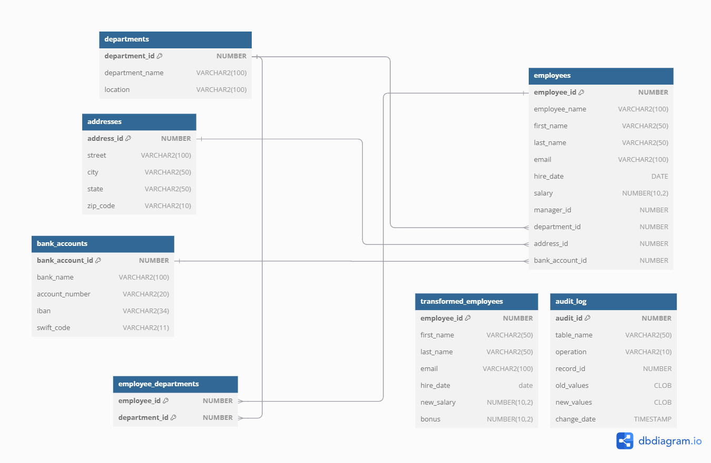

# Step-by-step Instructions how to Deploy Oracle database schema in an Oracle Multitenancy 19c database 

## Overview

Oracle Data Model and Script Documentation
Overview
This document provides an overview of the Oracle data model and the associated script. It explains the purpose and functionality of the various components, including tables, sequences, triggers, functions, and procedures.

__order and purpose of the scripts__

1. data_management_queries.sql  - consist different queries to cleanup the database schema if required
                                - calculate database volume
                                - list changed data inside the tables executed by start_datagenerator.sql
2. setup01_schema.sql         - create the data model inside the Oracle database for the migration tests
3. setup02_initial_dataload.sql         - create a test dataset of 10000 records. The number of records can be changed in the loop (FOR i IN 1..10000 LOOP)
4. setup03_start_datagenerator.sql      - to start the random changes (insert,update,delete) inside the database schema with an frequence of 2 minutes
 

__Tables:__

__departments__
Columns:
department_id: Primary key, unique identifier for each department.
department_name: Name of the department.
location: Location of the department.
employees

__employees__
Columns:
employee_id: Primary key, unique identifier for each employee.
first_name: First name of the employee.
last_name: Last name of the employee.
email: Email address of the employee.
hire_date: Date when the employee was hired.
salary: Salary of the employee.
manager_id: Foreign key referencing the employee's manager.
department_id: Foreign key referencing the department.
address_id: Foreign key referencing the address.
bank_account_id: Foreign key referencing the bank account.
employee_departments

__employee_departments__
Columns:
employee_id: Foreign key referencing the employee.
department_id: Foreign key referencing the department.
Primary Key: Composite key consisting of employee_id and department_id.
transformed_employees

__transformed_employees__
Columns:
employee_id: Primary key, unique identifier for each transformed employee.
first_name: First name of the transformed employee.
last_name: Last name of the transformed employee.
email: Email address of the transformed employee.
hire_date: Date when the transformed employee was hired.
new_salary: Transformed salary of the employee.
bonus: Bonus of the employee.

__audit_log__
Columns:
audit_id: Primary key, unique identifier for each audit log entry.
table_name: Name of the table where the change occurred.
operation: Type of operation (INSERT, UPDATE, DELETE).
record_id: ID of the record that was changed.
old_values: Old values of the record before the change.
new_values: New values of the record after the change.
change_date: Timestamp when the change occurred.
Sequences
audit_seq
Used to generate unique identifiers for the audit_log table.
Functions
calculate_bonus

__logic__

Parameters: p_salary (numeric)
Returns: Numeric
Description: Calculates a 5% bonus based on the provided salary.
transform_and_insert

Returns: Void
Description: Transforms employee data by increasing the salary by 10% and calculating the bonus. Inserts the transformed data into the transformed_employees table.
Procedures
ingest_1_million_records
Returns: Void
Description: Inserts 1 million records into the employees table with realistic data.
Triggers
trg_departments_audit
Description: Logs changes (INSERT, UPDATE, DELETE) to the departments table into the audit_log table.
Scheduler Jobs
DATA_GENERATOR_JOB
Description: A scheduled job that periodically runs the data_generator function to ingest data into the employees table.