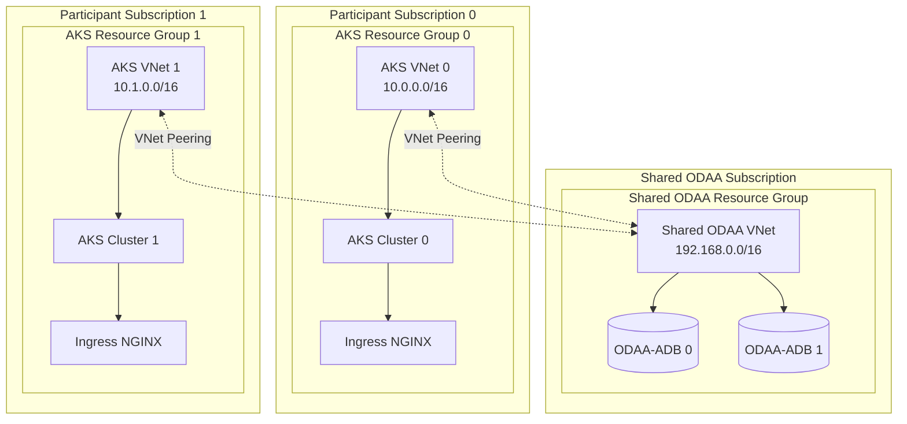
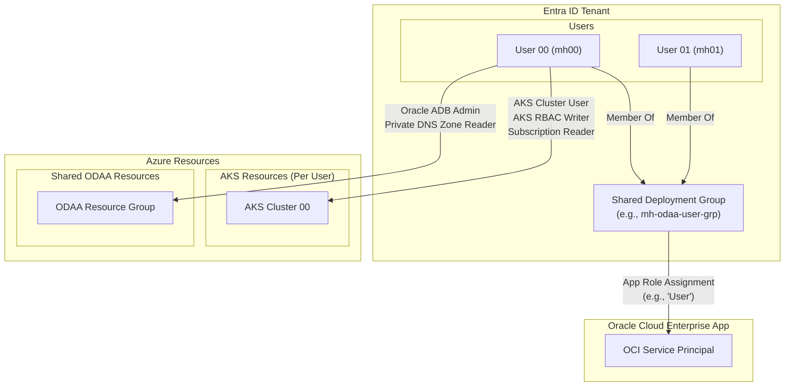
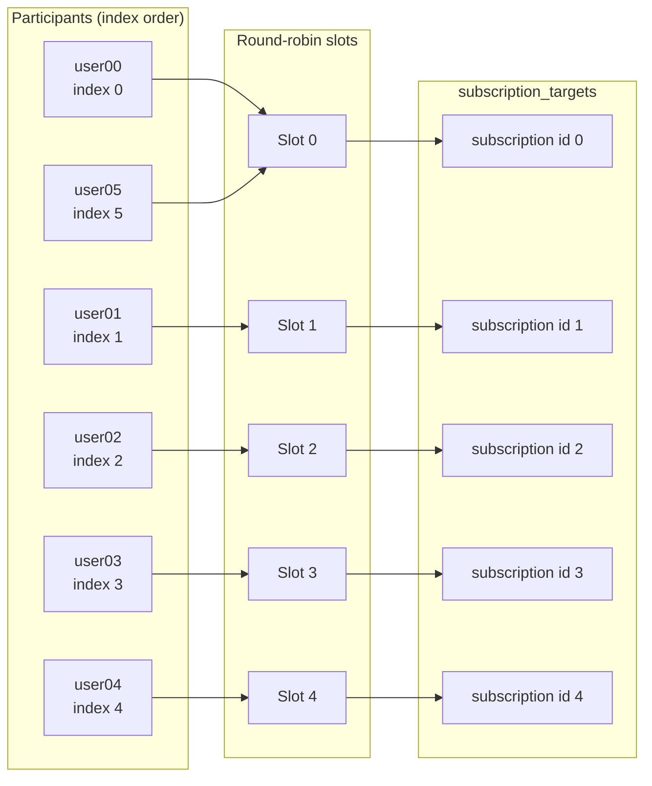
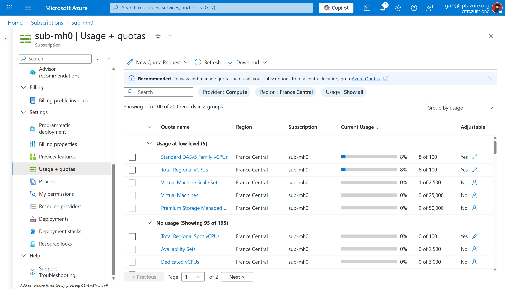
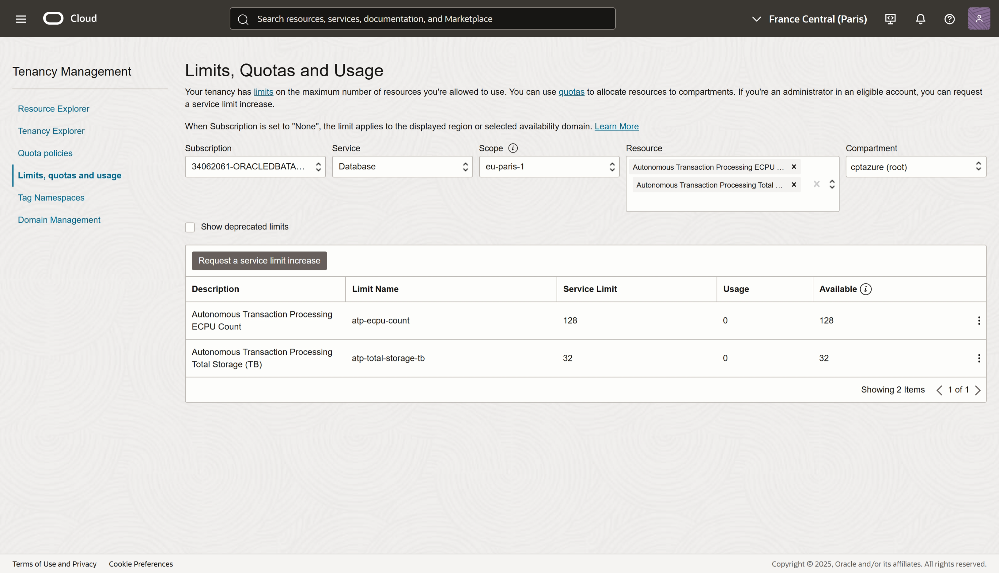
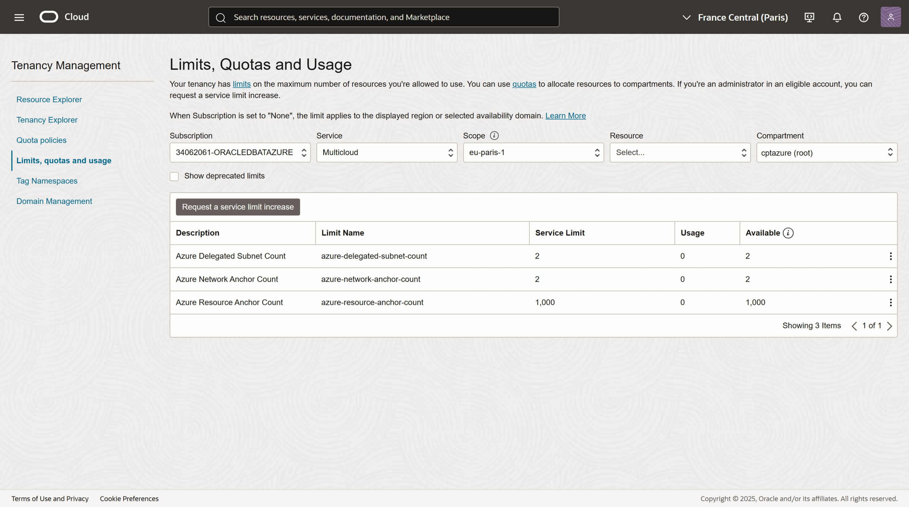

# Oracle on Azure Microhack Terraform

This Terraform project automates the provisioning of a scalable infrastructure for running Oracle on Azure, specifically tailored for a multi-user workshop (like a "MicroHack").

It is designed to create multiple, isolated Azure Kubernetes Service (AKS) environments, one for each participant, while enabling connectivity to a central Oracle Database@Azure (ODAA) deployment.

## Table of Contents

* [Core Functionality](#core-functionality)
* [Important Notes](#important)
* [Architecture Diagrams](#azure-resource-topology)
* [Prerequisites](#prerequisites)
* [Azure Quotas and Limits](#azure-quotas-and-limits)
* [Setup](#setup)
  * [Pre-flight Validation](#pre-flight-validation-recommended)
  * [Azure Authentication](#sign-in-and-set-the-active-subscription-repeat-for-each-subscription-that-will-host-resources)
  * [Oracle SDN Registration](#register-the-oracle-sdn-appliance-preview-feature-on-every-hosting-subscription-so-odaa-networking-works)
* [Configuration](#configuration)
* [Post-Deployment Checks](#post-deployment-checks)
* [Destroying the Environment](#destroying-the-environment)
* [Troubleshooting](#troubleshooting)

## Core Functionality

1.  **Multi-User Environment**: Provisions multiple, environments for a specified number of users (`user_count`). Each user gets their own Azure Kubernetes Service (AKS) cluster.
2.  **Subscription Management**: Distributes the deployments across up to five different Azure subscriptions in a round-robin fashion to manage resource allocation and quotas.
3.  **Identity and Access Management**:
    *   For each user, it creates a new Entra ID user with a generated password and adds them to an already existing security group.
    *   Assigns the necessary RBAC roles to these users so they can manage their AKS cluster and interact with the shared Oracle database resources.
4.  **Oracle Database@Azure (ODAA)**:
    *   Sets up a single, shared virtual network (VNet) in a dedicated subscription to host the Oracle database infrastructure.
6.  **Networking**:
    *   Creates a VNet for each AKS cluster.
    *   Establishes VNet peering between each user's AKS VNet and the central, shared ODAA VNet, allowing applications on AKS to communicate with the Oracle database.
    *   Configures Private DNS zones to resolve Oracle's service endpoints from within the AKS VNets.
7.  **Ingress Control**: Deploys an NGINX Ingress Controller into each AKS cluster using a Helm chart, enabling external access to applications.
8.  **Credential Management**: Generates a `user_credentials.json` file containing the initial login details for the newly created Entra ID users.

## **IMPORTANT**

- Oracle Database@Azure service needs to be bought via Azure Marketplace, you will not be able to use an Azure Subscription which is backed up with Microsoft Credits.
- Microsoft operates an Azure Tenant which can be used during the Microhack.
- Setting up the Environment can only be done by authorized personnel, reach out to your Account Team or contact the Microsoft Microhack organizers for assistance.
- The following instruction are only relevant in case you belong to the authorized team which is allowed to setup the Microhack environment.

## Azure Resource Topology

The following diagram illustrates the default topology created by this Terraform configuration. Multiple participant environments are created , but all are peered to a **single, shared ODAA VNet** located in the central ODAA subscription.



With the default settings (`user_count = 1`), Terraform provisions a single AKS environment and peers its VNet to the shared ODAA VNet. If `user_count` is increased, the configuration creates additional AKS environments in the next available subscription slots, each peered to the same shared ODAA network.

## Identity and Access Management

The project's identity and access management (IAM) structure is designed to provide secure, role-based access for each participant. The following diagram illustrates how users, groups, and roles are interconnected:



- **Entra ID Group**: A single security group is created to contain all workshop participants.
- **User Accounts**: A unique Entra ID user is created for each participant and added to the shared group.
- **Azure RBAC**: Each user is granted specific roles directly on their own resources (like their AKS cluster) and on the shared ODAA resources, following the principle of least privilege.
- **Oracle Cloud Access**: The entire group is granted an App Role on the Oracle Cloud enterprise application, allowing all members to access Oracle Cloud services.

## Subscription Distribution

Terraform keeps the subscription assignments inside `locals.deployments`. Each participant is indexed (starting at zero) and mapped to one of the five `subscription_targets` by taking `index % length(subscription_targets)`. This round-robin pattern repeats once all five slots are used, so participant 5 returns to slot 0, participant 6 to slot 1, and so on. The diagram below visualizes the default `subscription_targets` list and how the first six participants are routed:



Adding or reordering entries in `subscription_targets` immediately changes the destinations for all participants because Terraform recomputes the locals on the next plan/apply.

## Azure Quotas and Limits

> NOTE: The current architecture is setup to support 50 users in parallel.

The main constrain of how many user we can support depends on two main factors:

- vCPU quota for the VM family used by AKS clusters (default: Standard_D4as_v5) cross all 5 subscriptions.
- Number of eCPU allowed for Oracle Autonomous Database instances in the linked OCI Tenancy,

At azure we can provide a current max of 100 vCPU per subscriptions for the Standard_Dv5 family. Each AKS cluster with 2 nodes of size Standard_D4as_v5 consumes in total 8 vCPU. Therefore we can support a 12 users per Subscription (12 * 8 = 96 vCPU < 100 vCPU). Currently we support 5 subscriptions for the Microhack, therefore the total max user count is 60 users (5 * 12 = 60).

Screenshot of the current vCPU quota and usage for one single user


## OCI Limits

On the OCI tenancy we do support a total of 128 eCPUs. Each Oracle Autonomous Database instance consumes 2 eCPU. Therefore the max user count is limited to 64 users.

Reference: [Oracle Database@Azure Service Limits and Quotas](https://docs.oracle.com/en-us/iaas/Content/database-at-azure/quotas-service-limits.htm)



If it comes to delegated subnets we need to consider that our OracleSubscription of plan "pay-as-you-go" does only support 2 delegated subnets:

## Prerequisites

### Required Tools

- Windows 10/11 host with PowerShell 7+
- **Terraform** (>= 1.5.0) - Install via: `winget install Hashicorp.Terraform`
- **Azure CLI** - Install via: `winget install Microsoft.AzureCLI`
- **kubectl** - Install via: `winget install Kubernetes.kubectl`
- **helm** - Install via: `winget install Helm.Helm`
- **OCI CLI** - Install via: `winget install Oracle.OCI-CLI`

All tools must be available in your `PATH`.

### Service Principal (Required)

**IMPORTANT:** This deployment requires a Service Principal with the necessary permissions. Azure CLI authentication with a real User would run into a token expiration issue, so it alone is not sufficient because of the long time required for the deployment.

**Create the Service Principal:**

```powershell
cd resources\infra\terraform\scripts
.\create-service-principal.ps1 -OutputPath ..\mhodaa-sp-credentials.json
```

This script creates a service principal with:
- **Azure RBAC roles**: Contributor and User Access Administrator on the mhteams and mhodaa management groups
- **Entra ID directory roles**: User Administrator and Application Administrator
- **Microsoft Graph API permissions**: User.ReadWrite.All and AppRoleAssignment.ReadWrite.All

The credentials will be saved to `mhodaa-sp-credentials.json`.

**Configure Terraform to use the Service Principal:**

Add the credentials to your `terraform.tfvars`:

```hcl
client_id     = "your-app-id-here"
client_secret = "your-client-secret-here"
```

### Azure Permissions

The Service Principal requires the following role assignments on every target subscription (including the shared ODAA subscription):
- **Contributor** - For resource management
- **User Access Administrator** - For RBAC role assignments

Additionally, the Service Principal must have these Entra ID permissions:
- **Directory Roles**: User Administrator, Application Administrator
- **Microsoft Graph API Application Permissions**: User.ReadWrite.All, AppRoleAssignment.ReadWrite.All
  
### Management Group Access

- Read access to the **mhteams** management group for policy definitions and assignments

### Oracle Cloud Integration

- Oracle Cloud service principal (enterprise application) must be registered in your Entra ID tenant
- Default object ID: `6240ab05-e243-48b2-9619-c3e3f53c6dca`
- The service principal must have an enabled app role that workshop users can be assigned to

### Resource Quotas

Ensure adequate quotas in all target subscriptions:
- **VM Quota**: Standard_DASv5Family (Standard_D4as_v5) - Each user requires 8 vCPUs
- **Oracle eCPU**: Each Oracle Autonomous Database requires 2 eCPUs in the linked OCI tenancy
- **Public IPs**: For AKS ingress controllers (1 per cluster)

## Setup

### Pre-flight Validation (Recommended)

Before deploying, run the automated pre-flight check script to validate all prerequisites:

```powershell
cd resources\infra\terraform\scripts
.\preflight-check.ps1
```

The script validates:

* Required tools (Terraform, Azure CLI, kubectl, helm) and versions
* Azure authentication and subscription access
* Management group existence and permissions
* Oracle service principal configuration
* Resource provider registrations
* Oracle SDN feature flags
* VM family quotas across all target subscriptions
* users.json file structure and completeness
* Terraform initialization and configuration validity

**Optional Parameters:**

```powershell
# Skip VM quota checks for faster validation
.\preflight-check.ps1 -SkipQuotaCheck

# Use a custom terraform.tfvars file
.\preflight-check.ps1 -ConfigFile ".\custom-config.tfvars"
```

The script provides a color-coded summary with actionable remediation steps for any failures.

### Sign in and set the active subscription (repeat for each subscription that will host resources):

```powershell
az login
az account set --subscription "sub-mhcore"
```

### Refresh Azure CLI tokens for all workshop subscriptions

Long Terraform applies can fail with `ExpiredAuthenticationToken` if auxiliary tokens age out. Use the helper script to mint fresh tokens for every subscription before running `terraform plan`/`terraform apply`:

```powershell
pwsh ./scripts/refresh-azure-tokens.ps1
```

The script reuses your current Azure CLI session (`az login` must already be active), cycles through all Microhack subscriptions, retrieves fresh ARM and Microsoft Graph access tokens, and then restores your original subscription context.

### Register the Oracle SDN appliance preview feature on every hosting subscription so ODAA networking works

> NOTE: This may already be done for your subscriptions; check the feature state before registering.
>
> Reference: [Oracle Database@Azure Network Planning - Advanced Network Features](https://learn.microsoft.com/en-us/azure/oracle/oracle-db/oracle-database-network-plan#advanced-network-features)

```powershell
az feature register --namespace Microsoft.Baremetal --name EnableRotterdamSdnApplianceForOracle
az feature register --namespace Microsoft.Network --name EnableRotterdamSdnApplianceForOracle
az feature show --namespace Microsoft.Baremetal --name EnableRotterdamSdnApplianceForOracle --query properties.state
az feature show --namespace Microsoft.Network --name EnableRotterdamSdnApplianceForOracle --query properties.state
az provider register --namespace Microsoft.Baremetal
az provider register --namespace Microsoft.Network
```

For bulk registration across many subscriptions use `scripts/register-oracle-sdn.ps1` after updating its subscription list.

## Configuration

Before deploying, ensure you have completed the pre-flight validation steps above.

### Configure terraform.tfvars

Populate `terraform.tfvars` with the values for your event:

* `microhack_event_name` - Event identifier for tagging (e.g., "mhtest1")
* `user_count` - Number of participants (each gets an isolated AKS environment)

### Configure users.json

This project comes with a `users.json` file template. The `users.json` is located in the terraform root directory (`resources\infra\terraform`) and contain participant information. This is a simple array of user profiles indexed by position (0, 1, 2, etc.):

```json
[
  {
    "given_name": "Peter",
    "surname": "Parker",
    "hero_name": "Spider-Man"
  },
  {
    "given_name": "Bruce",
    "surname": "Wayne",
    "hero_name": "Batman"
  }
]
```

**Required fields per user:**

* `given_name` - User's first name
* `surname` - User's last name
* `hero_name` - Optional friendly identifier for documentation

> IMPORTANT: Ensure the file user.json contains at least as many entries as your configured `user_count` inside `terraform.tfvars`. The deployment will fail if there are insufficient user profiles.

### Deploy the Infrastructure

Run all Terraform commands from `resources\infra\terraform`:

```powershell
# Initialize Terraform (download providers)
terraform init

# Validate configuration
terraform validate

# Preview changes
terraform plan -out tfplan

# Apply the plan
terraform apply tfplan
```

**Important:** The `user_credentials.json` file contains sensitive initial passwords. Secure this file and distribute credentials through a secure channel (e.g., password manager, encrypted email).

## Post-Deployment Checks

After `terraform apply` completes successfully, verify your deployment using the following methods.

### Review Terraform Outputs

The most efficient verification method is using Terraform's output command:

```powershell
terraform output
```

**Key outputs to review:**

* **`deployment_summary`**: Confirms the total number of AKS deployments and subscription distribution
* **`aks_clusters`**: Lists cluster names, IDs, resource groups, and DNS zone information
* **`vnet_peering_connections`**: Confirms VNet peering between AKS and ODAA networks
* **`entra_id_deployment_group`**: Shows the shared security group details

**Security reminder:** The `user_credentials.json` file contains initial passwords. Distribute securely and instruct users to change passwords on first login.

### Verify AKS Cluster Access (Per-User)

Test connectivity to a specific user's AKS cluster:

```powershell
# Example for user 'mh00'
$rgName = "aks-user00"
$aksName = "aks-user00"

# Get cluster credentials
az aks get-credentials --resource-group $rgName --name $aksName --overwrite-existing

# Verify node status
kubectl get nodes

# Expected output: 2-3 nodes in Ready state
```

### Verify Ingress Controller

Check the NGINX Ingress Controller deployment and external IP assignment:

```powershell
kubectl get services --namespace ingress-nginx
```

**Expected output:**

```text
NAME                                 TYPE           CLUSTER-IP     EXTERNAL-IP    PORT(S)
ingress-nginx-controller             LoadBalancer   10.0.123.456   20.123.45.67   80:31234/TCP,443:32101/TCP
ingress-nginx-controller-admission   ClusterIP      10.0.78.9      <none>         443/TCP
```

The `EXTERNAL-IP` should be assigned (not `<pending>`). This may take 1-2 minutes after deployment.

### Verify Oracle Database Connectivity (If Enabled)

> NOTE: This verification applies only if you created Oracle Autonomous Databases and also already installed the onprem simulation on AKS.

```powershell
# List Oracle Autonomous Databases in the shared resource group
az oracle autonomous-database list \
  --resource-group odaa-shared \
  --query "[].{Name:name, State:state, ComputeCount:computeCount}" \
  --output table
```

All databases should show `State: AVAILABLE`.

### Verify VNet Peering

Check that VNet peering is established and active:

```powershell
# Example for user 'mh00'
az network vnet peering list \
  --resource-group aks-mh00 \
  --vnet-name aks-mh00 \
  --query "[].{Name:name, PeeringState:peeringState, RemoteVNet:remoteVirtualNetwork.id}" \
  --output table
```

Expected `PeeringState`: **Connected**

## Destroying the Environment

### Pre-Destroy Checklist

Before destroying the infrastructure, ensure to remove Oracle databases before. this will otherwise cause issues during the terraform destroy.

```powershell
# 1. Verify current state matches Azure reality
terraform plan

# 2. Destroy all resources
terraform destroy

# You will be prompted to confirm. Type 'yes' to proceed.
```

### Post-Destroy Verification

After successful destruction, verify:

```powershell
# Check no resource groups remain
az group list --query "[?starts_with(name, 'aks-mh') || starts_with(name, 'odaa-')].name" --output table

# Verify no orphaned peerings
az network vnet peering list --resource-group <any-remaining-rg> --vnet-name <any-vnet>

# Check custom role definitions (if you want to remove them)
az role definition list --custom-role-only true --query "[?starts_with(roleName, 'Oracle')].roleName" --output table
```

## Additional Resources

* [Oracle Database@Azure Documentation](https://learn.microsoft.com/en-us/azure/oracle/oracle-db/)
* [Oracle Database@Azure - Onboard and provision](https://learn.microsoft.com/en-us/azure/oracle/oracle-db/onboard-oracle-database)
* [Oracle Database@Azure - Network Planning](https://learn.microsoft.com/en-us/azure/oracle/oracle-db/oracle-database-network-plan)
* [Azure Kubernetes Service Documentation](https://learn.microsoft.com/en-us/azure/aks/)
* [Terraform Azure Provider Documentation](https://registry.terraform.io/providers/hashicorp/azurerm/latest/docs)
* [Oracle Database@Azure Service Limits](https://docs.oracle.com/en-us/iaas/Content/database-at-azure/quotas-service-limits.htm)

## OCI SSO

For OCI-Azure SSO integration, refer to:
[Terraform OCI Multicloud Azure Landing Zones](https://github.com/oci-landing-zones/terraform-oci-multicloud-azure)

---

## Appendix: Entra ID Group

**IMPORTANT:** Before deploying, you must create an Entra ID security group for workshop participants. Terraform will add users to this existing group but will not create it.

**Create the group using Azure CLI:**

```powershell
# Set the group name (must match the value in terraform.tfvars)
$groupName = "mh-odaa-user-grp"

# Create the security group
az ad group create --display-name $groupName --mail-nickname $groupName --description "Security group for Oracle on Azure workshop participants"

# Verify the group was created
az ad group show --group $groupName --query "{Name:displayName, ObjectId:id}" --output table
```
> **Note:** The group name must match the `aks_deployment_group_name` value in your `terraform.tfvars` file (default: `mh-odaa-user-grp`).

## Appendix: ODAA Autonomous Database Deployment Timeline

Understanding why Oracle Database@Azure (ODAA) Autonomous Database deployments take significantly longer than traditional Azure resources.

### Typical Deployment Time: 15-45 Minutes

ODAA deployments are substantially slower than native Azure SQL Database (2-5 minutes) due to **cross-cloud orchestration complexity** between Azure and Oracle Cloud Infrastructure (OCI).

**Reference**: [Oracle Database@Azure - Onboard and provision](https://learn.microsoft.com/en-us/azure/oracle/oracle-db/onboard-oracle-database)

### Deployment Phases

#### 1. Cross-Cloud Resource Provisioning (2-5 minutes)
- **Azure Resource Manager**: Creates Azure resource metadata, validates permissions, registers deployment
- **OCI Control Plane**: Provisions actual database infrastructure in OCI data centers
- **State Synchronization**: Both clouds must continuously synchronize state throughout the process

#### 2. Multicloud Network Link Setup (5-10 minutes - first deployment only)
When deploying the first ODAA resource in a region/subscription:
- Creates **OCI-Azure interconnect** infrastructure
- Establishes **VNet-to-VCN peering** across cloud boundaries
- Configures **routing and Dynamic Routing Gateway (DRG) attachments**
- Provisions **DNS zones** for name resolution (CustomerDnsZone resources)

**Note:** Subsequent deployments in the same region skip this phase and complete faster (~15-25 minutes).

#### 3. Database Infrastructure Provisioning (OCI Side) (5-15 minutes)
- **Storage allocation**: Provisions block storage for database data and logs
- **Compute nodes**: Spins up Autonomous Database compute infrastructure
- **Database initialization**: Creates and initializes Oracle database instance
- **Encryption setup**: Configures transparent data encryption (TDE)
- **Backup configuration**: Sets up automatic backup infrastructure

#### 4. Network Infrastructure (OCI Side) (3-8 minutes)
Based on actual deployment analysis, the following OCI resources are created:
- **Private IP addresses**: Allocates IPs for database connectivity (typically 10-15 IPs)
- **VCN resources**: Subnet, route tables, security lists, DHCP options
- **Network Security Group (NSG)**: Created with default security rules
- **Service Gateway**: Enables access to OCI services
- **DNS infrastructure**: Multiple DNS zones for endpoint resolution
  - `<id>.ociodaashared.ociodaashared.adb.<region>.oraclevcn.com`
  - `<id>.adb.<region>.oraclevcn.com`
  - `<id>.adbapps.<region>.oraclevcn.com`
  - Reverse DNS zones (e.g., `0.168.192.in-addr.arpa`)

#### 5. Private Endpoint Configuration (2-5 minutes)
- Creates **VNIC** (Virtual Network Interface Card)
- Configures **private endpoint** for Azure VNet connectivity
- Updates **DNS resolution** for private database access from Azure

#### 6. Security and Compliance (2-3 minutes)
- **Certificate generation**: SSL/TLS certificates for secure connections
- **Wallet creation**: Oracle wallet for authentication
- **IAM synchronization**: Maps Azure identities to OCI permissions
- **Audit logging**: Enables monitoring and compliance tracking

#### 7. Cross-Cloud State Synchronization (Throughout deployment)
- Azure Resource Manager polls OCI for completion status
- Multiple API calls between Azure and OCI control planes
- Network latency between cloud providers
- Final state reconciliation and validation

### Resource Creation Summary

A typical ODAA deployment creates approximately **30-35 OCI resources**, including:

| Resource Type | Count | Purpose |
|--------------|-------|---------|
| CustomerDnsZone | 6-8 | DNS resolution for database endpoints |
| PrivateIp | 10-15 | Network connectivity infrastructure |
| AutonomousDatabase | 1 | The actual database instance |
| NetworkSecurityGroup | 1 | Security rules for database access |
| VCN, Subnet, RouteTable, SecurityList | 1 each | Core networking infrastructure |
| DrgAttachment | 1 | Connection to Azure VNet |
| ServiceGateway | 1 | Access to OCI services |
| DnsResolver, DnsView | 1 each | DNS infrastructure |
| VNIC | 1 | Virtual network interface |
| DHCPOptions | 1 | DHCP configuration |

### Performance Factors

- **First deployment in region**: 30-45 minutes (establishes multicloud link)
- **Subsequent deployments**: 15-25 minutes (reuses existing network infrastructure)
- **Concurrent deployments**: May experience longer provisioning times due to API throttling

### Behind the Scenes: Deployment Flow

```
┌─────────────────────────────────────────────────────────────────┐
│ 1. Azure Portal/Terraform Request                               │
└─────────────────────┬───────────────────────────────────────────┘
                      ↓
┌─────────────────────────────────────────────────────────────────┐
│ 2. Azure Resource Manager validates request                     │
└─────────────────────┬───────────────────────────────────────────┘
                      ↓
┌─────────────────────────────────────────────────────────────────┐
│ 3. Azure calls OCI Control Plane API                           │
└─────────────────────┬───────────────────────────────────────────┘
                      ↓
┌─────────────────────────────────────────────────────────────────┐
│ 4. OCI provisions network infrastructure                        │
│    • VCN, subnet, NSG, route tables                            │
│    • Private IPs, service gateway, DRG attachment              │
│    • DNS zones and resolvers                                   │
└─────────────────────┬───────────────────────────────────────────┘
                      ↓
┌─────────────────────────────────────────────────────────────────┐
│ 5. OCI provisions database infrastructure                       │
│    • Storage allocation                                         │
│    • Compute nodes                                              │
│    • Database initialization                                    │
│    • Encryption and backup setup                                │
└─────────────────────┬───────────────────────────────────────────┘
                      ↓
┌─────────────────────────────────────────────────────────────────┐
│ 6. OCI configures private endpoint and connectivity            │
│    • VNIC creation                                              │
│    • DNS configuration                                          │
│    • Cross-cloud peering validation                             │
└─────────────────────┬───────────────────────────────────────────┘
                      ↓
┌─────────────────────────────────────────────────────────────────┐
│ 7. OCI reports completion status back to Azure                 │
└─────────────────────┬───────────────────────────────────────────┘
                      ↓
┌─────────────────────────────────────────────────────────────────┐
│ 8. Azure updates resource state to "Succeeded"                 │
└─────────────────────────────────────────────────────────────────┘
                      ↓
                 ✓ Complete
```

### Real-World Deployment Example

Based on actual production deployment logs from the `user00` Autonomous Database in this project:

**Deployment Timeline**: 15 minutes 44 seconds (08:52:57 UTC → 09:08:41 UTC on Nov 2, 2025)

#### Phase-by-Phase Breakdown (Actual Timestamps)

**Phase 1: Azure Initiation (08:52:57 - 08:53:32)** — 35 seconds

<details>
<summary>Command used to retrieve Azure Activity Log</summary>

```powershell
# Get Azure deployment timeline for user00 database
az monitor activity-log list `
  --subscription 4aecf0e8-2fe2-4187-bc93-0356bd2676f5 `
  --start-time 2025-11-02T08:30:00Z `
  --end-time 2025-11-02T09:00:00Z `
  --query "[?contains(resourceId, 'user00')].{Time:eventTimestamp, Operation:operationName.localizedValue, Status:status.localizedValue, Caller:caller}" `
  --output json | ConvertFrom-Json | Sort-Object Time | Format-Table -AutoSize
```
</details>

```
08:52:57  AutonomousDatabases_Update Started
08:53:14  AutonomousDatabases_Update Accepted
08:53:32  AutonomousDatabases_Get    Accepted
```
Azure Resource Manager validates the request and initiates OCI provisioning.

**Phase 2: OCI Network Infrastructure (08:53:45 - 08:55:06)** — 1 minute 21 seconds

<details>
<summary>Command used to retrieve OCI resource timeline</summary>

```powershell
# Get OCI resource creation timeline for specific compartment
$compartmentId = "ocid1.compartment.oc1..aaaaaaaayehuog6myqxudqejx3ddy6bzkr2f3dnjuuygs424taimn4av4wbq"
oci search resource structured-search `
  --query-text "query all resources where compartmentId = '$compartmentId' && timeCreated >= '2025-11-02T08:00:00Z' && timeCreated <= '2025-11-02T10:00:00Z'" `
  --query "data.items[*].{ResourceType:\`"resource-type\`",DisplayName:\`"display-name\`",TimeCreated:\`"time-created\`"}" `
  --output json | ConvertFrom-Json | Sort-Object TimeCreated | Format-Table -AutoSize
```
</details>

```
OCI Resource Creation Timeline:
08:53:45  VCN-multicloudnetworklink20251102085325 (Vcn)
08:53:45  Default Security List, Route Table, DHCP Options
08:53:46  primary-subnet-1762073626099 (Subnet)
08:53:46  DNS Resolver and DNS View
08:53:46  Reverse DNS zone (0.168.192.in-addr.arpa)
08:53:47  ociodaashared.ociodaashared.oraclevcn.com (DNS zone)
08:53:59  private-Ip-192.168.0.2
08:54:05  private-Ip-192.168.0.3
...       [8 more private IPs allocated]
08:55:03  private-Ip-192.168.0.15
08:55:06  service-gateway-1762073703797 (ServiceGateway)
08:55:30  drg-attachment-1762073729901 (DrgAttachment)
```

**Phase 3: Security and Database Provisioning (08:57:04 - 08:59:20)** — 2 minutes 16 seconds

<details>
<summary>Command used to verify database creation timestamp</summary>

```powershell
# Get specific database creation time
oci search resource structured-search `
  --query-text "query AutonomousDatabase resources where displayName = 'user00'" `
  --query "data.items[*].{DisplayName:\`"display-name\`",TimeCreated:\`"time-created\`",LifecycleState:\`"lifecycle-state\`"}" `
  --output json | ConvertFrom-Json
```
</details>

```
08:57:04  user00_NSG (NetworkSecurityGroup)
08:59:20  user00 (AutonomousDatabase) — Database instance created
```

**Phase 4: Private Endpoint and DNS (09:00:05 - 09:01:00)** — 55 seconds
```
09:00:05  PE_eu-paris-1_a740a016-fb9c-4ed7-80a4-049a5e5ed184 (VNIC + PrivateIp)
09:00:25  upltmjqb.adb.eu-paris-1.oraclecloud.com (DNS zone)
09:00:31  upltmjqb.adb.eu-paris-1.oraclecloudapps.com (DNS zone)
09:00:37  upltmjqb.ociodaashared.ociodaashared.adbapps... (DNS zone)
09:00:43  upltmjqb.adbapps.eu-paris-1.oraclevcn.com (DNS zone)
09:00:49  upltmjqb.adb.eu-paris-1.oraclevcn.com (DNS zone)
09:00:55  upltmjqb.ociodaashared.ociodaashared.adb... (DNS zone)
```

**Phase 5: Azure Polling and Status Updates (08:53:47 - 09:08:41)** — Throughout
```
Azure continuously polled OCI every ~15 seconds:
08:53:47  AutonomousDatabases_Get    Running
08:54:05  AutonomousDatabases_Get    Running
08:54:21  AutonomousDatabases_Get    Running
...       [~60 polling operations]
09:08:24  AutonomousDatabases_Get    Running
09:08:36  AutonomousDatabases_Update Started (final sync)
09:08:41  AutonomousDatabases_Update Succeeded ✓
```

#### Resources Created Summary

**Total OCI Resources**: 31 resources

| Time Range | Resources Created | Resource Types |
|------------|------------------|----------------|
| 08:53:45 - 08:53:47 | 7 | Core VCN infrastructure |
| 08:53:59 - 08:55:03 | 10 | Private IP addresses |
| 08:55:06 - 08:55:30 | 2 | Service Gateway, DRG Attachment |
| 08:57:04 | 1 | Network Security Group |
| 08:59:20 | 1 | **Autonomous Database** |
| 09:00:05 - 09:00:55 | 8 | Private Endpoint VNIC + 6 DNS zones |

### Monitoring Deployment Progress

For detailed deployment monitoring and timeline analysis, use the provided monitoring script:

```powershell
# Run the deployment monitoring script
.\scripts\monitor-odaa-deployment.ps1 `
  -ResourceGroupName "odaa-shared" `
  -DatabaseName "user00" `
  -CompartmentId "ocid1.compartment.oc1..aaaaaaaayehuog6myqxudqejx3ddy6bzkr2f3dnjuuygs424taimn4av4wbq"

# Specify custom time range
.\scripts\monitor-odaa-deployment.ps1 `
  -ResourceGroupName "odaa-shared" `
  -DatabaseName "user00" `
  -CompartmentId "ocid1.compartment.oc1..aaaaaa..." `
  -StartTime "2025-11-02T08:00:00Z" `
  -EndTime "2025-11-02T10:00:00Z"
```

The script retrieves:
* Azure Activity Log entries sorted chronologically
* OCI resource creation timeline with resource types and timestamps
* Table-formatted output for easy analysis

**Example Output:**

```text
=== ODAA Deployment Monitor ===
Resource Group: odaa-shared
Database: user00
Subscription: 4aecf0e8-2fe2-4187-bc93-0356bd2676f5
Time Range: 2025-11-02T08:00:00Z to 2025-11-02T10:00:00Z

=== Azure Activity Log ===
Found 50 Azure Activity Log entries:

Time                         Operation                                                 Status
----                         ---------                                                 ------
2025-11-02T09:51:41.0159719Z AutonomousDatabases_Update                                Succeeded
2025-11-02T09:14:26.6299734Z Create or Update Network Interface                        Succeeded
2025-11-02T09:08:44.2983526Z Create Deployment                                         Succeeded
2025-11-02T09:08:41.6168275Z AutonomousDatabases_Update                                Succeeded
2025-11-02T09:07:26.1082728Z Create or Update Private DNS zone link to virtual network Succeeded
2025-11-02T09:06:53.6441745Z Create or Update Private DNS Zone                         Succeeded
2025-11-02T09:06:18.4956818Z Create or Update Private DNS zone link to virtual network Succeeded
2025-11-02T09:05:45.6744136Z Create or update record set of type A                     Succeeded
2025-11-02T09:05:44.798683Z  Create or Update Private DNS Zone                         Succeeded
2025-11-02T09:04:24.6306366Z Create or Update Network Interface                        Succeeded
...

=== OCI Resource Timeline ===
+-----------------------------------------------------------------------+----------------------+----------------------------------+
| DisplayName                                                           | ResourceType         | Time                             |
+-----------------------------------------------------------------------+----------------------+----------------------------------+
| upltmjqb.ociodaashared.ociodaashared.adb.eu-paris-1.oraclevcn.com     | CustomerDnsZone      | 2025-11-02T09:00:55.528000+00:00 |
| upltmjqb.adb.eu-paris-1.oraclevcn.com                                 | CustomerDnsZone      | 2025-11-02T09:00:49.071000+00:00 |
| upltmjqb.adbapps.eu-paris-1.oraclevcn.com                             | CustomerDnsZone      | 2025-11-02T09:00:43.710000+00:00 |
| PE_eu-paris-1_a740a016-fb9c-4ed7-80a4-049a5e5ed184                    | PrivateIp            | 2025-11-02T09:00:05.740000+00:00 |
| PE_eu-paris-1_a740a016-fb9c-4ed7-80a4-049a5e5ed184                    | Vnic                 | 2025-11-02T09:00:05.740000+00:00 |
| user00                                                                | AutonomousDatabase   | 2025-11-02T08:59:20.069000+00:00 |
| user00_NSG                                                            | NetworkSecurityGroup | 2025-11-02T08:57:04.886000+00:00 |
| drg-attachment-1762073729901                                          | DrgAttachment        | 2025-11-02T08:55:30.307000+00:00 |
| service-gateway-1762073703797                                         | ServiceGateway       | 2025-11-02T08:55:06.566000+00:00 |
| private-Ip-192.168.0.15                                               | PrivateIp            | 2025-11-02T08:55:03.363000+00:00 |
| private-Ip-192.168.0.2                                                | PrivateIp            | 2025-11-02T08:53:59.137000+00:00 |
| VCN-multicloudnetworklink20251102085325                               | DnsResolver          | 2025-11-02T08:53:46.560000+00:00 |
| primary-subnet-1762073626099                                          | Subnet               | 2025-11-02T08:53:46.150000+00:00 |
| Default Route Table for VCN-multicloudnetworklink20251102085325       | RouteTable           | 2025-11-02T08:53:45.312000+00:00 |
| VCN-multicloudnetworklink20251102085325                               | Vcn                  | 2025-11-02T08:53:45.312000+00:00 |
+-----------------------------------------------------------------------+----------------------+----------------------------------+

Done!
```

This output shows the complete deployment timeline across both Azure and OCI, making it easy to track the provisioning sequence and identify any delays.

#### Via Azure Portal
1. Navigate to the resource group
2. Select "Deployments" under Settings
3. View deployment status and operation details
4. Check "Activity Log" for detailed progress (refreshes every ~15 seconds)

#### Via Azure CLI
```powershell
# Monitor deployment status
az oracle autonomous-database show \
  --resource-group <resource-group> \
  --name <database-name> \
  --query "{Name:name, State:state, Message:lifecycleDetails}" \
  --output table

# Watch for state changes
az oracle autonomous-database list \
  --resource-group <resource-group> \
  --query "[].{Name:name, State:state, Updated:timeUpdated}" \
  --output table
```

#### Via OCI CLI
```powershell
# List resources created today in compartment
$TODAY = (Get-Date).ToString("yyyy-MM-dd")
$compartmentId = "<your-compartment-ocid>"

oci search resource structured-search \
  --query-text "query all resources where timeCreated >= '${TODAY}T00:00:00Z' && compartmentId = '$compartmentId'" \
  --query "data.items[*].{ResourceType:\`"resource-type\`",DisplayName:\`"display-name\`",State:\`"lifecycle-state\`"}" \
  --output table
```

#### Example: Real Deployment Log Query

```powershell
# Get detailed creation timeline for a specific compartment
$compartmentId = "ocid1.compartment.oc1..aaaaaaaayehuog6myqxudqejx3ddy6bzkr2f3dnjuuygs424taimn4av4wbq"
oci search resource structured-search \
  --query-text "query all resources where compartmentId = '$compartmentId' && timeCreated >= '2025-11-02T08:00:00Z'" \
  --query "data.items[*].{ResourceType:\`"resource-type\`",DisplayName:\`"display-name\`",TimeCreated:\`"time-created\`"}" \
  --output json | ConvertFrom-Json | Sort-Object TimeCreated
```

### Troubleshooting Long Deployments

**Deployment exceeds 45 minutes:**
- Check Azure Activity Log for errors or throttling
- Verify OCI compartment has adequate quota (eCPU, storage)
- Ensure no network policy conflicts between Azure and OCI
- Contact Microsoft support if deployment is stuck

**Common causes of delays:**
- First deployment in region (network infrastructure creation)
- Regional capacity constraints
- Concurrent large-scale deployments
- Network policy validation issues

### Best Practices

1. **Plan for deployment time**: Allocate 30-45 minutes for workshop setup
2. **Deploy in advance**: Pre-provision databases before participant arrival
3. **Use Terraform**: Enables parallel deployment of multiple databases
4. **Monitor progress**: Use Azure Activity Log and OCI console for visibility
5. **Reuse infrastructure**: Subsequent deployments in same region are faster

