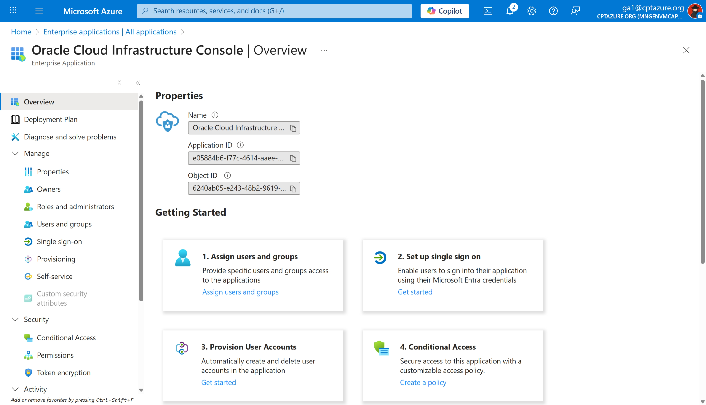
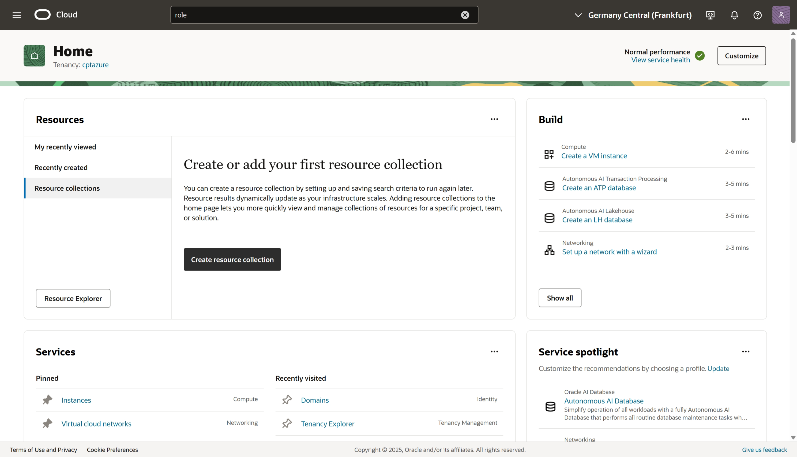
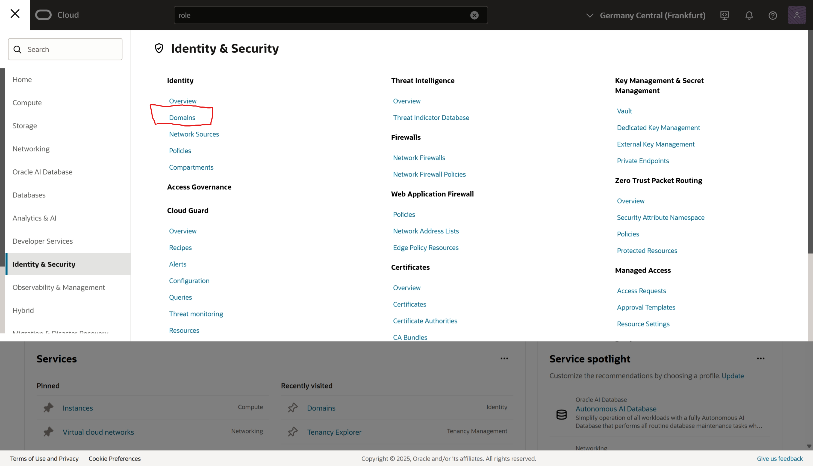
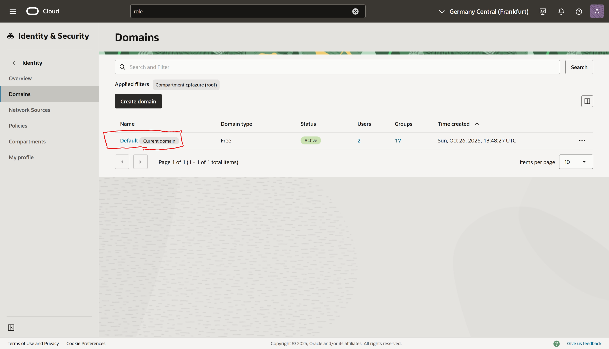
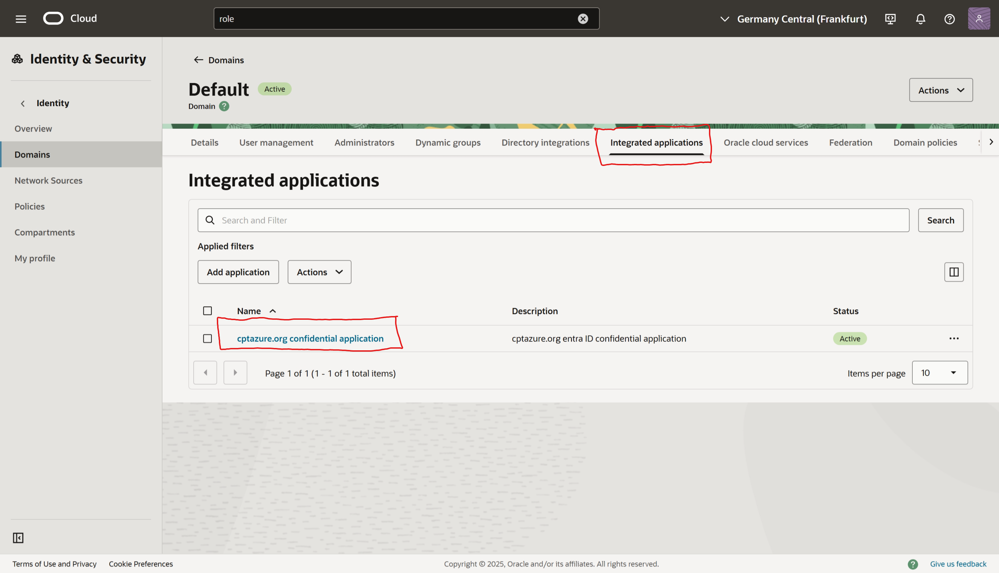
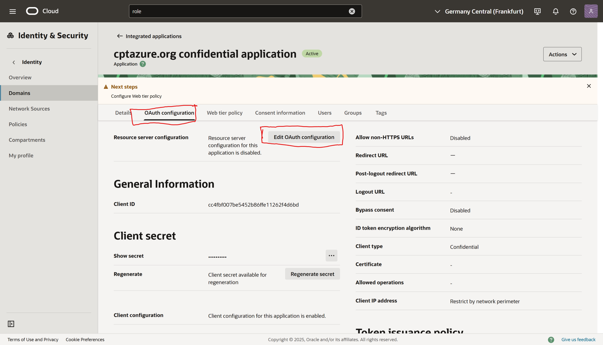
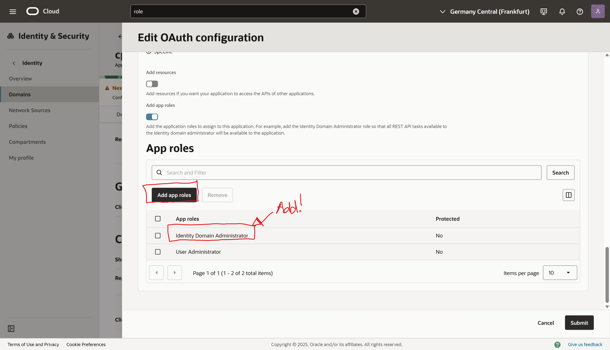

# Configuring App Roles for OCI Confidential Application

## Overview

The Entra ID "Oracle Cloud Infrastructure Console" is an Enterprise Application that enables Single Sign-On (SSO) between Azure and OCI.

When configured correctly, users authenticate through Entra ID and are seamlessly granted access to OCI resources without requiring separate OCI credentials by using SCIM.

## Find your Enterprise Application on the  Azure Portal

1. Navigate to the [Azure Portal](https://portal.azure.com)
2. Go to **Microsoft Entra ID** → **Enterprise applications**
3. In the search box, type **"Oracle Cloud"**
4. Select **Oracle Cloud Infrastructure Console** from the results

## Find your corresponding OCI confidential Application on the OCI Console (Web Portal)

Log into the OCI console via https://cloud.oracle.com/.

Click on the Hamburger menu (three horizontal lines) in the top left corner, then navigate to **Identity & Security** → **Security** → **Domoains**. 

Select your Domain, in our case it the "Default" domain.

Select "Confidetial Applications" tab to see the list of confidential applications.
Select the once called "cptazure.org confidential application".

Inside the confidential application select "OAuth configuration" and "Edit OAuth configuration":

Scroll to the bottom to the "App Roles" section, click on "Add App Role", select the appropriate app role (typically **Identity Domain Administrator**), then click **Save Changes**.

