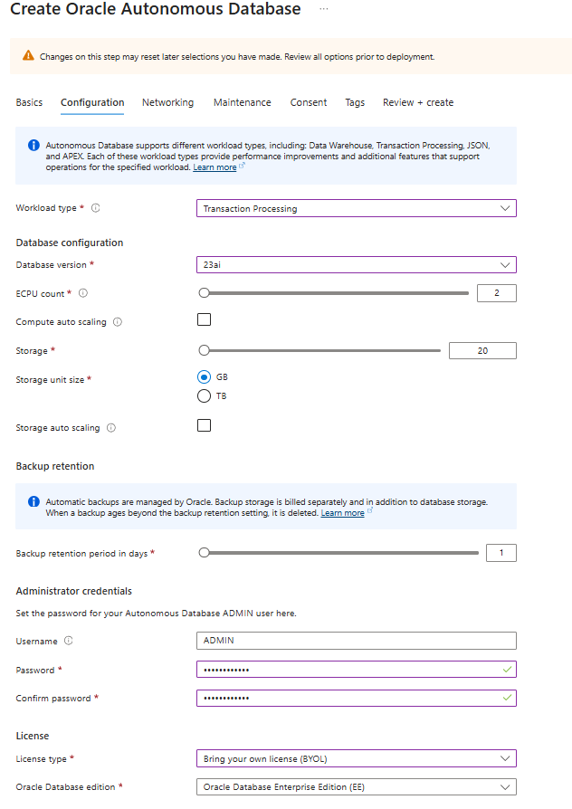
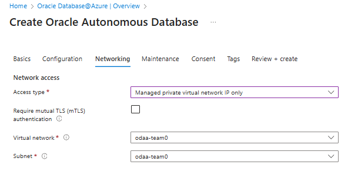

# 🚀 Challenge 2: Create Azure ODAA [Oracle Database@Azure] Database Resources

[Back to workspace README](../../README.md)

Subsequent you find all related information to 
1. Deploy an Oracle ADB in Azure and the required preparations like the availability of a delegated subnet for the accessibility of the database. 
2. Furthermore you will deploy in this chapte an ADB database via the Azure Portal.
3. Finally if the existing vnet peering between the AKS - and database subscription is available and correctly configured.

 

## 🛰️ Delegated Subnet Design (Prerequisites)

- ODAA Autonomous Database can be deployed within Azure Virtual Networks, in delegated subnets that are delegated to Oracle Database@Azure.
- Client subnet CIDR must fall between /27 and /22 (inclusive).
- Valid ranges must use private IPv4 addresses and must avoid the reserved 100.106.0.0/16 and 100.107.0.0/16 blocks used for the interconnect.

A more detailed description can be found here: [Oracle Documentation: Oracle's delegated subnet guidance](https://docs.oracle.com/en-us/iaas/Content/database-at-azure/network-delegated-subnet-design.htm)

**NOTE**: For this Microhack, we have already created the corresponding VNets and subnets, so no additional action is required in this step.

## 🧭 What is an Azure Delegated Subnet?

Azure delegated subnets allow you to delegate exclusive control of a subnet within your VNet to a specific Azure service. When you delegate a subnet, the service can deploy and manage its own network resources (NICs, endpoints, routing) within that subnet without requiring you to provision each resource manually. Traffic still flows privately over your VNet, and you remain in control of higher-level constructs like NSGs and route tables.

The delegate subnet is part of the vnet inside your ODAA subscription. 
1. Click on the subscription sub-mhodaa. 
2. Change to the available resource group odaa-shared 
3. You see the deployed resources inside the the resource group and use the vnet odaa-shared.
4. In the vnet overview you find under the sub menue settings the menue Subnets.
5. In the menue Subnets you see the subnet and inside the table the delegation for "Oracle.Database/networkAttachments".
   

## 🛠️ Create an ODAA Autonomous Database Instance

Please follow the instructions in the following link to create an ODAA Autonomous Database instance within the pre-created delegated subnet.

After you have successfully logged into the Azure portal, you will find the following resource groups which are of interest for you during this Microhack:

- **aks-user00** - Team members of user00 will work on the same deployed AKS and add additional pods during the microhack
- **odaa-user00** - Used to deploy your ADB shared database in the microhack

Please use the resource groups you are assigned to based on the number at the end of the resource group names. For example, aks-user00 corresponds to the user user00@cptazure.org who logged into the Azure portal.

### Use the following parameters when creating the ODAA Autonomous Database instance

- **Azure Subscription**: sub-mhodaa
- **Azure Resource Group**: odaa-user00 *(replace with your user number)*
- **Azure Region**: France Central
- **VNet**: odaa-user00 *(replace with your user number)*
- **Subnet**: odaa-user00 *(replace with your user number)*

To be considered during the deployment:

### Create the Oracle Autonomous Database

1. In the Azure portal search for the Oracle Services and select **Oracle Database@Azure**.

### Settings of the ADB

1. Choose Workload type: OLTP
2. Database version: 23ai
3. ECPU Count: 2
4. Compute auto scaling: off
5. Storage: 20 GB
6. Storage autoscaling: off
7. Backup retention period in days: 1 days
8. Administrator password: Welcome1234#
9. License type: BYOL
10. Oracle database edition: Enterprise Edition

### Network setting

1.  Choose for the connectivty the Access type: Managed private virtual network IP only

### Final summary of the settings of the ADB share

A complete documentation is available on under the following links.

[Oracle Documentation: Create an Autonomous Database](https://docs.oracle.com/en-us/iaas/Content/database-at-azure/azucr-create-autonomous-database.html)

## Check the existing vnet peering 

To save time to focus on the ODAA service itself the vnet peering between both subscriptions is already available and can be verified. Here you have to switch to the resource group aks-user[assigned number]. Under the section settings you find the menu point peering. Open the peering and check if the peering sync status and peering state are active.

The check of the vnet peering can be done from the ODAA side as well.

## Tips and Trickes

### How to control what can be deployed with Azure Policies and RBAC

Oracle Database@Azure does introduce new built-in RBAC Roles to help you manage access to Oracle Database@Azure resources. These roles can be assigned to users, groups, or service principals to control who can perform specific actions on Oracle Database@Azure resources. Overview of the different Azure RBAC roles can be found here: [Oracle documentation on RBAC roles](https://docs.oracle.com/en-us/iaas/Content/database-at-azure/onboard-access-control.htm)

In case you consider to use Azure Policies to restrict what can be deployed Azure Policy only accepts resource fields that have published aliases.

Oracle Database@Azure ADB doesn’t currently expose aliases for dataStorageSizeInGbs, backupRetentionPeriodInDays, isAutoScalingEnabled, isAutoScalingForStorageEnabled, licenseModel, or computeCount, so the service rejects any policy trying to evaluate them (InvalidPolicyAlias).

Currently you can only restrict the locations.

[Back to workspace README](../../README.md)