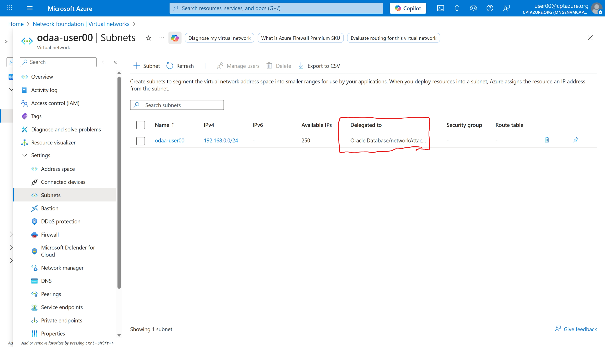
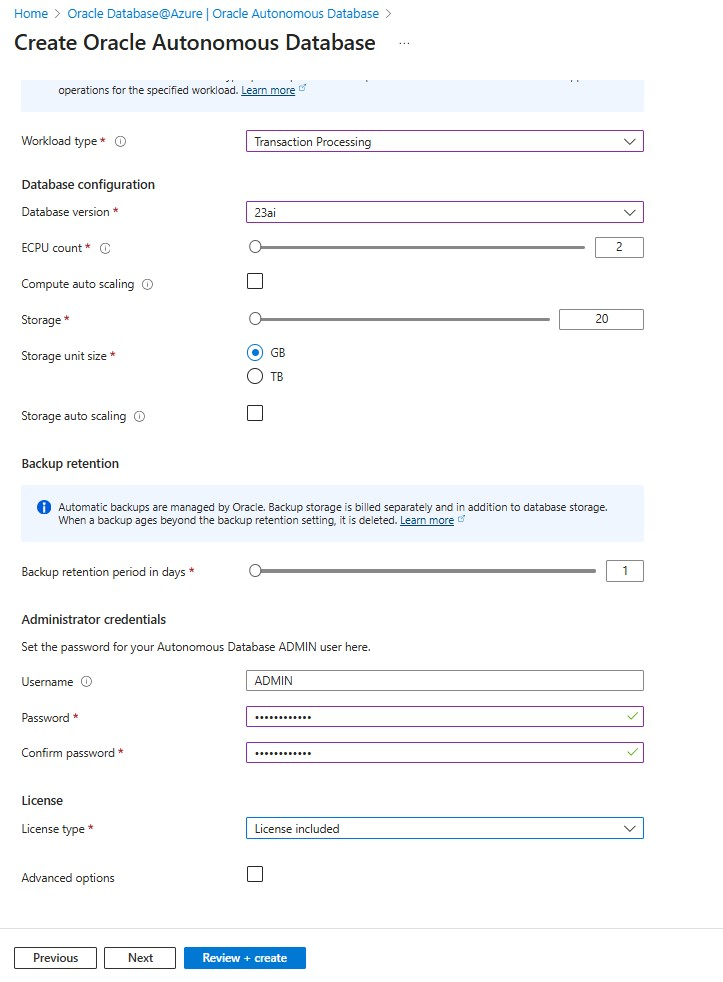

# 🚀 Challenge 2: Create Azure ODAA [Oracle Database@Azure] Database Resources

[Back to workspace README](../../README.md)

1. Registration of the Azure resource provider in Azure. In our case they are alreay deployed but can be checked if they are registered - see [Oracle Documentation: Oracle Database at Azure Network Enhancements](https://learn.microsoft.com/en-us/azure/oracle/oracle-db/oracle-database-network-plan)
2. Check the availability of a vnet and delegated subnet for the deployment of the database.
3. Deploy an Oracle ADB in Azure. 
4. Furthermore you will deploy in this chapter an ADB database via the Azure Portal.
5. Finally if the existing vnet peering between the AKS - and database subscription is available and correctly configured.

## 🛰️ Delegated Subnet Design (Prerequisites)

- ODAA Autonomous Database can be deployed within Azure Virtual Networks, in delegated subnets that are delegated to Oracle Database@Azure.
- Client subnet CIDR falls in general between /27 and /22 (inclusive).
- Valid ranges must use private IPv4 addresses and must avoid the reserved 100.106.0.0/16 and 100.107.0.0/16 blocks used for the interconnect.

A more detailed description can be found here: [Oracle Documentation: Oracle's delegated subnet guidance](https://docs.oracle.com/en-us/iaas/Content/database-at-azure/network-delegated-subnet-design.htm)

**NOTE**: For this Microhack, we have already created the corresponding VNets and subnets, so no additional action is required in this step.

## 🧭 What is an Azure Delegated Subnet?

Azure delegated subnets allow you to delegate exclusive control of a subnet within your VNet to a specific Azure service. When you delegate a subnet, the service can deploy and manage its own network resources (NICs, endpoints, routing) within that subnet without requiring you to provision each resource manually. Traffic still flows privately over your VNet, and you remain in control of higher-level constructs like NSGs and route tables.

The delegate subnet is part of the vnet inside your ODAA subscription. 
1. Click on the subscription sub-mhodaa. 
2. Change to the available resource group odaa-user00 
3. You see the deployed resources inside the the resource group and use the vnet odaa-user00.
4. In the vnet overview you find under the sub menue settings the menue Subnets.
5. In the menue Subnets you see the subnet and inside the table the delegation for "Oracle.Database/networkAttachments".
   

## 🛠️ Create an ODAA Autonomous Database Instance

### Login into the [Azure portal](https://portal.azure.com)

In the Azure portal search for the Oracle Services and select **Oracle Database@Azure**.

### Select Oracle Autonomous Database

Select **Create Oracle Autonomous Database** and "create" to start the creation of the Autonomous Database.

### Define Azure Basics

- Subscription: Select "sub-mhodaa"
- Resource Group: Select "odaa-user<your user number>"
- Database name: user<your user number>
- Region: France Central

### Settings of the ADB

1. Choose Workload type: OLTP
2. Database version: 23ai
3. ECPU Count: 2
4. Compute auto scaling: off
5. Storage: 20 GB
6. Storage autoscaling: off
7. Backup retention period in days: 1 days
8. Administrator password: (e.g. Welcom1234!)
9. License type: License included
10. Oracle database edition: Enterprise Edition

### Network setting

1.  Choose for the connectivty the Access type: Managed private virtual network IP only

### Final summary of the settings of the ADB share

Review the final summary and click "create"

### Deployment finished

The deployment will take between 10 to 15 minutes. 

After the deployment is finished you see the overview page of your new created Autonomous Database.

### Further Read

A complete documentation is available on under the following links.

[Oracle Documentation: Create an Autonomous Database](https://docs.oracle.com/en-us/iaas/Content/database-at-azure/azucr-create-autonomous-database.html)

## **IMPORTANT: While you are waiting for the ADB creation**

You will need in the following challenges to use the Microhack GitHub repository. Please clone the repository to your local machine if you have not done it yet.

Follow the instructions in the [Clone Partial Repository](../../docs/clone-partial-repo.md) document to clone only the required folder for this Microhack.

## Check the created ADB in OCI console

After the ADB was deployed successful, check if the ADB is visible on the Azure Portal and OCI side. Important to mention on the OCI side is that the region is set to <b> Fracne Central</b> and the Compartment is chosen properly.

To access the OCI console use the following link after you are logged in into the Azure portal under your newly created ODAA Autonomous Database resource:

At the OCI console login page selcet the "Entra ID" link:

You will land on the Oracle ADB databases overview page:

<!-- The compartment structure in OCI looks like:
~~~text
-- Root compartment - cptazure
   -- OCI Multicloudlink_ODBAA <number>
      -- Compartment <number>
~~~

 

 -->

## Check the existing vnet peering 

To save time to focus on the ODAA service itself the vnet peering between both subscriptions is already available and can be verified. Here you have to switch to the resource group aks-user[assigned number]. Under the section settings you find the menu point peering. Open the peering and check if the peering sync status and peering state are active.

The check of the vnet peering can be done from the ODAA side as well.

## Tips and Trickes

### How to control what can be deployed with Azure Policies and RBAC

Oracle Database@Azure does introduce new built-in RBAC Roles to help you manage access to Oracle Database@Azure resources. These roles can be assigned to users, groups, or service principals to control who can perform specific actions on Oracle Database@Azure resources. Overview of the different Azure RBAC roles can be found here: [Oracle documentation on RBAC roles](https://docs.oracle.com/en-us/iaas/Content/database-at-azure/onboard-access-control.htm)

In case you consider to use Azure Policies to restrict what can be deployed Azure Policy only accepts resource fields that have published aliases.

Oracle Database@Azure ADB doesn’t currently expose aliases for dataStorageSizeInGbs, backupRetentionPeriodInDays, isAutoScalingEnabled, isAutoScalingForStorageEnabled, licenseModel, or computeCount, so the service rejects any policy trying to evaluate them (InvalidPolicyAlias).

Currently you can only restrict the locations.

[Back to workspace README](../../README.md)