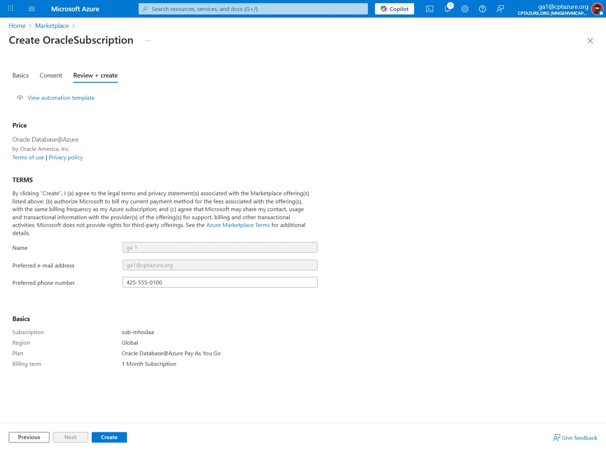
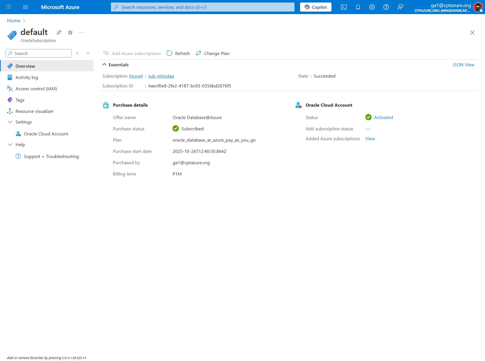

# 🚀 Challenge 1: Create Azure ODAA [Oracle Database@Azure] Service

[Back to workspace README](../../README.md)

> **IMPORTANT: In the case of this Microhack, the ODAA Subscription, which will be discussed here, is already created and therefore your user does not need the create one.**

## 🧱 ODAA Main Components

1. ODAA Subscription, which is a container that contains the different Oracle Database Services and defines the commercial aspects of the service
2. ODAA Database service. These are the database services that are used to run Oracle Database on Azure

Without an ODAA Subscription, you cannot create any ODAA Database services.

## 🛠️ Prerequisites

To create an ODAA Subscription, you will need an Azure subscription with permissions to purchase resources from the Azure Marketplace.
In addition, the subscriptions must have the following Microsoft Providers registered:

- Oracle.Database
- Microsoft.BareMetal
- Microsoft.Network
- Microsoft.Compute

This can be done by following the instructions in 
* [Oracle’s resource provider registration guide](https://docs.oracle.com/en-us/iaas/Content/database-at-azure/oaaprerequisites.htm#register-resource-providers)
* [Network planning for Oracle Database@Azure](https://learn.microsoft.com/en-us/azure/oracle/oracle-db/oracle-database-network-plan)

The enablement of the enhanced networking capabilities will be a default behavior shortly. Because it is not yet the case you can check if the Azure resource providers are enabled by using the Azure Portal or the Azure CLI. Because the settings need to be done on subscription level the providers are all enabled. Following we quickly described how to check the status via the Azure Portal.

1. Go the subscription where the ODAA is deployed. In our case the subscription has the name - sub-mhodaa.
2. In the subscription view you find under the menu setting the sub menue Resource Providers.
3. Click on the Resource Providers and search for the Providers

### 🛡️ Permissions for Onboarding and Provisioning ODAA

Many of the tasks you perform during ODAA Subscription onboarding require permissions in either the Azure cloud or the Oracle Cloud Infrastructure (OCI) cloud. Review the following link that details the permissions you need for each task of the onboarding process:

- [Oracle Documentation Permissions for Onboarding and Provisioning ODAA Services](https://docs.oracle.com/en-us/iaas/Content/database-at-azure/oaaprerequisites.htm#permissions)

## 💰 ODAA Subscription purchase options

You can purchase ODAA Subscription directly from the [Azure Marketplace](https://marketplace.microsoft.com/en-us/product/saas/oracle.oracle_database_at_azure?tab=Overview).

The Marketplace offers two purchasing options:

1. Public offer, available to all Azure customers
2. Private offer, available only to enterprise customers who have negotiated specific terms with Oracle

> ⚠️ **IMPORTANT**: In this Microhack the ODAA Subscription has been already purchased via a Public Offer.

## 💰 Purchase ODAA Subscription via Public Offer

When you purchase an ODAA Subscription through the public offer, you can choose between two licensing options:

1. Bring your own license (BYOL)
2. Pay-as-you-go (PAYG)

With BYOL, you can use your existing Oracle Database licenses to run the service, while with PAYG, you pay for the service based on your usage.

### 🚀 Onboarding ODAA Subscription via Public Offer

You can find the official Oracle documentation about onboarding ODAA Subscription in [Oracle’s PAYG onboarding guide](https://docs.oracle.com/en-us/iaas/Content/database-at-azure/onboard-purchase.htm#purchase-payg-offer).

To use the ODAA Subscription, you configure it within your Azure subscription through a process referred to as [onboarding](https://docs.oracle.com/en-us/iaas/Content/database-at-azure/oaaonboard.htm).

> **NOTE**: We need to select a subscription on the screenshot, as shown. The ODAA Subscription itself is not aligned to any Azure Region, but the database services created under the ODAA Subscription will be aligned to the Azure Region selected during onboarding.

You complete the purchase through Azure Marketplace. After the purchase is complete, you link your Azure subscription with an OCI tenancy. This is called multicloud linking.

Source: [Oracle Docs ODAA Overview](https://docs.oracle.com/en-us/iaas/Content/database-at-azure/overview.htm)

Final step of the ODAA Subscription creation:

During the deployment of the ODAA Subscription:

After the deployment is complete:

Now you can see the ODAA Subscription in your Azure portal where you can create ODAA Database services under this ODAA Subscription.

### 🌐 ODAA Multicloud Linking

To finish the ODAA Subscription onboarding, you will need an OCI account. This is needed because some components of the ODAA databases need to be configured via the Oracle Cloud Infrastructure (OCI) even if the physical hardware runs inside Azure Data Centers.

You perform most onboarding tasks only once, during your ODAA Subscription deployment. After you complete the onboarding tasks, you can begin provisioning and using ODAA database resources in your Azure environment.

Whether you create a new OCI account or link an existing account depends on your situation. Learn more about the Multicloud Linking here:

- [Linking your Azure subscription with an OCI tenancy](https://docs.oracle.com/en-us/iaas/Content/database-at-azure/onboard-link.htm)

The following shows how we linked our newly created public offer ODAA Subscription with a new OCI account as an example.

1. Select the "View Oracle Subscription" button on the ODAA Subscription Overview page in the Azure portal.

2. Select the newly created ODAA Subscription called "default".

3. On the Oracle Subscription detail page, select "Oracle Cloud Account" from the left-hand menu.

4. Select the link "Create new Oracle Cloud Account on OCI".

5. Enter details to create a new OCI account on the Oracle Cloud Infrastructure Portal.

6. Message after submitting the new OCI account creation form.

7. Go back to the Azure portal and refresh the Oracle Subscription page.

8. After a while, the Status will switch from "Pending" to "Activated".

## 💰 Purchase ODAA Subscription via Private Offer (Enterprise)

To purchase an ODAA Subscription via Private Offer, contact the Oracle sales team or your Oracle sales representative for a sales offer. Oracle Sales creates an Azure private offer in Azure Marketplace for your instance of the service. After an offer is created for your organization, you can accept the offer and complete the purchase in the marketplace in the Azure portal. For more information about Azure private offers, see [Overview of the commercial marketplace and enterprise procurement](https://learn.microsoft.com/en-us/marketplace/what-is-commercial-marketplace).

- [Oracle Docs ODAA Subscription private offer](https://docs.oracle.com/en-us/iaas/Content/database-at-azure/onboard-purchase.htm#purchase-private-offer)

## 💵 Billing Information

Billing and payment for the service is processed through Azure for public and private offers. Payment for ODAA Subscription counts toward Microsoft Azure Consumption Commitment (MACC). Existing Oracle Database software customers can use a bring-your-own-license (BYOL) option or an unlimited license agreement (ULA). On your regular invoice for Azure, charges for ODAA Subscription appear with charges for your other Azure Marketplace services.
([source](https://learn.microsoft.com/en-us/azure/oracle/oracle-db/oracle-database-get-started#purchase-oracle-databaseazure))

[Back to workspace README](../../README.md)