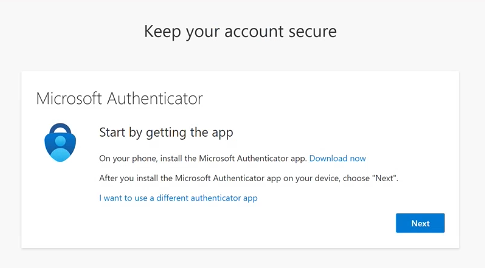
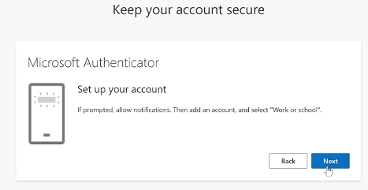
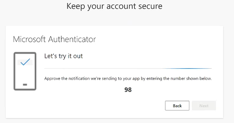
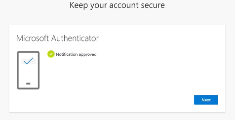
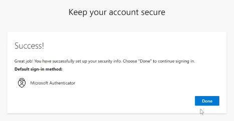
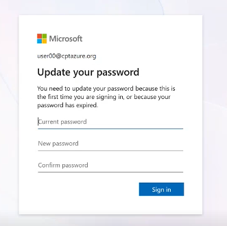

# Setup your User Account on Azure

[Back to workspace README](../../README.md)

<b>IMPORTANT due to time restrictions </b>
 
Before you start with the Microhack download the Microsoft Authenticator App on your mobile phone. The App is required for the multi factor authentication.

 
 

In the following section you will cover two task.
1. To access via Multi factor authentication
2. First check resource groups and roles are available
3. Troubleshooting
 
 
 

# To access via Multi factor authentication

1. Open a Browser with a new Incognito/Private window or Profile.

* Method 1 - Use your preferred browser
   * a. EDGE - Open a new private window 
   * b. Chrome - Open a new incognito window

* Method 2 - Create a new user profile in your browser

  * Example with EDGE  
Open your browser and click on your work icon in the upper right corner. 
 
 

 
 
<B>Important</B> If you are working with an existing browser profile please clear the browser cache.

2. Login the Azure portal by calling the URL https://portal.azure.com in the browser window of the new created profile and use the provided credentials you got at the beginning of the Microhack. Following an example of the credential you should got:  

~~~json
         "user01": [
        {
          "user_principal_name": "user01@cptazure.org",
          "display_name": "Bruce Wayne",
          "initial_password": <"Assigned Password">
        }
      ],
~~~

3. Create MFA authentication when prompted.

<b>Important:</b> For the Multi-Factor Authentication you have to download first the Microsoft Authenticator if you don't have the App yet on your mobile phone.

Following you see the step of a MFA authentication. If you have any additional question check the available online resources under [MFA](https://learn.microsoft.com/en-us/entra/identity/authentication/tutorial-enable-azure-mfa)

1. After you have open the first time the URL [Azure Portal](https://portal.azure.com/) you are forwarded to enable the MFA to access your Azure subscription. The following picutures will guide you through the process visually.

    1. Press next to follow the authentication process. 
        
    
    2. Press in the opened Authenticator app on the upper right + symbol and choose a new "work or school account". In the following menue choose "Scan QR code".  
        
    3.  After you have registered the new account you will asked to verify the registration by a sent random number to typ in the authenticator app. 
        
    4. The registration process for the MFA should be successful done. 
        
    5. Congratulations you have an established MFA authentication 
        
    6. Finally you have to update the pre assigned password. 
        
    7. Now, you are logged in the Azure Portal  
        

A first important step is successfully finished!

 
 
 

# First check resource groups and roles are available

After you successfully logged into the Azure portal a first check could be the verification of the required resource groups for the Microhack.

   1. Move to the resource group in the Azure portal or search for the name in the upper available search bar - [see](../../media/resource_group_check/first_check_rg_available1.png)
   2. Two resource group are in interest for the microhack and should be created - [see](../../media/resource_group_check/first_check_rg_available2.png)
      1. aks-user[your group number]
      2. odaa-user[your group number]
   3. Inside the resource group the following resources should be created - [see](../../media/resource_group_check/first_check_rg_available3.png)
      1. 2 x Private DNS zone for region France Central (Paris). <b>Important: This are global resources!!!</b>
         1. For the FQDN adb.eu-paris-1.oraclecloud.com
         2. For the FQDN adb.eu-paris-1.oraclecloudapps.com
      2. 2 x Private DNS zone for region German West Central (Frankfurt). <b>Important: This are global resources!!!</b>
         1. For the adb.eu-frankfurt-1.FQDN .oraclecloud.com
         2. For the FQDN adb.eu-frankfurt-1.oraclecloudapps.com
      3. Additionally to the global resources the following <b>local resource (in region France Central)</b> are deployed
         1. The kubernetes services - aks-cluster
         2. The virtual network - aks-user[your group number]
         3. The log analytics workspace - aks-user[your group number]
      4. Furthermore the following roles should be assigned the to connected users. Currently the user itself can not see their assigned roles. This could be checked with the tutor and his privileged user 
         1. On the ODAA resource group (sub-mhodaa) - [see](../../media/resource_group_check/first_check_rg_available5.png)  
            1. Oracle.Database Autonomous Database Administration - Resource Group
            2. custom-private-dns-zone-reader - Subscription
            3. Oracle Subscriptions Manager Reader - Subscription
            4. Oracle Subscriptioos Manager Reader - Resource Group
   
         2. On the aks cluster resource group (sub-team[group number]) - [see](../../media/resource_group_check/first_check_rg_available6.png)
            1. Reader - Subscription
            2. 2x Private DNS Zone Contributor - frankfurt - Private DNS zone
            3. 2x Private DNS Zone Contributor - Paris - Private DNS Zone
            4. Azure Kubernetes Service RBAC Writer - Kubernetes service
            5. Azure Kubernetes Service Cluster User Role - Kubernetes service

 
 
 

# Troubleshooting

1. Where to find the user credential file?
     
    The generated user and password file after can be found in the project in the main directory called 
    ~~~text
    user_credentialed.json
    ~~~
 

1. If the user the first time runs in a conditional error during the authentication. See the following snapshot.
    
   

  To avoid to many picture the snapshot to guide you to solve the issues can be found by adding the following steps and if required view the snapshots behind each added URL.

  * Login the Azure portal as the tutor with the appropriate rights.
  * Move in the Azure Portal to the Conditional 
    ~~~text
    Conditional Access Policies
    ~~~

  * Press the link "Security info registration for Microsoft partners and vendors" - [see](../../media/conditional_access_issue/conditional%20access%20issue%201.png)
  * Press the link "All users included and specific users excluded" link - [see](../../media/conditional_access_issue/conditional%20access%20issue%202.png)
  * Press in the open window with the title "Security info registration for Microsoft partners and vendors" the link "numbers of users" und the section "Select excluded users and groups" (in the snapshot you choose the linke "2 users") - [see](../../media/conditional_access_issue/conditional%20access%20issue%204.png)
  * Find the goup "mh-odaa-user-grp" and add the group to the excluded users - [see](../../media/conditional_access_issue/conditional%20access%20issue%205.png)
  * Finally press the Save button
 
 

 
[Back to workspace README](../../README.md)