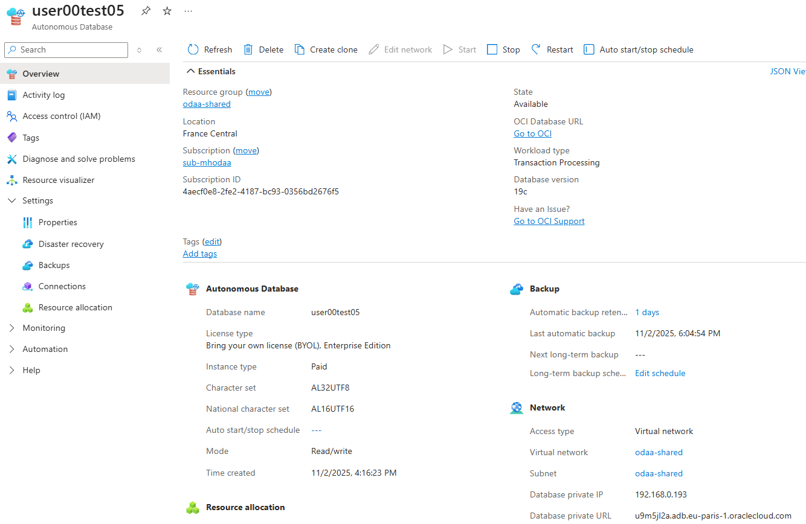

# 🔐 Challenge 3: Update Oracle ADB NSG and DNS Configuration

[Back to workspace README](../../README.md)

## 🌐 Network Security Group Configuration

You need to update the Oracle ADB Network Security Group (NSG) with the CIDR range of the VNet where your AKS cluster is deployed. This can be done via the Azure Portal.

## 📋 Steps

1. 🎯 Navigate to your Oracle ADB instance in the Azure Portal
2. 🔧 Locate the Network Security Group settings
3. ➕ Add the AKS VNet CIDR (e.g., `10.0.0.0/16`) to the allowed sources
4. 💾 Save the configuration
5. ✅ Test connectivity from AKS to verify the changes

See the [official Oracle documentation about Network Security Groups](https://docs.oracle.com/en-us/iaas/Content/Network/Concepts/nsg-manage.htm) for more details.

## 🔍 DNS Configuration

Because we deployed our ODAA Autonomous Database in a different VNet than the one that contains your AKS cluster, you will need to extract the ODAA FQDN and IP Address from the Azure Portal and assign them to the Azure Private DNS Zones linked to the AKS VNet.

### Create AKS DNS Records

There are multiple ways to create the required DNS records within the Azure Private DNS Zones that are linked to the AKS VNet. We will be using the Azure portal directly

#### Move in the Azure portal to your AKS subscription and resoucre group where your aks cluster is deployed. Inside the resource group you will find the aks related vnet. Copy in the overview "address space" the CIDR of the vnet.

In our case the "address space" should be 10.0.0.0/16

To access the OCI console use the following link after you are logged in into the Azure portal under your newly created ODAA Autonomous Database resource:

At the OCI console login page selcet the "Entra ID" link:

You will land on the Oracle ADB databases overview page:

#### Scroll down to the networking section on the ADB homepage.

4. Press on the link "Network Security Groups" to reach the NSG page. Under the Tab "Security Rules" you have to press the "Add Rules" button to add an ingress rule.
 

5. Choose in the Rule as "Source Type" CIDR and add the copied vnet address space of the previous AKS cluster into the field. Finally click the "Add" button to create the Rule.

#### Set the private DNS zones for AKS VNet via Azure Portal

1. From the overview portal of the deployed ADB database, copy the FQDN of the "Database URL name" and Database private IP address both in the section Network.

   

2. Move to the AKS resource group (aks-user[assignedgroup number])

   

3. The private DNS name needs to be set on the following two private DNS names. 
   * adb.eu-paris-1.oraclecloud.com
   * adb.eu-paris-1.oraclecloudapps.com

    The following step is equal for both private DNS name. In the private DNS zone menu open the DNS management and press the link <b>Recodsets</b>.

   

    <b>Important!</b> The other two Private DNS zones can be skipped for the moment till we need to set up ADB with high availability.

4.  In the menue Recordsets press the Add button to add the FQDN and private ip address of the deployed ADB shared database.

   

5. After you press the Add button a new window will be opened where the name for the ADB and the private IP address needs to be added. In addition change the TTL to 10 seconds.

   

6. Final save the configuration and repeat the step for the second private DNS name in the same way as described.

   
 

#### Set the private DNS zones for AKS VNet via Powershell (alternative to Azure portal)

### Retrieve ODAA FQDN

 <b>Important:</b> We need to query the Private DNS Zones created with the <b>ODAA deployment</b>.

~~~powershell
# switch to the corresponding subscription where ODAA is deployed
$subODAA="sub-mhodaa"  # name of the odaa subscription
az account set -s $subODAA
$rgODAA="odaa-user02" # replace with your ODAA resource group name

$zones = az network private-dns zone list -g $rgODAA --query "[].name" -o tsv
echo $zones
# Extract the first lable of the first ODAA FQDN entry of $zones
$yourADBDNSLabel = ($zones[0] -split '\.')[0]
~~~

The extracted ODAA FQDNs should look similar to this:

~~~text
t6bchxz9.adb.eu-paris-1.oraclecloud.com
t6bchxz9.adb.eu-paris-1.oraclecloudapps.com
~~~

Extract the first lable of the first ODAA FQDN entry of $zones

~~~powershell
$yourADBDNSLabel = ($zones[0] -split '\.')[0]
~~~

The extracted ODAA FQDN Lable should look similar to this:

~~~text
zuyhervb
~~~

Get IP address of the ODAA ADB from the Private DNS Zone

~~~powershell
$fqdnODAAIpv4 = az network private-dns record-set a show -g $rgODAA --zone-name $zones[0] --name "@" --query "aRecords[0].ipv4Address" -o tsv
~~~

Find your Azure Kubernetes Service

There you will find the subscription name which is also used by the private DNS zones linked to your AKS VNet.

~~~powershell
# switch back to the subscription where AKS is deployed
$subAKS="sub-mh2" # replace with your AKS subscription name
az account set -s $subAKS
$rgAKS="aks-user02" # replace with your AKS resource group name
$vnetAKSName="aks-user02" # replace with your AKS resource group name

# iterate through all zones and list all A records
$zonesAKS = az network private-dns zone list --resource-group $rgAKS --query "[].name" -o tsv
$zonesAKS
~~~

resulting zones should look similar to this:

~~~text
adb.eu-frankfurt-1.oraclecloud.com
adb.eu-frankfurt-1.oraclecloudapps.com
adb.eu-paris-1.oraclecloud.com
adb.eu-paris-1.oraclecloudapps.com
~~~

~~~powershell
# Create A records in each private DNS zone with TTL of 10 seconds
foreach ($zoneAKS in $zonesAKS) {
    Write-Host "Creating A record '$yourADBDNSLabel' in zone: $zoneAKS"
    
    # Create or update the record set with TTL of 10 seconds
    az network private-dns record-set a create `
        --resource-group $rgAKS `
        --zone-name $zoneAKS `
        --name $yourADBDNSLabel `
        --ttl 10 `
    
    # Add the IP address to the record set
    az network private-dns record-set a add-record `
        --resource-group $rgAKS `
        --zone-name $zoneAKS `
        --record-set-name $yourADBDNSLabel `
        --ipv4-address $fqdnODAAIpv4
}
~~~

Verify the created A records:

~~~powershell
foreach ($zoneAKS in $zonesAKS) {   
    Write-Host "Listing A records for zone: $zoneAKS"
    az network private-dns record-set a list --zone-name $zoneAKS --resource-group $rgAKS --query "[].{Name:name, Records:aRecords[0].ipv4Address}" -o table
}
~~~

~~~text
Listing A records for zone: adb.eu-frankfurt-1.oraclecloud.com
Name      Records
--------  -------------
t6bchxz9  192.168.0.185
Listing A records for zone: adb.eu-frankfurt-1.oraclecloudapps.com
Name      Records
--------  -------------
t6bchxz9  192.168.0.185
Listing A records for zone: adb.eu-paris-1.oraclecloud.com
Name      Records
--------  -------------
t6bchxz9  192.168.0.185
Listing A records for zone: adb.eu-paris-1.oraclecloudapps.com
Name      Records
--------  -------------
t6bchxz9  192.168.0.185
~~~

> NOTE: The script does already create A-Records for all 4 private DNS zones linked to the AKS VNet. But we are going only use the one which contain paris in the name for the moment.

[Back to workspace README](../../README.md)