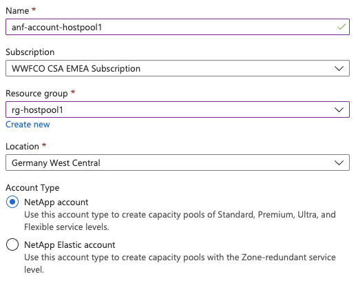
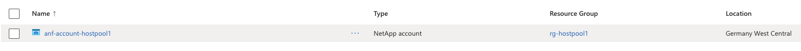
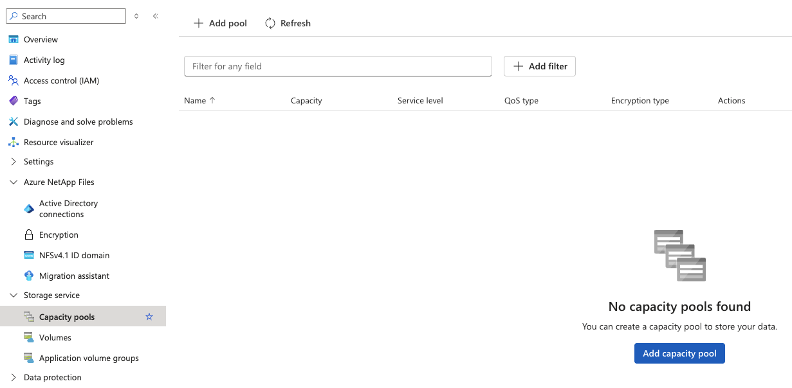
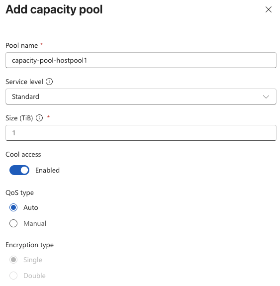
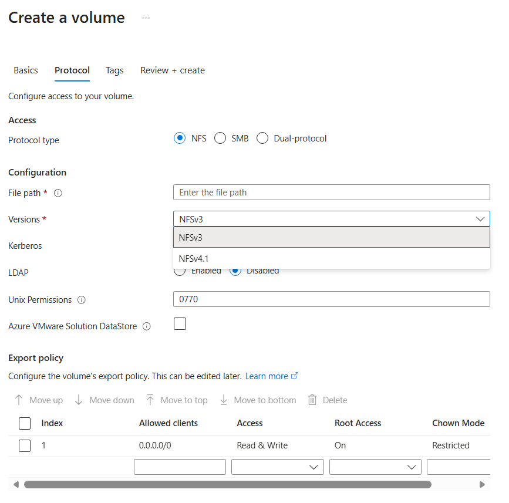
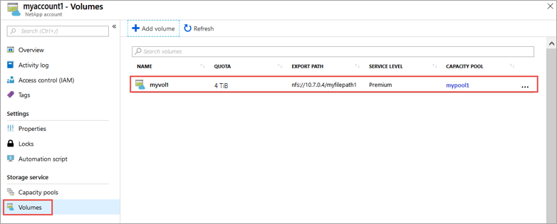
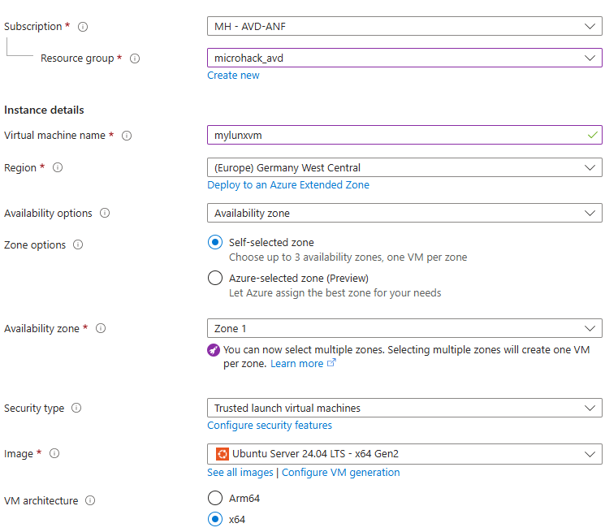
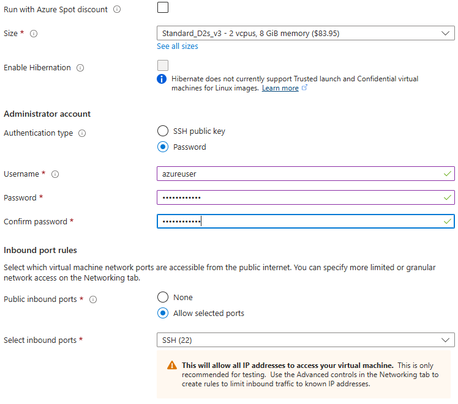
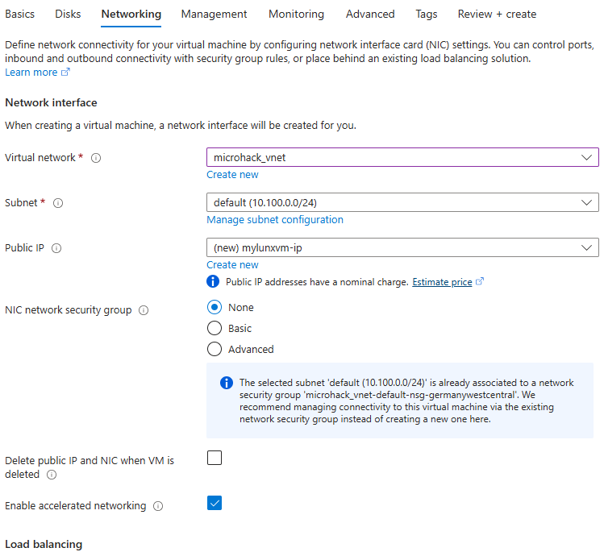

# Walkthrough Challenge 3 - Setting Up Azure NetApp Files

[Previous Challenge Solution](../challenge-02/solution-02.md) - **[Home](../../Readme.md)** - [Next Challenge Solution](../challenge-04/solution-04.md)

Duration: 30 minutes

## Prerequisites

Please ensure that you successfully verified the [General prerequisits](../../Readme.md#general-prerequisites) before continuing with this challenge.

### **Task 1: Create a NetApp account in Azure NetApp Files**

1. In the Azure portal's search box, enter **Azure NetApp Files** and then select **Azure NetApp Files** from the list that appears. 

<kbd>  </kbd>

2. Select + **Create** to create a new NetApp account. 

3. In the New NetApp Account window, provide the following information:
   
* Enter **anf-account-hostpool{Group Number}** for the account name. 
* Select your subscription. 
* Select the previously created resource group **rg-hostpool-{Group Number}**
* Select your account location to "Germany West Central"
* Account Type: **NetApp Account**

<kbd>  </kbd>

4. Select **Create** to create your new NetApp account.

### **Task 2: Create a capacity pool**

1. From the Azure NetApp Files management sidebar, select your NetApp account **anf-account-hostpool{Group Number}**

<kbd>  </kbd>

2. From the Azure NetApp Files management sidebar, select **Capacity pools** in the section "storage service"

<kbd>  </kbd>

3. Select + **+ Add pools**. 

<kbd>  </kbd>

4. Provide information for the capacity pool: 

* Name: **capacity-pool-hostpool{Group Number}** 
* Service Level: **Standard**
* Size (TiB): **1 (TiB)** 
* QoS Type: **Auto**
* Encryption: **Single**

5. Select **Create**

### **Task 3: Create an NFS volume for Azure NetApp Files**

1. Select the Volumes blade from the Capacity Pools blade.


2. Select + Add volume to create a volume.


3. In the Create a Volume window, provide information for the volume:
   
* Enter **myvol1** as the volume name.
* Select your capacity pool (**mypool1**).
* Use the default value for quota.


4. Select **Protocol**, and then complete the following actions:



* Select **NFS** and **NFSv3** as protocol type and version for the volume.
* Active Directory: **microhack.test**
* Share name: **myvol1**

5. Select **Review + create** to display information for the volume you're creating.

6. Select **Create** to create the volume. The created volume appears in the Volumes menu.



### **Task 4: Create a Linux VM and mout the NFS volume**

1. Select **Virtual Machines** blade

2. Select **Create** and **Virtual Machine** and enter these parameters

<kbd>  </kbd>
<kbd>  </kbd>

3. Click on **Disks** and leave the defaults

4. Click on **Networking** and enter the vnet and default subnet (not the delegated subnet) you had created in the previous challenge

<kbd>  </kbd>

5. Click **Review + create** and **Create**

5. Once deployment has finished to Networking configuration and add an inbound rule for your IP to the NSG

6. Log into you VM using public IP via puTTY

7. Run the following commands 

```bash
sudo su
apt update
apt install fio
apt install nfs-common
mkdir /netapp-mnt
cd /netapp-mnt
```
8. Go back to your NetApp account and click on the NFS volume you had created

9. On the left side find **Mount instructions**, select it and copy the mount command

10. Paste it into putty and make sure the share will be mounted to /netapp-mnt

Example:

```bash
mount -t nfs -o rw,hard,rsize=262144,wsize=262144,vers=3,tcp 10.100.1.5:/myvol1 /netapp-mnt
```
11. Copy some files to the share


You successfully completed challenge 3! 🚀🚀🚀